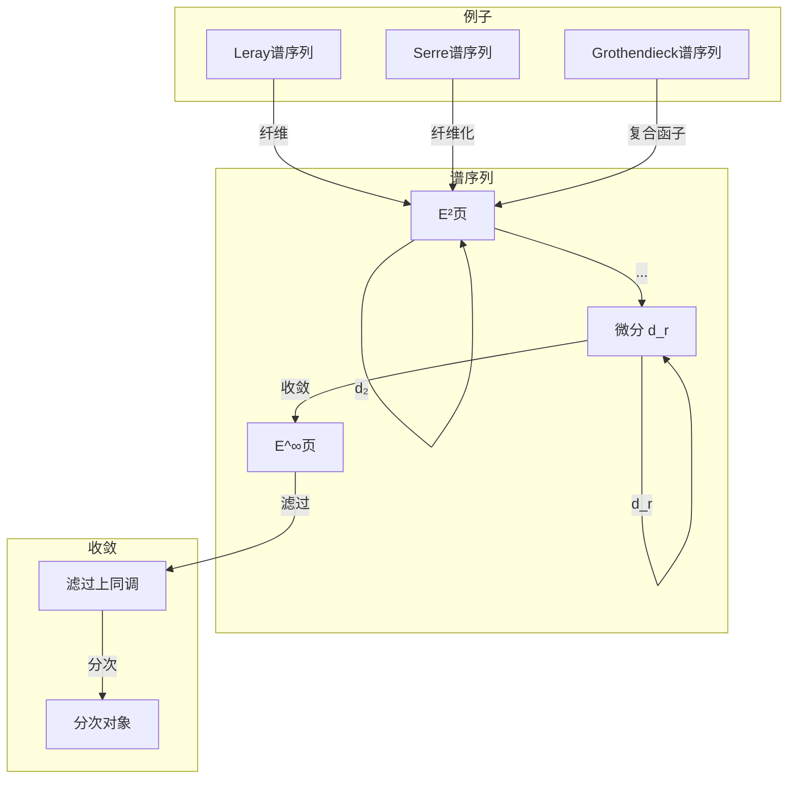
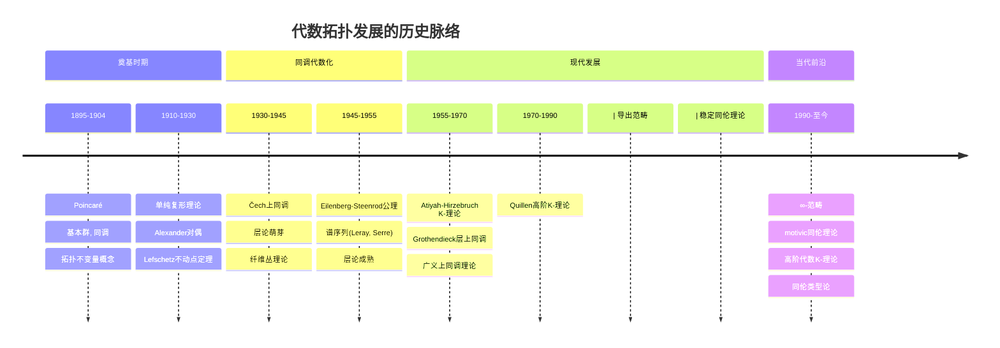
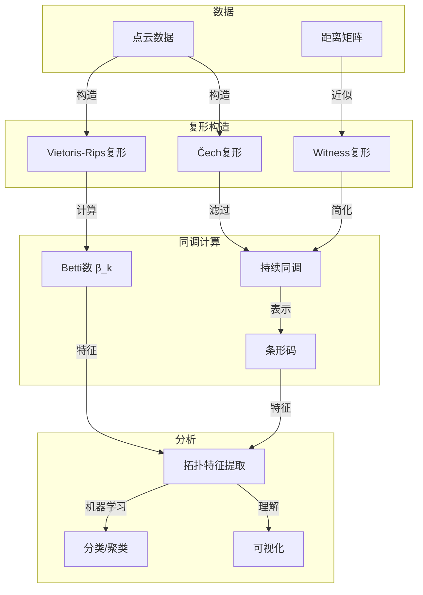

# 代数拓扑联系

> **代数 ↔ 拓扑：群、表示与空间的不变量理论**

---

## 目录

1. [核心理论框架](#一核心理论框架)
2. [群 ↔ 覆叠空间](#二群--覆叠空间)
3. [群表示 ↔ 向量丛](#三群表示--向量丛)
4. [同调代数 ↔ 层上同调](#四同调代数--层上同调)
5. [K-理论（拓扑↔代数）](#五k-理论拓扑代数)
6. [历史发展与现代应用](#六历史发展与现代应用)

---

## 一、核心理论框架

### 1.1 代数拓扑的基本对应

代数拓扑通过**代数不变量**研究**拓扑空间**，建立了代数结构与几何对象之间的深刻联系。

```mermaid
graph TB
    subgraph Algebra[代数结构]
        G[群 G]
        Ring[环 R]
        Module[模 M]
        Rep[表示 ρ: G → GL(V)]
    end

    subgraph Topology[拓扑对象]
        Space[拓扑空间 X]
        Cover[覆叠空间 E → B]
        Bundle[向量丛 E → B]
        Sheaf[层 F]
    end

    subgraph Invariants[不变量]
        Pi1[基本群 π₁]
        Homology[同调 H_*]
        Cohomology[上同调 H^*]
        KTheory[K-理论]
    end

    G <-->|Galois对应| Cover
    Rep <-->|关联丛| Bundle
    Module <-->|层化| Sheaf
    
    Space -->|环路| Pi1
    Space -->|链复形| Homology
    Space -->|上链| Cohomology
    Bundle -->|分类| KTheory

```

### 1.2 三层对应结构

```

┌─────────────────────────────────────────────────────────────┐
│ 第一层：群与空间                                              │
│  群 ⟷ 覆叠空间                                                │
│  群表示 ⟷ 向量丛                                              │
│  群作用 ⟷ 轨道空间                                            │
├─────────────────────────────────────────────────────────────┤
│ 第二层：同调与上同调                                          │
│  同调代数 ⟷ 层上同调                                          │
│  链复形 ⟷ 奇异链                                              │
│  Ext/Tor ⟷ 上同调/同调运算                                    │
├─────────────────────────────────────────────────────────────┤
│ 第三层：高级结构                                              │
│  K-代数 ⟷ K-拓扑空间                                          │
│  导出范畴 ⟷ 稳定同伦范畴                                      │
│  谱序列 ⟷ 滤过空间                                            │
└─────────────────────────────────────────────────────────────┘

```

---

## 二、群 ↔ 覆叠空间

### 2.1 Galois对应的几何化

**核心定理（覆叠空间分类）**：

```

设B是道路连通、局部道路连通、半局部单连通空间，b₀ ∈ B

{覆叠空间 p: E → B} / 同构  ⟷  {π₁(B, b₀)的共轭类子群}

具体对应：
- E ⟷ H = p_*(π₁(E, e₀)) ⊆ π₁(B, b₀)
- E是连通的 ⟷ H是子群
- E是正则覆叠 ⟷ H是正规子群
- Deck变换群 ⟷ N(H)/H

```

```mermaid
graph TB
    subgraph GroupSide[群论侧]
        Pi1[π₁(B, b₀)]
        H[子群 H ⊆ π₁]
        Normal[正规子群 N ◁ π₁]
        Quotient[商群 π₁/N]
    end

    subgraph CoveringSide[覆叠空间侧]
        Universal[万有覆叠 p: Ẽ → B]
        Connected[连通覆叠 E → B]
        Regular[正则覆叠]
        Deck[Deck变换群 Aut(E/B)]
    end

    subgraph Correspondence[对应关系]
        GalCorr[Galois对应]
    end

    Pi1 <-->|平凡子群| Universal
    H <-->|中间覆叠| Connected
    Normal <-->|正规性| Regular
    Quotient <-->|自同构| Deck
    
    GalCorr -->|一一对应| H
    GalCorr -->|一一对应| Connected

```

### 2.2 详细对应表

| 代数概念 | 群论定义 | 几何概念 | 拓扑定义 |
|---------|---------|---------|---------|
| **子群 H ≤ G** | 子集，运算封闭 | **覆叠空间** | p: E → B 局部同胚 |
| **正规子群 N ◁ G** | 共轭不变 | **正则覆叠** | Deck变换作用传递 |
| **商群 G/N** | 陪集群 | **Deck变换群** | 覆叠自同构群 |
| **群作用** | G × X → X | **覆叠变换** | 纤维上的作用 |
| **自由作用** | 无不动点 | **主G-丛** | 自由且适当的覆叠 |
| **轨道空间** | X/G | **底空间** | B = E/Deck(E) |

### 2.3 经典例子

**圆周 S¹ 的覆叠**：

```mermaid
graph LR
    subgraph CircleCoverings[S¹的覆叠]
        R[ℝ → S¹, t ↦ e^{2πit}]
        SN[Sⁿ → S¹, n次覆叠]
        Universal[万有覆叠]
        Finite[有限覆叠]
    end

    subgraph GroupStructure[群结构]
        Z[π₁(S¹) = ℤ]
        nZ[nℤ ⊆ ℤ]
        Zn[ℤ/nℤ]
    end

    R -->|对应| Z
    SN -->|对应| nZ
    Universal -->|平凡子群| Z
    Finite -->|有限指数| Zn

```

**详细对应**：

| 覆叠空间 | 覆叠映射 | 对应子群 | Deck变换群 |
|---------|---------|---------|-----------|
| **ℝ → S¹** | t ↦ e^{2πit} | {0} ⊆ ℤ | ℤ（平移） |
| **S¹ → S¹** | z ↦ zⁿ | nℤ ⊆ ℤ | ℤ/nℤ |
| **环面 T² → S¹∨S¹** | 万有覆叠 | {e} ⊆ F₂ | F₂（自由群） |

---

## 三、群表示 ↔ 向量丛

### 3.1 表示与丛的关联构造

**基本对应**：

```

代数侧:
--------
群表示 ρ: G → GL(V)
- V 是向量空间
- G 在 V 上线性作用

几何侧:
--------
向量丛 E → B（带G-结构）
- 纤维是 V
- 结构群是 G

构造:
------
给定主G-丛 P → B 和表示 ρ: G → GL(V)
关联丛 E = P ×_G V → B

反过来:
--------
给定向量丛 E → B，可以构造：
- 主GL(n)-丛（标架丛）
- 和乐表示 ρ: π₁(B) → GL(n)

```

```mermaid
graph TB
    subgraph Representation[表示论]
        Rho[ρ: G → GL(V)]
        Irreducible[不可约表示]
        Character[特征标 χ_ρ]
    end

    subgroup PrincipalBundle[主丛]
        P[P → B 主G-丛]
        Transition[转移函数 g_{ij}]
    end

    subgraph VectorBundle[向量丛]
        E[E → B 向量丛]
        Section[截面 Γ(E)]
        Connection[联络 ∇]
    end

    subgraph Invariants2[不变量]
        Chern[陈类 c(E)]
        Curvature[曲率 F^∇]
    end

    Rho -->|关联构造| E
    P -->|关联| E
    
    Transition -->|由表示给出| Rho
    
    E -->|特征类| Chern
    Connection -->|曲率| Curvature
    
    Irreducible -->|不可约分解| E
    Character -->|示性类| Chern

```

### 3.2 表示 ↔ 向量丛的详细对应

| 表示论概念 | 代数定义 | 向量丛概念 | 几何定义 |
|-----------|---------|-----------|---------|
| **表示空间 V** | G-模 | **纤维** | 向量空间 |
| **直和表示** | V₁ ⊕ V₂ | **Whitney和** | E₁ ⊕ E₂ |
| **张量积表示** | V₁ ⊗ V₂ | **张量积丛** | E₁ ⊗ E₂ |
| **对偶表示** | V* | **对偶丛** | E* |
| **同态表示** | Hom(V₁, V₂) | **Hom丛** | Hom(E₁, E₂) |
| **不可约表示** | 无非平凡子模 | **不可分解丛** | 非分裂 |
| **特征标** | χ(g) = tr(ρ(g)) | **陈特征** | ch(E) |

### 3.3 和乐表示与平坦丛

**和乐定理**：设 E → B 是向量丛，∇ 是联络，则：

```

和乐映射: Hol: π₁(B, b₀) → GL(E_{b₀})

性质：
- 平坦联络 ⟷ Hol 是群同态
- 和乐群是结构群的子群
- 和乐表示分类平坦丛

```

```mermaid
graph TB
    subgraph Holonomy[和乐理论]
        Loop[环路 γ]
        Parallel[平行移动 P_γ]
        HolGroup[和乐群 Hol(∇)]
    end

    subgraph FlatBundle[平坦丛]
        FlatConn[平坦联络 ∇² = 0]
        LocalSystem[局部系统]
        RepPi1[表示 ρ: π₁ → GL(n)]
    end

    subgraph Classification[分类]
        OneOne[一一对应]
        CategoryEquiv[范畴等价]
    end

    Loop -->|平行移动| Parallel
    Parallel -->|生成| HolGroup
    
    FlatConn -->|构造| LocalSystem
    LocalSystem -->|单值| RepPi1
    
    HolGroup <-->|同构| RepPi1
    RepPi1 -->|分类| OneOne
    OneOne -->|范畴| CategoryEquiv

```

---

## 四、同调代数 ↔ 层上同调

### 4.1 导出函子的几何实现

**核心思想**：同调代数的导出函子理论在几何中的实现是层上同调。

```mermaid
graph TB
    subgraph HomologicalAlgebra[同调代数]
        Derived[导出函子 R^iF]
        Ext[Ext^i_R(M, N)]
        Tor[Tor^R_i(M, N)]
        Resolution[投射/内射分解]
    end

    subgraph SheafCohomology[层上同调]
        Cohom[H^i(X, F)]
        ExtSheaf[Ext^i_{O_X}(F, G)]
        DirectImage[R^if_*F]
    end

    subgraph Grothendieck[Grothendieck理论]
        Tohoku[Tohoku论文]
        Spectral[谱序列]
        DerivedCat[导出范畴]
    end

    Derived <-->|抽象理论| Tohoku
    Ext <-->|层版本| ExtSheaf
    
    Tohoku -->|应用| Cohom
    Tohoku -->|推广| Spectral
    Spectral -->|现代语言| DerivedCat
    
    Resolution -->|flasque/内射分解| Cohom

```

### 4.2 详细对应表

| 同调代数 | 代数定义 | 层上同调 | 几何定义 |
|---------|---------|---------|---------|
| **Ext^i_R(M, -)** | 导出Hom | **H^i(X, F)** | 导出全局截面 |
| **Tor^R_i(M, -)** | 导出张量积 | **局部系数同调** | 扭曲系数 |
| **长正合列** | 连接同态 | **上同调长正合列** | 层短正合列诱导 |
| **投射分解** | 投射模消解 | **flasque分解** | flasque层消解 |
| **内射分解** | 内射模消解 | **内射层分解** | 内射层消解 |
| **泛系数定理** | Ext/Tor公式 | **上同调泛系数** | 局部系数公式 |

### 4.3 谱序列的统一作用

**主要谱序列及其来源**：

| 谱序列 | 来源 | E²项 | 收敛到 | 几何/代数意义 |
|-------|-----|------|-------|-------------|
| **Leray** | 连续映射 f: X → Y | H^p(Y, R^qf_*F) | H^{p+q}(X, F) | 纤维上同调 |
| **Serre** | 纤维化 F → E → B | H^p(B, H^q(F)) | H^{p+q}(E) | 纤维化计算 |
| **Grothendieck** | 复合函子 | R^pF ∘ R^qG | R^{p+q}(F∘G) | 导出函子复合 |
| **Leray-Serre** | 纤维丛 | H^p(B; H^q(F)) | H^{p+q}(E) | 纤维丛上同调 |
| **Hochschild-Serre** | 群扩张 | H^p(G/N, H^q(N)) | H^{p+q}(G) | 群上同调 |



---

## 五、K-理论（拓扑↔代数）

### 5.1 拓扑K-理论与代数K-理论的统一

**Serre-Swan定理**：对于紧Hausdorff空间X，

```

有限生成投射C(X)-模范畴 ≅ 复向量丛Vect_C(X)

这启发了K-理论的统一观点：
- 拓扑K-理论：K^0(X) = Grothendieck群 of Vect(X)
- 代数K-理论：K_0(R) = Grothendieck群 of Proj(R)

```

```mermaid
graph TB
    subgraph Topological[拓扑K-理论]
        Vect[向量丛 Vect(X)]
        K0Top[K⁰(X)]
        K1Top[K⁻¹(X)]
        Bott[Bott周期性]
    end

    subgraph Algebraic[代数K-理论]
        Proj[投射模 Proj(R)]
        K0Alg[K₀(R)]
        K1Alg[K₁(R)]
    end

    subgraph Connection[联系]
        SerreSwan[Serre-Swan]
        CStar[C*-代数]
        Noncommutative[非交换几何]
    end

    Vect <-->|等价| Proj
    Proj -->|Grothendieck群| K0Alg
    Vect -->|Grothendieck群| K0Top
    
    SerreSwan -->|C(X)-模| Vect
    SerreSwan -->|丛的截面| Proj
    
    K0Top <-->|非交换推广| CStar
    CStar -->|Connes| Noncommutative
    
    Bott -->|拓扑性质| K0Top

```

### 5.2 K-理论的详细对应

| 拓扑K-理论 | 拓扑对象 | 代数K-理论 | 代数对象 |
|-----------|---------|-----------|---------|
| **K⁰(X)** | 向量丛Grothendieck群 | **K₀(R)** | 投射模Grothendieck群 |
| **K⁻ⁿ(X)** | 高阶K-群 | **Kₙ(R)** | Quillen高阶K-群 |
| **约化K̃⁰(X)** | 稳定等价类 | **K̃₀(R)** | 稳定投射模 |
| **Bott周期性** | K⁰ ≅ K⁻² | **无直接类比** | - |
| **Chern特征** | ch: K⁰ → H^{even} | **Chern特征** | ch: K₀ → HC_{even} |
| **Thom同构** | 紧化构造 | **Thom同构** | 投射模的Thom构造 |

### 5.3 示性类与K-理论

**Chern特征**：连接K-理论与上同调的核心映射

```

ch: K⁰(X) → H^{even}(X; ℚ)
ch([E]) = rank(E) + c₁(E) + (c₁(E)² - 2c₂(E))/2 + ...

性质：
- 环同态
- 有理同构（对于有限CW复形）
- 分裂原理计算

```

```mermaid
graph TB
    subgraph KTheory[K-理论]
        K0[K⁰(X)]
        KClass[虚拟丛 [E] - [F]]
    end

    subgroup CharacteristicClasses[示性类]
        Chern[Chern类 c_i]
        Pontryagin[Pontryagin类 p_i]
        Euler2[Euler类 e]
    end

    subgraph Cohomology2[上同调]
        Even[H^{even}(X)]
        Integral[H^*(X; ℤ)]
        Rational[H^*(X; ℚ)]
    end

    K0 -->|Chern特征| Even
    KClass -->|分量| Chern
    
    Chern -->|ℤ系数| Integral
    Chern -->|ℚ系数| Rational
    
    Pontryagin -->|实丛| Integral
    Euler2 -->|可定向| Integral

```

---

## 六、历史发展与现代应用

### 6.1 代数拓扑的历史脉络



### 6.2 关键人物贡献

| 数学家 | 贡献 | 跨分支工作 |
|-------|------|-----------|
| **Poincaré** | 基本群、同调 | 拓扑学创始人 |
| **Noether** | 抽象代数方法 | 同调代数化 |
| **Eilenberg-Steenrod** | 同调公理 | 统一同调理论 |
| **Serre** | 层论、谱序列 | 代数化拓扑 |
| **Grothendieck** | Tohoku论文 | 层上同调理论 |
| **Atiyah-Hirzebruch** | K-理论 | 拓扑-代数联系 |
| **Bott** | Bott周期性 | 拓扑K-理论 |
| **Quillen** | 高阶K-理论 | 代数-拓扑统一 |
| **Thom** | 配边理论 | 示性类应用 |

### 6.3 现代应用领域

| 应用领域 | 核心数学 | 代数拓扑工具 |
|---------|---------|-------------|
| **数据科学** | 拓扑数据分析 | 持续同调、Mapper |
| **机器人学** | 构型空间 | 上同调运算 |
| **材料科学** | 拓扑绝缘体 | K-理论、示性类 |
| **量子计算** | 拓扑量子场论 | 辫群、纽结不变量 |
| **神经网络** | 深度学习拓扑 | 层上同调、图拓扑 |
| **形式化证明** | 同伦类型论 | ∞-群胚、Univalence |

### 6.4 拓扑数据分析案例



---

## 七、概念映射汇总

### 7.1 完整对应表

| 代数概念 | 代数定义 | 拓扑概念 | 拓扑定义 |
|---------|---------|---------|---------|
| **群 G** | 集合+运算 | **覆叠空间** | 局部同胚映射 |
| **子群 H ≤ G** | 子集封闭 | **覆叠 E → B** | 对应子群 |
| **正规子群** | 共轭不变 | **正则覆叠** | Deck变换传递 |
| **商群 G/N** | 陪集 | **Deck变换群** | 覆叠自同构 |
| **表示 ρ: G → GL(V)** | 群同态 | **向量丛** | 纤维丛+结构群 |
| **投射模** | 直和项 | **向量丛** | 局部平凡 |
| **Ext^i** | 导出Hom | **层上同调 H^i** | 导出全局截面 |
| **K₀(R)** | 投射模Grothendieck群 | **K⁰(X)** | 向量丛Grothendieck群 |

### 7.2 统计信息

- **核心对应**: 15+ 组
- **关键定理**: 10+ 条
- **谱序列类型**: 8+ 种
- **应用领域**: 7+ 个
- **历史节点**: 10+ 个

---

*文档版本: 2026年4月 | 代数拓扑联系 | FormalMath项目*
