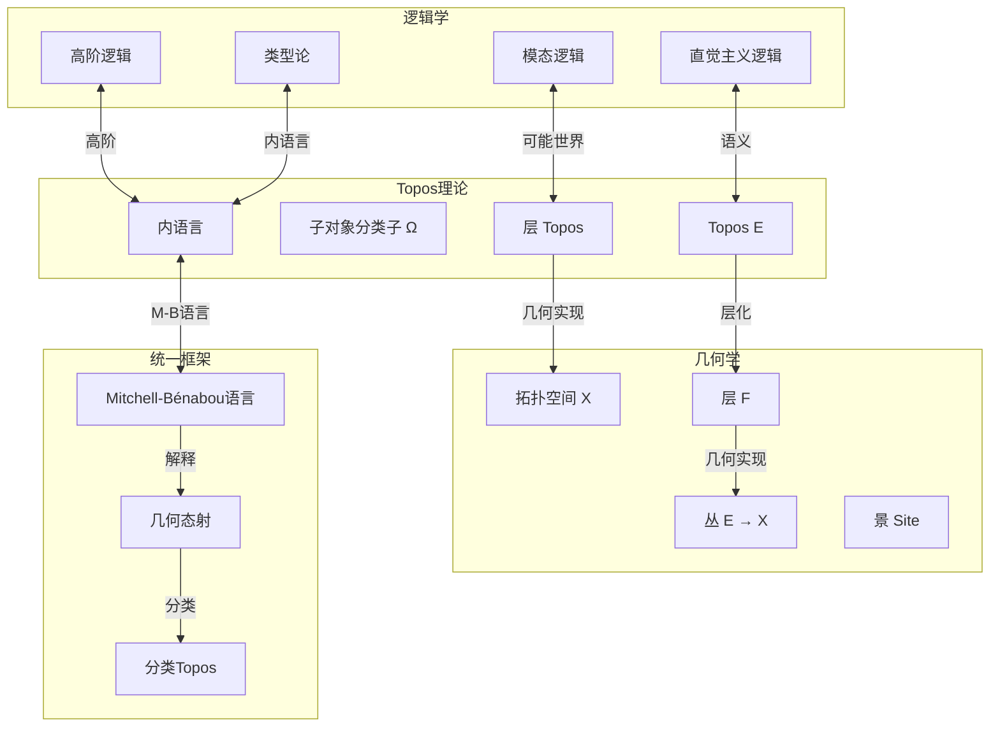
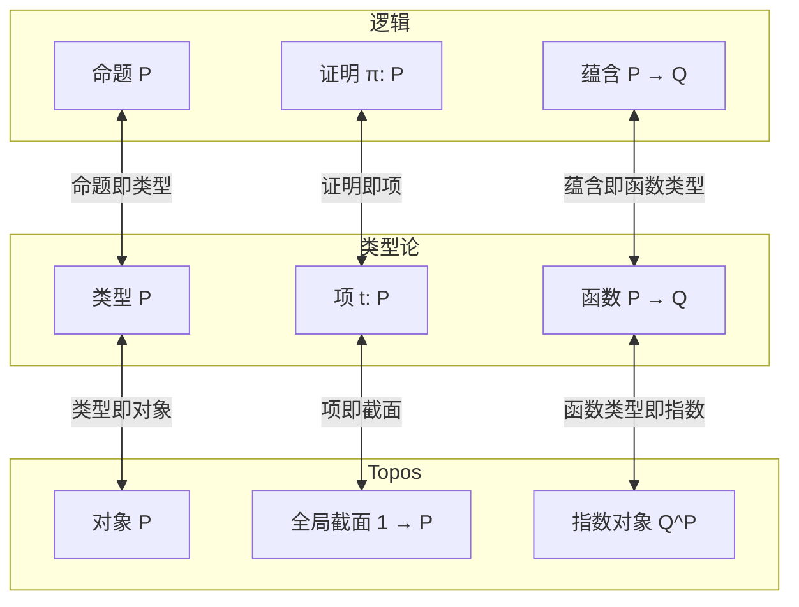
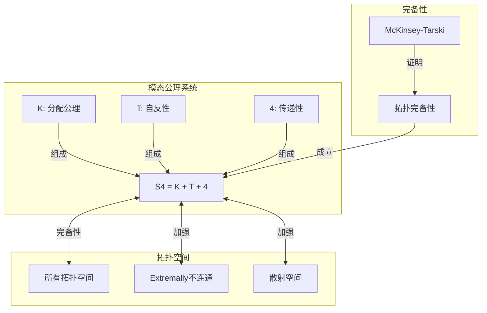
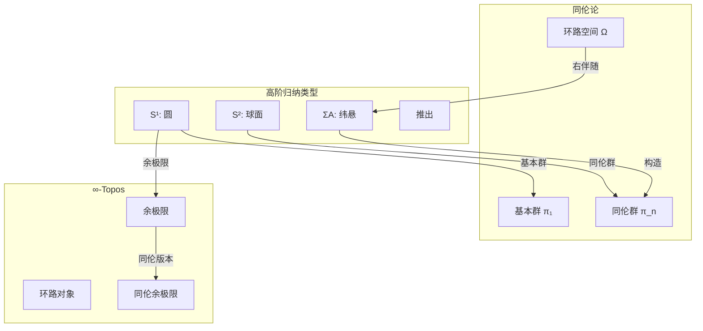
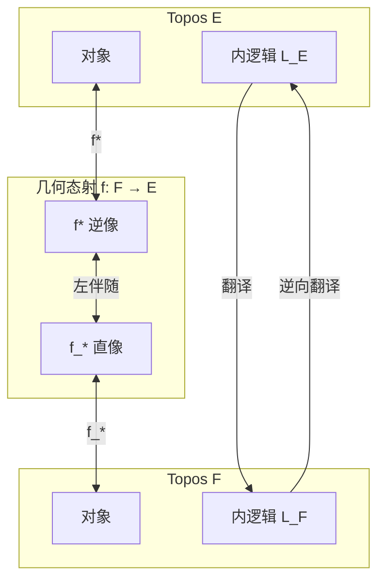
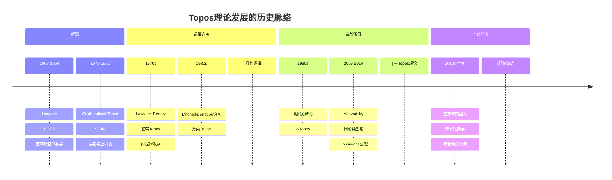

# 逻辑几何Topos理论

> **逻辑 ↔ 几何：直觉主义逻辑、层语义与Topos的深层统一**

---

## 目录

1. [核心理论框架](#一核心理论框架)
2. 直觉主义逻辑 ↔ Topos
3. 层语义 ↔ 模态逻辑
4. 同伦类型论 ↔ ∞-Topos
5. [内语言与几何实现](#五内语言与几何实现)
6. [历史发展与现代应用](#六历史发展与现代应用)

---

## 一、核心理论框架

### 1.1 Topos理论的基本哲学

Topos理论提供了一个统一的框架，将**逻辑**与**几何**联系起来：
- 每个Topos可以看作一个"广义集合论宇宙"
- 同时也是一个"广义空间"
- 逻辑命题对应于几何对象（子对象）



### 1.2 对应的三层结构

```

┌─────────────────────────────────────────────────────────────┐
│ 第一层：命题对应                                              │
│  直觉主义命题 ⟷ 子对象                                        │
│  真值 ⟷ 子终对象                                              │
│  逻辑连接词 ⟷ 子对象格运算                                    │
├─────────────────────────────────────────────────────────────┤
│ 第二层：类型对应                                              │
│  类型 ⟷ 对象                                                  │
│  项 ⟷ 全局截面                                                │
│  类型构造子 ⟷ 范畴论极限/余极限                               │
├─────────────────────────────────────────────────────────────┤
│ 第三层：模态对应                                              │
│  □（必然）⟷ 内部算子                                          │
│  ◇（可能）⟷ 闭包算子                                          │
│  可能世界 ⟷ 层/局部算子                                       │
└─────────────────────────────────────────────────────────────┘

```

---

## 二、直觉主义逻辑 ↔ Topos

### 2.1 Heyting代数与Topos的真值

**核心事实**：在Topos E中，子对象分类子 Ω 构成一个内部Heyting代数。

```mermaid
graph TB
    subgraph ClassicalLogic[经典逻辑]
        Bool[布尔代数 2 = {0,1}]
        ExcludedMiddle[排中律 P ∨ ¬P = ⊤]
        DoubleNeg[双重否定 ¬¬P = P]
    end

    subgraph IntuitionisticLogic[直觉主义逻辑]
        Heyting[Heyting代数 Ω]
        NoLEM[无排中律]
        WeakDouble[弱双重否定 ¬¬P → P]
    end

    subgraph ToposLogic[Topos内逻辑]
        Subobject[子对象 Sub(X)]
        TruthValues[真值 E(1, Ω)]
        InternalLogic[内逻辑]
    end

    Bool -.->|弱化| Heyting
    ExcludedMiddle -.->|不成立| NoLEM
    DoubleNeg -.->|弱化| WeakDouble
    
    Heyting <-->|同构| Subobject
    Heyting <-->|真值对象| TruthValues
    Subobject -->|内语言| InternalLogic
    TruthValues -->|解释| InternalLogic

```

**详细对应表**：

| 逻辑概念 | 直觉主义逻辑 | Topos对应 | 几何解释 |
|---------|------------|----------|---------|
| **真值** | Heyting代数元素 | **子对象分类子** Ω | 开集格 |
| **命题** | 可证性 | **子对象** U ⊆ X | 开子空间 |
| **与 ∧** | 合取 | **交** U ∩ V | 集合交 |
| **或 ∨** | 析取 | **并** U ∪ V | 集合并 |
| **蕴含 →** | 可证性蕴含 | **Heyting蕴含** U ⇒ V | 内部((X\U) ∪ V) |
| **否定 ¬** | 矛盾 | **伪补** ¬U = (U ⇒ ⊥) | 内部补集 |
| **真 ⊤** | 可证 | **极大元** X | 整个空间 |
| **假 ⊥** | 矛盾 | **极小元** ∅ | 空集 |

### 2.2 排中律的几何意义

**经典逻辑**：在集合范畴 Set 中，Ω = {0, 1} = 2 是布尔代数，排中律成立。

**直觉主义逻辑**：在层Topos Sh(X) 中，Ω = O(X)（开集格），排中律一般不成立。

```

例子：在 Sh(ℝ) 中
设 P 是命题"x > 0"（作为层/开集 (0, ∞)）

¬P 对应于 int(ℝ \ (0,∞)) = (-∞, 0]
¬¬P 对应于 int(ℝ \ (-∞, 0]) = (0, ∞) = P ✓

但 P ∨ ¬P 对应于 (0,∞) ∪ (-∞,0] = ℝ \ {0} ≠ ℝ

因此 P ∨ ¬P ≠ ⊤，排中律不成立！

```

### 2.3 证明即构造的对应

**Curry-Howard-Lambek对应（在Topos中）**：



**详细对应**：

| 逻辑 | 类型论 | Topos | 几何 |
|-----|-------|-------|-----|
| **命题 P** | **类型 P** | **对象 P** | 空间 |
| **证明** | **项 t: P** | **全局截面** | 点 |
| **P ∧ Q** | **积类型 P × Q** | **积 P × Q** | 乘积空间 |
| **P ∨ Q** | **和类型 P + Q** | **余积 P + Q** | 不交并 |
| **P → Q** | **函数类型 P → Q** | **指数 Q^P** | 映射空间 |
| **∀x:P.Q(x)** | **Π类型** | **右伴随 Π** | 截面空间 |
| **∃x:P.Q(x)** | **Σ类型** | **左伴随 Σ** | 全空间 |

---

## 三、层语义 ↔ 模态逻辑

### 3.1 层的模态逻辑解释

**层作为"可能世界"的集合**：

```

设 X 是拓扑空间，F 是 X 上的层

- 开集 U ⊆ X ⟷ 可能世界（知识状态）
- 截面 s ∈ F(U) ⟷ 在U上的局部真理
- 茎 F_x ⟷ 在世界x处的真理
- 限制映射 ⟷ 知识增长/细化

```

```mermaid
graph TB
    subgraph PossibleWorlds[可能世界]
        X[拓扑空间 X]
        U[开集 U ⊆ X]
        Inclusion[包含 V ⊆ U]
    end

    subgraph SheafSemantics[层语义]
        F[层 F]
        SectionU[截面 F(U)]
        SectionV[截面 F(V)]
        Restriction[限制映射 res_{U,V}]
    end

    subgraph ModalLogic[模态逻辑]
        Box[□（必然）]
        Diamond[◇（可能）]
        Local[局部真理]
        Global[全局真理]
    end

    X -->|开集| U
    U -->|包含| Inclusion
    V -->|包含于| U
    
    U -->|截面| SectionU
    V -->|截面| SectionV
    SectionU -->|限制| Restriction
    Restriction -->|映射到| SectionV
    
    F -->|解释| Box
    F -->|解释| Diamond
    SectionU -->|局部| Local
    SectionX -->|全局| Global

```

### 3.2 内部与闭包算子

**拓扑模态算子**：

在拓扑空间X的幂集P(X)上：

| 算子 | 定义 | 模态对应 | 代数性质 |
|-----|------|---------|---------|
| **内部** int(A) | 最大开子集 | **□A**（必然） | S4模态算子 |
| **闭包** cl(A) | 最小闭超集 | **◇A**（可能） | S4模态算子 |
| **外部** ext(A) | int(X\A) | **¬◇A** | - |
| **边缘** bd(A) | cl(A) \ int(A) | **◇A ∧ ¬□A** | 边界 |

**模态公理的几何意义**：

```

K: □(P → Q) → (□P → □Q)  ⟷  内部运算保持包含
T: □P → P                  ⟷  int(A) ⊆ A
4: □P → □□P               ⟷  int(int(A)) = int(A)
5: ◇P → □◇P               ⟷  cl(A)是开集（离散空间）
B: P → □◇P                ⟷  A ⊆ int(cl(A))（正则开）

```

### 3.3 McKinsey-Tarski定理

**定理陈述**：

```

S4模态逻辑与拓扑语义的关系：

S4 ⊨ φ  ⟺  对所有拓扑空间X，φ在X的层语义中成立

更精确地说：
- S4是拓扑空间的模态逻辑
- S4.2对应于extremally不连通空间
- S4.1对应于散射空间

```



---

## 四、同伦类型论 ↔ ∞-Topos

### 4.1 高阶结构与无穷范畴

**核心对应**：

```

同伦类型论(HoTT)            ∞-Topos理论
------------------          ------------------
类型 A                      ∞-群胚/对象
项 a : A                    点/全局截面
等同类型 a =_A b            道路空间 Path(a,b)
高阶等同 p =_{a=b} q        道路之间的同伦
同伦层次（h-level）          截断(truncation)

```

```mermaid
graph TB
    subgraph HomotopyTypeTheory[同伦类型论]
        Type[类型 A]
        Identity[a =_A b]
        Higher[p =_{a=b} q]
        Univalence[Univalence公理]
    end

    subgraph InfinityTopos[∞-Topos]
        Object[对象 X]
        Path[道路空间 Path(X)]
        Homotopy[高阶道路]
        ObjectClassifier[对象分类子]
    end

    subgraph Models[模型]
        SimplicialSets[单纯集]
        CubicalSets[立方体集]
    end

    Type <-->|基本群胚| Object
    Identity <-->|道路空间| Path
    Higher <-->|高阶道路| Homotopy
    Univalence <-->|对应| ObjectClassifier
    
    Object -->|Quillen模型| SimplicialSets
    Type -->|立方体模型| CubicalSets

```

### 4.2 Univalence公理的几何意义

**Univalence公理（Voevodsky）**：

```

等价即等同 (Equivalence is equivalent to Equality)

形式化表述：
(A =_U B) ≃ (A ≃ B)

其中：
- U 是宇宙（类型 universe）
- A =_U B 是等同类型
- A ≃ B 是等价类型

几何意义：
在同伦论中，同伦等价的空间在无穷群胚的意义下"等同"

```

**在∞-Topos中的实现**：

| HoTT概念 | ∞-Topos对应 | 几何意义 |
|---------|-----------|---------|
| **类型** | **对象** | 高阶群胚 |
| **等同 =** | **道路对象** | 路径空间 |
| **等价 ≅** | **弱等价** | 同伦等价 |
| **Univalence** | **对象分类子** | 万有纤维化 |
| **截断 ‖A‖_n** | **n-截断** | Postnikov塔 |

### 4.3 高阶归纳类型与几何构造

**高阶归纳类型(HIT)**：允许通过生成元和关系自由构造类型。



**经典HIT例子**：

| HIT | 构造 | 几何实现 | 同伦不变量 |
|-----|-----|---------|-----------|
| **S¹** | 点 base + 道路 loop | **圆周** | π₁ = ℤ |
| **S²** | 点 base + 2-道路 surf | **球面** | π₂ = ℤ |
| **ΣA** | 纬悬构造 | **纬悬空间** | π_{n+1}(ΣA) |
| **T²** | S¹ × S¹ | **环面** | π₁ = ℤ² |
| **ℝP^∞** | 反演作用 | **无穷实射影空间** | π₁ = ℤ/2 |

---

## 五、内语言与几何实现

### 5.1 Mitchell-Bénabou内语言

**基本思想**：每个Topos都有其"内语言"，允许像处理集合一样处理Topos中的对象。

```mermaid
graph TB
    subgraph InternalLogic[内逻辑]
        Variables[变量 x: X]
        Formulas[公式 φ(x)]
        Quantifiers[量词 ∀, ∃]
        Connectives[连接词 ∧, ∨, →]
    end

    subgraph ToposInternal[Topos内构造]
        Objects[对象 X, Y]
        Morphisms[态射 f: X → Y]
        Subobjects[子对象 {x | φ(x)}]

        Classifier[分类态射 χ: X → Ω]
    end

    subgraph External[外范畴]
        ExternalLogic[外逻辑]
        MetaTheory[元理论]
    end

    Variables <-->|解释| Objects
    Formulas <-->|解释| Subobjects
    Quantifiers <-->|伴随| Morphisms
    Connectives <-->|格运算| Classifier
    
    Objects -->|内构造| ExternalLogic
    Subobjects -->|真值| MetaTheory

```

**内语言解释表**：

| 内逻辑 | 语法 | Topos语义 | 几何解释 |
|-------|-----|----------|---------|
| **元素 x ∈ X** | 变量 | **广义元素** x: U → X | 从开集的映射 |
| **谓词 P(x)** | 公式 | **子对象** {x | P(x)} ⊆ X | 开子空间 |
| **∀x:P.Q** | 全称量词 | **右伴随** Π | 截面空间 |
| **∃x:P.Q** | 存在量词 | **左伴随** Σ | 全空间 |
| **P ∧ Q** | 合取 | **拉回** | 交 |
| **P ∨ Q** | 析取 | **像的并** | 并 |
| **P → Q** | 蕴含 | **指数** Q^P | 映射空间 |

### 5.2 几何态射与逻辑翻译

**几何态射 f: F → E**：由一对伴随函子构成

```

f* : E → F  （逆像，保持有限极限）
f_* : F → E  （直像，右伴随）

逻辑意义：
- f* 翻译E中的逻辑到F
- f_* 是"全局截面"或" forall "的推广

```



### 5.3 分类Topos

**思想**：每个几何理论T都有一个"分类Topos"，使得T的模型对应于几何态射。

```

几何理论 T ────→ 分类Topos B(T)
   ↓                      ↓
T的模型    ⟷    几何态射 E → B(T)

例子：
- 对象分类子：分类"对象"
- 子对象分类子：分类"子对象"
- 循环群分类子：分类"循环群对象"

```

---

## 六、历史发展与现代应用

### 6.1 Topos理论的历史脉络



### 6.2 关键人物贡献

| 数学家 | 贡献 | 跨分支工作 |
|-------|------|-----------|
| **Grothendieck** | Grothendieck Topos | 几何-代数联系 |
| **Lawvere** | 初等Topos, ETCS | 逻辑-范畴论统一 |
| **Tierney** | 初等Topos理论 | 层论公理化 |
| **Makkai-Reyes** | 分类Topos | 逻辑-几何对应 |
| **Johnstone** | Topos百科全书 | 系统整理 |
| **Voevodsky** | 同伦类型论 | 逻辑-同伦联系 |
| **Lurie** | ∞-Topos理论 | 高阶范畴论 |
| **Awodey-Coquand** | 立方体类型论 | 计算实现 |

### 6.3 现代应用领域

| 应用领域 | 核心数学 | Topos工具 |
|---------|---------|----------|
| **形式化证明** | 证明助手 | HoTT, 立方体类型论 |
| **综合微分几何** | SDG | 可微Topos |
| **域论/物理** | 量子引力 | 光滑无穷 Topos |
| **计算机科学** | 域论/语义 | 层语义, 类型论 |
| **代数几何** | motive理论 | 导出无穷 Topos |
| **集合论基础** | ETCS | 初等Topos |

### 6.4 形式化数学案例

```mermaid
graph TB
    subgraph TypeTheory3[类型论]
        Dependent[依赖类型]
        Inductive[归纳类型]
        HIT2[高阶归纳类型]
    end

    subgroup ProofAssistant[证明助手]
        Coq[Coq]
        Agda[Agda]
        Lean[Lean]
        Cubical[Cubical Agda]
    end

    subgraph FormalizedMath[形式化数学]
        Homotopy[同伦论]
        Category[范畴论]
        AlgebraicTopology[代数拓扑]
    end

    Dependent -->|基础| Coq
    Dependent -->|基础| Agda
    Inductive -->|核心| Lean
    HIT2 -->|HoTT| Cubical
    
    Coq -->|MathComp| FormalizedMath
    Agda -->|UniMath| Homotopy
    Cubical -->|立方体HoTT| Homotopy
    Lean -->|Mathlib4| Category

```

---

## 七、概念映射汇总

### 7.1 完整对应表

| 逻辑概念 | 逻辑定义 | Topos对应 | 几何解释 |
|---------|---------|----------|---------|
| **命题 P** | 可证性 | **子对象** U ⊆ X | 开子空间 |
| **真值** | Heyting代数 | **真值对象** Ω | 子对象分类子 |
| **证明** | 构造 | **全局截面** 1 → P | 点 |
| **必然 □P** | S4模态 | **内部算子** int(U) | 最大开子集 |
| **可能 ◇P** | S4模态 | **闭包算子** cl(U) | 最小闭超集 |
| **类型 A** | 类型论 | **对象** A ∈ E | 空间 |
| **等同 a = b** | 同一性 | **道路空间** | 路径对象 |
| **等价 A ≃ B** | 结构相同 | **弱等价** | 同伦等价 |

### 7.2 统计信息

- **核心对应**: 15+ 组
- **关键定理**: 8+ 条
- **Topos类型**: 6+ 种
- **应用领域**: 7+ 个
- **历史节点**: 10+ 个

---

*文档版本: 2026年4月 | 逻辑几何Topos理论 | FormalMath项目*
