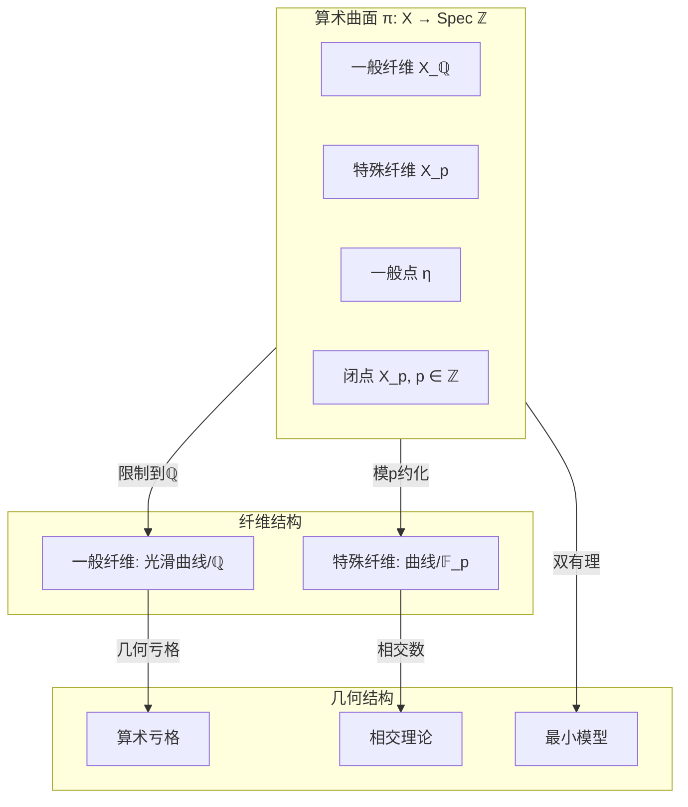
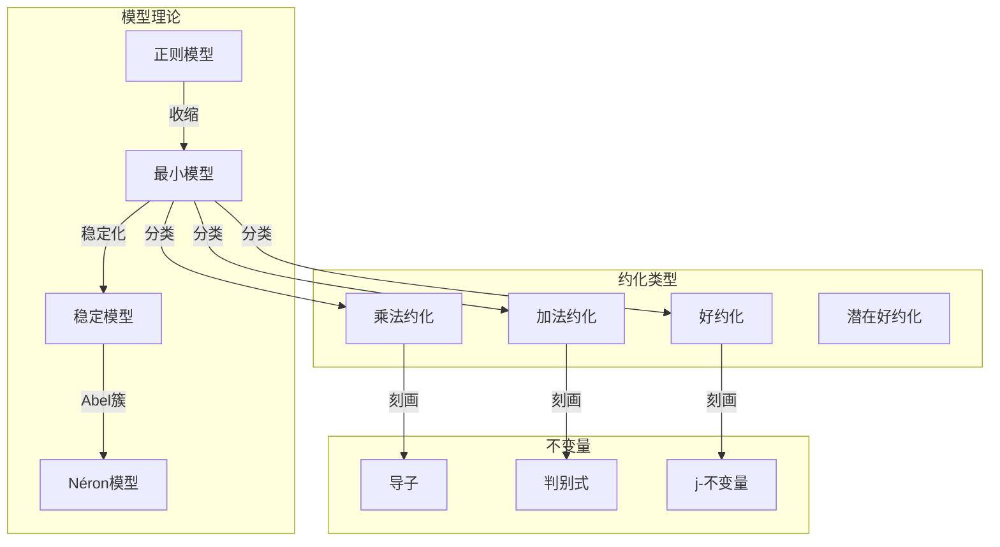
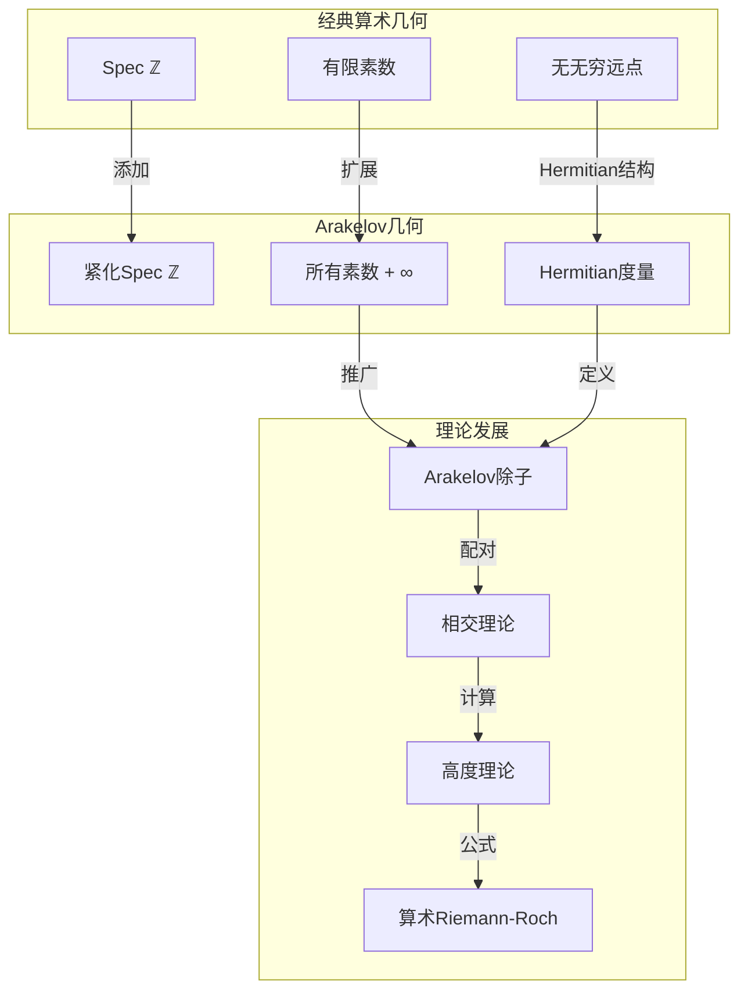
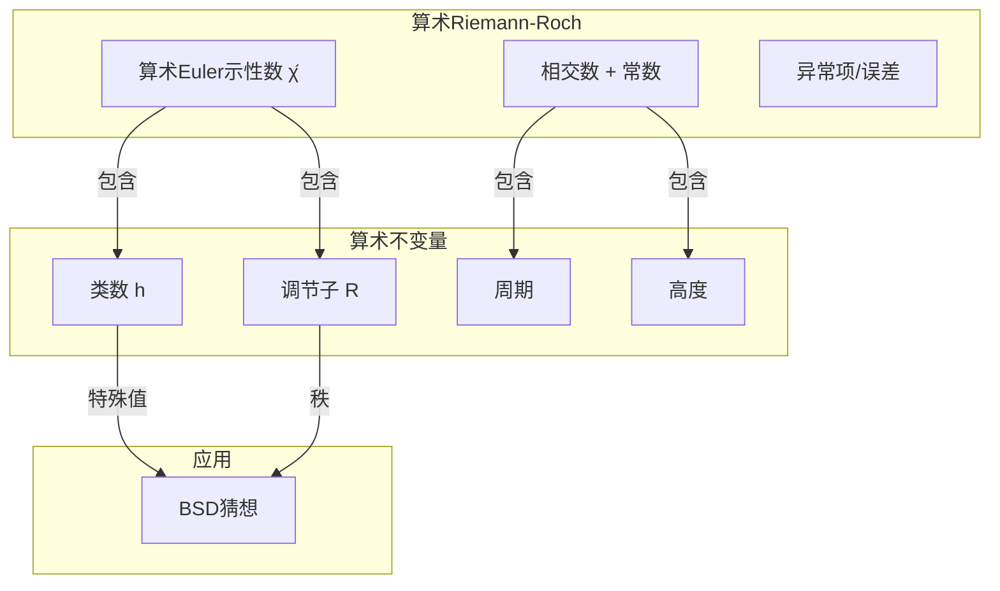
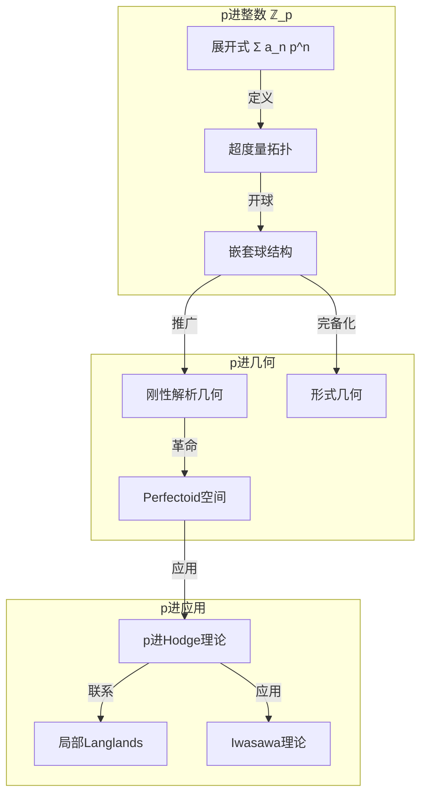
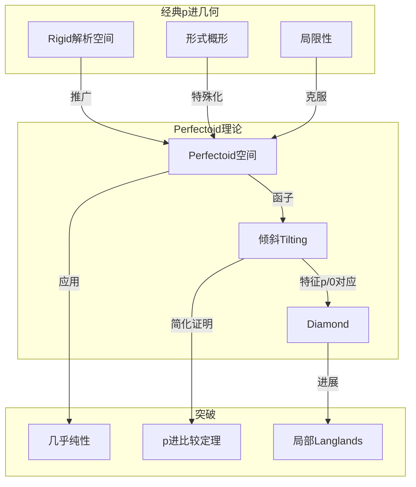
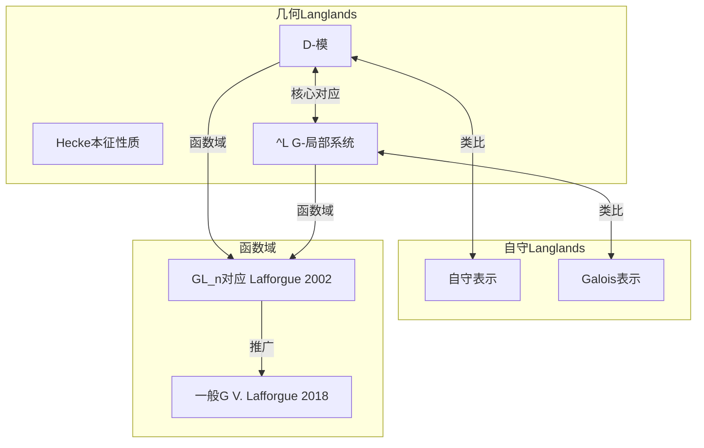
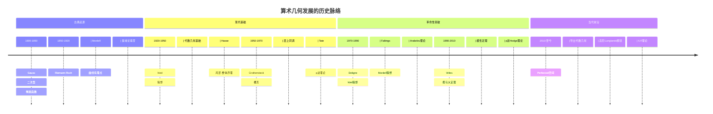

# 算术几何前沿

> **数论 ↔ 几何：算术几何的深层联系与现代发展**

---

## 目录

1. [核心理论框架](#一核心理论框架)
2. [算术曲面](#二算术曲面)
3. [Arakelov理论](#三arakelov理论)
4. [p进几何](#四p进几何)
5. [Langlands纲领](#五langlands纲领)
6. [历史发展与现代前沿](#六历史发展与现代前沿)

---

## 一、核心理论框架

### 1.1 算术几何的基本哲学

算术几何研究**数论问题**的**几何方法**和**几何问题**的**数论应用**，核心是将整数环Spec ℤ视为一维概形，研究其上的"曲线"。

```mermaid
graph TB
    subgraph NumberTheory[数论侧]
        Q[有理数域 ℚ]
        Z[整数环 ℤ]
        OK[整数环 O_K]
        Galois[Galois群 Gal(K/ℚ)]
    end

    subgraph ArithmeticGeometry[算术几何]
        SpecZ[Spec ℤ]
        SpecOK[Spec O_K]
        Curve[算术曲线]
        Point[素理想/闭点]
    end

    subgroup AlgebraicGeometry[代数几何]
        Scheme[概形理论]
        Divisor[除子理论]
        Cohomology[层上同调]
        Bundle[向量丛]
    end

    subgraph Unified[统一框架]
        ArakelovTheory[Arakelov理论]
        PAdic[p进Hodge理论]
        Langlands[Langlands纲领]
    end

    Q -->|类比| Curve
    Z -->|一维概形| SpecZ
    OK -->|Dedekind概形| SpecOK

    SpecZ -->|层论| Scheme
    SpecOK -->|除子| Divisor
    Galois -->|étale上同调| Cohomology

    Curve <-->|Arakelov| ArakelovTheory
    SpecZ <-->|p进| PAdic
    Galois <-->|表示论| Langlands

```

### 1.2 数域 ↔ 函数域的类比

**核心类比**：数域（ℚ的有限扩张）与函数域（曲线的有理函数域）之间的深刻相似。

```

数域 K/ℚ          函数域 k(C)/k         统一概念
-----------       ---------------       -----------
整数环 O_K        正则函数环 k[C]      整体结构层
素理想 𝔭          点 P ∈ C              位(place)
完备化 K_𝔭        形式幂级数 k((t))     局部域
Adele环 𝔸_K       Adele环 (几何)        限制直积
类群 Cl_K         Picard群 Pic⁰(C)      理想类群
Zeta函数 ζ_K(s)   Weil Zeta Z(C,T)      生成函数

```

```mermaid
graph TB
    subgraph NumberField[数域情形]
        K[数域 K]
        Places[位集合 M_K]
        Global[整体域]
    end

    subgraph FunctionField[函数域情形]
        kC[函数域 k(C)]
        Points[曲线点集]
        Function[函数域]
    end

    subgraph GlobalTheory[全局理论]
        Adele[Adele理论]
        ClassField[类域论]
        Zeta[Zeta理论]
    end

    K <-->|类比| kC
    Places <-->|对应| Points
    Global <-->|类比| Function

    K -->|限制积| Adele
    kC -->|限制积| Adele

    K -->|Galois理论| ClassField
    kC -->|Galois理论| ClassField

    K -->|解析| Zeta
    kC -->|Weil| Zeta

```

---

## 二、算术曲面

### 2.1 算术曲面的定义与结构

**定义**：算术曲面是指平坦、有限型、相对维数1的概形 π: X → Spec ℤ。

**结构分解**：



### 2.2 算术曲面的基本不变量

| 不变量 | 定义 | 几何意义 | 数论意义 |
|-------|-----|---------|---------|
| **算术亏格** p_a | dim H¹(X, O_X) | 整体几何复杂度 | 类数相关 |
| **几何亏格** p_g | dim H⁰(X, ω_X) | 典则除子的截面 | 微分形式 |
| **Euler示性数** χ | 2 - 2p_a | 拓扑不变量 | 解析公式 |
| **自交数** K² | 典则除子自交 | 双有理不变量 | 稳定性 |
| **高度** h | Arakelov高度 | 度量几何 | 算术复杂度 |

### 2.3 最小模型与稳定约化

**最小模型理论**：

```

对于算术曲面 X → Spec ℤ，存在最小模型 X^{min} 满足：
1. X^{min} 是正则的
2. 典范除子 K_{X^{min}} 相对丰富
3. 在所有模型中体积最小

特殊纤维的约化类型：
- 好约化：光滑曲线
- 乘法约化：节点曲线
- 加法约化：尖点曲线

```



---

## 三、Arakelov理论

### 3.1 Arakelov几何的基本思想

**核心洞见**：在算术几何中，"无穷远点"应该被认真对待，如同有限素点一样。

```

经典代数几何：
- 只考虑Spec ℤ上的点（素数）
- 缺少"无穷远"的信息

Arakelov几何：
- 添加无穷远点 ∞
- Spec ℤ 的"紧化"：Spec ℤ ∪ {∞}
- 在无穷远处添加Hermitian度量

```



### 3.2 Arakelov除子与相交理论

**Arakelov除子定义**：

```

Div̂(X) = {有限除子} ⊕ {无穷处度量}

对于算术曲面 π: X → Spec ℤ：
D̂ = (D_f, g_∞)

其中：
- D_f 是有限部分的Weil除子
- g_∞ 是在X_∞（Riemann面）上的Green函数

```

**相交配对**：

| 相交类型 | 有限-有限 | 有限-无穷 | 无穷-无穷 |
|---------|----------|----------|----------|
| **定义** | 通常相交数 | Green函数积分 | 度规配对 |
| **公式** | (D·E)_f | ∫ g_D dμ_E | ⟨ω_D, ω_E⟩ |

### 3.3 算术Riemann-Roch定理

**定理陈述（Gillet-Soulé）**：

```

对于算术曲面 X 上的Hermitian线丛 L̄：

χ̂(L̄) = (L̄·(L̄ - ω̄_X))/2 + χ̂(O_X) + O(误差项)

其中：
- χ̂ 是算术Euler示性数
- (·) 是Arakelov相交配对
- ω̄_X 是装备Arakelov度量的典则除子

数论意义：
- 连接了类数、调节子、导子等不变量
- 推广了经典的Riemann-Roch公式

```



---

## 四、p进几何

### 4.1 p进数的几何直观

**p进整数的几何**：ℤ_p 可以被看作以 p 为基的"形式圆盘"。



### 4.2 p进Hodge理论

**比较定理**：p进Hodge理论提供了不同上同调理论之间的比较同构。

| 上同调理论 | 定义 | p进比较 | 特征0类比 |
|-----------|-----|--------|----------|
| **p进étale** | H^i_{ét}(X_{K̄}, ℚ_p) | 基点 | Betti上同调 |
| **de Rham** | H^i_{dR}(X/K) | 比较 | 代数de Rham |
| **晶体** | H^i_{cris}(X_k/W) | 比较 | 奇异上同调 |
| **对数晶体** | H^i_{log-cris} | 比较 | 边界情形 |

**p进比较同构**：

```

对于光滑真概形 X/K（K是p进域）：

H^i_{ét}(X_{K̄}, ℚ_p) ⊗_{ℚ_p} B_{dR} ≅ H^i_{dR}(X/K) ⊗_K B_{dR}

其中 B_{dR} 是de Rham周期环

这表明：
- p进étale上同调（算术）
- 与de Rham上同调（几何）
- 通过周期环联系

```

### 4.3 Perfectoid空间革命

**Peter Scholze的贡献（2012）**：

```

Perfectoid空间：
- 新型p进解析空间
- 允许"提取p次根"
- 连接特征0和特征p的几何

核心定理：
- 几乎纯性定理
- p进Hodge理论的简化证明
- 对局部Langlands纲领的突破

```



---

## 五、Langlands纲领

### 5.1 Langlands纲领总览

**核心愿景**：建立数论、表示论、代数几何之间的深刻对应。

```mermaid
graph TB
    subgraph NumberTheory4[数论侧]
        GalRep[Galois表示 ρ: G_ℚ → GL_n]
        ArtinL[Artin L-函数]
        Reciprocity[互反律]
    end

    subgraph AutomorphicSide[自守侧]
        AutoRep[自守表示 π]
        AutoForm[自守形式]
        StandardL[标准L-函数 L(s,π)]
        Hecke[Hecke算子]
    end

    subgroup GeometricSide[几何侧]
        Motive[Motive]
        Shimura[Shimura簇]
        Moduli[模空间]
    end

    subgraph LanglandsCorrespondence[Langlands对应]
        Local[局部对应]
        Global[整体对应]
        Functoriality[函子性]
    end

    GalRep <-->|对应| AutoRep
    ArtinL <-->|相等| StandardL
    Reciprocity <-->|体现| Functoriality

    AutoRep <-->|几何实现| Motive
    AutoForm <-->|几何实现| Shimura

    Local -->|整体化| Global
    Global -->|提升| Functoriality

```

### 5.2 数论↔表示论↔几何的三元对应

**详细对应表**：

| 数论概念 | 表示论概念 | 几何概念 | 对应关系 |
|---------|----------|---------|---------|
| **Galois群 G_F** | **L-群 ^L G** | **基本群 π₁^{ét}** | Langlands对偶 |
| **Galois表示 ρ** | **自守表示 π** | **局部系统** | 核心对应 |
| **Artin L-函数** | **标准L-函数** | **Hasse-Weil Zeta** | 相等 |
| **素数 p** | **局部分量 π_p** | **点 p ∈ Spec ℤ** | 位 |
| **类域论** | **GL₁对应** | **Picard群** | 交换情形 |
| **Frobenius元素** | **Hecke算子 T_p** | **Frobenius作用** | 迹相等 |

### 5.3 几何Langlands纲领

**函数域上的Langlands对应**：

```

设 C 是 𝔽_q 上的光滑射影曲线

几何Langlands对应：
{ Bun_G(C) 上的Hecke本征D-模 }
    ↔
{ ^L G-局部系统 }

其中：
- Bun_G(C) 是G-丛的模空间
- Hecke本征意味着D-模在Hecke作用下有本征性质
- ^L G 是Langlands对偶群

```



### 5.4 关键结果与开放问题

**已证明的重要结果**：

| 结果 | 内容 | 证明者 | 年份 |
|-----|------|-------|------|
| **函数域GL_n** | 函数域上的Langlands对应 | L. Lafforgue | 2002 |
| **函数域一般G** | 一般约化群对应 | V. Lafforgue | 2018 |
| **模性提升** | 对称幂提升 | Kim-Shahidi | 2000s |
| **局部对应** | 局部Langlands对应 | Harris-Taylor等 | 2001 |
| **几何对应** | 几何Langlands（部分） | Gaitsgory等 | 2010s |

**主要开放问题**：

```

1. 数域上的Langlands对应（一般情形）
2. 函子性猜想的一般证明
3. Langlands纲领与物理的联系
4. 几何Langlands的完整证明
5. 与motive理论的精确联系

```

---

## 六、历史发展与现代前沿

### 6.1 算术几何的历史脉络



### 6.2 关键人物贡献

| 数学家 | 贡献 | 跨分支工作 |
|-------|------|-----------|
| **Weil** | Weil猜想 | 数论-几何联系 |
| **Grothendieck** | 概形理论, motive | 现代代数几何之父 |
| **Tate** | p进理论, Tate模 | 数论-几何桥梁 |
| **Deligne** | 证明Weil猜想 | ℓ-adic上同调 |
| **Faltings** | Mordell猜想 | Diophantine几何 |
| **Arakelov** | Arakelov理论 | 紧化算术几何 |
| **Wiles** | 费马大定理 | 模性定理 |
| **Lafforgue** | 函数域Langlands | 几何Langlands |
| **Scholze** | Perfectoid理论 | p进几何革命 |
| **Mochizuki** | IUT理论 | abc猜想 |

### 6.3 现代应用领域

| 应用领域 | 核心数学 | 算术几何工具 |
|---------|---------|-------------|
| **密码学** | ECC, 配对 | 椭圆曲线算术, Tate配对 |
| **量子计算** | 拓扑量子计算 | 算术拓扑, 纽结不变量 |
| **弦理论** | Calabi-Yau紧化 | 算术几何, motive |
| **机器学习** | 代数统计 | 算术簇, 高度理论 |
| **编码理论** | 代数几何码 | 曲线有理点, Riemann-Roch |
| **形式化证明** | 证明助手 | 算术几何形式化 |

### 6.4 椭圆曲线密码学深度应用

```mermaid
graph TB
    subgraph EllipticCurveMath[椭圆曲线数学]
        E2[椭圆曲线 E]
        Group[群结构 E(F_q)]
        TateModule[Tate模 T_l(E)]
        WeilPairing[Weil配对 e_n]
    end

    subgraph Arithmetic[算术性质]
        Reduction[约化类型]
        Counting[点计数 #E(F_q)]
        ZetaFunction[局部Zeta函数]
    end

    subgroup Cryptography[密码学应用]
        ECDH2[ECDH]
        ECDSA2[ECDSA]
        BLS2[BLS签名]
        PairingCrypto[配对密码]
    end

    subgraph Advanced[高级应用]
        ZK[零知识证明]
        SNARK[zk-SNARKs]
        MPC[安全多方计算]
    end

    E2 --> Group
    E2 --> TateModule
    TateModule --> WeilPairing

    E2 --> Reduction
    Group --> Counting
    Counting --> ZetaFunction

    Group --> ECDH2
    Group --> ECDSA2
    WeilPairing --> BLS2
    WeilPairing --> PairingCrypto

    PairingCrypto --> ZK
    ZK --> SNARK
    BLS2 --> MPC

```

---

## 七、概念映射汇总

### 7.1 完整对应表

| 数论概念 | 数论定义 | 几何概念 | 几何定义 |
|---------|---------|---------|---------|
| **整数环 ℤ** | 有理整数 | **Spec ℤ** | 一维概形 |
| **素数 p** | 不可约整数 | **闭点** | 极大理想 |
| **数域 K** | ℚ的有限扩张 | **曲线** | 一维正则概形 |
| **理想类群** | 分式理想/主理想 | **Picard群** | 线丛同构类 |
| **完备化 K_p** | p进完备 | **形式纤维** | 形式几何 |
| **Galois群** | 域自同构 | **étale基本群** | 覆叠变换 |
| **L-函数** | Euler乘积 | **Hasse-Weil Zeta** | 上同调结构 |
| **高度** | 算术复杂度 | **Arakelov度量** | 度规结构 |

### 7.2 统计信息

- **核心对应**: 15+ 组
- **关键定理**: 10+ 条
- **应用领域**: 7+ 个
- **历史节点**: 12+ 个
- **开放问题**: 6+ 个

---

*文档版本: 2026年4月 | 算术几何前沿 | FormalMath项目*
