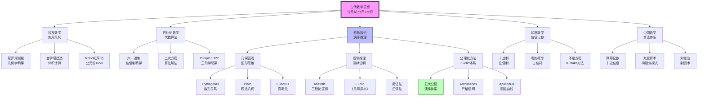
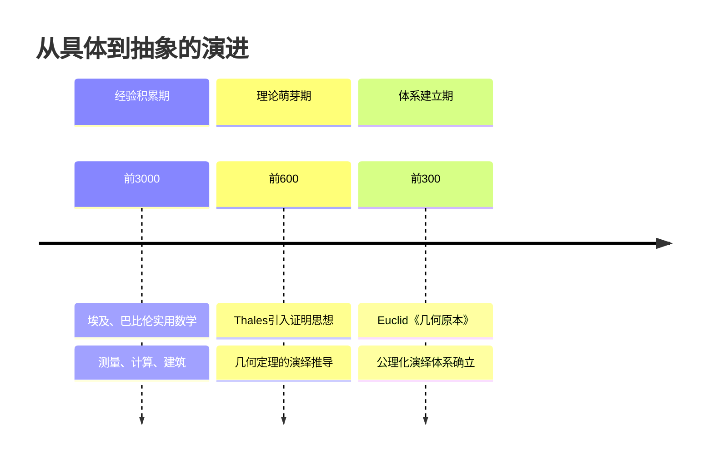
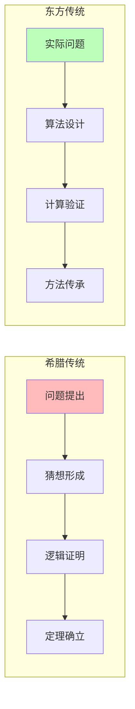
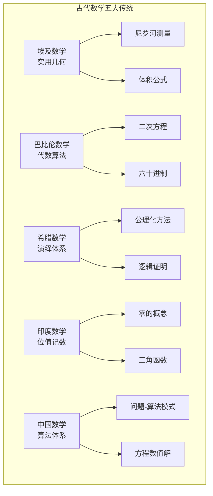
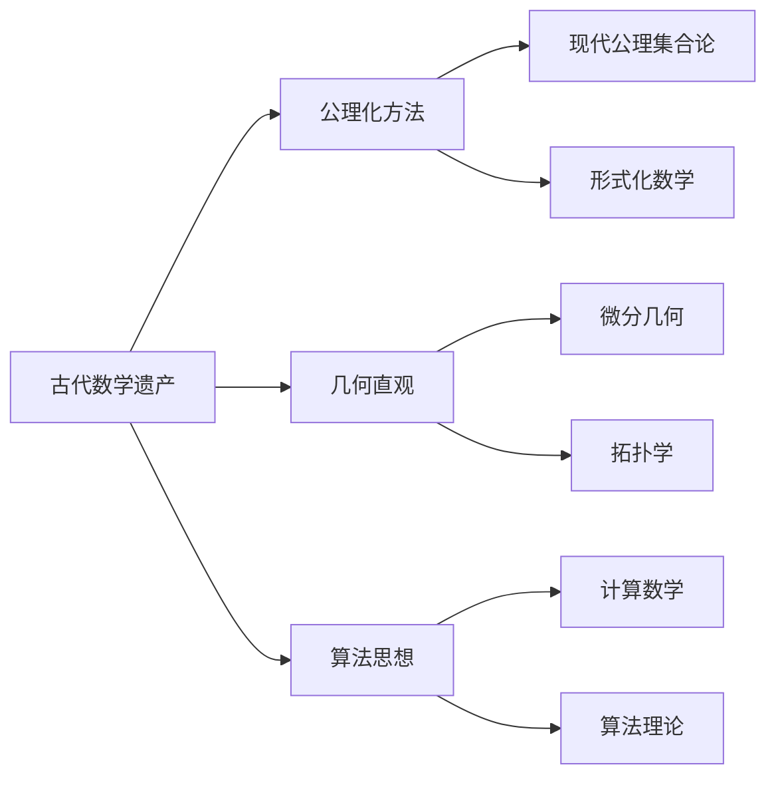

# 古代数学思想演进

> **历史时期**：公元前3000年 - 公元5世纪

---

## 时代背景

古代数学起源于人类文明的实际需求：土地测量、天文观测、商业计算和工程建设。不同文明发展出各具特色的数学传统，其中古希腊、埃及、巴比伦、印度和中国的贡献尤为突出。

---

## 核心思想演进树

---

## 关键人物及其贡献

### 1. Euclid（欧几里得，约前330-前275）

| 维度 | 内容 |
|------|------|
| **核心著作** | 《几何原本》（Elements），约公元前300年 |
| **核心贡献** | 建立公理化演绎体系，23条定义、5条公设、5条公理 |
| **思想突破** | 从少数不证自明的命题出发，通过逻辑演绎构建整个几何体系 |
| **历史意义** | 西方数学传统的奠基之作，影响持续两千余年 |

**五大公设**：

1. 任意两点可连一直线
2. 直线可无限延长
3. 以任意点为中心，任意长为半径可作圆
4. 凡直角皆相等
5. **平行公设**：若一直线与两直线相交，同侧内角之和小于两直角，则两直线延长后在该侧相交

### 2. Aristotle（亚里士多德，前384-前322）

| 维度 | 内容 |
|------|------|
| **核心著作** | 《工具论》（Organon） |
| **核心贡献** | 建立形式逻辑体系，特别是三段论 |
| **思想突破** | 将逻辑推理系统化，为数学证明提供方法论基础 |
| **历史意义** | 西方逻辑学的奠基人，影响数学证明风格两千余年 |

### 3. Archimedes（阿基米德，前287-前212）

| 维度 | 内容 |
|------|------|
| **核心著作** | 《论球与圆柱》《圆的度量》《论螺线》 |
| **核心贡献** | 穷竭法、杠杆原理、浮力定律、π的精确计算 |
| **思想突破** | 将几何直观与严格证明完美结合，逼近思想的先驱 |
| **历史意义** | 古代最伟大的数学家之一，积分思想的雏形 |

### 4. 刘徽（约225-约295）

| 维度 | 内容 |
|------|------|
| **核心著作** | 《九章算术注》《海岛算经》 |
| **核心贡献** | 割圆术、开立圆术、重差术 |
| **思想突破** | 通过内接正多边形逼近圆面积，π≈3.1416 |
| **历史意义** | 中国古典数学理论的奠基人 |

---

## 思想转折点分析

### 转折一：从具体到抽象（约公元前500-前300）

**关键变化**：

- 从**具体问题**（测量、计算）转向**抽象关系**（点、线、面的性质）
- 从**经验归纳**转向**逻辑演绎**
- 从**实用算法**转向**理论体系**

### 转折二：从计算到证明（希腊 vs 东方）

**对比分析**：

| 维度 | 希腊传统 | 东方传统 |
|------|----------|----------|
| **核心目标** | 知识的确证 | 问题的解决 |
| **方法论** | 演绎推理 | 算法构造 |
| **成果形式** | 定理与证明 | 算法与例题 |
| **典型案例** | Euclid《几何原本》 | 《九章算术》 |

---

## 各文明传统对比

---

## 对后世影响

### 直接影响

1. **希腊传统的影响**
   - 中世纪经院哲学的逻辑训练
   - 文艺复兴时期数学的复兴
   - 现代公理化方法的直接源头

2. **东方传统的影响**
   - 阿拉伯数学的桥梁作用
   - 十进制记数法的全球传播
   - 算法数学的现代复兴（吴文俊机械化数学）

### 范式遗产

| 遗产 | 内容 | 现代延续 |
|------|------|----------|
| 公理化方法 | 从不证自明的公理出发 | Hilbert公理化、ZFC集合论 |
| 演绎推理 | 逻辑推导的严格性要求 | 现代数学证明标准 |
| 几何直观 | 图形辅助思维 | 微分几何、拓扑学 |
| 算法构造 | 问题-算法-应用模式 | 计算数学、计算机科学 |

---

## 现代意义

### 1. 数学教育的启示

- **两种传统并重**：演绎推理与算法构造都是数学的本质特征
- **直观与严格平衡**：Archimedes式的几何直观仍有重要价值
- **历史文化维度**：理解数学思想的演进有助于把握数学本质

### 2. 当代数学的基础

### 3. 未解决的问题

- **平行公设的独立性**：Euclid第五公设的地位问题，直到19世纪才得到解决
- **无穷概念的处理**：古代数学对无穷的态度（潜无穷 vs 实无穷）
- **构造性 vs 存在性证明**：这一分歧一直延续到当代数学基础争论

---

## 总结

古代数学思想的演进呈现两条主线：

1. **希腊传统**：从Pythagoras到Euclid再到Archimedes，建立了以演绎推理为核心的公理化数学传统，强调证明的严格性和知识的系统性。

2. **东方传统**（埃及、巴比伦、印度、中国）：发展了以算法构造为核心的实用数学传统，强调问题的解决和方法的传承。

这两种传统在后世不断交汇融合，共同构成现代数学的丰富遗产。理解这一演进脉络，有助于把握数学的本质——既是发现真理的演绎科学，也是解决问题的算法艺术。

---

*文档编号：01*
*创建日期：2026年4月*
*所属项目：FormalMath 第十批推进计划*
*涵盖时期：公元前3000年 - 公元5世纪*
*关键人物：Euclid、Aristotle、Archimedes、刘徽等*
