# 数学思想演进树

> **完整版深度** | 涵盖从古代至当代的数学思想演进脉络

---

## 概述

数学思想的演进是人类理性思维的壮丽史诗。从古希腊的公理化方法到现代的结构主义，从几何直观到抽象代数，数学思想经历了数次深刻的范式转换。本文档构建数学思想的演进树，追溯各核心思想的历史脉络、突破点和深远影响。

---

## 一、古代数学（公元前3000年-公元5世纪）

### 1.1 希腊数学传统

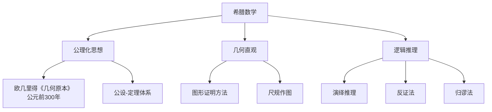

#### 1.1.1 公理化思想（欧几里得）

| 维度 | 内容 |
|-----|------|
| **时间节点** | 约公元前300年 |
| **核心人物** | 欧几里得（Euclid） |
| **核心思想** | 从少数公设出发，通过逻辑演绎构建整个数学体系 |
| **突破点** | 首次系统阐述公理化方法，确立5条几何公设 |
| **历史意义** | 奠定西方数学传统的基础，影响长达2000余年 |
| **对后世影响** | 希尔伯特公理化、现代公理集合论、Bourbaki结构主义 |

#### 1.1.2 几何直观与逻辑推理

- **几何直观**：以图形为思维媒介，通过视觉洞察发现定理
- **逻辑推理**：亚里士多德三段论在数学中的应用，强调严密证明
- **代表人物**：柏拉图（理念论）、亚里士多德（逻辑学）、阿基米德（穷竭法）、阿波罗尼奥斯（圆锥曲线）

### 1.2 东方数学传统

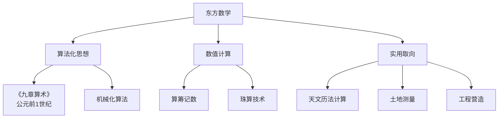

#### 1.2.1 算法化思想（中国）

| 维度 | 内容 |
|-----|------|
| **时间节点** | 《九章算术》约公元前1世纪-公元1世纪 |
| **核心人物** | 刘徽（注释）、祖冲之、秦九韶 |
| **核心思想** | 问题-算法-应用的程式化数学 |
| **突破点** | 开立圆术、割圆术、大衍求一术（中国剩余定理） |
| **历史意义** | 形成与希腊演绎数学并行的算法数学传统 |
| **对后世影响** | 吴文俊数学机械化、现代计算机科学 |

#### 1.2.2 数值计算与实用取向

- **算筹与算盘**：十进位值制记数法的高效计算工具
- **天文历法**：精密的天文计算推动代数方法发展
- **特色成就**：
  - 圆周率计算（祖冲之：3.1415926 < π < 3.1415927）
  - 高次方程数值解法（增乘开方法）
  - 线性方程组解法（直除法）

### 1.3 印度-阿拉伯数学

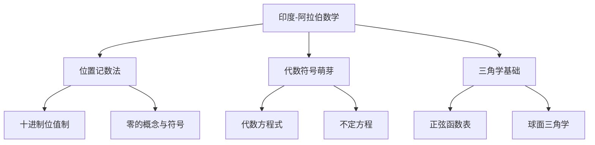

#### 1.3.1 位置记数法与零的概念

| 维度 | 内容 |
|-----|------|
| **时间节点** | 公元5-12世纪 |
| **核心人物** | 婆罗摩笈多、花拉子米、斐波那契 |
| **核心思想** | 十进位值制记数法的完善与传播 |
| **突破点** | 零作为数字和运算符号的系统化使用 |
| **历史意义** | 革命性地简化了计算，为代数发展奠定基础 |
| **对后世影响** | 现代记数系统、计算机二进制记数 |

---

## 二、近代数学（15-18世纪）

### 2.1 解析几何革命（笛卡尔，1637）

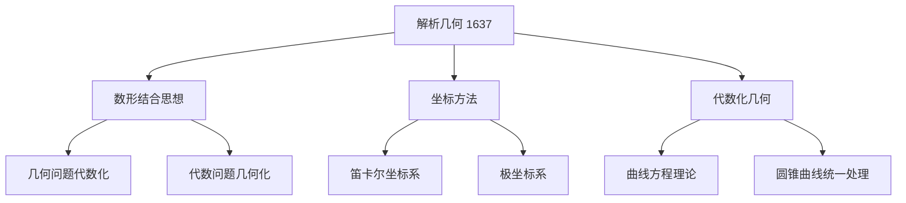

| 维度 | 内容 |
|-----|------|
| **时间节点** | 1637年《几何学》 |
| **核心人物** | 笛卡尔（Descartes）、费马（Fermat） |
| **核心思想** | 通过坐标系建立几何与代数的对应关系 |
| **突破点** | 用方程表示曲线，开创变量数学时代 |
| **历史意义** | 打破几何与代数的壁垒，为微积分铺平道路 |
| **对后世影响** | 微积分创立、微分几何、代数几何 |

### 2.2 微积分的诞生（Newton/Leibniz，1687）

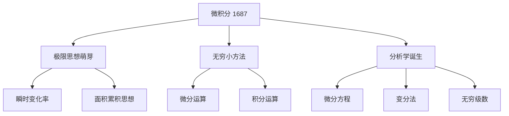

| 维度 | 内容 |
|-----|------|
| **时间节点** | 1665-1687年（牛顿）；1675-1684年（莱布尼茨） |
| **核心人物** | 牛顿（Newton）、莱布尼茨（Leibniz） |
| **核心思想** | 通过无穷小量研究变化与累积 |
| **突破点** | 微积分基本定理，微分与积分的互逆关系 |
| **历史意义** | 数学史上最重要的发明之一，使精密自然科学成为可能 |
| **对后世影响** | 整个分析学、物理学、工程学 |

### 2.3 概率论的创立（Pascal/Fermat，1654）

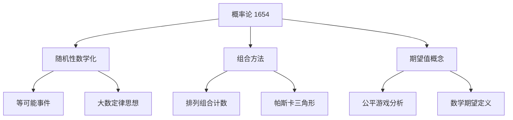

| 维度 | 内容 |
|-----|------|
| **时间节点** | 1654年通信，1713年《猜度术》 |
| **核心人物** | 帕斯卡（Pascal）、费马（Fermat）、伯努利（Bernoulli） |
| **核心思想** | 将随机现象纳入数学研究范围 |
| **突破点** | 期望值的严格定义，大数定律的证明 |
| **历史意义** | 开创不确定性数学研究的新领域 |
| **对后世影响** | 统计学、金融数学、量子力学、信息论 |

### 2.4 代数方程理论的发展

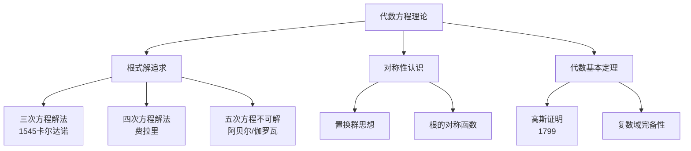

---

## 三、现代数学（19世纪-20世纪初）

### 3.1 分析的严格化运动

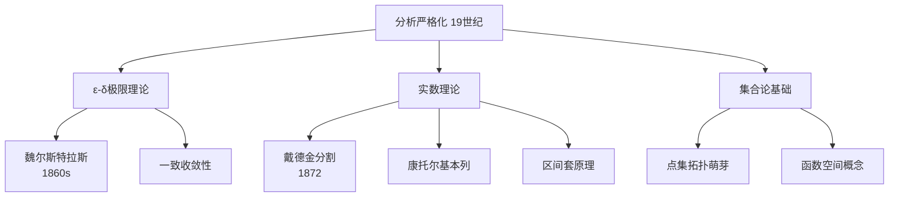

#### 3.1.1 ε-δ极限理论（魏尔斯特拉斯）

| 维度 | 内容 |
|-----|------|
| **时间节点** | 1860年代柏林讲义 |
| **核心人物** | 魏尔斯特拉斯（Weierstrass） |
| **核心思想** | 用静态的ε-δ语言代替动态的无穷小概念 |
| **突破点** | 极限的严格算术化定义 |
| **历史意义** | 消除微积分的逻辑漏洞，奠定现代分析基础 |
| **对后世影响** | 泛函分析、拓扑学、现代测度论 |

#### 3.1.2 实数理论与集合论

- **戴德金分割**（1872）：用有理数分割定义实数
- **康托尔基本列**：用柯西序列的等价类定义实数
- **集合论的创立**（康托尔，1874）：无穷集合的数学理论

### 3.2 非欧几何的革命

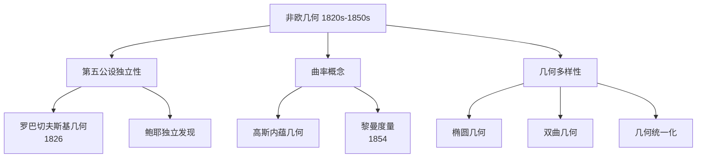

| 维度 | 内容 |
|-----|------|
| **时间节点** | 1826年（罗巴切夫斯基）、1854年（黎曼） |
| **核心人物** | 罗巴切夫斯基、鲍耶、高斯、黎曼 |
| **核心思想** | 几何学不依赖于物理空间，存在多种相容的几何体系 |
| **突破点** | 否定第五公设，建立自洽的非欧几何体系 |
| **历史意义** | 打破欧氏几何的独尊地位，解放数学思想 |
| **对后世影响** | 广义相对论、微分几何、现代物理学 |

### 3.3 抽象代数的兴起

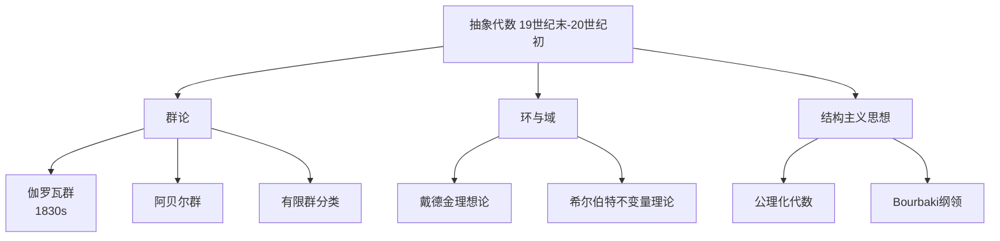

#### 3.3.1 群论的诞生（伽罗瓦）

| 维度 | 内容 |
|-----|------|
| **时间节点** | 1830年（手稿），1846年（发表） |
| **核心人物** | 伽罗瓦（Galois）、阿贝尔（Abel） |
| **核心思想** | 用群的结构研究方程的可解性 |
| **突破点** | 伽罗瓦对应：方程↔群，根式可解↔可解群 |
| **历史意义** | 开创抽象代数方法，解决古典难题 |
| **对后世影响** | 近世代数、代数拓扑、物理学对称性理论 |

### 3.4 拓扑学的起源

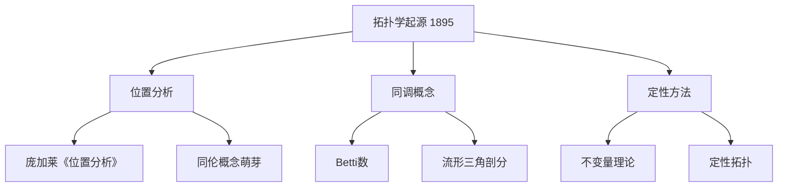

| 维度 | 内容 |
|-----|------|
| **时间节点** | 1895年《位置分析》 |
| **核心人物** | 庞加莱（Poincaré） |
| **核心思想** | 研究图形在连续变形下不变的性质 |
| **突破点** | 引入同调群、基本群等拓扑不变量 |
| **历史意义** | 开创拓扑学这一全新数学分支 |
| **对后世影响** | 代数拓扑、微分拓扑、大范围分析 |

---

## 四、当代数学（20世纪中-21世纪）

### 4.1 结构主义数学（Bourbaki学派）

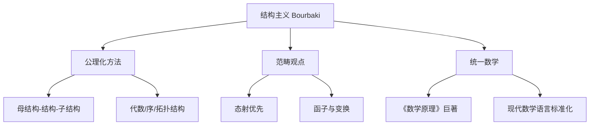

| 维度 | 内容 |
|-----|------|
| **时间节点** | 1935年创立，1950年代鼎盛 |
| **核心人物** | Nicolas Bourbaki（集体笔名） |
| **核心思想** | 数学是结构的科学，通过公理方法统一各分支 |
| **突破点** | 系统阐述三大母结构：代数、序、拓扑 |
| **历史意义** | 重塑20世纪数学的面貌和教育体系 |
| **对后世影响** | 现代数学的统一语言、范畴论的兴起 |

### 4.2 代数几何革命

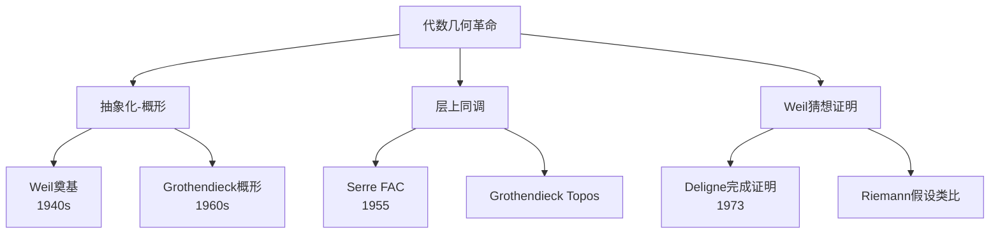

#### 4.2.1 Grothendieck革命

| 维度 | 内容 |
|-----|------|
| **时间节点** | 1958-1970年（IHES时期） |
| **核心人物** | Grothendieck、Serre、Deligne |
| **核心思想** | 用概形统一代数几何与数论，几何化地处理算术问题 |
| **突破点** | 概形理论、层上同调、 motive理论 |
| **历史意义** | 数学史上最深远的革命之一 |
| **对后世影响** | Faltings证明Mordell猜想、Wiles证明费马大定理 |

### 4.3 数学基础的多元化

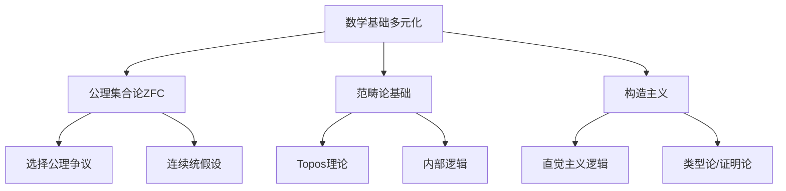

### 4.4 计算数学的兴起

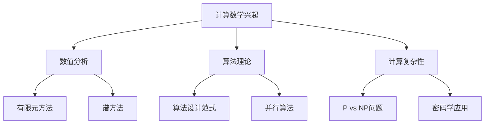

### 4.5 数学与物理的深度融合

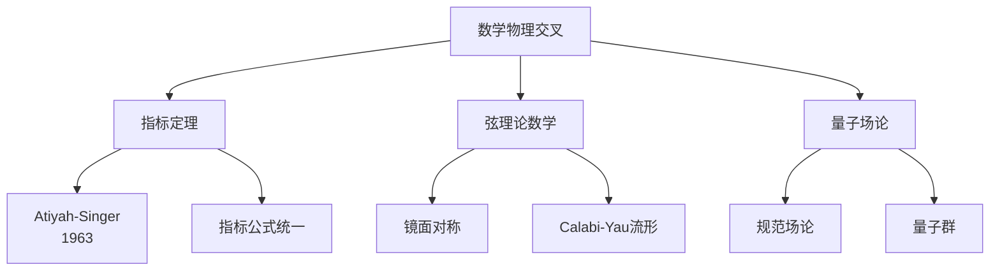

---

## 五、核心数学思想总览

### 5.1 30个核心理念清单

| 序号 | 思想名称 | 时期 | 代表人物 | 核心特征 |
|-----|---------|------|---------|---------|
| 1 | 公理化思想 | 古代 | 欧几里得 | 从公设演绎定理 |
| 2 | 算法化思想 | 古代 | 《九章算术》 | 问题-算法-应用 |
| 3 | 位置记数法 | 古代 | 印度-阿拉伯 | 十进位值制 |
| 4 | 数形结合 | 近代 | 笛卡尔 | 坐标方法 |
| 5 | 极限思想 | 近代 | 牛顿/莱布尼茨 | 变化与累积 |
| 6 | 随机性数学化 | 近代 | 帕斯卡/费马 | 概率论 |
| 7 | 对称性研究 | 近代 | 伽罗瓦 | 群论方法 |
| 8 | ε-δ严格化 | 现代 | 魏尔斯特拉斯 | 分析算术化 |
| 9 | 无穷集合 | 现代 | 康托尔 | 超限数学 |
| 10 | 非欧几何 | 现代 | 罗巴切夫斯基/黎曼 | 几何多样性 |
| 11 | 抽象代数 | 现代 | 戴德金/希尔伯特 | 结构研究 |
| 12 | 拓扑不变量 | 现代 | 庞加莱 | 连续变形 |
| 13 | 结构主义 | 当代 | Bourbaki | 统一数学 |
| 14 | 概形理论 | 当代 | Grothendieck | 代数几何革命 |
| 15 | 层上同调 | 当代 | Serre/Grothendieck | 几何化工具 |
| 16 | 范畴论 | 当代 | Eilenberg/MacLane | 关系优先 |
| 17 | 构造主义 | 当代 | Brouwer/Heyting | 可构造性 |
| 18 | 算法复杂性 | 当代 | Cook/Levin | 计算极限 |
| 19 | 指标定理 | 当代 | Atiyah-Singer | 分析与拓扑统一 |
| 20 | Langlands纲领 | 当代 | Langlands | 数论-表示论-几何 |
| 21 | 几何化纲领 | 当代 | Thurston/Perelman | 三维流形分类 |
| 22 | 算术几何 | 当代 | Weil/Grothendieck | 几何化数论 |
| 23 | 导出范畴 | 当代 | Verdier | 同调代数深化 |
| 24 | 高阶范畴 | 当代 | Lurie | 无穷范畴论 |
| 25 | 非交换几何 | 当代 | Connes | 空间概念的拓展 |
| 26 | 镜面对称 | 当代 | Strominger/Yau/Zaslow | 弦理论数学 |
| 27 |  motive理论 | 当代 | Grothendieck | 上同调统一 |
| 28 | 同伦型理论 | 当代 | Voevodsky | 新数学基础 |
| 29 | 信息几何 | 当代 | Amari | 统计与几何 |
| 30 | 深度学习数学 | 当代 | 当代学者 | 神经网络理论 |

---

## 六、数学思想演进的动力学

### 6.1 范式转换机制

### 6.2 内在张力推动

1. **抽象与具体的张力**：从具体问题到抽象理论，再回到应用
2. **统一与分化的张力**：分支细分与跨领域统一的交替
3. **连续与离散的张力**：分析与代数的相互渗透
4. **有限与无穷的张力**：对无穷概念的持续探索

### 6.3 外部驱动因素

- **物理科学的需要**：力学、电磁学、相对论、量子力学
- **工程技术的推动**：计算需求、优化问题、信号处理
- **其他学科的渗透**：经济学、生物学、计算机科学
- **计算能力的革命**：计算机带来的实验数学新范式

---

## 七、结语

数学思想的演进呈现以下特征：

1. **累积性与革命性并存**：新思想往往建立在旧基础之上，同时带来范式转换
2. **抽象化与统一化趋势**：从具体到抽象，从分散到统一
3. **内在逻辑的自洽性追求**：严格性标准的不断提升
4. **与外部世界的持续互动**：物理、技术、社会需求的推动

数学思想的演进树仍在生长，新的分支不断涌现，旧的联系被重新发现。理解这一演进脉络，有助于把握数学的本质和未来发展方向。

---

*文档版本：完整版*  
*创建日期：2026年4月*  
*所属项目：FormalMath*
