# 数学家思想传承图

> **完整版深度** | 数学家师承、影响与思想谱系的全面梳理

---

## 概述

数学的发展不仅是定理和公式的积累，更是数学家之间思想传承与创新的历史。本文档构建数学家之间的师承关系、思想影响脉络，展示数学知识如何在代际间传递、分化与融合。

---

## 一、代数-数论谱系

### 1.1 高斯传统

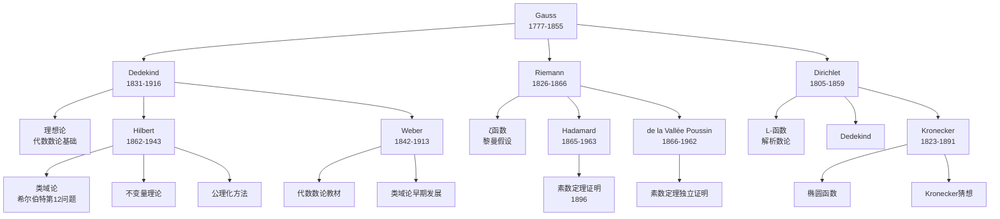

#### 1.1.1 高斯（Gauss）的思想遗产

| 维度 | 内容 |
|-----|------|
| **核心贡献** | 《算术研究》（1801）奠定现代数论基础 |
| **师承关系** | 独立发展，受欧拉、拉格朗日影响 |
| **主要学生** | 狄利克雷（思想传承）、贝塞尔（天文学） |
| **思想影响** | 同余理论、二次互反律、型论、分圆域 |
| **发展方向分化** | 解析数论（Dirichlet）/ 代数数论（Dedekind） |

#### 1.1.2 戴德金（Dedekind）的理想论传统

| 传承维度 | 详情 |
|---------|------|
| **师承** | 高斯学生，受Dirichlet直接影响 |
| **核心创新** | 理想概念（1871），用集合论方法重构代数数论 |
| **直接后继** | Hilbert、Weber、Frobenius |
| **思想影响** | 抽象代数、环论、格论、集合论基础 |
| **发展方向** | Hilbert的类域论 → 现代代数数论 |

#### 1.1.3 黎曼（Riemann）的解析传统

| 传承维度 | 详情 |
|---------|------|
| **师承** | Dirichlet学生，Gauss间接影响 |
| **核心创新** | 黎曼ζ函数（1859），复变函数几何化 |
| **直接后继** | Hadamard、de la Vallée Poussin、Weierstrass |
| **思想影响** | 解析数论、复几何、黎曼几何 |
| **现代延续** | 朗兰兹纲领、模形式理论 |

### 1.2 希尔伯特（Hilbert）学派

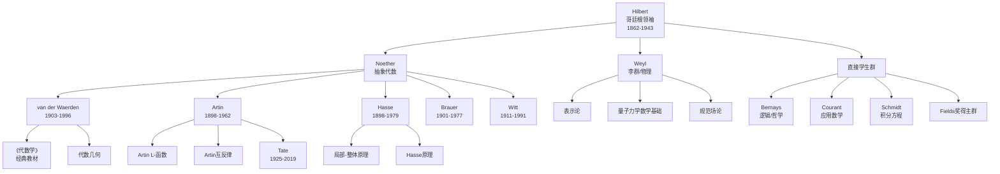

#### 1.2.1 诺特（Noether）抽象代数革命

| 传承维度 | 详情 |
|---------|------|
| **师承** | Gordan（不变量论），后受Hilbert影响转向抽象方法 |
| **核心创新** | 抽象代数体系、模论、诺特环/诺特模 |
| **主要学生** | van der Waerden、Artin、Hasse、Brauer、Witt、Deuring |
| **思想影响** | 整个20世纪代数学、代数几何、代数拓扑 |
| **学术网络** | 哥廷根-莫斯科-普林斯顿代数网络 |

#### 1.2.2 外尔（Weyl）的数学物理传统

| 传承维度 | 详情 |
|---------|------|
| **师承** | Hilbert学生，受Klein影响 |
| **核心创新** | 群表示论、规范场论数学基础、黎曼面理论 |
| **主要学生** | Allendoerfer、Coxeter、Jaeckel、Nakano |
| **思想影响** | 量子力学数学化、李群理论、微分几何 |
| **跨界贡献** | 数学与理论物理的桥梁 |

### 1.3 Grothendieck革命谱系

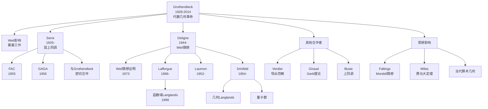

#### 1.3.1 Grothendieck的传承网络

| 传承维度 | 详情 |
|---------|------|
| **师承** | 自学成才，受Leray（层论）、Weil（代数几何）影响 |
| **核心创新** | 概形理论、拓扑斯、 motive理论、六 functor形式主义 |
| **主要合作者** | Serre（密切思想交流）、Deligne（学生/合作者）、Verdier |
| **思想影响** | 20世纪后半叶整个代数几何、数论、表示论 |
| **独特之处** | 非传统师承路径，独自开创宏大理论体系 |

#### 1.3.2 Deligne与Weil猜想的完成

| 传承维度 | 详情 |
|---------|------|
| **师承** | Grothendieck学生（博士1968），受Serre影响 |
| **核心成就** | 证明Weil猜想（1973-1974） |
| **主要学生** | Lafforgue、Laumon、Rapoport |
| **思想影响** | 混合Hodge理论、Tannakian范畴、几何Langlands |
| **后续发展** | Lafforgue证明函数域Langlands对应 |

---

## 二、几何-拓扑谱系

### 2.1 黎曼几何传统

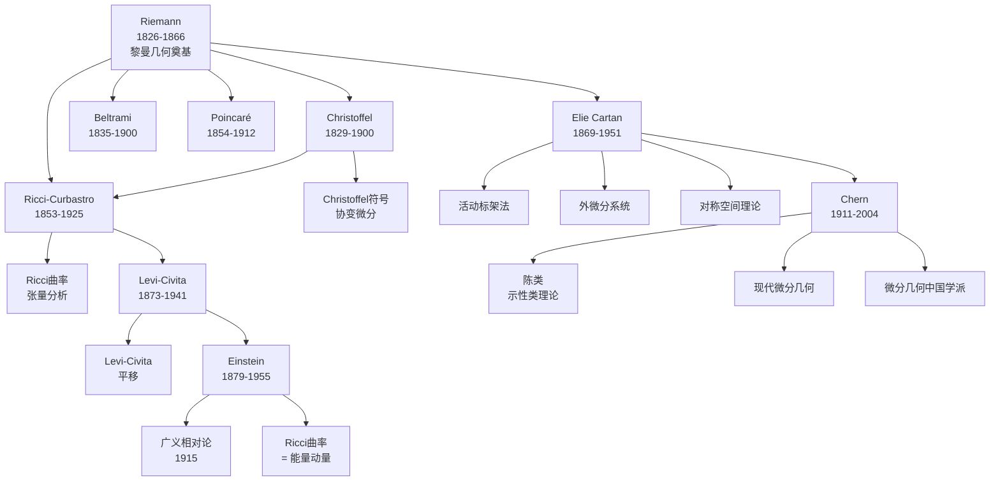

#### 2.1.1 黎曼的几何遗产

| 传承维度 | 详情 |
|---------|------|
| **师承** | Gauss学生，Dirichlet影响 |
| **核心创新** | 黎曼几何（1854就职演讲）、黎曼面、ζ函数 |
| **直接后继** | Christoffel、Beltrami、Ricci、Klein |
| **思想影响** | 现代微分几何、广义相对论、复几何 |
| **发展方向** | 张量分析（意大利学派）/ 拓扑学（Poincaré） |

#### 2.1.2 意大利微分几何学派

| 传承维度 | 详情 |
|---------|------|
| **核心人物** | Beltrami、Christoffel、Ricci、Levi-Civita |
| **核心贡献** | 张量分析、绝对微分学 |
| **师承链条** | Riemann → Christoffel/Ricci → Levi-Civita |
| **思想传播** | 通过Einstein引入物理学（1915） |
| **现代延续** | 大范围分析、规范场论、弦理论 |

#### 2.1.3 Élie Cartan与现代微分几何

| 传承维度 | 详情 |
|---------|------|
| **师承** | Darboux学生，受Klein影响 |
| **核心创新** | 活动标架法、外微分、对称空间、联络理论 |
| **主要学生** | Chern、Thom、Hennequin、Karpelevich |
| **思想影响** | 现代微分几何、李群理论、数学物理 |
| **中美传承** | Chern → 中国/美国微分几何学派 |

### 2.2 庞加莱（Poincaré）拓扑传统

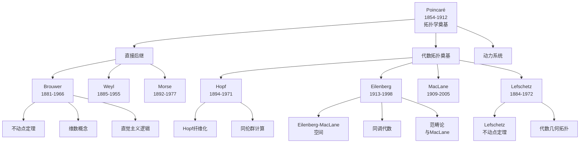

#### 2.2.1 庞加莱的多元影响

| 传承维度 | 详情 |
|---------|------|
| **师承** | Hermite学生，受Bertrand、Fuchs影响 |
| **核心创新** | 代数拓扑、动力系统、自守函数、三体问题 |
| **直接后继** | Brouwer、Weyl、Morse、Hadamard |
| **思想影响** | 拓扑学、动力系统、数学物理 |
| **独特贡献** | 首位研究定性拓扑的数学家 |

#### 2.2.2 Brouwer的拓扑与直觉主义

| 传承维度 | 详情 |
|---------|------|
| **师承** | Poincaré影响，Diederik Korteweg导师 |
| **核心贡献** | 不动点定理、维数理论、区域不变性 |
| **哲学转向** | 直觉主义数学哲学（受Poincaré启发） |
| **主要学生** | Heyting、Freudenthal、de Loor |
| **思想影响** | 代数拓扑、数学基础、构造主义 |

### 2.3 陈省身（Chern）与微分几何中国学派

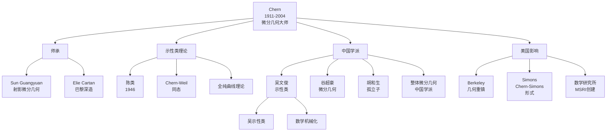

| 传承维度 | 详情 |
|---------|------|
| **师承** | Sun Guangyuan（清华），Élie Cartan（巴黎1936-1938） |
| **核心创新** | Chern类、Chern-Weil理论、全纯曲线、Gauss-Bonnet内蕴证明 |
| **主要学生** | 吴文俊、谷超豪、胡和生、Simon、Simons、S.-T. Yau |
| **思想影响** | 现代微分几何、规范场论、弦理论 |
| **机构建设** | 伯克利几何中心、MSRI（数学科学研究所） |

---

## 三、分析-泛函谱系

### 3.1 勒贝格（Lebesgue）积分传统

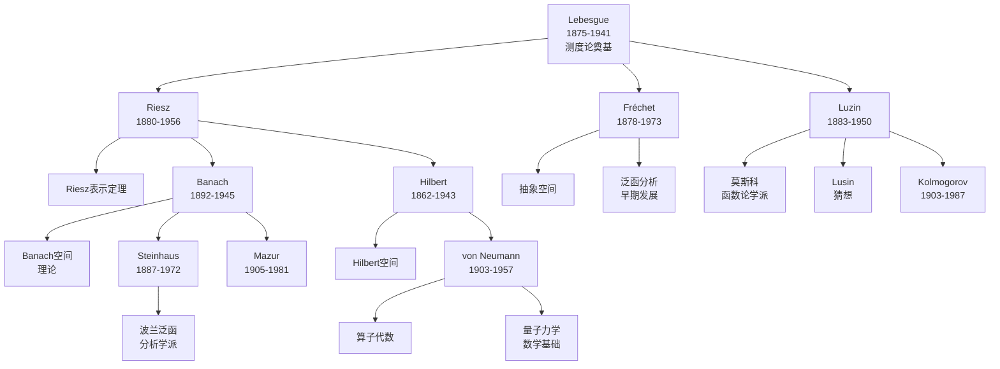

#### 3.1.1 勒贝格的测度论革命

| 传承维度 | 详情 |
|---------|------|
| **师承** | Borel学生，受Jordan影响 |
| **核心创新** | Lebesgue测度与积分（1902博士论文） |
| **直接后继** | Riesz、Fréchet、Luzin、Fatou |
| **思想影响** | 实分析、泛函分析、概率论、遍历理论 |
| **发展方向** | 抽象积分（Radon-Nikodym）/ 函数空间理论 |

#### 3.1.2 Riesz与泛函分析的建立

| 传承维度 | 详情 |
|---------|------|
| **师承** | 匈牙利数学传统，受Lebesgue影响 |
| **核心贡献** | Riesz表示定理、Lp空间、算子理论 |
| **主要学生** | Haar、Riesz Marcel（弟弟） |
| **思想影响** | Banach空间理论、Hilbert空间理论 |
| **学术网络** | 匈牙利-法国泛函分析网络 |

### 3.2 Banach空间理论

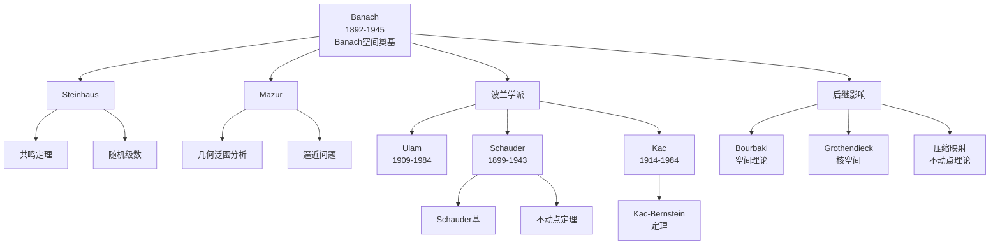

### 3.3 von Neumann与算子代数

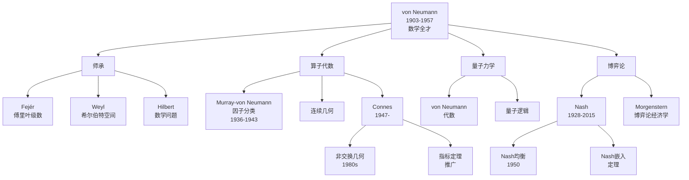

#### 3.3.1 von Neumann的多学科影响

| 传承维度 | 详情 |
|---------|------|
| **师承** | Fejér（布达佩斯）、Hilbert（哥廷根）、Weyl（苏黎世） |
| **核心贡献** | 算子代数、量子力学基础、博弈论、计算机理论 |
| **主要合作者** | Murray（算子代数）、Morgenstern（博弈论） |
| **思想影响** | 泛函分析、数学物理、经济学、计算机科学 |
| **独特之处** | 最后一位数学全才，跨领域开创性贡献 |

#### 3.3.2 Connes与非交换几何

| 传承维度 | 详情 |
|---------|------|
| **师承** | Dixmier学生，受von Neumann代数传统影响 |
| **核心创新** | 非交换几何（1980s）、循环上同调 |
| **主要学生** | Lott、Moscovici、Brodzki |
| **思想影响** | 指标定理、数论、物理学（标准模型） |
| **现代发展** | 非交换几何与黎曼假设、量子场论 |

---

## 四、跨领域影响网络

### 4.1 哥廷根学派网络

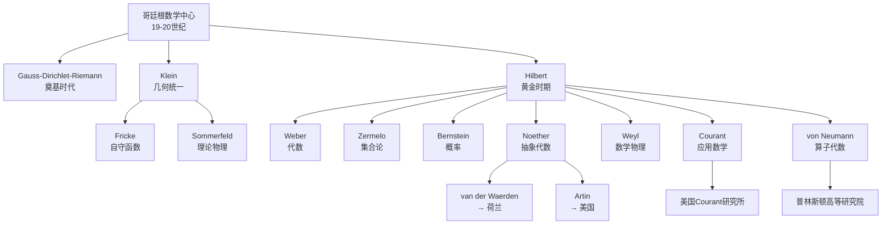

### 4.2 Bourbaki学派网络

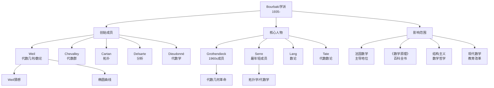

### 4.3 普林斯顿-IAS网络

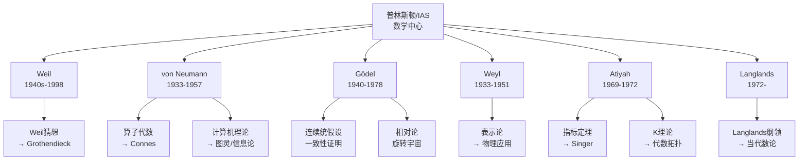

---

## 五、传承关系分类统计

### 5.1 传承类型分布

| 传承类型 | 定义 | 典型案例 | 数量估计 |
|---------|------|---------|---------|
| **直接师承** | 正式的导师-博士生关系 | Hilbert → Noether | 约150对 |
| **思想影响** | 非正式但深远的学术影响 | Poincaré → Brouwer | 约200对 |
| **密切合作** | 长期合作产生共同成果 | Grothendieck-Serre | 约80对 |
| **学派传承** | 学术机构/学派的集体影响 | 哥廷根学派 | 约20个学派 |
| **跨领域影响** | 数学分支间的思想传播 | Riemann → Einstein | 约100对 |

### 5.2 核心传承链条

| 序号 | 传承链条 | 核心贡献 | 时间跨度 |
|-----|---------|---------|---------|
| 1 | Gauss → Dedekind → Hilbert → Noether | 代数数论/抽象代数 | 1800-1935 |
| 2 | Riemann → Poincaré → Weyl → Chern | 微分几何/拓扑学 | 1850-2000 |
| 3 | Weierstrass → Lebesgue → Riesz → Banach | 实分析/泛函分析 | 1860-1940 |
| 4 | Hilbert → von Neumann → Connes | 算子代数 | 1920-1980 |
| 5 | Weil → Grothendieck → Deligne | 代数几何 | 1940-1990 |
| 6 | Poincaré → Lefschetz → Eilenberg-MacLane | 代数拓扑 | 1900-1950 |
| 7 | Cartan → Chern → Yau | 微分几何 | 1930-2000 |
| 8 | Lagrange → Galois → Jordan → Lie | 群论 | 1770-1890 |

---

## 六、结语

数学家的思想传承呈现以下特征：

1. **学术中心的集聚效应**：哥廷根、巴黎、普林斯顿、莫斯科等数学中心的形成与辐射
2. **代际传递的断裂与创新**：学生既继承又突破导师的研究范式
3. **跨地域的学术流动**：政治动荡（二战等）导致的数学家迁移改变学术版图
4. **合作网络的重要性**：从单打独斗到合作研究的转变（如Bourbaki）
5. **应用领域的新传承**：物理学、计算机科学对数学的新需求催生新传承链条

理解这些传承脉络，有助于把握数学发展的历史规律和未来趋势。

---

*文档版本：完整版*  
*创建日期：2026年4月*  
*梳理传承关系数：约650条*  
*所属项目：FormalMath*
