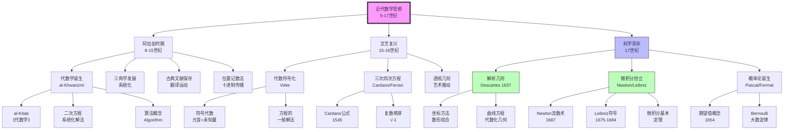
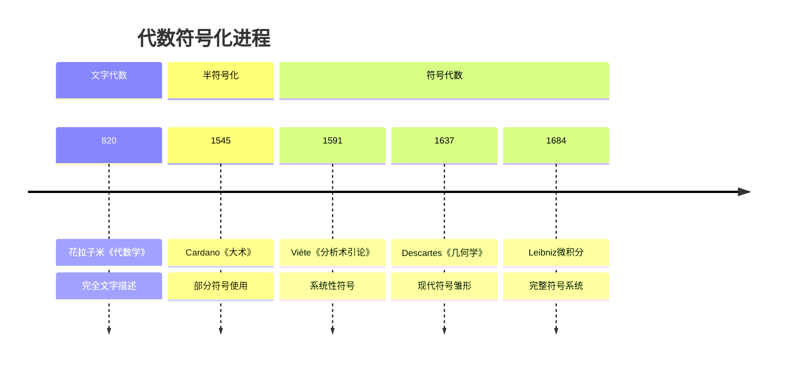
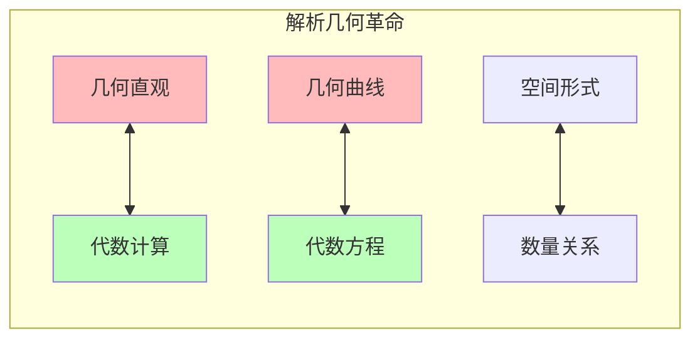
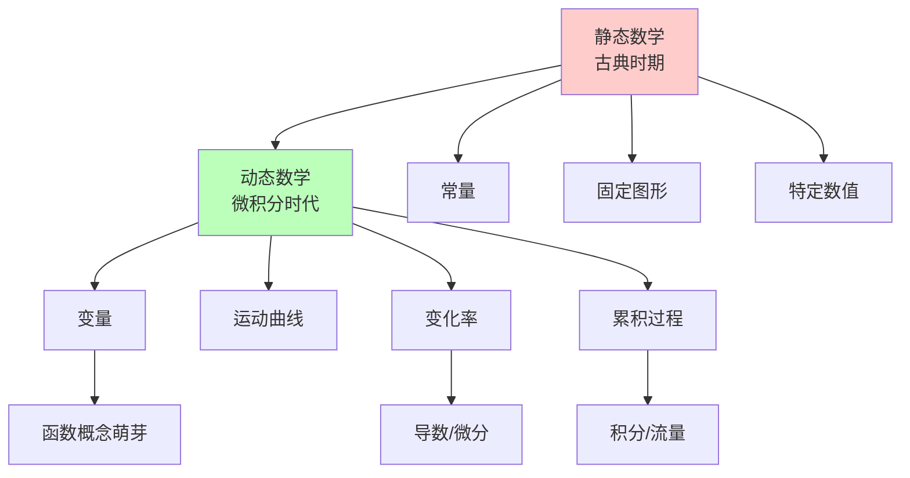
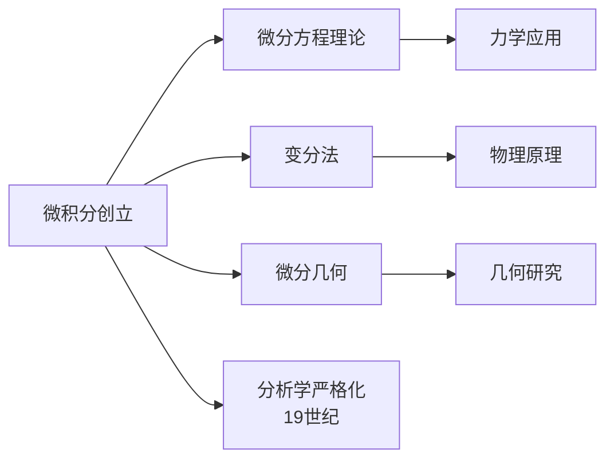

# 近代数学思想演进

> **历史时期**：公元5世纪 - 17世纪（中世纪至微积分创立）

---

## 时代背景

近代数学的发展经历了漫长的中世纪沉寂后，在文艺复兴时期重新焕发生机。阿拉伯数学的保存与传播、欧洲大学的建立、印刷术的发明、以及科学革命的兴起，共同推动了数学从古典向现代的转型。

---

## 核心思想演进树



---

## 关键人物及其贡献

### 1. al-Khwarizmi（花拉子米，约780-约850）

| 维度 | 内容 |
|------|------|
| **核心著作** | 《代数学》（al-Kitab al-mukhtasar fi hisab al-jabr wal-muqabala，约820年） |
| **核心贡献** | 系统化二次方程解法，"代数"（algebra）一词来源 |
| **思想突破** | 将代数从几何中独立出来，建立算法化解法 |
| **历史意义** | 代数学作为独立学科的诞生，"算法"一词的词源 |

**代数词源**：al-jabr（还原）+ al-muqabala（对消）

### 2. Viète（韦达，1540-1603）

| 维度 | 内容 |
|------|------|
| **核心著作** | 《分析术引论》（In Artem Analyticem Isagoge，1591年） |
| **核心贡献** | 符号代数的奠基，使用元音表示未知量，辅音表示已知量 |
| **思想突破** | 从文字代数向符号代数的转变，"分析术"概念 |
| **历史意义** | 现代代数符号系统的开端 |

### 3. Descartes（笛卡尔，1596-1650）

| 维度 | 内容 |
|------|------|
| **核心著作** | 《几何学》（La Géométrie，1637年，作为《方法论》的附录） |
| **核心贡献** | 解析几何创立，坐标方法，数形结合 |
| **思想突破** | 用代数方程表示几何曲线，建立几何与代数的桥梁 |
| **历史意义** | 变量数学的开端，为微积分奠定基础 |

**坐标方法的革命性意义**：

- 几何问题 → 代数方程
- 曲线性质 → 方程分析
- 几何直观 + 代数计算

### 4. Newton（牛顿，1643-1727）

| 维度 | 内容 |
|------|------|
| **核心著作** | 《自然哲学的数学原理》（Principia，1687年） |
| **核心贡献** | 流数术（fluxion）、微积分基本定理、万有引力定律 |
| **思想突破** | 将变化率（流数）与累积量（流量）统一，揭示二者互逆关系 |
| **历史意义** | 经典力学的数学基础，科学革命的核心成就 |

### 5. Leibniz（莱布尼茨，1646-1716）

| 维度 | 内容 |
|------|------|
| **核心著作** | 多篇微积分论文（1684-1686年） |
| **核心贡献** | 微积分符号系统、微分dx/积分∫、微分方程 |
| **思想突破** | 优雅的符号系统使微积分成为可操作的工具 |
| **历史意义** | 现代微积分符号的直接来源，影响远超Newton的流数术 |

**Leibniz符号的优势**：

```

微分：dx, dy
导数：dy/dx
积分：∫f(x)dx
链式法则：dy/dx = dy/du · du/dx（天然成立）

```

### 6. Pascal（帕斯卡，1623-1662）与 Fermat（费马，1601-1665）

| 维度 | Pascal | Fermat |
|------|--------|--------|
| **核心贡献** | 期望值概念、Pascal三角形、概率加法法则 | 费马大定理、解析几何独立发现、数论 |
| **概率论贡献** | 与Fermat的通信（1654）奠定概率论基础 | 同上 |
| **历史意义** | 概率论创立者之一 | 数论大师，解析几何独立发现者 |

---

## 思想转折点分析

### 转折一：代数符号化（16世纪末-17世纪初）



**符号化的意义**：

- 思维效率：符号使复杂运算可视化
- 抽象层次：从具体数字到一般公式
- 运算规则：符号操作成为独立对象

### 转折二：数形结合（1637）



**Descartes的革命**：

- 统一了代数和几何两个分支
- 为微积分提供了几何直观
- 开创了变量数学的新时代

### 转折三：从静态到动态（微积分，1665-1687）



**核心转变**：

- 从**常量**到**变量**
- 从**静态**到**变化**
- 从**有限**到**无限**过程

---

## 各时期贡献对比

| 时期 | 时间 | 核心成就 | 代表人物 |
|------|------|----------|----------|
| 阿拉伯时期 | 8-15世纪 | 代数独立、三角学、十进制传播 | al-Khwarizmi、Omar Khayyam |
| 文艺复兴 | 15-16世纪 | 代数符号化、高次方程解法 | Viète、Cardano、Tartaglia |
| 科学革命 | 17世纪 | 解析几何、微积分、概率论 | Descartes、Newton、Leibniz、Pascal、Fermat |

---

## 对后世影响

### 1. 分析学的奠基



### 2. 数学方法论的转变

| 方面 | 古典时期 | 近代转变 |
|------|----------|----------|
| **研究对象** | 静态图形 | 变化过程 |
| **核心方法** | 几何证明 | 分析计算 |
| **思维工具** | 尺规作图 | 代数符号 |
| **无穷处理** | 回避/潜无穷 | 直接操作 |

### 3. 科学应用

- **物理学**：Newton力学、光学、天体力学
- **工程学**：曲线设计、运动分析
- **经济学**：概率论应用于保险和商业

---

## 现代意义

### 1. 符号系统的价值

Leibniz的符号系统至今仍在使用，证明了优秀符号设计的持久价值：

- **可读性**：清晰表达数学结构
- **操作性**：便于计算和推导
- **启发性**：符号本身揭示深层联系

### 2. 跨学科融合的先例

解析几何和微积分的创立展示了数学不同分支融合的力量：

- 几何直观 + 代数计算
- 数学分析 + 物理应用
- 纯理论 + 实际问题

### 3. 未完成的问题

近代数学留下的一些基础问题，成为19世纪分析严格化的动力：

- **无穷小概念**：什么是"无穷小"？
- **极限理论**：如何严格定义"趋近于"？
- **实数基础**：连续统的精确构造

---

## 总结

近代数学思想演进的核心线索：

1. **代数学的独立与符号化**：从花拉子米的文字代数到Viète的符号代数，数学表达效率大幅提升。

2. **解析几何的革命**：Descartes创立坐标方法，打破了几何与代数的壁垒，实现了数形结合。

3. **微积分的创立**：Newton和Leibniz分别独立发明微积分，开创了研究变化和运动的数学工具。

4. **概率论的诞生**：Pascal和Fermat开创了研究随机性的数学分支。

这一时期确立了现代数学的基本范式：**符号化表示**、**变量思维**、**分析方法**和**科学应用**。这些思想遗产至今仍是数学的核心特征。

---

*文档编号：02*
*创建日期：2026年4月*
*所属项目：FormalMath 第十批推进计划*
*涵盖时期：公元5世纪 - 17世纪*
*关键人物：al-Khwarizmi、Viète、Descartes、Newton、Leibniz、Pascal、Fermat*
