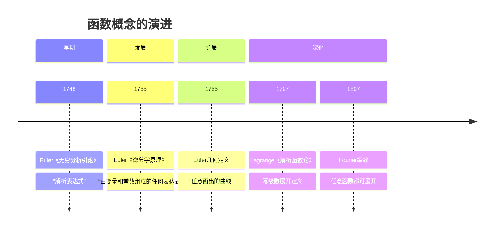
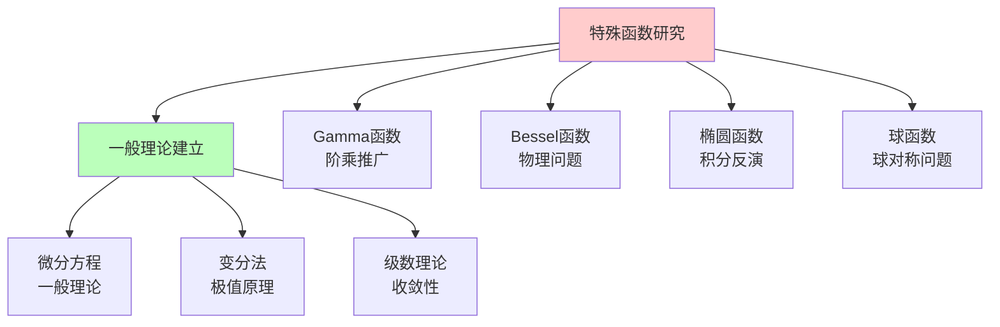
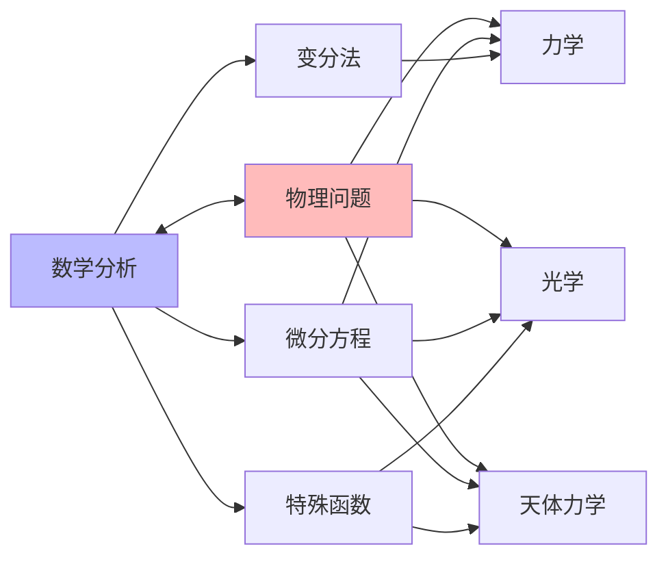
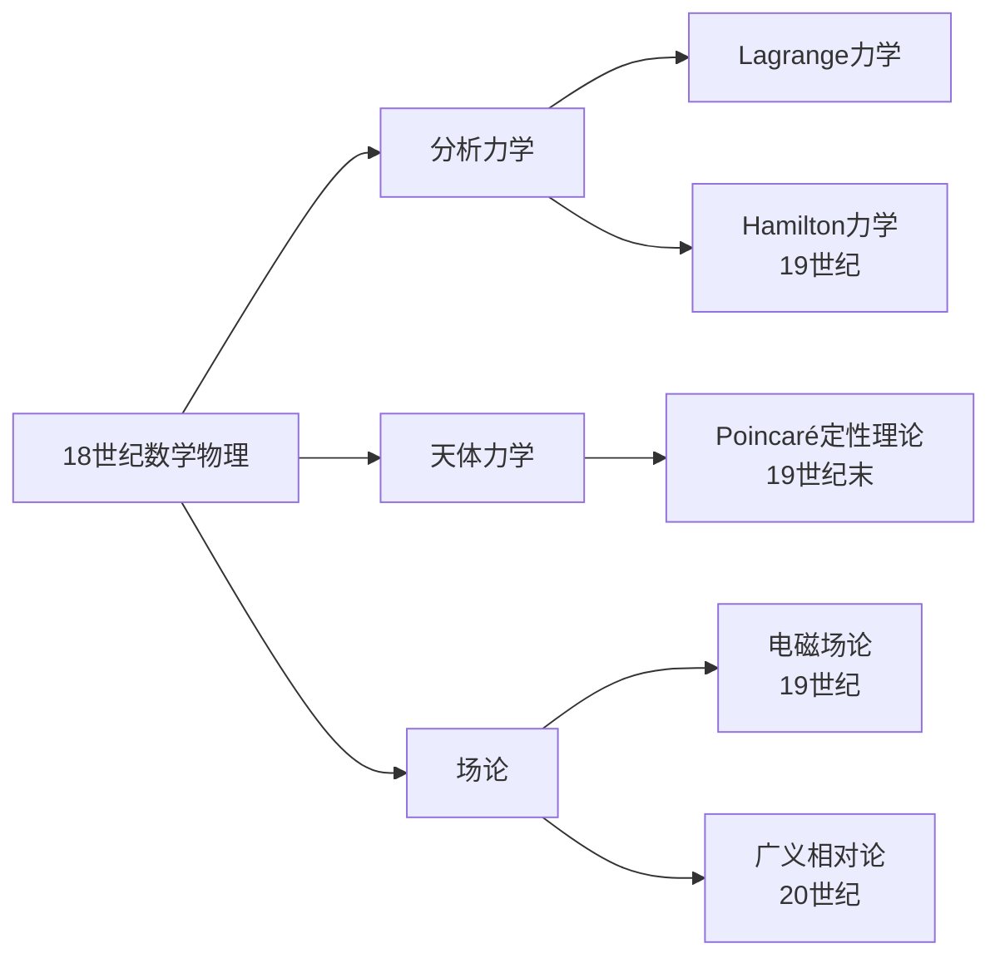

# 18世纪数学思想演进

> **历史时期**：1700-1800年（启蒙时代）

---

## 时代背景

18世纪是数学蓬勃发展的时期，微积分的威力在物理学和工程学中得到充分展示。这一时期的特点是：分析方法的广泛应用、函数概念的形成、以及数学与物理学的深度融合。Euler、Lagrange、Laplace、Bernoulli等大师在这一时代创造了辉煌的成就。

---

## 核心思想演进树

```mermaid
graph TD
    Root[18世纪数学思想<br/>分析方法发展] --> Analysis[分析学扩展]
    Root --> Function[函数概念形成]
    Root --> Mechanics[数学物理]
    Root --> Variation[变分法创立]
    Root --> Probability[概率论发展]
    
    Analysis --> An1[无穷级数<br/>Taylor/MacLaurin]
    Analysis --> An2[微分方程<br/>常/偏微分方程]
    Analysis --> An3[复数运算<br/>Euler公式]
    
    An1 --> An1_1[Taylor展开<br/>1715]
    An1 --> An1_2[幂级数方法<br/>求解微分方程]
    An1 --> An1_3[渐近级数<br/>Stirling公式]
    
    An2 --> An2_1[常微分方程<br/>解法系统化]
    An2 --> An2_2[偏微分方程<br/>波动方程/热方程]
    An2 --> An2_3[分离变量法<br/>Fourier前身]
    
    An3 --> An3_1[Euler公式<br/>e^iπ+1=0]
    An3 --> An3_2[复函数萌芽<br/>解析性认识]
    
    Function --> F1[函数定义演变<br/>公式→对应关系]
    Function --> F2[特殊函数<br/>Gamma/Bessel]
    Function --> F3[函数分类<br/>代数/超越]
    
    Mechanics --> M1[分析力学<br/>Lagrange 1788]
    Mechanics --> M2[天体力学<br/>Laplace]
    Mechanics --> M3[变分原理<br/>最小作用量]
    
    Variation --> V1[Euler方程<br/>1744]
    Variation --> V2[Lagrange方法<br/>δ记号]
    Variation --> V3[等周问题<br/>泛函极值]
    
    Probability --> P1[Bernoulli<br/>大数定律 1713]
    Probability --> P2[de Moivre<br/>中心极限定理]
    Probability --> P3[Bayes<br/>逆概率 1763]
    
    style Root fill:#f9f,stroke:#333,stroke-width:4px
    style Analysis fill:#bbf,stroke:#333
    style Function fill:#bfb,stroke:#333

```



---

## 关键人物及其贡献

### 1. Euler（欧拉，1707-1783）

| 维度 | 内容 |
|------|------|
| **核心著作** | 《无穷分析引论》（1748）、《微分学原理》（1755）、《积分学原理》（1768-1770） |
| **核心贡献** | 函数概念的现代化、Euler公式、无穷级数理论、图论创立 |
| **思想突破** | 将函数定义为"解析表达式"，建立了分析学的基础概念框架 |
| **历史意义** | 18世纪最多产的数学家，分析学的主要奠基人 |

**Euler公式与恒等式**：

```

e^(iθ) = cos θ + i sin θ
e^(iπ) + 1 = 0  （最美数学公式）

```

**Euler的贡献统计**：
- 发表论文约800篇
- 著作约30部
- 涵盖分析、数论、几何、力学、光学、天文学等领域

### 2. Lagrange（拉格朗日，1736-1813）

| 维度 | 内容 |
|------|------|
| **核心著作** | 《分析力学》（Mécanique analytique，1788年） |
| **核心贡献** | 分析力学、变分法、群论先驱、代数方程理论 |
| **思想突破** | 将力学完全建立在变分原理之上，"只有数学分析" |
| **历史意义** | 分析力学的创始人，现代数学物理的奠基人 |

**《分析力学》的特点**：
> "在这本书中，你找不到一张图。"

全书采用纯分析方法，展示了数学分析的强大威力。

### 3. Laplace（拉普拉斯，1749-1827）

| 维度 | 内容 |
|------|------|
| **核心著作** | 《天体力学》（Mécanique céleste，1799-1825）、《概率的分析理论》（1812） |
| **核心贡献** | 天体力学、概率论、Laplace方程、Laplace变换 |
| **思想突破** | 将概率论建立在分析基础之上，提出决定论世界观 |
| **历史意义** | "法国牛顿"，概率论数学化的关键人物 |

**Laplace的决定论名言**：
> "一个拥有无限智慧和计算能力的智能体，只要知道某一时刻自然界所有粒子的位置和速度，就能计算出过去和未来的全部状态。"

### 4. Bernoulli家族

| 成员 | 生卒年 | 核心贡献 |
|------|--------|----------|
| Jacob Bernoulli | 1654-1705 | 大数定律、等周问题、Bernoulli数 |
| Johann Bernoulli | 1667-1748 | 变分法、L'Hôpital法则、虚功原理 |
| Daniel Bernoulli | 1700-1782 | 流体力学、概率论应用、效用理论 |

### 5. d'Alembert（达朗贝尔，1717-1783）

| 维度 | 内容 |
|------|------|
| **核心贡献** | 波动方程、级数收敛判别法、d'Alembert原理 |
| **思想突破** | 对级数收敛性的早期关注，对极限概念的初步思考 |
| **历史意义** | 18世纪分析严格化的先驱 |

---

## 思想转折点分析

### 转折一：函数概念的形成



**函数定义的演变**：

| 时期 | 定义者 | 定义内容 | 特点 |
|------|--------|----------|------|
| 1748 | Euler | "解析表达式" | 强调公式表示 |
| 1755 | Euler | "任意画出的曲线" | 几何化扩展 |
| 1797 | Lagrange | 可展开为幂级数 | 分析化定义 |
| 1807 | Fourier | 分段连续函数 | 扩展函数范围 |

### 转折二：从特殊到一般



### 转折三：数学物理的诞生



**数学物理的发展**：
- **力学**：Lagrange分析力学（1788）
- **天体力学**：Laplace《天体力学》（1799-1825）
- **光学**：Euler、Lagrange的光学理论
- **流体力学**：Bernoulli、Euler、d'Alembert

---

## 各分支发展状况

### 分析学

| 分支 | 主要进展 | 关键人物 |
|------|----------|----------|
| 无穷级数 | Taylor展开、幂级数、渐近级数 | Taylor、MacLaurin、Stirling |
| 微分方程 | 常微分方程解法系统化 | Euler、Bernoulli、Lagrange |
| 偏微分方程 | 波动方程、热方程、Laplace方程 | d'Alembert、Euler、Laplace |
| 复数运算 | 复函数初步、Euler公式 | Euler、Argand |

### 概率论

| 时期 | 进展 | 人物 |
|------|------|------|
| 1713 | 大数定律 | Jacob Bernoulli |
| 1733 | 正态分布初步 | de Moivre |
| 1763 | 逆概率（Bayes定理） | Bayes |
| 1812 | 概率论系统化 | Laplace |

---

## 对后世影响

### 1. 19世纪分析严格化的动力

18世纪的分析方法虽然强大，但也暴露出基础不牢固的问题：
- **无穷级数收敛性**：任意使用发散级数
- **无穷小概念**：缺乏严格定义
- **函数概念**：需要更精确的定义

这些问题直接推动了19世纪的分析严格化运动（Cauchy、Weierstrass）。

### 2. 数学物理的范式确立



### 3. 函数概念的发展

Euler的函数概念经历了多次扩展，最终发展为Dirichlet的现代函数定义：
- Euler（1748）：解析表达式
- Euler（1755）：任意曲线
- Fourier（1807）：分段连续函数
- Dirichlet（1837）：任意对应关系

---

## 现代意义

### 1. 符号和记号的遗产

18世纪确立的许多数学记号沿用至今：
- $e$：自然对数的底（Euler）
- $i$：虚数单位（Euler）
- $\pi$：圆周率（Jones引入，Euler推广）
- $\Sigma$：求和符号（Euler）
- $f(x)$：函数记号（Euler）
- $\delta$：变分符号（Lagrange）

### 2. 数学与物理的关系

18世纪确立了数学作为物理学语言的地位：
- 数学不仅是工具，更是物理规律的表达形式
- 变分原理成为物理学的基本范式
- 这一传统延续到现代理论物理

### 3. 开放问题

18世纪的一些开放问题推动了后续发展：
- **弦振动问题** → Fourier分析
- **太阳系稳定性** → Poincaré动力系统
- **最速降线问题** → 变分法完善
- **代数方程根式解** → Galois理论

---

## 总结

18世纪数学思想演进的核心特征：

1. **分析方法的主导**：微积分成为数学的核心工具，Euler、Lagrange、Laplace等将分析学发展到新的高度。

2. **函数概念的形成**：从不清晰的"解析表达式"到更一般的理解，为19世纪Dirichlet的现代定义奠定基础。

3. **数学物理的诞生**：数学与物理学深度融合，分析力学和天体力学成为典范。

4. **变分法的创立**：Euler和Lagrange建立了研究泛函极值的系统方法。

5. **概率论的数学化**：从赌博问题到分析理论的转变。

18世纪是数学的"黄金时代"之一，虽然基础尚不够严格，但方法的威力和应用的范围都得到了充分展示。这一时期确立的许多概念和方法，至今仍是数学的核心内容。

---

*文档编号：03*  
*创建日期：2026年4月*  
*所属项目：FormalMath 第十批推进计划*  
*涵盖时期：1700-1800年*  
*关键人物：Euler、Lagrange、Laplace、Bernoulli家族、d'Alembert*
