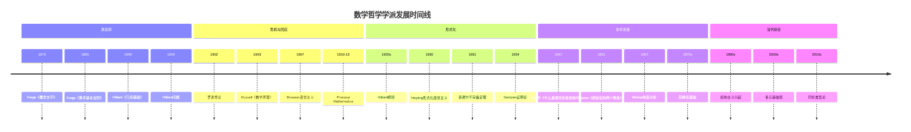

# 数学哲学学派对比

> **完整版深度** | 数学基础与哲学立场的系统性比较

---

## 概述

数学哲学探讨数学的本质、数学对象的存在性、数学真理的性质以及数学知识的来源等问题。20世纪以来，形成了多个具有深远影响的数学哲学流派。本文档对这些学派进行系统性对比分析。

---

## 一、三大经典学派对比

### 1.1 对比总表

| 维度 | 逻辑主义<br/>Logicism | 形式主义<br/>Formalism | 直觉主义<br/>Intuitionism |
|-----|---------------------|----------------------|------------------------|
| **代表人物** | Russell, Whitehead<br/>Frege, Carnap | Hilbert, Curry<br/>Cohen, Robinson | Brouwer, Heyting<br/>Weyl, Dummett |
| **核心主张** | 数学即逻辑<br/>数学可还原为逻辑 | 数学是符号游戏<br/>形式系统的一致性即真理 | 数学是心智构造<br/>可构造性即存在性 |
| **无穷观** | 接受实际无穷<br/>集合论基础 | 理想元素方法<br/>无穷作为便利工具 | 潜无穷唯一合法<br/>否定实际无穷 |
| **排中律** | 完全接受<br/>经典逻辑的基石 | 形式系统中接受<br/>元数学中有限主义 | 拒绝<br/>不可判定命题无真假 |
| **证明标准** | 逻辑推导<br/>从公理到定理 | 形式可推导性<br/>符号变换规则 | 可构造性证明<br/>直觉上明确的构造 |
| **数学对象** | 逻辑构造<br/>类、关系、函项 | 形式符号<br/>无内在意义 | 直觉构造<br/>心智活动产物 |
| **典型成果** | Principia Mathematica<br/>类型论 | 希尔伯特计划（部分）<br/>证明论 | 直觉主义逻辑<br/>BHK解释 |
| **局限性** | 悖论问题<br/>还原的不完全性 | 不完备定理打击<br/>一致性证明困难 | 过于限制<br/>经典数学大量失效 |
| **现代影响** | 类型论/逻辑编程<br/>计算机科学 | 证明论/自动定理证明<br/>形式化验证 | 构造数学/计算机科学<br/>类型理论 |

### 1.2 逻辑主义（Logicism）

```
核心主张树
├── 数学可还原为逻辑
│   ├── 算术是逻辑的延伸
│   ├── 分析建立在算术之上
│   └── 集合论提供基础
├── 数学真理即逻辑真理
│   ├── 先验性
│   ├── 必然性
│   └── 分析性
└── 数学对象是逻辑构造
    ├── 数是类的类
    ├── 关系是命题函项
    └── 函数是映射关系
```

#### 1.2.1 弗雷格（Frege）的开创

| 项目 | 内容 |
|-----|------|
| **时期** | 1879-1903 |
| **核心著作** | 《概念文字》（1879）、《算术基础》（1884）、《算术基本法则》（1893-1903） |
| **核心贡献** | 现代逻辑学奠基、逻辑主义纲领提出 |
| **技术工具** | 谓词逻辑、量化理论、从逻辑导出算术 |
| **挫折** | 罗素悖论（1902）摧毁了《算术基本法则》系统 |
| **历史地位** | 分析哲学与数理逻辑的共同源头 |

#### 1.2.2 罗素（Russell）与怀特海（Whitehead）的《数学原理》

| 项目 | 内容 |
|-----|------|
| **时期** | 1910-1913 |
| **核心著作** | Principia Mathematica（三卷本） |
| **核心贡献** | 类型论解决悖论、逻辑主义体系化 |
| **技术工具** | 分支类型论、可归约性公理、无穷公理 |
| **影响评估** | 逻辑主义未完全成功，但催生了类型论和现代逻辑 |
| **现代遗产** | 类型论（Martin-Löf）、逻辑编程（Prolog） |

#### 1.2.3 逻辑主义的核心论证

**弗雷格-罗素定义**：
- 0 = {∅}（以空集为唯一元素的类）
- n+1 = 所有恰有n个元素的类的类
- 自然数即通过这种方式定义的基数

**优点**：
- 数学知识的先验性得到解释
- 数学与逻辑的统一性

**困难**：
- 无穷公理和选择公理的非逻辑性
- 可归约性公理的特设性
- 哥德尔不完备定理的限制

### 1.3 形式主义（Formalism）

```
核心主张树
├── 数学是符号操作
│   ├── 无意义的符号串
│   ├── 形成规则
│   └── 变形规则
├── 真理即可证性
│   ├── 形式可推导性
│   ├── 一致性即存在
│   └── 完备性理想
├── 无穷作为理想元素
│   ├── 实无穷是理想化
│   ├── 元数学中有限主义
│   └── 实际数学中自由使用
└── 数学对象无需本体论承诺
    ├── 符号本身即对象
    ├── 解释是额外的
    └── 多模型可能性
```

#### 1.3.1 希尔伯特（Hilbert）纲领

| 项目 | 内容 |
|-----|------|
| **时期** | 1900-1931（哥德尔定理） |
| **核心目标** | 证明数学形式系统的一致性、完备性、可判定性 |
| **方法论** | 将数学形式化为符号系统，用有穷方法证明元数学性质 |
| **有穷主义** | 元数学中只承认有限构造，不涉及无穷 |
| **理想元素** | 数学实践中可使用无穷作为便利工具 |
| **挫折** | 哥德尔不完备定理（1931）证明纲领不可实现 |

#### 1.3.2 形式主义的变体

** curry的形式主义**：
- 数学是形式系统的研究
- 不关心解释，只关心句法性质
- 接受各种相容的形式系统并存

** Robinson的非标准分析**：
- 无穷小量的严格形式化处理
- 展示形式主义的技术威力
- 模型论方法的应用

#### 1.3.3 希尔伯特纲领的影响与遗产

**正面遗产**：
- 证明论的建立（Gentzen、Ackermann）
- 元数学的发展
- 形式化方法在计算机科学中的应用

**技术成就**：
- Gentzen对PA一致性的证明（超限归纳）
- 形式系统的相对一致性证明
- 逆向数学（Reverse Mathematics）

**现代应用**：
- 自动定理证明
- 程序验证
- 形式化数学（如Lean、Coq）

### 1.4 直觉主义（Intuitionism）

```
核心主张树
├── 数学是心智构造
│   ├── 基于时间直觉
│   ├── 原初二元性（一与多）
│   └── 自由构造序列
├── 可构造性即真理
│   ├── 存在 = 被构造
│   ├── 证明 = 构造方法
│   └── 真 = 有证明
├── 潜无穷唯一合法
│   ├── 自然数是无穷序列
│   ├── 实无穷不可接受
│   └── 连续统是构造过程
└── 拒绝排中律
    ├── 未证≠假
    ├── 未证≠真
    └── 真值间隙存在
```

#### 1.4.1 布劳威尔（Brouwer）的直觉主义

| 项目 | 内容 |
|-----|------|
| **时期** | 1907-1966 |
| **核心著作** | 《论数学基础》（1907）、《数学、科学和语言》（1929） |
| **核心贡献** | 直觉主义数学哲学、选择序列、直觉主义拓扑 |
| **时间直觉** | 数学基于"原初直觉"——时间流逝中的二元性 |
| **自由选择序列** | 数学对象可以是未完全确定的构造过程 |
| **对经典数学的批评** | 排中律的滥用、实际无穷的虚构性 |

#### 1.4.2 海廷（Heyting）的形式化

| 项目 | 内容 |
|-----|------|
| **时期** | 1930s |
| **核心贡献** | 直觉主义逻辑的形式化、BHK解释 |
| **技术工具** | 直觉主义命题逻辑和谓词逻辑 |
| **否定解释** | ¬p ≡ p → ⊥（导致矛盾） |
| **BHK解释** | 命题证明即构造程序 |

#### 1.4.3 BHK解释详解

| 命题 | 证明/构造是... |
|-----|--------------|
| p ∧ q | 一个对（p的证明，q的证明） |
| p ∨ q | 一个标记对，标记为"左"附带p的证明，或"右"附带q的证明 |
| p → q | 一个函数，将p的证明映射为q的证明 |
| ⊥ | 无（矛盾） |
| ∀x.P(x) | 一个函数，将每个a映射为P(a)的证明 |
| ∃x.P(x) | 一个对（a, P(a)的证明） |

#### 1.4.4 直觉主义的影响

**构造数学的发展**：
- Bishop的构造分析（1967）
- 构造代数
- 逆向数学中的构造性层次

**计算机科学的联系**：
- Curry-Howard同构：证明 = 程序
- 类型论（Martin-Löf）
- 函数式编程
- 程序提取

---

## 二、其他重要学派

### 2.1 柏拉图主义（Platonism）

```
核心主张树
├── 数学对象客观存在
│   ├── 独立于心智
│   ├── 独立于物理世界
│   └── 抽象、永恒的实在
├── 数学真理是发现而非发明
│   ├── 数学家像探险家
│   ├── 定理等待被发现
│   └── 证明揭示真理
├── 数学直观把握抽象对象
│   ├── 类似知觉但非感觉
│   ├── 直接认识数学对象
│   └── 哥德尔的数学直觉
└── 集合论宇宙的真实存在
    ├── 连续统假设有确定真值
    ├── ZFC只是近似描述
    └── 新公理的发现
```

#### 2.1.1 哥德尔的柏拉图主义

| 项目 | 内容 |
|-----|------|
| **时期** | 1940s-1970s |
| **核心主张** | 集合论概念的客观实在性 |
| **认识论** | 数学直觉可以逐渐清晰化 |
| **连续统假设观点** | CH有确定的真值（可能是假的） |
| **新公理观** | 需要寻找更强的无穷公理 |
| **论证支持** | 数学的成功需要解释；一致性即存在 |

#### 2.1.2 现代集合论柏拉图主义

- **集合论实在论**：集合论描述真实的数学宇宙
- **多宇宙观与单宇宙观的张力**：Woodin等的大基数研究
- **解释性力量**：新公理的选择标准

### 2.2 自然主义/经验主义（Naturalism/Empiricism）

```
核心主张树
├── 数学知识是经验知识的延伸
│   ├── 奎因的整体主义
│   ├── 数学与科学连续
│   └── 数学对象的认识论地位类似物理对象
├── 不可或缺论证
│   ├── 数学对科学不可或缺
│   ├── 科学是经验的
│   └── 数学对象是实在的
├── 数学真理的经验辩护
│   ├── 预测成功
│   ├── 解释力
│   └── 理论简洁性
└── 拒绝先验数学知识
    ├── 数学-科学连续体
    ├── 可修正性
    └── 自然化认识论
```

#### 2.2.1 奎因（Quine）的整体主义

| 项目 | 内容 |
|-----|------|
| **核心主张** | 知识是整体，数学与科学共同面对经验检验 |
| **本体论承诺** | "存在就是成为约束变量的值" |
| **对逻辑主义的批评** | 逻辑也有本体论承诺（集合） |
| **对分析/综合区分的否定** | 所有陈述都是可修正的 |
| **对数学的影响** | 数学真理的地位取决于科学整体的成功 |

#### 2.2.2 普特南（Putnam）的不可或缺论证

**论证结构**：
1. 我们对自然科学有充分理由相信
2. 数学对自然科学不可或缺
3. 因此，我们有充分理由相信数学
4. 数学承诺了数学对象的存在
5. 因此，数学对象存在

**批评与辩护**：
- 菲尔德（Field）的唯名论尝试：科学可以不需要数学
- Maddy的自然主义：数学实践自主性的辩护

#### 2.2.3 麦蒂（Maddy）的自然主义

| 项目 | 内容 |
|-----|------|
| **核心主张** | 数学方法论自主于科学，但仍然是自然的 |
| **数学实践优先** | 哲学应尊重数学家的实际做法 |
| **集合论自然主义** | 大基数公理的选择基于数学实践标准 |
| **对不可或缺论证的修正** | 数学辩护来自数学内部，而非科学应用 |

### 2.3 结构主义（Structuralism）

```
核心主张树
├── 数学研究结构而非对象
│   ├── 数是结构中的位置
│   ├── 结构关系优先于对象
│   └── 同构结构等价
├── 消去结构主义
│   ├── 结构可用逻辑描述
│   ├── 位置可消去
│   └── 类逻辑主义立场
├── 非消去结构主义
│   ├── 结构是真实的
│   ├── 位置是真实的
│   └── 类似柏拉图主义但强调结构
└── 模态结构主义
    ├── 数学陈述是模态的
    ├── "必然地，任何满足...的结构"
    └── 避免本体论承诺
```

#### 2.3.1 Bourbaki的结构主义实践

| 项目 | 内容 |
|-----|------|
| **时期** | 1935- |
| **核心主张** | 数学是结构的科学 |
| **三大母结构** | 代数结构、序结构、拓扑结构 |
| **方法论** | 公理化方法、同构分类 |
| **影响** | 20世纪数学的统一化和抽象化 |
| **与哲学结构主义关系** | 实践先于哲学理论化 |

#### 2.3.2 夏皮罗（Shapiro）的结构主义哲学

| 项目 | 内容 |
|-----|------|
| **核心著作** | 《数学哲学：结构与本体论》（1997） |
| **核心主张** | 数学对象即结构中的位置 |
| **认识论** | 通过抽象认识结构（从系统到结构） |
| **结构的存在** | 结构作为抽象模式存在 |
| **与柏拉图主义关系** | 保留实在论但改变本体论承诺的性质 |

#### 2.3.3 赫尔曼（Hellman）的模态结构主义

| 项目 | 内容 |
|-----|------|
| **核心主张** | 数学陈述可翻译为模态陈述 |
| **示例** | "存在素数" → "必然地，任何ω-序列都有素数位置" |
| **优势** | 避免抽象对象的本体论承诺 |
| **挑战** | 模态逻辑的本体论地位、原始模态性 |

### 2.4 范畴论基础（Categorical Foundations）

```
核心主张树
├── 范畴论作为数学基础
│   ├── 不需要集合论
│   ├── 态射优先于元素
│   └── 统一各数学分支
├── 泛性质的核心地位
│   ├── 极限/余极限
│   ├── 伴随函子
│   └── 表征性定义
├── Topos理论
│   ├── 推广集合论概念
│   ├── 内部逻辑
│   └── 构造主义数学的基础
└── 结构主义的形式化
    ├── 结构即范畴
    ├── 结构保持即函子
    └── 结构关系即自然变换
```

#### 2.4.1 Lawvere的范畴论基础

| 项目 | 内容 |
|-----|------|
| **时期** | 1960s- |
| **核心贡献** | 范畴论作为基础、ETCS（基本拓扑斯理论） |
| **核心主张** | 数学的本质是映射（态射）而非集合（元素） |
| **技术工具** | 范畴的初等理论、函子语义学 |
| **影响** | 范畴论在代数几何、逻辑学、计算机科学中的应用 |

#### 2.4.2 Topos理论与构造主义

| 项目 | 内容 |
|-----|------|
| **核心概念** | Topos = 推广的集合论宇宙 |
| **内部逻辑** | 每个Topos有其自身的逻辑（通常是构造主义的） |
| **应用** | 构造主义数学、代数几何（Grothendieck Topos） |
| **与集合论关系** | 集合范畴是特殊的Topos |
| **多元性** | 允许多种"数学宇宙"并存 |

---

## 三、学派间的对话与融合

### 3.1 历史发展脉络



### 3.2 核心分歧点分析

| 问题 | 逻辑主义 | 形式主义 | 直觉主义 | 柏拉图主义 | 结构主义 |
|-----|---------|---------|---------|-----------|---------|
| **数学对象存在性** | 逻辑构造 | 符号 | 心智构造 | 独立存在 | 结构位置 |
| **无穷的地位** | 实际无穷 | 理想元素 | 潜无穷 | 实际无穷 | 结构特性 |
| **排中律** | 接受 | 接受 | 拒绝 | 接受 | 接受 |
| **数学真理标准** | 逻辑真 | 可证性 | 可构造性 | 客观真 | 结构满足 |
| **认识论来源** | 逻辑直觉 | 符号操作 | 时间直觉 | 数学直觉 | 抽象能力 |
| **与科学关系** | 独立 | 独立 | 独立 | 独立/先验 | 可应用性 |

### 3.3 现代融合趋势

#### 3.3.1 同伦类型论（Homotopy Type Theory）

| 方面 | 内容 |
|-----|------|
| **时期** | 2006-（Awodey-Warren, Voevodsky） |
| **核心创新** | Martin-Löf类型论与无穷范畴论的融合 |
| **与经典学派的联系** | 直觉主义逻辑 + 范畴论基础 + 构造主义 |
| **公理** | 泛等公理（Univalence Axiom） |
| **意义** | 可能提供新的数学基础框架 |
| **影响** | 形式化数学、证明助手、计算机验证 |

#### 3.3.2 多元基础观（Pluralism）

| 方面 | 内容 |
|-----|------|
| **核心主张** | 不存在唯一的数学基础 |
| **代表性学者** | Feferman、Beeson、数学实践哲学学者 |
| **论证** | 不同基础服务于不同目的 |
| **与经典学派的对比** | 放弃基础主义，拥抱多元 |
| **实践意义** | 尊重数学的多样性 |

---

## 四、当代争论焦点

### 4.1 大基数与新公理

| 学派 | 立场 |
|-----|------|
| **柏拉图主义** | 大基数公理描述真实的集合论宇宙 |
| **自然主义** | 大基数的选择基于数学实践标准 |
| **多元论者** | 不同集合论宇宙对应不同公理系统 |
| **怀疑论者** | 连续统假设可能有确定真值但不可知 |

### 4.2 数学实践哲学

| 主题 | 核心问题 |
|-----|---------|
| **证明的本质** | 证明是形式推导还是可说服的论证？ |
| **解释在数学中的作用** | 数学解释是否有客观标准？ |
| **可视化与严格性** | 计算机辅助证明的地位 |
| **数学理解** | 理解的认知特征与规范价值 |

### 4.3 计算机对数学哲学的影响

| 方面 | 影响 |
|-----|------|
| **四色定理证明** | 计算机辅助证明的可接受性争论 |
| **形式化数学** | Lean、Coq等证明助手的发展 |
| **实验数学** | 计算机发现与严格证明的关系 |
| **人工智能** | 机器能否"做数学"？ |

---

## 五、学派对比矩阵

### 5.1 本体论承诺对比

| 学派 | 数学对象 | 存在性标准 | 本体论地位 |
|-----|---------|-----------|-----------|
| 逻辑主义 | 类、关系 | 逻辑可定义性 | 逻辑构造 |
| 形式主义 | 符号 | 形式可表达性 | 无意义工具 |
| 直觉主义 | 构造 | 心智可构造 | 心智活动 |
| 柏拉图主义 | 抽象对象 | 客观存在 | 独立实在 |
| 自然主义 | 科学所需 | 科学不可或缺性 | 经验可及 |
| 结构主义 | 结构位置 | 结构实例化 | 抽象模式 |
| 范畴论 | 对象与态射 | 范畴存在 | 关系优先 |

### 5.2 认识论方法对比

| 学派 | 知识来源 | 证明标准 | 真理观 |
|-----|---------|---------|-------|
| 逻辑主义 | 逻辑直觉 | 逻辑推导 | 分析真 |
| 形式主义 | 符号操作 | 形式可推导 | 约定真 |
| 直觉主义 | 时间直觉 | 构造性证明 | 可证即真 |
| 柏拉图主义 | 数学直觉 | 严格证明 | 客观真 |
| 自然主义 | 科学实践 | 实用标准 | 经验确证 |
| 结构主义 | 抽象能力 | 结构保持 | 结构真 |
| 范畴论 | 关系洞察 | 泛性质 | 表征真 |

---

## 六、结语

数学哲学的各大学派提供了理解数学本质的不同视角：

1. **逻辑主义**强调数学与逻辑的连续性
2. **形式主义**关注数学的严格基础和形式结构
3. **直觉主义**强调数学的构造性本质和认识论基础
4. **柏拉图主义**维护数学的客观性和真理性
5. **自然主义**将数学置于更广泛的科学认识论框架中
6. **结构主义**改变本体论焦点，从对象转向结构
7. **范畴论**提供关系主义的基础框架

这些学派之间的对话与竞争推动了数学基础研究的深入，也为理解数学的本质提供了丰富的思想资源。当代趋势显示，学派间的壁垒正在松动，综合与多元成为新的特征。

---

*文档版本：完整版*  
*创建日期：2026年4月*  
*覆盖学派：7个主要学派 + 多个子流派*  
*所属项目：FormalMath*
