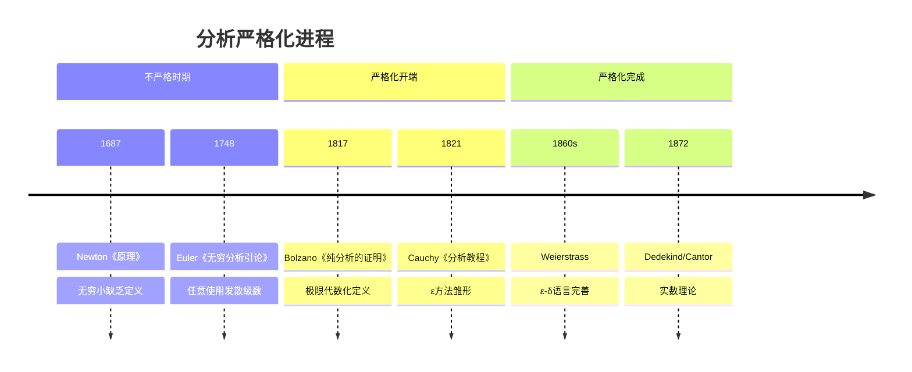
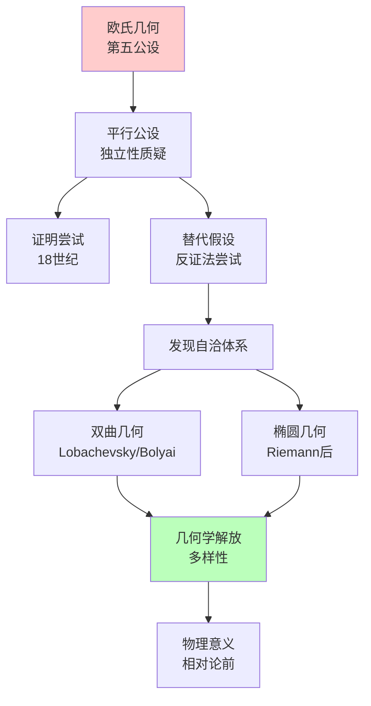
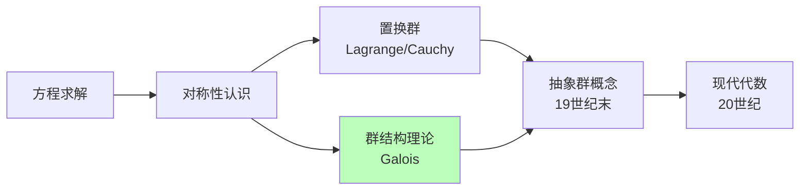
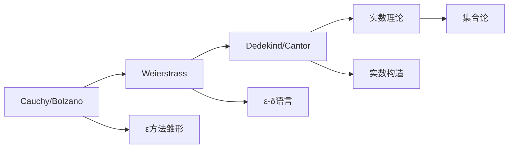

# 19世纪数学思想演进（上）

> **历史时期**：1800-1850年（分析严格化运动）

---

## 时代背景

19世纪上半叶是数学史上的关键转折期。微积分在18世纪展现了惊人的威力，但其基础（无穷小、无穷级数、极限概念）缺乏严格定义。Cauchy、Bolzano、Abel等数学家开始关注分析的严格性，同时Gauss、Bolyai、Lobachevsky等开创了非欧几何，Galois建立了群论。这一时期的核心主题是**严格化**与**解放**——分析学的严格化与几何学从欧氏传统的解放。

---

## 核心思想演进树

```mermaid
graph TD
    Root[19世纪数学思想上<br/>1800-1850] --> Analysis[分析严格化]
    Root --> Geometry[非欧几何诞生]
    Root --> Algebra[群论起源]
    Root --> NumberTheory[代数数论萌芽]
    
    Analysis --> An1[极限严格化<br/>Cauchy/Bolzano]
    Analysis --> An2[收敛性理论<br/>级数/积分]
    Analysis --> An3[实数理论<br/>算术化开端]
    Analysis --> An4[复分析创立<br/>Cauchy积分]
    
    An1 --> An1_1[ε-δ语言雏形<br/>代数化极限]
    An1 --> An1_2[连续性定义<br/>Cauchy 1821]
    An1 --> An1_3[导数定义<br/>基于极限]
    
    An2 --> An2_1[级数收敛<br/>Cauchy准则]
    An2 --> An2_2[一致收敛<br/>Abel/Weierstrass]
    
    An3 --> An3_1[无理数认识<br/>几何依赖破除]
    An3 --> An3_2[实数构造<br/>Dedekind/Cantor后]
    
    An4 --> An4_1[Cauchy积分定理<br/>1825]
    An4 --> An4_2[留数理论<br/>1814-1831]
    An4 --> An4_3[复函数理论<br/>奠基]
    
    Geometry --> Geo1[平行公设独立性<br/>质疑]
    Geometry --> Geo2[双曲几何<br/>Lobachevsky 1826]
    Geometry --> Geo3[椭圆几何<br/>Riemann后]
    Geometry --> Geo4[Gauss内蕴几何<br/>1827]
    
    Algebra --> Alg1[方程可解性<br/>Galois理论]
    Algebra --> Alg2[置换群<br/>Cauchy]
    Algebra --> Alg3[抽象群概念<br/>萌芽]
    
    Alg1 --> Alg1_1[Galois对应<br/>方程↔群]
    Alg1 --> Alg1_2[根式可解<br/>可解群判别]
    Alg1 --> Alg1_3[五次方程<br/>不可解证明]
    
    NumberTheory --> NT1[高斯整数<br/>Gauss]
    NumberTheory --> NT2[二次型理论<br/>Gauss《算术研究》]
    NumberTheory --> NT3[理想数概念<br/>Kummer后]
    
    style Root fill:#f9f,stroke:#333,stroke-width:4px
    style Analysis fill:#bbf,stroke:#333
    style An1_1 fill:#bfb,stroke:#333
    style Geometry fill:#fbb,stroke:#333

```



---

## 关键人物及其贡献

### 1. Cauchy（柯西，1789-1857）

| 维度 | 内容 |
|------|------|
| **核心著作** | 《分析教程》（1821）、《无穷小计算教程》（1823）、《微分计算教程》（1829） |
| **核心贡献** | 分析严格化的奠基人，极限的现代定义，复分析创立者 |
| **思想突破** | 用代数化的不等式语言（ε方法）定义极限，摆脱几何直观 |
| **历史意义** | 现代分析学的奠基人，严格数学证明的典范 |

**Cauchy的贡献**：
- **极限定义**：序列极限的严格定义
- **连续性**：函数连续性的现代定义
- **级数收敛**：Cauchy收敛准则
- **复分析**：Cauchy积分定理、留数理论
- **微分方程**：存在性定理（Cauchy-Lipschitz）

### 2. Bolzano（波尔查诺，1781-1848）

| 维度 | 内容 |
|------|------|
| **核心著作** | 《纯分析的证明》（1817）、《无穷的悖论》（1851） |
| **核心贡献** | 极限概念的严格化、中间值定理证明、无穷集合的早期研究 |
| **思想突破** | 独立于Cauchy发展了类似的严格化思想，但被忽视多年 |
| **历史意义** | 分析严格化的先驱，集合论思想的先驱 |

**Bolzano的定理**：
- **Bolzano-Weierstrass定理**：有界数列必有收敛子列
- **Bolzano中间值定理**：连续函数零点存在性

### 3. Gauss（高斯，1777-1855）

| 维度 | 内容 |
|------|------|
| **核心著作** | 《算术研究》（1801）、《曲面的一般研究》（1827） |
| **核心贡献** | 现代数论奠基、非欧几何的私下研究、微分几何创立 |
| **思想突破** | 非欧几何的早期认识（未发表）、曲面的内蕴几何 |
| **历史意义** | "数学王子"，19世纪数学的领军人物 |

**Gauss的贡献领域**：
- **数论**：《算术研究》奠定现代数论基础
- **几何**：非欧几何的早期发现（未发表）、微分几何
- **代数**：代数基本定理证明、复数几何表示
- **分析**：最小二乘法、正态分布、级数收敛
- **大地测量学**：实际应用推动微分几何发展

### 4. Lobachevsky（罗巴切夫斯基，1792-1856）

| 维度 | 内容 |
|------|------|
| **核心著作** | 《论几何基础》（1829-1830）、《平行线理论的几何研究》（1840） |
| **核心贡献** | 双曲几何的公开创立者 |
| **思想突破** | 否定第五公设，建立自洽的非欧几何体系 |
| **历史意义** | 打破欧氏几何的独尊地位，解放了几何学 |

### 5. Bolyai（鲍耶，1802-1860）

| 维度 | 内容 |
|------|------|
| **核心贡献** | 独立于Lobachevsky发现双曲几何 |
| **历史意义** | 非欧几何的独立发现者之一 |

### 6. Abel（阿贝尔，1802-1829）

| 维度 | 内容 |
|------|------|
| **核心著作** | 多篇论文（关于五次方程、椭圆函数、分析） |
| **核心贡献** | 证明五次方程一般不可根式解、椭圆函数、一致收敛 |
| **思想突破** | 反例思维（Abel定理）、椭圆函数的革命 |
| **历史意义** | 短暂而辉煌的一生，对代数和分析的深远影响 |

**Abel的成就**：
- **代数**：五次方程不可根式解（1824）
- **分析**：二项式级数的严格处理、一致收敛的早期认识
- **椭圆函数**：椭圆函数的革命性研究

### 7. Galois（伽罗瓦，1811-1832）

| 维度 | 内容 |
|------|------|
| **核心著作** | 1830-1832年的手稿，1846年由Liouville发表 |
| **核心贡献** | 群论创立、方程可解性理论、现代代数的奠基 |
| **思想突破** | 用群的结构研究方程的可解性，开创抽象代数方法 |
| **历史意义** | 21岁决斗身亡，留下改变数学面貌的思想遗产 |

**Galois对应**：

```

方程 ↔ Galois群
根式可解 ↔ 可解群

```

---

## 思想转折点分析

### 转折一：从直观到严格（分析学的算术化）



**严格化的核心变化**：

| 概念 | 18世纪理解 | 19世纪严格定义 |
|------|------------|----------------|
| 极限 | "趋近于"、"无穷小量" | ε-N/ε-δ定义 |
| 连续 | "一笔画出" | ε-δ连续性 |
| 收敛 | "趋向于" | Cauchy收敛准则 |
| 导数 | "无穷小增量比" | 极限定义 |

### 转折二：非欧几何的诞生（几何学的解放）



**第五公设问题的发展**：

| 时期 | 进展 | 人物 |
|------|------|------|
| 公元前300年 | 第五公设表述 | Euclid |
| 18世纪 | 证明尝试 | Saccheri、Legendre |
| 1826 | 双曲几何公开 | Lobachevsky |
| 1832 | 双曲几何独立发现 | Bolyai |
| 1854 | 几何统一理论 | Riemann |

### 转折三：代数学的抽象化（群论诞生）



**群论诞生的意义**：
- 从**具体计算**（解方程）到**结构研究**（群论）
- 开创抽象代数的新范式
- 对称性成为数学的核心概念

---

## 各分支发展状况

### 分析学

| 方面 | 进展 | 关键人物 |
|------|------|----------|
| 极限理论 | 严格化开端 | Cauchy、Bolzano |
| 级数理论 | 收敛性研究 | Cauchy、Abel |
| 复分析 | Cauchy积分理论 | Cauchy |
| 实数基础 | 认识不足（后解决） | （Weierstrass/Dedekind后） |

### 几何学

| 方面 | 进展 | 关键人物 |
|------|------|----------|
| 非欧几何 | 双曲几何创立 | Lobachevsky、Bolyai |
| 微分几何 | 曲面内蕴几何 | Gauss |
| 射影几何 | 系统化 | Poncelet、Möbius、Plücker |

### 代数学

| 方面 | 进展 | 关键人物 |
|------|------|----------|
| 方程理论 | 可解性理论 | Abel、Galois |
| 群论 | 置换群、群概念萌芽 | Cauchy、Galois |
| 线性代数 | 行列式、矩阵 | Cauchy、Sylvester后 |

---

## 对后世影响

### 1. 分析学严格化的延续



### 2. 几何学的多元化

非欧几何的诞生开启了几何学的多元化时代：
- **黎曼几何**（1854）
- **高维几何**
- **流形理论**
- **广义相对论应用**（20世纪）

### 3. 代数学的革命

Galois理论的影响：
- 抽象代数的发展
- 群论成为独立学科
- 对称性概念的广泛应用
- 几何与代数的统一（Klein的Erlangen纲领后）

---

## 现代意义

### 1. 严格性的价值

19世纪上半叶的严格化运动确立了现代数学的标准：
- 定义的精确性
- 证明的严格性
- 概念的清晰性

### 2. 观念解放

非欧几何的诞生展示了数学观念的解放：
- 数学真理不等于物理真理
- 公理系统的选择是自由的
- 多种相容的数学体系可以并存

### 3. 结构思维的兴起

Galois理论开创了结构研究的新范式：
- 从具体对象到抽象结构
- 从计算到关系
- 这一思想延续到20世纪的Bourbaki结构主义

---

## 总结

19世纪上半叶数学思想演进的核心主题：

1. **分析的严格化**：Cauchy和Bolzano开创了分析的严格化运动，用代数化的不等式语言定义极限和连续性。

2. **几何学的解放**：Lobachevsky和Bolyai创立非欧几何，打破欧氏几何的独尊地位，解放了几何学思想。

3. **代数学的革命**：Abel证明五次方程不可根式解，Galois创立群论，开创了用结构研究代数问题的新范式。

4. **基础问题的暴露**：这一时期也暴露了数学基础的问题（实数定义、无穷概念），为19世纪下半叶的进一步工作提供了动力。

这一时期确立的原则——严格性、抽象性、结构性——成为现代数学的标志性特征。

---

*文档编号：04*  
*创建日期：2026年4月*  
*所属项目：FormalMath 第十批推进计划*  
*涵盖时期：1800-1850年*  
*关键人物：Cauchy、Bolzano、Gauss、Lobachevsky、Bolyai、Abel、Galois*
