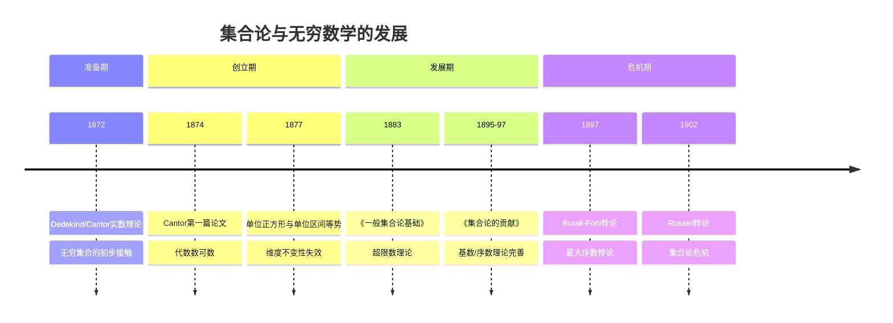
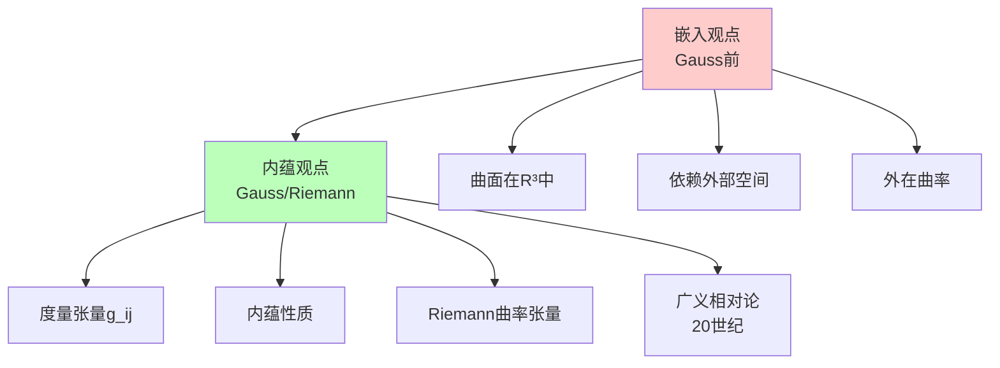
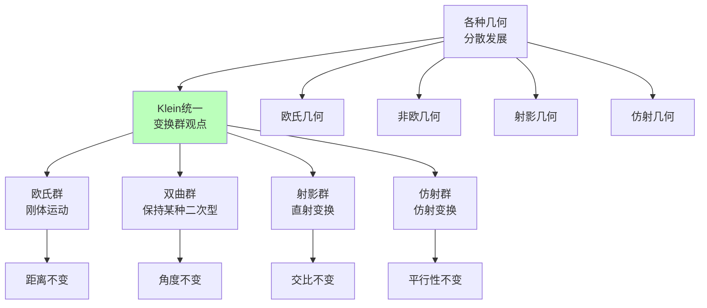
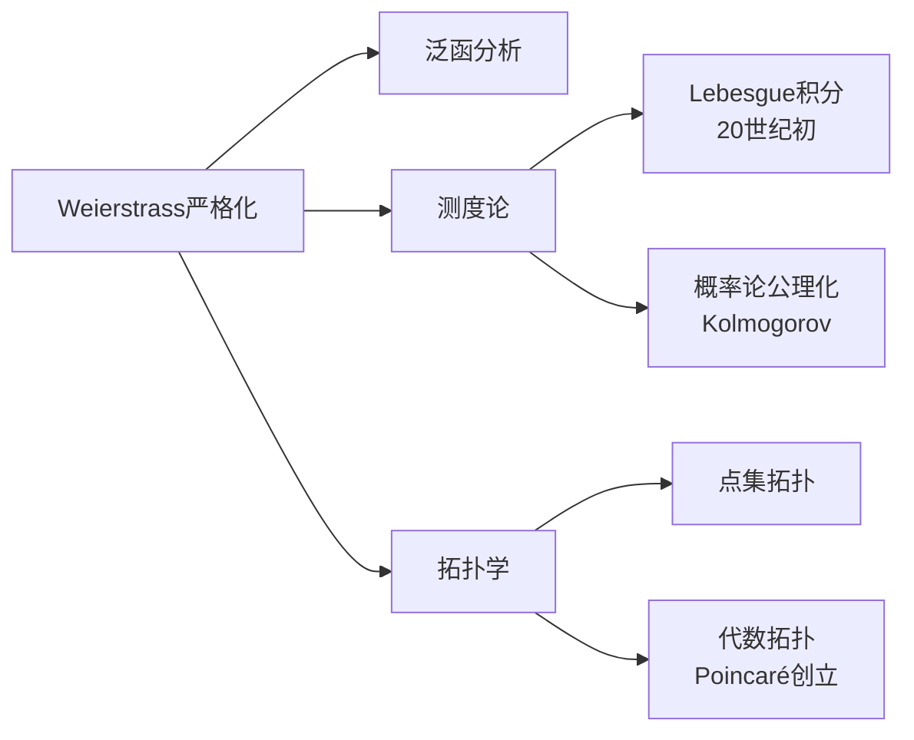
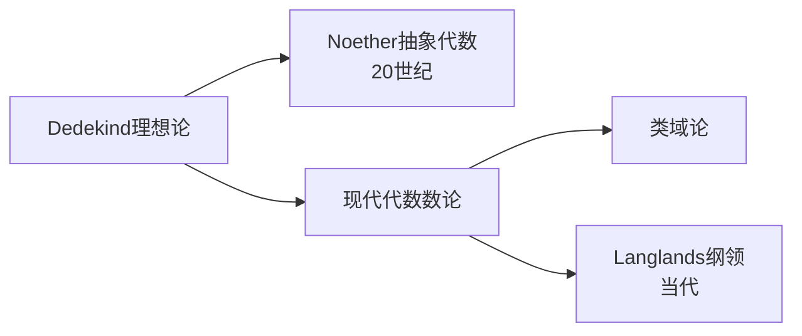

# 19世纪数学思想演进（下）

> **历史时期**：1850-1900年（代数学与几何学深化）

---

## 时代背景

19世纪下半叶，数学进入深度发展期。Weierstrass完成了分析的严格化，Dedekind和Cantor建立了实数理论和集合论，Riemann创立了复分析和黎曼几何，Klein提出了Erlangen纲领，Lie创立了李群理论。这一时期的核心特征是**统一化**与**抽象化**——不同分支的统一、更高层次的抽象。

---

## 核心思想演进树

```mermaid
graph TD
    Root[19世纪数学思想下<br/>1850-1900] --> Analysis[分析学完成]
    Root --> Geometry[几何学深化]
    Root --> Algebra[代数学发展]
    Root --> SetTheory[集合论诞生]
    
    Analysis --> An1[ε-δ语言<br/>Weierstrass]
    Analysis --> An2[实数理论<br/>Dedekind/Cantor 1872]
    Analysis --> An3[测度萌芽<br/>Peano/Jordan]
    
    An1 --> An1_1[极限严格化<br/>算术化完成]
    An1 --> An1_2[一致收敛<br/>级数理论完善]
    An1 --> An1_3[无处可微函数<br/>病态函数]
    
    An2 --> An2_1[Dedekind分割<br/>有理数完备化]
    An2 --> An2_2[Cantor基本列<br/>柯西序列方法]
    An2 --> An3_3[连续统假设<br/>Cantor 1878]
    
    Geometry --> Geo1[Riemann几何<br/>1854]
    Geometry --> Geo2[Klein Erlangen纲领<br/>1872]
    Geometry --> Geo3[Lie群<br/>连续变换群]
    
    Geo1 --> Geo1_1[内蕴几何<br/>度量张量]
    Geo1 --> Geo1_2[高维流形<br/>n维空间]
    Geo1 --> Geo1_3[曲率张量<br/>Riemann曲率]
    
    Geo2 --> Geo2_1[变换群统一<br/>几何分类]
    Geo2 --> Geo2_2[欧氏/非欧<br/>射影统一]
    
    Algebra --> Alg1[抽象代数<br/>群/环/域]
    Algebra --> Alg2[线性代数<br/>矩阵理论]
    Algebra --> Alg3[代数数论<br/>Dedekind理想论]
    
    Alg1 --> Alg1_1[抽象群定义<br/>Cayley后]
    Alg1 --> Alg1_2[域论<br/>Galois理论完善]
    Alg1 --> Alg1_3[有限单群<br/>分类开端]
    
    Alg3 --> Alg3_1[理想论<br/>代数整数]
    Alg3 --> Alg3_2[戴德金环<br/>唯一分解补救]
    Alg3 --> Alg3_3[类数公式<br/>Dirichlet]
    
    SetTheory --> Set1[Cantor集合论<br/>1874-1897]
    SetTheory --> Set2[超限数<br/>基数/序数]
    SetTheory --> Set3[悖论萌芽<br/>1897]
    
    style Root fill:#f9f,stroke:#333,stroke-width:4px
    style SetTheory fill:#fbb,stroke:#333
    style An2 fill:#bfb,stroke:#333
    style Geo1 fill:#bbf,stroke:#333

```



---

## 关键人物及其贡献

### 1. Weierstrass（魏尔斯特拉斯，1815-1897）

| 维度 | 内容 |
|------|------|
| **核心贡献** | 分析严格化的完成者，ε-δ语言的完善，复分析发展 |
| **思想突破** | 用静态的代数不等式语言完全取代动态的无穷小概念 |
| **历史意义** | "现代分析之父"，严格数学证明的典范 |

**Weierstrass的贡献**：
- **ε-δ语言**：极限、连续性、导数的严格定义
- **一致收敛**：级数理论的基础
- **无处可微连续函数**：揭示直觉的局限性
- **解析延拓**：复分析的核心方法
- **椭圆函数**：系统理论

### 2. Dedekind（戴德金，1831-1916）

| 维度 | 内容 |
|------|------|
| **核心著作** | 《连续性与无理数》（1872）、《数的意义》（1888） |
| **核心贡献** | Dedekind分割、理想论、代数数论基础、自然数公理化 |
| **思想突破** | 用集合论方法重构数系基础，用理想概念推广整数 |
| **历史意义** | 现代代数数论的奠基人，集合论思想的先驱 |

**Dedekind的关键贡献**：
- **Dedekind分割**（1872）：用有理数分割定义实数
- **理想论**（1871）：用理想概念补救代数整数的唯一分解性
- **自然数公理化**（1888）：递归定义、数学归纳法基础

### 3. Cantor（康托尔，1845-1918）

| 维度 | 内容 |
|------|------|
| **核心著作** | 《一般集合论基础》（1883）、《集合论的贡献》（1895-1897） |
| **核心贡献** | 集合论创立、超限数理论、无穷集合的数学理论 |
| **思想突破** | 承认实际无穷，证明无穷有不同"大小" |
| **历史意义** | 现代数学基础的核心，引发数学基础危机 |

**Cantor的革命性思想**：
- **一一对应**：集合等势的定义
- **可数与不可数**：实数比自然数"更多"
- **超限数**：ℵ₀, ℵ₁, ... 基数的层级
- **连续统假设**：2^ℵ₀ = ℵ₁（独立性问题）

### 4. Riemann（黎曼，1826-1866）

| 维度 | 内容 |
|------|------|
| **核心著作** | 就职演讲《论几何基础中的假设》（1854）、复分析论文 |
| **核心贡献** | 黎曼几何、复分析（黎曼面）、ζ函数、黎曼积分 |
| **思想突破** | 空间的度量性质独立于嵌入空间，复函数的几何化 |
| **历史意义** | 现代微分几何的奠基人，影响深远的思想家 |

**Riemann的贡献领域**：
- **黎曼几何**（1854）：内蕴几何、度量张量、曲率
- **复分析**：黎曼面、黎曼映射定理、黎曼-Roch定理
- **数论**：黎曼ζ函数、黎曼假设
- **分析**：黎曼积分、傅里叶级数条件

### 5. Klein（克莱因，1849-1925）

| 维度 | 内容 |
|------|------|
| **核心著作** | Erlangen纲领（1872） |
| **核心贡献** | 用变换群统一几何学，自守函数 |
| **思想突破** | 几何学 = 在变换群下的不变量理论 |
| **历史意义** | 几何学统一化的里程碑 |

**Erlangen纲领的核心思想**：

```

给定一个空间和一个作用于其上的变换群，
研究在该群下不变的几何性质。

```

| 几何 | 变换群 | 不变量 |
|------|--------|--------|
| 欧氏几何 | 刚体运动群 | 距离、角度 |
| 仿射几何 | 仿射变换群 | 平行性、比例 |
| 射影几何 | 射影变换群 | 交比 |
| 拓扑学 | 同胚群 | 连通性、孔洞 |

### 6. Lie（李，1842-1899）

| 维度 | 内容 |
|------|------|
| **核心贡献** | 李群、李代数、连续变换群 |
| **思想突破** | 用无穷小变换研究连续群，群与微分方程的联系 |
| **历史意义** | 李群成为现代数学和物理的核心工具 |

### 7. Poincaré（庞加莱，1854-1912）

| 维度 | 内容 |
|------|------|
| **核心贡献** | 代数拓扑创立、自守函数、动力系统、三体问题 |
| **思想突破** | 研究图形在连续变形下的不变性质（拓扑学） |
| **历史意义** | 最后一位通才数学家，影响20世纪数学发展 |

---

## 思想转折点分析

### 转折一：从有限到无穷（集合论的诞生）



**Cantor的无穷概念**：

| 概念 | 含义 | 革命性 |
|------|------|--------|
| 实际无穷 | 无穷作为完成的整体 | 反对传统观点 |
| 一一对应 | 判断集合大小的标准 | 无穷集的真子集可等势 |
| 可数无穷 | ℵ₀ = 自然数集的基数 | 有理数可数 |
| 连续统 | c = 实数集的基数 | c > ℵ₀ |
| 超限数 | 无穷基数的层级 | ℵ₀, ℵ₁, ℵ₂, ... |

### 转折二：从嵌入到内蕴（黎曼几何）



**Riemann几何的革命性**：
- **空间的度量性质**可以独立于任何嵌入空间来研究
- **曲率**是内蕴的，不依赖外部观察
- **高维空间**可以有任意维度
- 为**广义相对论**提供了数学框架（60年后）

### 转折三：几何学的统一（Erlangen纲领）



---

## 各分支发展状况

### 分析学（严格化完成）

| 方面 | 进展 | 关键人物 |
|------|------|----------|
| 极限理论 | ε-δ语言完善 | Weierstrass |
| 实数理论 | Dedekind分割、Cantor基本列 | Dedekind、Cantor |
| 复分析 | 黎曼面理论、Weierstrass方法 | Riemann、Weierstrass |
| 级数理论 | 一致收敛理论完善 | Weierstrass |

### 几何学（统一与深化）

| 方面 | 进展 | 关键人物 |
|------|------|----------|
| 微分几何 | 内蕴几何、黎曼几何 | Gauss、Riemann |
| 几何统一 | Erlangen纲领 | Klein |
| 拓扑学 | 代数拓扑创立 | Poincaré |
| 李群 | 连续变换群 | Lie |

### 代数学（抽象化）

| 方面 | 进展 | 关键人物 |
|------|------|----------|
| 群论 | 抽象群定义、有限群分类 | Cayley、Sylow、Jordan |
| 环论/域论 | 理想论、代数数论 | Dedekind、Kronecker |
| 线性代数 | 矩阵理论、向量空间 | Cayley、Grassmann、Peano |

### 基础数学（集合论）

| 方面 | 进展 | 关键人物 |
|------|------|----------|
| 集合论 | 建立基本理论 | Cantor |
| 悖论 | Burali-Forti悖论 | Burali-Forti |
| 公理化 | （20世纪Zermelo） | （后续） |

---

## 对后世影响

### 1. 现代分析的基础



### 2. 几何学与物理学的融合

Riemann几何的影响：
- **张量分析**（Ricci、Levi-Civita）
- **广义相对论**（Einstein，1915）
- **规范场论**（20世纪）
- **弦理论**（当代）

### 3. 抽象代数的兴起



### 4. 集合论的基础地位

Cantor集合论成为现代数学的基础：
- 所有数学对象都是集合
- 提供统一的表达语言
- 但也带来了基础危机（悖论问题）

---

## 现代意义

### 1. 严格性与抽象性的价值

19世纪下半叶确立了现代数学的双重特征：
- **严格性**：每个概念都有精确定义，每个证明都有逻辑基础
- **抽象性**：从具体例子中提炼一般结构

### 2. 统一化的追求

Klein的Erlangen纲领代表了数学的统一化追求：
- 不同几何的统一
- 不同代数结构的统一
- 这一追求延续到20世纪的Bourbaki和范畴论

### 3. 基础问题的重要性

这一时期也暴露了数学基础的问题：
- 集合论悖论（Burali-Forti，1897）
- 引发20世纪的数学基础危机
- 推动公理化集合论的发展（Zermelo-Fraenkel）

---

## 总结

19世纪下半叶数学思想演进的核心主题：

1. **分析的严格化完成**：Weierstrass完善ε-δ语言，Dedekind和Cantor建立实数理论，分析学的基础完全算术化。

2. **几何学的深化与统一**：Riemann创立内蕴几何，Klein用变换群统一各种几何学，Lie创立连续变换群理论。

3. **代数学的抽象化**：群、环、域等代数结构概念形成，Dedekind的理想论奠定代数数论基础。

4. **集合论的创立**：Cantor建立无穷集合的数学理论，开创超限数研究，但也埋下了基础危机的种子。

5. **拓扑学的诞生**：Poincaré创立代数拓扑，研究连续变形下的不变性质。

这一时期确立的严格性标准、抽象化方法和统一化追求，成为20世纪现代数学的基本特征。

---

*文档编号：05*  
*创建日期：2026年4月*  
*所属项目：FormalMath 第十批推进计划*  
*涵盖时期：1850-1900年*  
*关键人物：Weierstrass、Dedekind、Cantor、Riemann、Klein、Lie、Poincaré*
