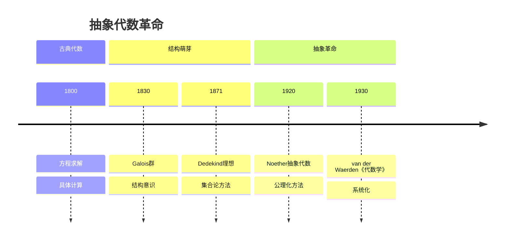
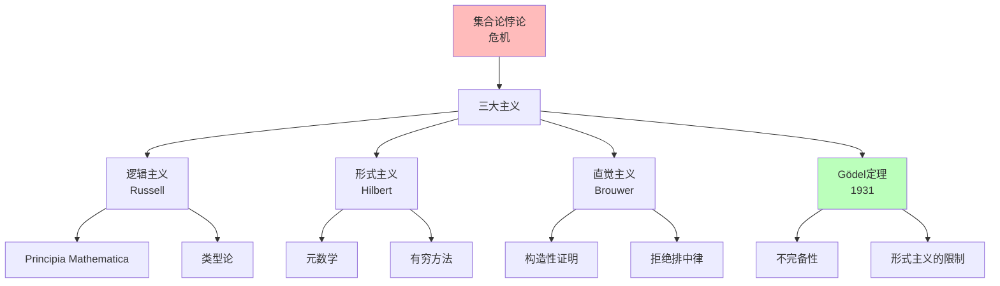
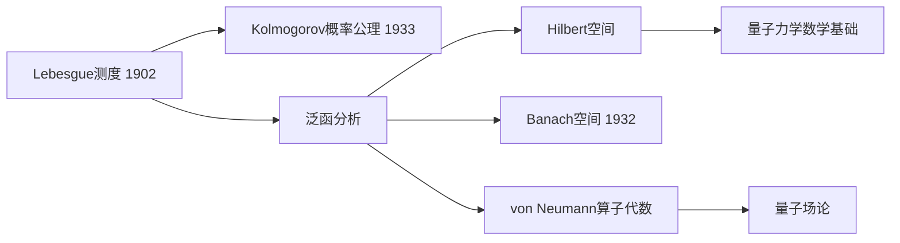
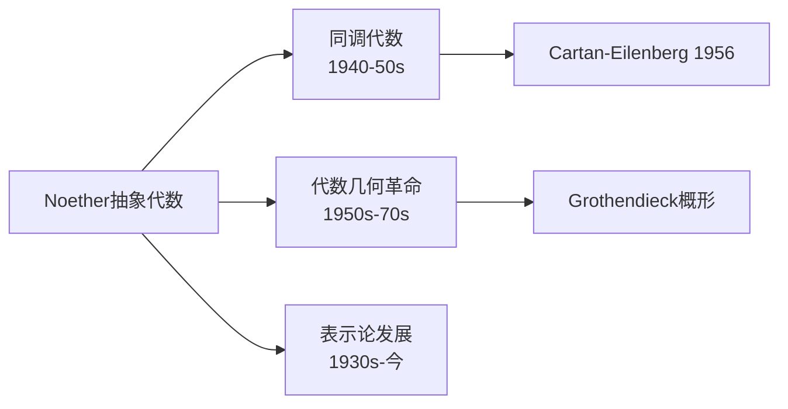

# 20世纪数学思想演进（上）

> **历史时期**：1900-1940年（现代数学奠基）

---

## 时代背景

20世纪初是数学史上最具革命性的时期之一。Hilbert在1900年巴黎国际数学家大会上提出23个问题，指明了未来数学的方向。与此同时，集合论悖论的发现引发了数学基础危机，促使逻辑主义、形式主义、直觉主义三大哲学流派的争论。这一时期见证了抽象代数的兴起、测度论与Lebesgue积分的建立、泛函分析的诞生，以及拓扑学的系统发展。

---

## 核心思想演进树

```mermaid
graph TD
    Root[20世纪数学思想上<br/>现代数学奠基 1900-1940] --> Foundation[数学基础危机]
    Root --> Algebra[抽象代数革命]
    Root --> Analysis[分析学深化]
    Root --> Topology[拓扑学发展]
    
    Foundation --> F1[Hilbert 23问题<br/>1900]
    Foundation --> F2[集合论悖论<br/>Russell 1902]
    Foundation --> F3[三大主义争论<br/>1910-1930]
    Foundation --> F4[哥德尔定理<br/>1931]
    
    F3 --> F3_1[逻辑主义<br/>Russell/Whitehead]
    F3 --> F3_2[形式主义<br/>Hilbert纲领]
    F3 --> F3_3[直觉主义<br/>Brouwer]
    
    F4 --> F4_1[不完备性<br/>第一定理]
    F4 --> F4_2[一致性<br/>第二定理]
    
    Algebra --> A1[Noether抽象代数<br/>1910s-1920s]
    Algebra --> A2[van der Waerden<br/>《代数学》1930]
    Algebra --> A3[Artin/Brauer等<br/>具体发展]
    
    A1 --> A1_1[理想论系统<br/>诺特环/模]
    A1 --> A1_2[抽象方法<br/>公理化结构]
    A1 --> A1_3[代数拓扑应用<br/>同调代数萌芽]
    
    Analysis --> An1[Lebesgue测度<br/>1902]
    Analysis --> An2[泛函分析<br/>Hilbert空间]
    Analysis --> An3[Banach空间<br/>1932]
    
    An1 --> An1_1[测度论公理<br/>Carathéodory]
    An1 --> An1_2[可测函数<br/>积分理论]
    An1 --> An1_3[概率论公理化<br/>Kolmogorov 1933]
    
    An2 --> An2_1[Hilbert空间<br/>积分方程]
    An2 --> An2_2[von Neumann<br/>算子代数]
    An2 --> An2_3[谱理论<br/>量子力学应用]
    
    Topology --> T1[Poincaré遗产<br/>1904年后]
    Topology --> T2[组合拓扑<br/>代数拓扑发展]
    Topology --> T3[点集拓扑<br/>公理化]
    
    T2 --> T2_1[同调论<br/>Eilenberg/Steenrod]
    T2 --> T2_2[同伦论<br/>基本群/高阶同伦]
    T2 --> T2_3[不动点定理<br/>Brouwer/Lefschetz]
    
    style Root fill:#f9f,stroke:#333,stroke-width:4px
    style Foundation fill:#fbb,stroke:#333
    style Algebra fill:#bbf,stroke:#333
    style A1 fill:#bfb,stroke:#333

```



---

## 关键人物及其贡献

### 1. Hilbert（希尔伯特，1862-1943）

| 维度 | 内容 |
|------|------|
| **核心事件** | 1900年巴黎国际数学家大会，提出23个问题 |
| **核心贡献** | Hilbert空间、不变量理论、积分方程、公理化方法、证明论 |
| **思想突破** | 公理化方法、形式主义数学哲学、23个问题指引20世纪数学方向 |
| **历史意义** | 20世纪最具影响力的数学家，哥廷根学派的领袖 |

**Hilbert的23个问题（1900）**

| 问题 | 主题 | 进展 |
|------|------|------|
| 第1问题 | 连续统假设 | 1938 Gödel证明一致性；1963 Cohen证明独立性 |
| 第2问题 | 算术公理的一致性 | Gödel第二不完备定理（1931）否定可证性 |
| 第6问题 | 物理学的公理化 | 部分进展（概率论、量子力学） |
| 第8问题 | 黎曼假设 | 未解决（当代最重要数学问题之一） |
| 第10问题 | Diophantine方程可判定性 | 1970 Matiyasevich证明不可判定 |

### 2. Russell（罗素，1872-1970）与 Whitehead（怀特海，1861-1947）

| 维度 | 内容 |
|------|------|
| **核心著作** | 《数学原理》（Principia Mathematica，1910-1913） |
| **核心贡献** | 逻辑主义数学基础、类型论、集合论悖论 |
| **思想突破** | 发现Russell悖论（1902），用类型论避免悖论 |
| **历史意义** | 逻辑主义的最高成就，现代类型论的先驱 |

**Russell悖论（1902）**：

```

考虑集合 R = {x | x ∉ x}

如果 R ∈ R，则 R ∉ R（由定义）
如果 R ∉ R，则 R ∈ R（由定义）
矛盾！

```

### 3. Brouwer（布劳威尔，1881-1966）

| 维度 | 内容 |
|------|------|
| **核心贡献** | 直觉主义数学哲学、代数拓扑（不动点定理）、维数理论 |
| **思想突破** | 数学是心智构造，拒绝排中律，强调可构造性 |
| **历史意义** | 数学基础争论的主要参与者，构造性数学的先驱 |

### 4. Noether（诺特，1882-1935）

| 维度 | 内容 |
|------|------|
| **核心贡献** | 抽象代数体系、诺特环/诺特模、理想论、交换代数 |
| **思想突破** | 用抽象结构取代具体计算，公理化代数方法 |
| **历史意义** | "现代代数之母"，20世纪最有影响力的女数学家 |

**Noether的革命性思想**：
- 从**具体方程**到**抽象结构**
- 从**计算技巧**到**结构理论**
- 从**个别例子**到**一般定理**

她的名言：
> "关系比对象更重要。"

### 5. van der Waerden（范德瓦尔登，1903-1996）

| 维度 | 内容 |
|------|------|
| **核心著作** | 《代数学》（Moderne Algebra，1930，两卷本） |
| **核心贡献** | 系统阐述Noether和Artin的抽象代数理论 |
| **思想突破** | 将抽象代数学的成果系统化为标准教材 |
| **历史意义** | 《代数学》成为20世纪最有影响力的数学教材之一 |

### 6. Lebesgue（勒贝格，1875-1941）

| 维度 | 内容 |
|------|------|
| **核心著作** | 《积分、长度与面积》（1902）、《关于三角级数的讲义》（1906） |
| **核心贡献** | Lebesgue测度与积分理论、实变函数论 |
| **思想突破** | 用测度理论重构积分概念，处理更广泛的函数类 |
| **历史意义** | 现代分析学的奠基人，测度论的创立者 |

**Lebesgue积分的优势**：
- 可积函数类大大扩展
- 积分与极限可交换的条件更弱
- 为泛函分析和概率论奠定基础

### 7. Kolmogorov（柯尔莫哥洛夫，1903-1987）

| 维度 | 内容 |
|------|------|
| **核心著作** | 《概率论基础》（1933） |
| **核心贡献** | 概率论的公理化、测度论基础、随机过程 |
| **思想突破** | 用测度论严格建立概率论，概率 = 测度 |
| **历史意义** | 现代概率论的奠基人，影响深远的数学家 |

### 8. Gödel（哥德尔，1906-1978）

| 维度 | 内容 |
|------|------|
| **核心贡献** | 不完备性定理（1931）、连续统假设的一致性证明（1938） |
| **思想突破** | 在任何足够强的形式系统中，存在不可判定命题 |
| **历史意义** | 20世纪最重要的逻辑学家，彻底改变了数学基础研究 |

**Gödel不完备性定理（1931）**：

**第一不完备性定理**：
> 任何包含算术的一致形式系统，都存在在该系统内不可判定的命题。

**第二不完备性定理**：
> 任何包含算术的一致形式系统，都不能证明自身的一致性。

### 9. Banach（巴拿赫，1892-1945）

| 维度 | 内容 |
|------|------|
| **核心著作** | 《线性算子理论》（Théorie des opérations linéaires，1932） |
| **核心贡献** | Banach空间理论、泛函分析的奠基 |
| **思想突破** | 无限维向量空间的系统研究，算子理论 |
| **历史意义** | 泛函分析的主要创立者之一 |

---

## 思想转折点分析

### 转折一：从具体到抽象（抽象代数革命）



**抽象化的核心变化**：

| 方面 | 古典代数 | 抽象代数 |
|------|----------|----------|
| **研究对象** | 具体方程、多项式 | 群、环、域、模 |
| **方法** | 计算、公式推导 | 结构分析、同态映射 |
| **目标** | 求解具体问题 | 理解结构关系 |
| **结果形式** | 公式、算法 | 定理、结构分类 |

### 转折二：数学基础危机与回应



### 转折三：分析的公理化（测度论与泛函分析）



---

## 各分支发展状况

### 数学基础

| 方面 | 进展 | 关键人物 |
|------|------|----------|
| 集合论公理化 | Zermelo-Fraenkel公理系统 | Zermelo、Fraenkel |
| 类型论 | 分支类型论、简单类型论 | Russell、Church |
| 证明论 | 元数学、有穷方法 | Hilbert、Gentzen |
| 模型论 | 一阶逻辑完备性 | Gödel |

### 抽象代数

| 方面 | 进展 | 关键人物 |
|------|------|----------|
| 环论/模论 | 诺特环、Artin环的系统理论 | Noether、Artin |
| 域论 | 类域论早期发展 | Takagi、Artin |
| 表示论 | 有限群表示 | Frobenius、Burnside、Schur |
| 同调代数 | 初步萌芽 | Noether、Hopf |

### 分析学

| 方面 | 进展 | 关键人物 |
|------|------|----------|
| 测度论 | 公理化、一般测度空间 | Carathéodory、Lebesgue |
| 泛函分析 | Hilbert空间、Banach空间 | Hilbert、Riesz、Banach |
| 概率论 | 测度论基础 | Kolmogorov |
| 调和分析 | Fourier分析严格化 | Lebesgue、F. Riesz |

### 拓扑学

| 方面 | 进展 | 关键人物 |
|------|------|----------|
| 点集拓扑 | 公理化、紧致性、连通性 | Hausdorff、Alexandroff |
| 代数拓扑 | 同调论、同伦论发展 | Brouwer、Alexander、Hopf |
| 纤维丛 | 初步概念 | Whitney（后期） |

---

## 对后世影响

### 1. 现代代数的框架确立



### 2. 分析学的现代形式

- **泛函分析**：成为偏微分方程、量子力学、优化理论的基础
- **概率论**：测度论基础使其成为严格的数学分支
- **调和分析**：与表示论、数论的深刻联系

### 3. 数学基础研究的深化

Gödel定理的影响：
- **可计算性理论**：Church、Turing
- **模型论**：Tarski等
- **证明论**：Gentzen等

---

## 现代意义

### 1. 抽象化的方法论价值

20世纪初的抽象化运动确立了现代数学的方法论：
- 从具体例子中提取一般结构
- 用公理系统定义研究对象
- 关注结构之间的关系（同态、函子）

### 2. 严格性与应用性的平衡

这一时期展示了严格性与应用性的统一：
- Lebesgue积分严格但有用
- Hilbert空间抽象但应用于量子力学
- 概率论公理化后应用更广

### 3. 基础问题的深远影响

数学基础危机虽然"解决"了（通过ZFC集合论），但其影响持续至今：
- 构造性数学的发展
- 类型论与计算机科学的联系
- 形式化数学证明（Lean、Coq）

---

## 总结

20世纪上半叶数学思想演进的核心主题：

1. **数学基础危机**：集合论悖论引发三大哲学流派的争论，Gödel不完备性定理揭示了形式系统的内在限制。

2. **抽象代数革命**：Noether建立抽象代数体系，van der Waerden系统阐述，代数从计算转向结构研究。

3. **分析的公理化**：Lebesgue建立测度论与积分理论，泛函分析诞生（Hilbert空间、Banach空间），概率论获得严格的测度论基础（Kolmogorov）。

4. **拓扑学的发展**：从Poincaré的组合拓扑发展到系统的代数拓扑和点集拓扑。

5. **公理化方法的胜利**：Hilbert的公理化方法在各分支取得成功，成为现代数学的标准范式。

这一时期确立的抽象化、公理化、结构化的方法论，成为20世纪下半叶现代数学发展的基础。

---

*文档编号：06*  
*创建日期：2026年4月*  
*所属项目：FormalMath 第十批推进计划*  
*涵盖时期：1900-1940年*  
*关键人物：Hilbert、Russell、Whitehead、Brouwer、Noether、van der Waerden、Lebesgue、Kolmogorov、Gödel、Banach*
