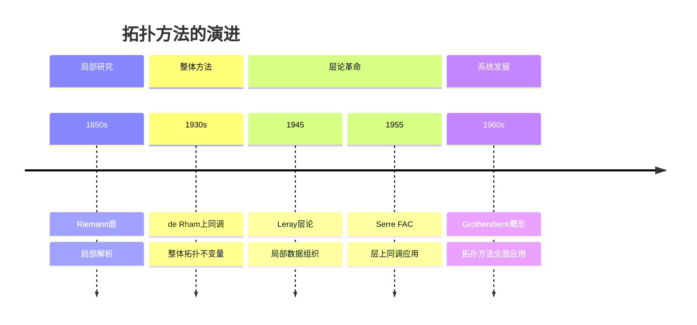
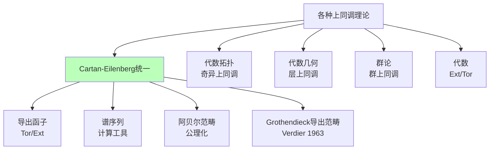
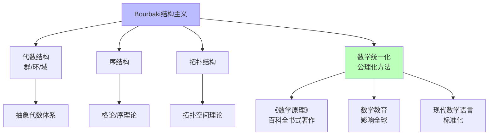
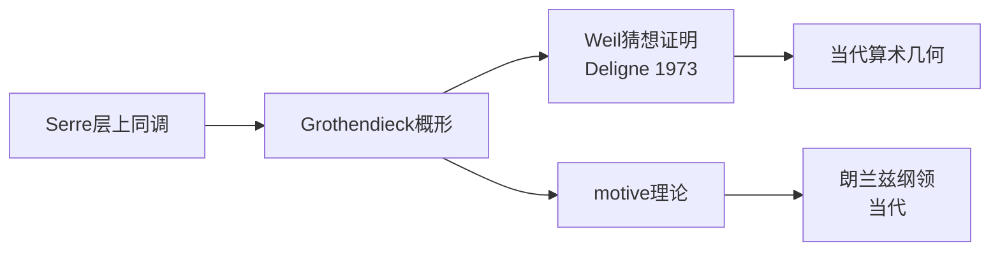

# 20世纪数学思想演进（中）

> **历史时期**：1940-1970年（结构数学发展）

---

## 时代背景

二战后至1970年代是数学的黄金发展期。这一时期见证了同调代数的系统化、代数拓扑的飞跃发展、泛函分析的成熟、以及数学基础的进一步探索。Bourbaki学派的结构主义影响了整个数学界，同时数学与物理学（量子场论、规范场论）的联系日益紧密。

---

## 核心思想演进树

```mermaid
graph TD
    Root[20世纪数学思想中<br/>结构数学发展 1940-1970] --> HomAlg[同调代数系统化]
    Root --> AlgTop[代数拓扑飞跃]
    Root --> FuncAnal[泛函分析成熟]
    Root --> Bourbaki[Bourbaki结构主义]
    Root --> Physics[数学物理融合]
    
    HomAlg --> HA1[Cartan-Eilenberg<br/>1956 奠基之作]
    HomAlg --> HA2[导出函子<br/>Tor/Ext]
    HomAlg --> HA3[谱序列<br/>Leray 1946]
    HomAlg --> HA4[层上同调<br/>Grothendieck]
    
    HA1 --> HA1_1[阿贝尔范畴<br/>正合序列]
    HA1 --> HA1_2[同调代数<br/>统一框架]
    
    AlgTop --> AT1[Eilenberg-Steenrod<br/>公理 1945]
    AlgTop --> AT2[同伦论<br/>Serre/Grothendieck]
    AlgTop --> AT3[K理论<br/>Atiyah-Hirzebruch]
    AlgTop --> AT4[配边理论<br/>Thom/René Thom]
    
    AT2 --> AT2_1[Serre纤维化<br/>谱序列应用]
    AT2 --> AT2_2[Grothendieck导出范畴<br/>Verdier]
    AT2 --> AT2_3[稳定同伦论<br/>Adams谱序列]
    
    FuncAnal --> FA1[von Neumann代数<br/>深化]
    FuncAnal --> FA2[C*-代数<br/>Gelfand-Naimark]
    FuncAnal --> FA3[广义函数<br/>Schwartz]
    FuncAnal --> FA4[指标定理<br/>Atiyah-Singer 1963]
    
    FA2 --> FA2_1[Gelfand表示<br/>交换C*-代数]
    FA4 --> FA4_1[分析-拓扑统一<br/>椭圆算子]
    
    Bourbaki --> B1[《数学原理》<br/>1939-]
    Bourbaki --> B2[结构主义纲领<br/>三大母结构]
    Bourbaki --> B3[数学教育<br/>影响深远]
    
    B2 --> B2_1[代数结构<br/>群/环/域]
    B2 --> B2_2[序结构]<br/>
    B2 --> B2_3[拓扑结构]<br/>
    
    Physics --> P1[量子场论<br/>数学化]
    Physics --> P2[规范场论<br/>拓扑方法]
    Physics --> P3[表示论<br/>物理应用]
    
    style Root fill:#f9f,stroke:#333,stroke-width:4px
    style HomAlg fill:#bbf,stroke:#333
    style AT4 fill:#bfb,stroke:#333
    style FA4 fill:#fbb,stroke:#333

```

---

## 关键人物及其贡献

### 1. Cartan（嘉当，1904-2008）与 Eilenberg（艾伦伯格，1913-1998）

| 维度 | 内容 |
|------|------|
| **核心著作** | 《同调代数》（Homological Algebra，1956） |
| **核心贡献** | 系统建立同调代数框架，导出函子理论 |
| **思想突破** | 用范畴论语言统一各种上同调理论 |
| **历史意义** | 同调代数的奠基之作，影响代数几何、代数拓扑、表示论 |

**同调代数的影响领域**：
- 代数几何（层上同调）
- 代数拓扑（奇异同调、上同调）
- 群上同调
- 环论与模论

### 2. Leray（勒雷，1906-1998）

| 维度 | 内容 |
|------|------|
| **核心贡献** | 层论（faisceau）创立（1945）、谱序列发明（1946） |
| **思想突破** | 用层组织局部数据，谱序列计算复杂同调 |
| **历史意义** | 为代数几何和拓扑学提供了强大工具 |

**层论的意义**：
- 统一处理局部与整体
- 代数几何革命的基础（Grothendieck）
- 现代微分几何的核心工具

### 3. Serre（塞尔，1926-）

| 维度 | 内容 |
|------|------|
| **核心贡献** | FAC（1955）、GAGA（1956）、同伦论、代数几何 |
| **思想突破** | 用层上同调研究代数几何，将拓扑方法引入代数几何 |
| **历史意义** | 20世纪最重要的代数学家之一，Fields奖（1954） |

**Serre的关键论文**：
- **FAC**（Faisceaux Algébriques Cohérents，1955）：层上同调在代数几何的系统应用
- **GAGA**（Géométrie Algébrique et Géométrie Analytique，1956）：代数几何与解析几何的等价

### 4. Grothendieck（格罗滕迪克，1928-2014）

| 维度 | 内容 |
|------|------|
| **核心贡献** | 概形理论、拓扑斯（Topos）、六函子形式主义、motive理论 |
| **思想突破** | 用概形统一代数几何与数论，几何化地处理算术问题 |
| **历史意义** | 20世纪最具影响力的数学家之一，代数几何革命的核心人物 |

**Grothendieck革命的时间线**：

| 年份 | 贡献 |
|------|------|
| 1955-1958 | 层上同调、Abel范畴 |
| 1958-1960 | 概形概念诞生 |
| 1960-1966 | IHES时期，EGA/SGA写作 |
| 1966-1970 | motive理论、六函子、拓扑斯 |

### 5. Atiyah（阿蒂亚，1929-2019）与 Singer（辛格，1924-2021）

| 维度 | 内容 |
|------|------|
| **核心贡献** | Atiyah-Singer指标定理（1963） |
| **思想突破** | 建立椭圆微分算子的解析指标与拓扑指标的联系 |
| **历史意义** | 20世纪最重要的数学定理之一，连接分析、拓扑、几何 |

**指标定理的简洁表述**：

```

解析指标 = 拓扑指标
（dim ker D - dim coker D）= （拓扑不变量）

```

### 6. Hirzebruch（希策布鲁赫，1927-2012）

| 维度 | 内容 |
|------|------|
| **核心贡献** | Riemann-Roch定理的高维推广、示性类理论、K理论 |
| **思想突破** | 用示性类表达拓扑不变量，建立代数几何与拓扑的桥梁 |
| **历史意义** | 德国数学复兴的核心人物，影响了Grothendieck和Atiyah |

### 7. Thom（托姆，1923-2002）

| 维度 | 内容 |
|------|------|
| **核心贡献** | 配边理论（Cobordism）、Thom同构、突变理论 |
| **思想突破** | 用配边分类流形，Thom空间与示性类的联系 |
| **历史意义** | Fields奖（1958），对代数拓扑和微分拓扑的深远影响 |

### 8. Eilenberg（艾伦伯格，1913-1998）与 Mac Lane（麦克莱恩，1909-2005）

| 维度 | 内容 |
|------|------|
| **核心贡献** | 范畴论创立（1945） |
| **思想突破** | 用"对象-态射"框架统一数学结构 |
| **历史意义** | 现代数学的基础语言，影响代数几何、逻辑学、计算机科学 |

**范畴论的基本概念**：
- **对象**：群、空间、集合等
- **态射**：保持结构的映射（同态、连续映射等）
- **函子**：范畴之间的映射
- **自然变换**：函子之间的映射

### 9. Schwartz（施瓦茨，1915-2002）

| 维度 | 内容 |
|------|------|
| **核心贡献** | 广义函数（分布）理论（1945） |
| **思想突破** | 严格化处理Dirac δ函数等奇异对象 |
| **历史意义** | 为偏微分方程和物理学提供了严格的数学基础，Fields奖（1950） |

---

## 思想转折点分析

### 转折一：从个体到整体（拓扑方法的胜利）



**整体方法的意义**：
- 从研究**局部性质**到研究**整体不变量**
- 拓扑不变量（同调、同伦）成为核心工具
- 代数几何从"研究代数方程"到"研究几何空间"

### 转折二：同调代数的系统化



### 转折三：结构主义的胜利（Bourbaki纲领）



---

## 各分支发展状况

### 同调代数

| 方面 | 进展 | 关键人物 |
|------|------|----------|
| 系统建立 | 《同调代数》（1956） | Cartan、Eilenberg |
| 导出范畴 | 三角范畴、t-结构 | Verdier、Grothendieck |
| 层上同调 | 代数几何应用 | Grothendieck、Serre |
| 谱序列 | 计算工具完善 | Leray、Serre |

### 代数拓扑

| 方面 | 进展 | 关键人物 |
|------|------|----------|
| 公理化 | Eilenberg-Steenrod公理（1945） | Eilenberg、Steenrod |
| 同伦论 | 高阶同伦群计算 | Serre、Kan |
| K理论 | 向量丛分类 | Atiyah、Hirzebruch |
| 配边理论 | 流形分类 | Thom、Milnor |

### 泛函分析

| 方面 | 进展 | 关键人物 |
|------|------|----------|
| 指标定理 | Atiyah-Singer（1963） | Atiyah、Singer |
| 算子代数 | von Neumann代数分类 | Murray、von Neumann、Connes后 |
| C*-代数 | Gelfand-Naimark理论 | Gelfand、Naimark |
| 广义函数 | 分布理论 | Schwartz |

### 数学物理

| 方面 | 进展 | 关键人物 |
|------|------|----------|
| 指标定理应用 | 瞬子、规范场 | Atiyah、Ward |
| 表示论 | 物理对称性 | Wigner、Mackey |
| 统计力学 | 相变数学 | Onsager、Yang-Lee |

---

## 对后世影响

### 1. 代数几何革命



### 2. K理论与指标定理

Atiyah-Hirzebruch K理论和Atiyah-Singer指标定理的影响：
- 代数拓扑的新工具
- 指标理论与数学物理（规范场论、弦理论）
- 非交换几何（Connes）

### 3. 结构主义的遗产

Bourbaki结构主义的影响：
- 数学教育的现代化
- 公理化方法的普及
- 数学语言的统一化
- （批判）过于抽象化的倾向

---

## 现代意义

### 1. 工具与结构的平衡

这一时期展示了数学工具与抽象结构的平衡：
- **层论**：既是抽象结构，也是实用工具
- **谱序列**：复杂的计算工具
- **指标定理**：深刻的理论结果

### 2. 跨学科融合的先例

数学与物理学的深度融合：
- 指标定理与规范场论
- 层上同调与物理学
- 这一趋势延续到弦理论、镜面对称等

### 3. 抽象化的反思

Bourbaki结构主义引发的反思：
- 抽象化是否过度？
- 具体例子与直观的重要性
- 20世纪70年代后的部分"回归具体"

---

## 总结

20世纪中叶（1940-1970）数学思想演进的核心主题：

1. **同调代数的系统化**：Cartan-Eilenberg建立统一框架，层上同调成为代数几何和拓扑学的核心工具。

2. **代数拓扑的飞跃**：Eilenberg-Steenrod公理化、Serre的同伦论工作、Thom的配边理论、K理论的创立。

3. **泛函分析的成熟**：Atiyah-Singer指标定理连接分析与拓扑，广义函数理论严格化，算子代数深化。

4. **Bourbaki结构主义**：用三大母结构统一数学，影响数学教育和语言。

5. **数学物理的融合**：指标定理与规范场论，表示论与物理学对称性。

这一时期确立的抽象化、公理化、结构化的方法论达到高峰，但也引发了对过度抽象化的反思，为20世纪后期和当代数学的发展提供了基础。

---

*文档编号：07*  
*创建日期：2026年4月*  
*所属项目：FormalMath 第十批推进计划*  
*涵盖时期：1940-1970年*  
*关键人物：Cartan、Eilenberg、Leray、Serre、Grothendieck、Atiyah、Singer、Hirzebruch、Thom、Mac Lane、Schwartz*
