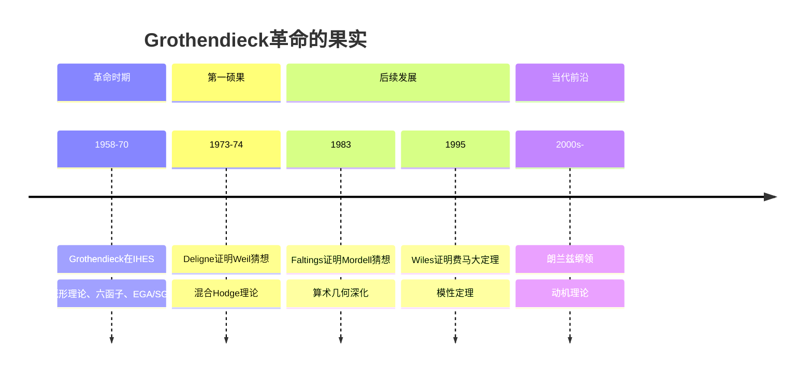
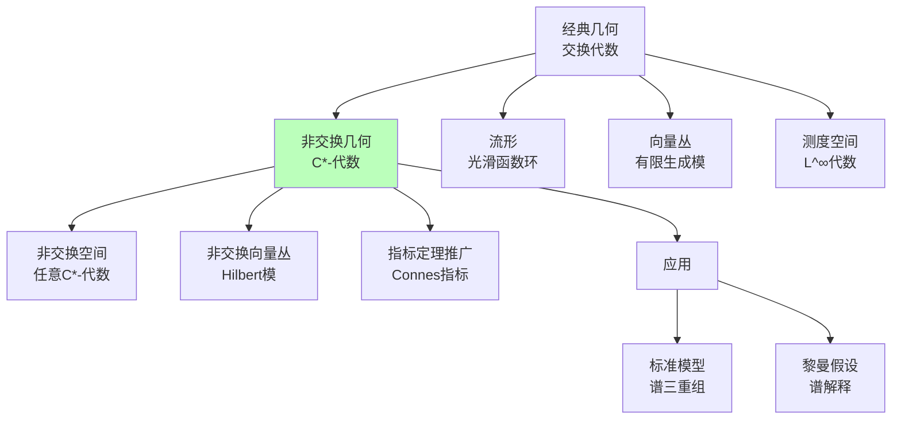
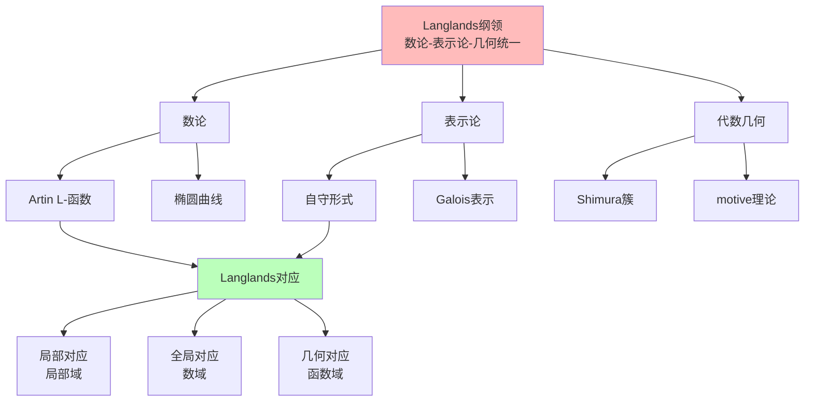
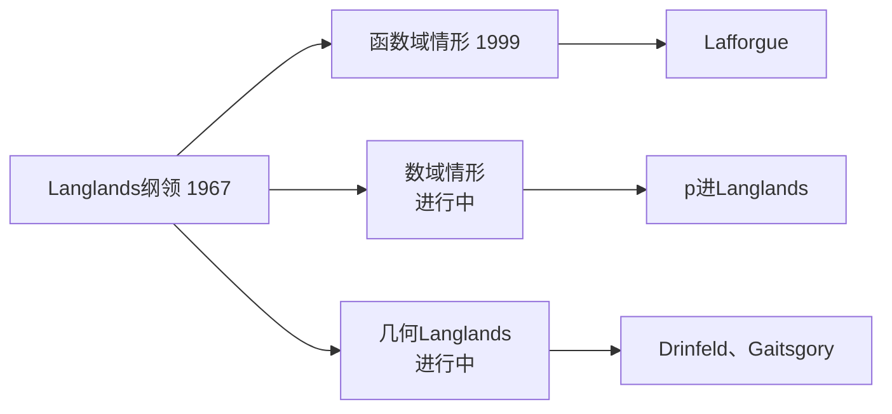

# 20世纪数学思想演进（下）

> **历史时期**：1970-2000年（统一化运动）

---

## 时代背景

1970年代至世纪末是数学统一化运动的高峰期。Grothendieck革命在此时期结出硕果，Weil猜想的证明（Deligne）和费马大定理的证明（Wiles）是这一时期的标志性成就。范畴论进一步深化，无穷范畴论和高阶范畴论兴起。同时，数学与物理学（弦理论、量子场论）的联系达到前所未有的深度，计算机对数学的影响日益显著。

---

## 核心思想演进树

```mermaid
graph TD
    Root[20世纪数学思想下<br/>统一化运动 1970-2000] --> AG[代数几何革命成果]
    Root --> Cat[范畴论深化]
    Root --> Unification[统一化纲领]
    Root --> MathPhys[数学物理高潮]
    Root --> Comp[计算机影响]
    
    AG --> AG1[Weil猜想证明<br/>Deligne 1973]
    AG --> AG2[费马大定理<br/>Wiles 1995]
    AG --> AG3[ motive理论<br/>Grothendieck纲领]
    AG --> AG4[导出代数几何<br/>当代]
    
    AG1 --> AG1_1[Riemann假设类比<br/>有限域上]
    AG1 --> AG1_2[混合Hodge理论<br/>权滤过]
    
    AG2 --> AG2_1[椭圆曲线<br/>模性猜想]
    AG2 --> AG2_2[Taylor-Wiles<br/>形变理论]
    
    Cat --> C1[2-范畴<br/>高阶范畴]
    Cat --> C2[无穷范畴<br/>拟范畴]
    Cat --> C3[Topos理论<br/>Lawvere]
    
    C2 --> C2_1[Joyal<br/>拟范畴]
    C2 --> C2_2[Lurie<br/>高阶Topos理论]
    
    Unification --> U1[Langlands纲领<br/>1967-]
    Unification --> U2[几何Langlands<br/>Drinfeld/Lafforgue]
    Unification --> U3[非交换几何<br/>Connes]
    
    U1 --> U1_1[数论-表示论-几何<br/>统一]
    U1 --> U1_2[函数域情形<br/>Lafforgue 1999]
    
    U3 --> U3_1[空间代数化<br/>C*-代数]
    U3 --> U3_2[指标定理推广<br/>非交换]
    
    MathPhys --> MP1[弦理论数学<br/>1980s-90s]
    MathPhys --> MP2[镜面对称<br/>1990s]
    MathPhys --> MP3[量子群<br/>Drinfeld/Jimbo]
    
    MP1 --> MP1_1[Calabi-Yau流形<br/>超弦]
    MP1 --> MP1_2[共形场论<br/>顶点算子代数]
    
    MP2 --> MP2_1[SYZ猜想<br/>1996]
    MP2 --> MP2_2[Gromov-Witten<br/>不变量]
    
    Comp --> CP1[四色定理<br/>Appel-Haken 1976]
    Comp --> CP2[有限单群分类<br/>1981]
    Comp --> CP3[形式化证明<br/>四色定理验证]
    
    style Root fill:#f9f,stroke:#333,stroke-width:4px
    style AG fill:#bbf,stroke:#333
    style AG2 fill:#bfb,stroke:#333
    style U1 fill:#fbb,stroke:#333
```



---

## 关键人物及其贡献

### 1. Deligne（德利涅，1944-）

| 维度 | 内容 |
|------|------|
| **核心贡献** | 证明Weil猜想（1973-1974）、混合Hodge理论、Tannakian范畴 |
| **思想突破** | 完成Grothendieck纲领，用深层的几何工具解决数论问题 |
| **历史意义** | Fields奖（1978），20世纪最重要的代数几何学家之一 |

**Weil猜想（1949）与证明**：

| 猜想 | 内容 | 证明 |
|------|------|------|
| 有理性 | Zeta函数是有理函数 | Dwork（1960） |
| 函数方程 | 特定对称性 | Grothendieck（1960s） |
| Riemann假设类比 | 零点在临界线上 | Deligne（1973） |
| Betti数 | 与拓扑Betti数一致 | Grothendieck（1960s） |

### 2. Wiles（怀尔斯，1953-）

| 维度 | 内容 |
|------|------|
| **核心贡献** | 证明费马大定理（1995）、椭圆曲线的模性定理 |
| **思想突破** | 将椭圆曲线的模性与形变理论联系，攻克谷山-志村猜想的关键情形 |
| **历史意义** | 解决了350年的数学难题，推动算术几何的发展 |

**证明路线**：
```
谷山-志村猜想 → 费马方程导出椭圆曲线
↓
Ribet（1986）：Frey曲线不可能模性
↓
Wiles（1995）：半稳定椭圆曲线模性
↓
费马大定理成立
```

### 3. Langlands（朗兰兹，1936-）

| 维度 | 内容 |
|------|------|
| **核心贡献** | Langlands纲领（1967年起）、自守形式理论、表示论 |
| **思想突破** | 提出数论、表示论、代数几何的深刻统一 |
| **历史意义** | 当代数学最重要的研究纲领之一，影响深远 |

**Langlands纲领的核心**：
```
Galois表示 ↔ 自守表示
          ↕
    L-函数相等
```

### 4. Connes（孔涅，1947-）

| 维度 | 内容 |
|------|------|
| **核心贡献** | 非交换几何（1980s）、指标定理、与物理学的联系 |
| **思想突破** | 用C*-代数"几何化"非交换空间，推广经典几何 |
| **历史意义** | Fields奖（1982），非交换几何的创立者 |

**非交换几何的应用**：
- 指标定理的一般化
- 标准模型的数学结构
- 黎曼假设的新方法
- 量子时空

### 5. Drinfeld（德林费尔德，1954-）

| 维度 | 内容 |
|------|------|
| **核心贡献** | 量子群（与Jimbo独立发现）、函数域Langlands、几何Langlands |
| **思想突破** | 用代数几何方法处理表示论问题 |
| **历史意义** | Fields奖（1990），对数学物理和表示论的深远影响 |

### 6. Lafforgue（拉福格，1966-）

| 维度 | 内容 |
|------|------|
| **核心贡献** | 证明函数域的Langlands对应（1999） |
| **思想突破** | 用层论和上同调方法解决函数域Langlands |
| **历史意义** | Fields奖（2002），Langlands纲领的重大进展 |

### 7. Witten（威滕，1951-）

| 维度 | 内容 |
|------|------|
| **核心贡献** | 弦理论数学、拓扑量子场论、Jones多项式的新证明、镜面对称 |
| **思想突破** | 用物理直觉发现深刻的数学结果 |
| **历史意义** | Fields奖（1990），唯一获得该奖的物理学家，对数学影响巨大 |

**Witten的数学贡献**：
- **Jones多项式**：用Chern-Simons理论给出新解释
- **拓扑量子场论**：数学公理化（Atiyah-Segal）
- **镜面对称**：提出物理直觉，引发数学研究热潮
- **Seiberg-Witten理论**：四维拓扑的新工具

### 8. Lurie（卢里，1978-）

| 维度 | 内容 |
|------|------|
| **核心贡献** | 高阶范畴论、无穷范畴论、《高等Topos理论》 |
| **思想突破** | 系统建立（∞,1）-范畴理论，推广经典范畴论和Topos理论 |
| **历史意义** | 当代最具影响力的年轻数学家之一 |

### 9. Yau（丘成桐，1949-）

| 维度 | 内容 |
|------|------|
| **核心贡献** | Calabi猜想证明（1976）、Yau-Tian-Donaldson理论、镜面对称 |
| **思想突破** | 复微分几何与代数几何的深刻联系 |
| **历史意义** | Fields奖（1982），微分几何大师，推动数学与物理学的联系 |

---

## 思想转折点分析

### 转折一：代数几何革命的成果



### 转折二：从交换到非交换（非交换几何）



### 转折三：统一化纲领（Langlands纲领）



---

## 各分支发展状况

### 代数几何

| 方面 | 进展 | 关键人物 |
|------|------|----------|
| Weil猜想 | 完全证明（1973-74） | Deligne |
| 费马大定理 | Wiles证明（1995） | Wiles、Taylor |
| 动机理论 | Grothendieck纲领 | Grothendieck |
| 导出代数几何 | Toën-Vezzosi等 | Toën、Lurie |

### 表示论与数论

| 方面 | 进展 | 关键人物 |
|------|------|----------|
| Langlands纲领 | 函数域情形证明（1999） | Lafforgue |
| 几何Langlands | Drinfeld、Gaitsgory等 | Drinfeld |
| 量子群 | 表示论应用 | Drinfeld、Jimbo、Lusztig |

### 数学物理

| 方面 | 进展 | 关键人物 |
|------|------|----------|
| 弦理论数学 | Calabi-Yau、镜面对称 | Candelas、Yau、Kontsevich |
| 拓扑量子场论 | 公理化、不变量 | Witten、Atiyah、Segal |
| 量子群 | 纽结不变量、统计力学 | Drinfeld、Jones、Witten |

### 范畴论与高阶结构

| 方面 | 进展 | 关键人物 |
|------|------|----------|
| 无穷范畴 | 拟范畴理论 | Joyal、Lurie |
| 高阶Topos | 系统理论 | Lurie |
| 导出范畴 | 三角范畴、t-结构 | Verdier、Beilinson |

---

## 对后世影响

### 1. 朗兰兹纲领的延续



### 2. 数学与物理学的深度融合

这一时期见证了数学与物理学前所未有的融合：
- **弦理论**：需要深刻的代数几何（Calabi-Yau）
- **镜面对称**：物理直觉驱动数学发现
- **量子群**：数学与统计力学的联系
- **规范场论**：拓扑方法的应用

### 3. 计算机与数学

| 事件 | 年份 | 意义 |
|------|------|------|
| 四色定理证明 | 1976 | 第一个依赖计算机的重大证明 |
| 有限单群分类完成 | 1981 | 人类最长的数学证明（约15000页） |
| 形式化验证 | 2000s | 计算机辅助严格证明（四色定理等） |

---

## 现代意义

### 1. 统一化追求的价值

这一时期展示了数学统一化的威力：
- Langlands纲领展示了不同领域的深刻联系
- 代数几何成为连接数论、表示论、物理学的桥梁
- 统一化带来新问题和新技术

### 2. 数学与物理学的对话

Witten的贡献表明：
- 物理直觉可以发现数学真理
- 数学严格化物理猜想
- 这种对话模式延续至今

### 3. 高阶结构与基础

无穷范畴论的发展：
- 为同伦论、代数几何提供新语言
- Lurie的工作系统化这一领域
- 可能影响未来的数学基础

### 4. 计算机的角色

计算机在数学中的角色变化：
- 从计算工具到证明助手
- 形式化数学的兴起（Lean、Coq）
- 四色定理证明引发的可接受性争论

---

## 总结

20世纪后期（1970-2000）数学思想演进的核心主题：

1. **代数几何革命的成果**：Deligne证明Weil猜想，Wiles证明费马大定理，展示了Grothendieck方法的威力。

2. **统一化纲领**：Langlands纲领成为连接数论、表示论、代数几何的核心框架，函数域情形得到证明。

3. **非交换几何**：Connes创立非交换几何，将空间概念推广到非交换代数，应用于物理学和数论。

4. **数学与物理学的融合**：弦理论、镜面对称、量子群等展示了数学与物理学的深刻联系。

5. **高阶范畴论**：无穷范畴论和Lurie的系统工作为数学提供了新的基础语言。

这一时期是数学统一化运动的高峰期，也是数学与物理学对话的黄金时代。这些发展为21世纪的数学研究奠定了基础。

---

*文档编号：08*  
*创建日期：2026年4月*  
*所属项目：FormalMath 第十批推进计划*  
*涵盖时期：1970-2000年*  
*关键人物：Deligne、Wiles、Langlands、Connes、Drinfeld、Lafforgue、Witten、Lurie、Yau*
