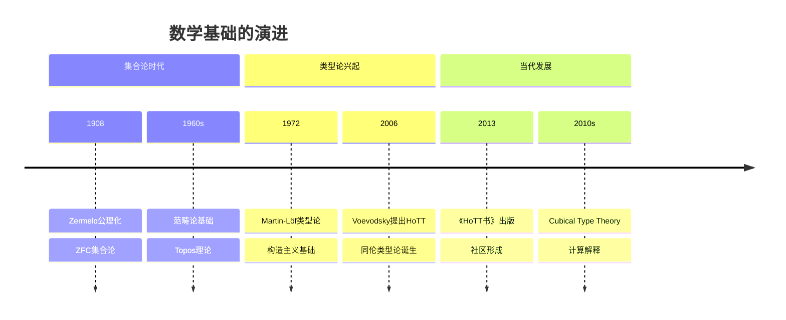
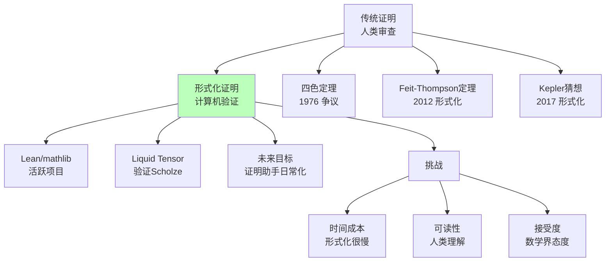
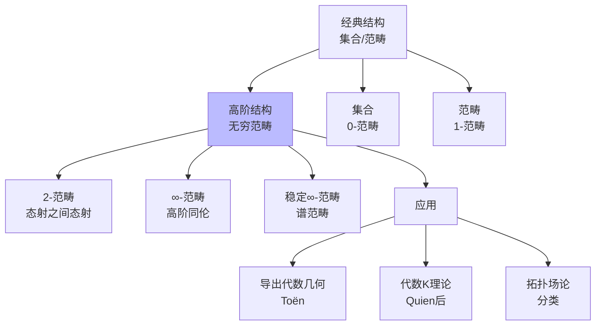
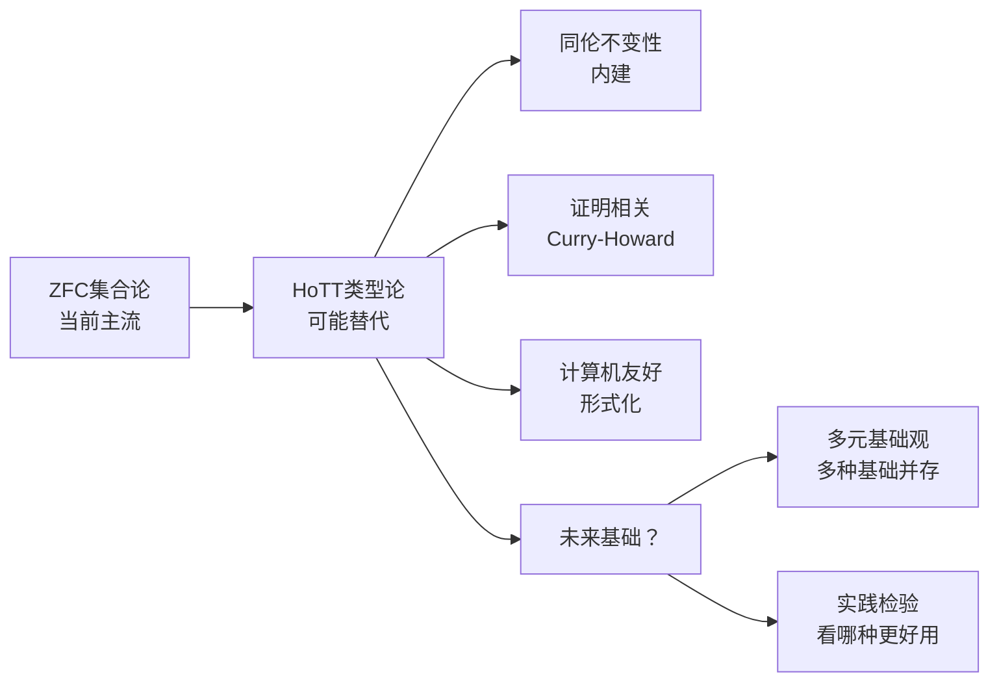

# 当代数学思想演进

> **历史时期**：21世纪（前沿拓展）

---

## 时代背景

21世纪的数学进入了一个新的发展阶段。朗兰兹纲领继续推进，同伦类型论（HoTT）作为新的数学基础框架兴起，计算机形式化证明技术日益成熟。算术几何、非交换几何、高阶范畴论等方向持续发展。同时，人工智能、机器学习等新技术开始对数学研究产生影响，催生了新的研究方向和方法论。

---

## 核心思想演进树

```mermaid
graph TD
    Root[当代数学思想<br/>21世纪前沿拓展] --> Langlands[朗兰兹纲领深化]
    Root --> HoTT[同伦类型论]
    Root --> Formalization[形式化数学]
    Root --> Arithmetic[算术几何发展]
    Root --> HigherStructure[高阶结构]
    Root --> AI[人工智能与数学]
    
    Langlands --> L1[p进Langlands<br/>Scholze]
    Langlands --> L2[几何Langlands<br/>进展]
    Langlands --> L3[完美oid空间<br/>2011]
    
    L1 --> L1_1[ diamonds<br/>凝聚性拓扑]
    L1 --> L1_2[p进Hodge理论<br/>推广]
    
    HoTT --> H1[Voevodsky<br/>2006-2017]
    HoTT --> H2[泛等公理<br/>Univalence]
    HoTT --> H3[计算机验证<br/>证明助手]
    
    H2 --> H2_1[等价即相等<br/>同伦不变性]
    H2 --> H2_2[同伦层次<br/>n-类型]
    
    Formalization --> F1[Lean<br/>de Moura]
    Formalization --> F2[Coq<br/>形式化证明]
    Formalization --> F3[四色定理<br/>完全形式化]
    Formalization --> F4[Kepler猜想<br/>Hales 2017]
    
    Arithmetic --> A1[Scholze<br/>完美oid]
    Arithmetic --> A2[Faltings-Wiles<br/>方法发展]
    Arithmetic --> A3[椭圆曲线<br/>BSD猜想]
    
    HigherStructure --> HS1[无穷范畴<br/>Lurie]
    HigherStructure --> HS2[导出代数几何<br/>Toën-Vezzosi]
    HigherStructure --> HS3[高阶代数结构<br/>operad]
    
    AI --> AI1[机器学习<br/>辅助发现]
    AI --> AI2[自动定理证明<br/>神经网络]
    AI --> AI3[数学与AI<br/>互动]
    
    AI1 --> AI1_1[Knot理论<br/>DeepMind]
    AI1 --> AI1_2[表示论<br/>新发现]
    
    style Root fill:#f9f,stroke:#333,stroke-width:4px
    style HoTT fill:#bbf,stroke:#333
    style Formalization fill:#bfb,stroke:#333
    style L1 fill:#fbb,stroke:#333

```



---

## 关键人物及其贡献

### 1. Scholze（舒尔策，1987-）

| 维度 | 内容 |
|------|------|
| **核心贡献** | 完美oid空间（perfectoid spaces，2011）、凝聚态数学（condensed mathematics）、 diamonds |
| **思想突破** | 用新几何框架统一p进Hodge理论，将几何方法应用于p进数域 |
| **历史意义** | Fields奖（2018），当代最具影响力的年轻数学家之一 |

**完美oid空间的意义**：
- 统一了p进几何的不同分支
- 为p进Langlands纲领提供新工具
- 解决了多个长期悬而未决的问题

### 2. Voevodsky（沃耶沃茨基，1966-2017）

| 维度 | 内容 |
|------|------|
| **核心贡献** | motive理论、Milnor猜想证明（1996）、同伦类型论（HoTT）创立（2006） |
| **思想突破** | 从代数几何到数学基础，提出新的数学基础框架 |
| **历史意义** | Fields奖（2002），数学基础革命的先驱 |

**Voevodsky的贡献**：
- **代数几何**：motive理论，Milnor猜想/Bloch-Kato猜想证明
- **数学基础**：同伦类型论（HoTT）
- **证明验证**：推动数学的形式化

### 3. Lurie（卢里，1978-）

| 维度 | 内容 |
|------|------|
| **核心贡献** | 《高等Topos理论》（2009）、《高阶代数》（2011） |
| **思想突破** | 系统建立高阶范畴论的理论框架 |
| **历史意义** | 当代最具影响力的数学家之一，高阶结构的系统化者 |

### 4. de Moura（德莫拉，1966-）

| 维度 | 内容 |
|------|------|
| **核心贡献** | Lean定理证明器（2013年起）、Z3 SMT求解器 |
| **思想突破** | 设计易用的依赖类型证明助手，推动数学形式化 |
| **历史意义** | Lean成为当代最活跃的形式化数学平台 |

**Lean项目**：
- **mathlib**：庞大的数学库
- **Liquid Tensor Experiment**：验证Scholze的结果
- **Xena Project**：本科生形式化数学教育

### 5. Hales（黑尔斯，1958-）

| 维度 | 内容 |
|------|------|
| **核心贡献** | Kepler猜想证明（1998，发表于2005）、Flyspeck项目（2017年完成形式化验证） |
| **思想突破** | 用计算机辅助证明开普勒球堆积猜想，完成完全形式化验证 |
| **历史意义** | 计算机辅助证明和形式化验证的里程碑 |

### 6. Kontsevich（孔采维奇，1964-）

| 维度 | 内容 |
|------|------|
| **核心贡献** | 镜像对称（1994）、形变量子化、 motive积分、非交换几何 |
| **思想突破** | 用物理直觉驱动数学发现，提出深刻的新概念 |
| **历史意义** | Fields奖（1998），当代最具创造力的数学家之一 |

### 7. Tao（陶哲轩，1975-）

| 维度 | 内容 |
|------|------|
| **核心贡献** | 素数研究（Green-Tao定理）、调和分析、偏微分方程、压缩感知 |
| **思想突破** | 在多个领域取得突破性进展，展示数学的统一性 |
| **历史意义** | Fields奖（2006），当代最活跃和最具影响力的数学家之一 |

### 8. Bhatt（巴特，1984-）

| 维度 | 内容 |
|------|------|
| **核心贡献** | p进Hodge理论、prismatic上同调（与Scholze合作） |
| **思想突破** | 发展新的上同调理论，统一p进几何的各个方面 |
| **历史意义** | 当代算术几何的领军人物 |

### 9. Buzzard（巴泽德，1963-）

| 维度 | 内容 |
|------|------|
| **核心贡献** | 推动代数数论的形式化，Xena Project |
| **思想突破** | 倡导用Lean形式化现代数学，培养新一代形式化数学家 |
| **历史意义** | 形式化数学运动的领导者之一 |

---

## 思想转折点分析

### 转折一：从集合到类型（同伦类型论）



**同伦类型论的核心思想**：

| 传统基础 | HoTT |
|----------|------|
| 集合论（ZFC） | 类型论（Martin-Löf） |
| 元素属于集合 | 项具有类型 |
| 相等是命题 | 相等是结构（路径） |
| 同伦是拓扑 | 同伦是相等 |

**泛等公理（Univalence Axiom）**：

```

等价即相等：(A ≃ B) ≃ (A = B)
同伦等价的类型在类型论中相等

```

### 转折二：形式化数学的成熟



### 转折三：高阶结构的系统化



---

## 各分支发展状况

### 朗兰兹纲领

| 方面 | 进展 | 关键人物 |
|------|------|----------|
| p进Langlands | Scholze的完美oid理论 | Scholze、Caraiani |
| 几何Langlands | 层论方法 | Gaitsgory、Lafforgue |
| 函数域 | Lafforgue证明（1999） | Lafforgue |
| 数域 | 部分进展 | 多个研究团队 |

### 形式化数学

| 系统 | 特点 | 代表项目 |
|------|------|----------|
| Lean | 依赖类型、活跃社区 | mathlib、Liquid Tensor |
| Coq | 成熟系统、Gallina语言 | Feit-Thompson定理 |
| Isabelle/HOL | 高阶逻辑、可读性强 | Archive of Formal Proofs |
| Mizar | 经典系统、大量结果 | Mizar Mathematical Library |

### 同伦类型论

| 方面 | 进展 | 关键人物 |
|------|------|----------|
| 理论基础 | 《HoTT书》（2013） | Voevodsky等 |
| 计算解释 | Cubical Type Theory | Cohen、Coquand、Huber、Mörtberg |
| 证明助手 | Cubical Agda、redtt | 社区 |
| 数学应用 | 同伦理论形式化 | 进行中 |

### 人工智能与数学

| 应用 | 进展 | 关键团队 |
|------|------|----------|
| 猜想生成 | 纽结理论新发现 | DeepMind（Davies等） |
| 辅助证明 | GPT-f、LeanDojo | OpenAI、微软 |
| 形式化辅助 | 自动形式化 | 多个研究组 |

---

## 对后世影响

### 1. 数学基础的可能变革



### 2. 计算机验证的未来

形式化数学的可能发展：
- **短期**：更多数学结果的形式化验证
- **中期**：证明助手成为研究工具
- **长期**：人机协作的数学研究新范式

### 3. 新工具与新问题

当代数学的新特征：
- **技术驱动**：新工具（完美oid、HoTT）带来新问题
- **跨学科**：数学与物理、计算机科学的深度交叉
- **规模化**：大项目、大合作（如形式化数学社区）

---

## 现代意义

### 1. 基础多元化的趋势

当代数学显示出基础多元化的趋势：
- **ZFC集合论**仍是主流
- **范畴论**提供另一种视角
- **同伦类型论**作为新候选
- **多元主义**：不同基础服务于不同目的

### 2. 严格性的新维度

形式化数学增加了严格性的新维度：
- **传统严格性**：人类可理解的证明
- **形式严格性**：计算机可验证的证明
- **二者结合**：可能是未来的标准

### 3. 人工智能的角色

AI在数学中的可能角色：
- **辅助发现**：模式识别、猜想生成
- **辅助证明**：证明搜索、形式化
- **教育工具**：个性化学习、解释
- **（未来）自主研究？**

---

## 总结

21世纪数学思想演进的核心主题：

1. **朗兰兹纲领的深化**：p进Langlands通过完美oid理论取得突破，几何Langlands持续推进，函数域情形已解决。

2. **同伦类型论（HoTT）**：Voevodsky提出新的数学基础框架，将类型论与同伦论结合，泛等公理提供了新的相等概念。

3. **形式化数学的成熟**：Lean等证明助手系统日益成熟，四色定理、Kepler猜想等重要结果得到完全形式化验证。

4. **算术几何的发展**：Scholze的完美oid空间革命化了p进几何，prismatic上同调统一了p进Hodge理论的各个方面。

5. **高阶结构的系统化**：Lurie的工作系统化无穷范畴论，为代数几何、拓扑学提供了新语言。

6. **人工智能与数学**：机器学习开始辅助数学发现，自动定理证明取得进展，人机协作的数学研究模式正在形成。

当代数学呈现出前所未有的多元化、技术化和交叉化特征。新的基础框架、新的工具和新的合作模式正在塑造数学的未来。

---

*文档编号：09*  
*创建日期：2026年4月*  
*所属项目：FormalMath 第十批推进计划*  
*涵盖时期：2000年至今*  
*关键人物：Scholze、Voevodsky、Lurie、de Moura、Hales、Kontsevich、Tao、Bhatt、Buzzard*
