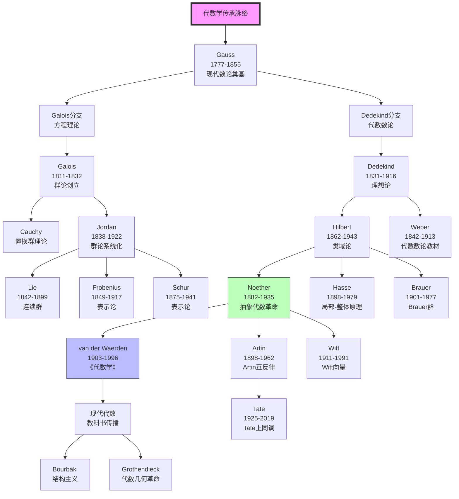
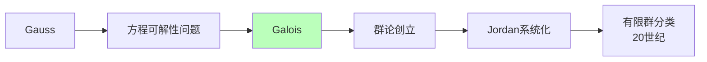
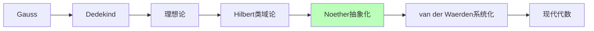
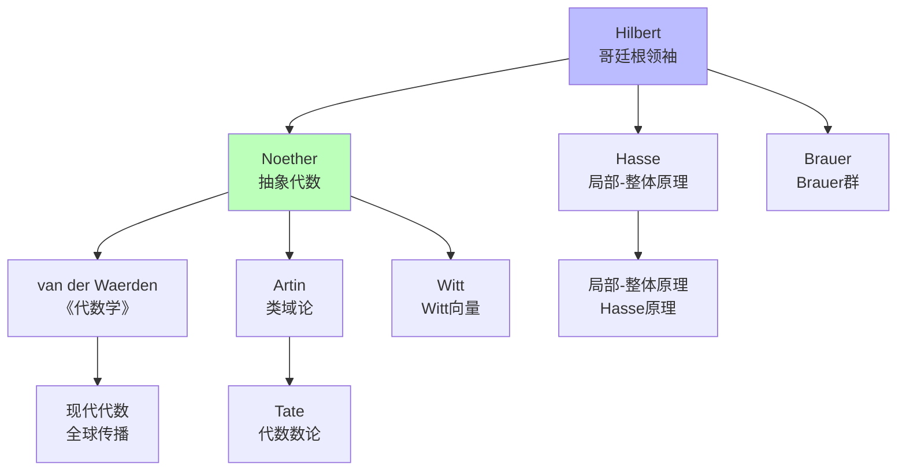
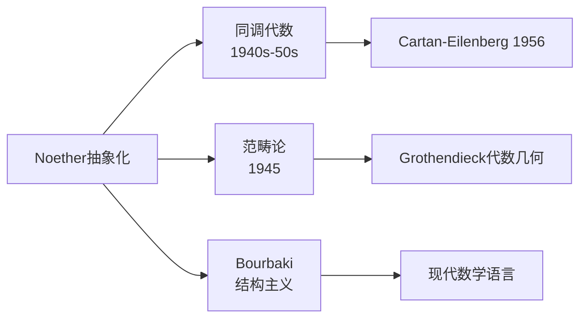

# 代数学传承脉络

> **核心传承链**：Gauss → Galois → Jordan → Noether → van der Waerden → Artin

---

## 传承脉络总览



---

## 关键传承节点

### 第一节点：Gauss（高斯）——现代数论奠基

| 维度 | 内容 |
|------|------|
| **核心著作** | 《算术研究》（Disquisitiones Arithmeticae，1801） |
| **核心贡献** | 同余理论、二次互反律、型论、分圆域、代数基本定理证明 |
| **思想遗产** | 现代数论的基础框架，代数方法的典范 |
| **传承方向** | 方程理论（Galois方向）、代数数论（Dedekind方向） |

**Gauss的直接学生**：
- **Dirichlet**（1805-1859）：解析数论、L-函数
- **Riemann**（1826-1866）：ζ函数、复几何
- **Bessel**（天文学，数学较少）

### 第二节点：Galois（伽罗瓦）——群论创立

| 维度 | 内容 |
|------|------|
| **核心著作** | 1830-1832手稿，1846年由Liouville发表 |
| **核心贡献** | 群论创立、方程可解性理论、Galois对应 |
| **思想突破** | 用群的结构研究方程，开创抽象代数方法 |
| **历史悲剧** | 21岁决斗身亡，未能见证自己的理论开花结果 |

**Galois对应的核心**：

```

方程的可解性 ↔ Galois群的结构
根式可解 ↔ Galois群是可解群

```

**传承影响**：
- **Cauchy**：发展置换群理论
- **Jordan**：系统化群论，有限群分类开端
- **Lie**：将群论扩展到连续变换（李群）

### 第三节点：Dedekind（戴德金）——理想论创立

| 维度 | 内容 |
|------|------|
| **核心贡献** | 理想概念（1871）、Dedekind分割、代数数论基础 |
| **师承** | Gauss学生，受Dirichlet直接影响 |
| **思想突破** | 用集合论方法（理想）推广整数唯一分解性 |
| **历史意义** | 现代代数数论的奠基人，抽象代数的先驱 |

**Kummer的理想数 → Dedekind的理想**：
- Kummer用"理想数"补救分圆域中唯一分解的失效
- Dedekind用集合论语言重新表述为"理想"
- 这一概念成为现代环论的核心

### 第四节点：Hilbert（希尔伯特）——哥廷根学派领袖

| 维度 | 内容 |
|------|------|
| **核心贡献** | 不变量理论、类域论、公理化方法、Hilbert空间 |
| **师承** | 受Dedekind、Kronecker、Weierstrass影响 |
| **思想突破** | 用存在性证明取代构造性证明，抽象代数方法 |
| **历史意义** | 哥廷根数学中心领袖，20世纪最具影响力的数学家 |

**Hilbert与Noether的关系**：
- 最初反对Noether的抽象方法
- 后成为其坚定支持者
- 名言："我已经完全被抽象化方法征服了"

### 第五节点：Noether（诺特）——抽象代数革命

| 维度 | 内容 |
|------|------|
| **核心贡献** | 抽象代数体系、诺特环/模、交换代数、同调代数萌芽 |
| **师承** | Gordan（不变量论），后受Hilbert影响转向抽象方法 |
| **思想突破** | 完全抽象化，"关系比对象更重要" |
| **历史意义** | "现代代数之母"，20世纪最有影响力的女数学家 |

**Noether的革命性贡献**：

| 领域 | 贡献 |
|------|------|
| 环论 | 诺特环的上升链条件，理想的结构理论 |
| 模论 | 模作为线性代数的一般化，同态基本定理 |
| 交换代数 | 局部化、完备化，代数几何的代数基础 |
| 同调代数 | 群上同调、Ext/Tor的早期形式 |
| 理论物理 | Noether定理（对称性与守恒量） |

**Noether的学生网络**：
- **van der Waerden**：系统阐述抽象代数
- **Artin**：类域论、Artin互反律
- **Hasse**：局部-整体原理
- **Brauer**：Brauer群、中心单代数
- **Witt**：Witt向量、二次型
- **Deuring**：代数函数域

### 第六节点：van der Waerden（范德瓦尔登）——《代数学》

| 维度 | 内容 |
|------|------|
| **核心著作** | 《代数学》（Moderne Algebra，1930，两卷本） |
| **师承** | Noether学生，Artin影响 |
| **核心贡献** | 系统阐述Noether和Artin的抽象代数理论 |
| **历史意义** | 20世纪最有影响力的数学教材之一，抽象代数的传播者 |

**《代数学》的影响**：
- 首次系统呈现抽象代数体系
- 影响了数代数学家
- 确立了群-环-域的教学顺序
- Bourbaki《代数学》的前身和模板

### 第七节点：Artin（阿廷）——类域论完成

| 维度 | 内容 |
|------|------|
| **核心贡献** | Artin互反律、Artin L-函数、Braid群、实闭域理论 |
| **师承** | Noether学生，受Herglotz、Hecke影响 |
| **思想突破** | 完成类域论的算术化，用群论统一描述 |
| **历史意义** | 类域论的完成者，代数数论的集大成者 |

**Artin互反律（1927）**：

```

类域论的核心定理，建立了Abel扩张与广义理想类群的一一对应
Artin映射：Galois群 → 理想类群

```

---

## 传承链条详解

### 链条一：方程理论 → 群论



### 链条二：代数数论 → 抽象代数



### 链条三：哥廷根网络



---

## 关键传承事件

### 事件一：Galois手稿的发表（1846）

**背景**：Galois 1832年死于决斗，手稿散落
**关键人物**：Liouville在1846年整理发表
**影响**：群论思想开始传播，30年后Jordan系统化

### 事件二：Dedekind理想的引入（1871）

**背景**：Kummer的"理想数"概念需要严格化
**创新**：用集合论语言定义理想
**影响**：代数数论的基础，现代环论的起点

### 事件三：Hilbert的存在性证明（1888）

**背景**：不变量理论的具体计算困难
**突破**：用存在性证明取代构造性证明
**争议**：Gordan："这不是数学，是神学"
**后续**：Hilbert后来给出了构造性证明

### 事件四：Noether在哥廷根（1915-1933）

**背景**：Noether作为女性和犹太人在哥廷根任教困难
**支持**：Hilbert力排众议支持Noether
**成就**：抽象代数革命
**转折**：1933年纳粹上台，被迫流亡美国

### 事件五：《代数学》的出版（1930）

**背景**：抽象代数成果需要系统化
**内容**：Noether和Artin讲义的综合
**影响**：成为标准教材，传播抽象代数思想

---

## 对现代代数的影响

### 1. 抽象化方法的确立



### 2. 代数几何的代数基础

Noether的交换代数为Grothendieck代数几何革命奠定了基础：
- 局部化与概形的概念
- 层论的代数准备
- 同调代数的技术

### 3. 当代延续

| 方向 | 当代发展 | 代表人物 |
|------|----------|----------|
| 代数数论 | Langlands纲领 | Langlands、Scholze |
| 表示论 | 几何表示论 | Lusztig、Ginzburg |
| 同调代数 | 导出范畴、无穷范畴 | Verdier、Lurie |
| 非交换几何 | C*-代数、量子群 | Connes、Drinfeld |

---

## 总结

代数学传承脉络的核心线索：

1. **Gauss奠基**：1801年《算术研究》确立现代数论基础，开创代数方法。

2. **两条分支**：
   - **Galois方向**：方程理论 → 群论 → 抽象群论
   - **Dedekind方向**：代数数论 → 理想论 → 抽象代数

3. **Hilbert综合**：类域论、公理化方法，支持Noether的抽象化。

4. **Noether革命**：完全抽象化，确立现代代数的研究范式。

5. **van der Waerden传播**：《代数学》系统阐述，影响数代数学家。

6. **Artin完成**：类域论的算术化，Artin互反律。

这一传承脉络从19世纪初的Gauss延伸到20世纪初的抽象代数革命，确立了现代代数学的基本框架和方法论，影响至今。

---

*文档编号：10*  
*创建日期：2026年4月*  
*所属项目：FormalMath 第十批推进计划*  
*核心传承链：Gauss → Galois/Jordan 或 Gauss → Dedekind → Hilbert → Noether → van der Waerden/Artin*  
*关键转折点：Galois群论创立、Dedekind理想论、Noether抽象代数革命*
