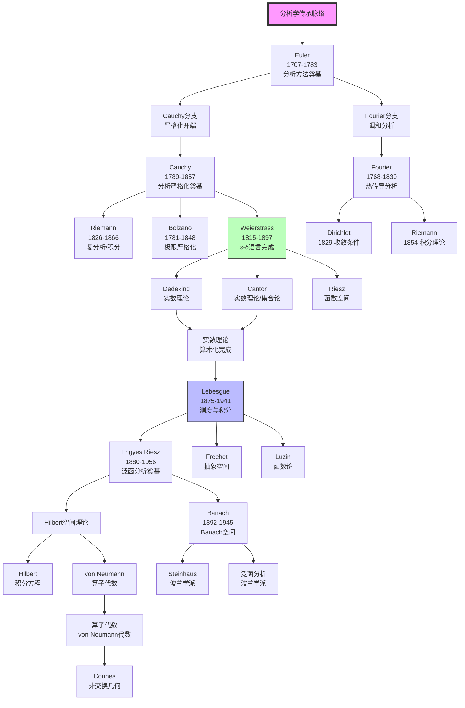
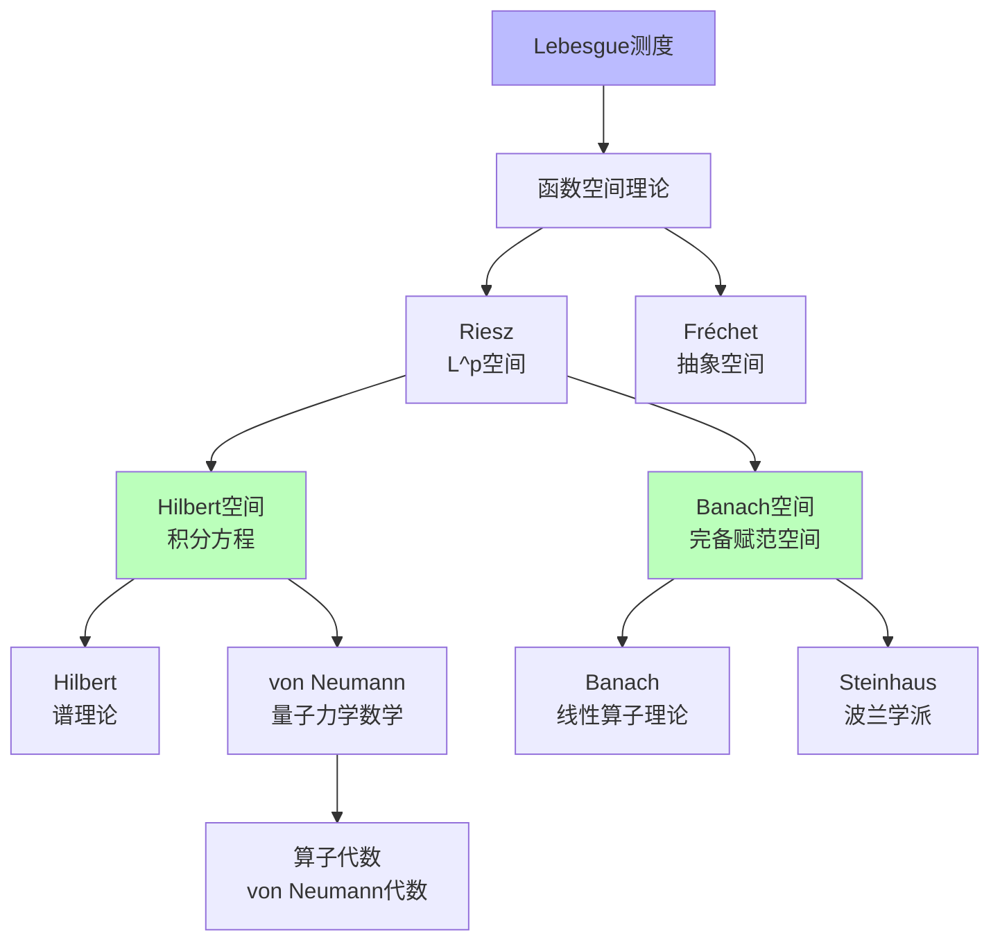
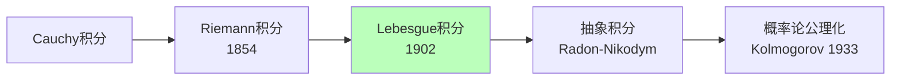
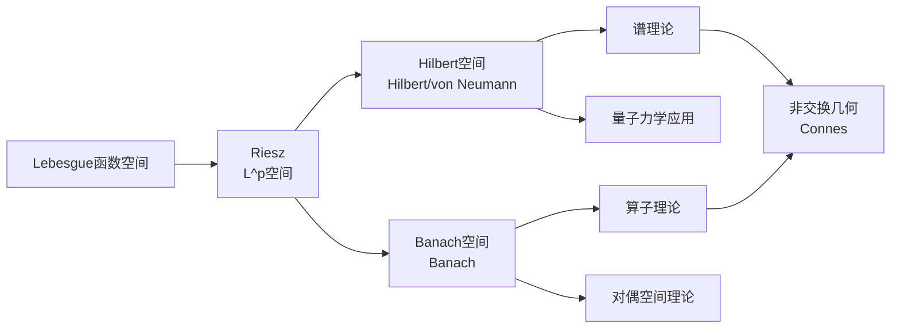
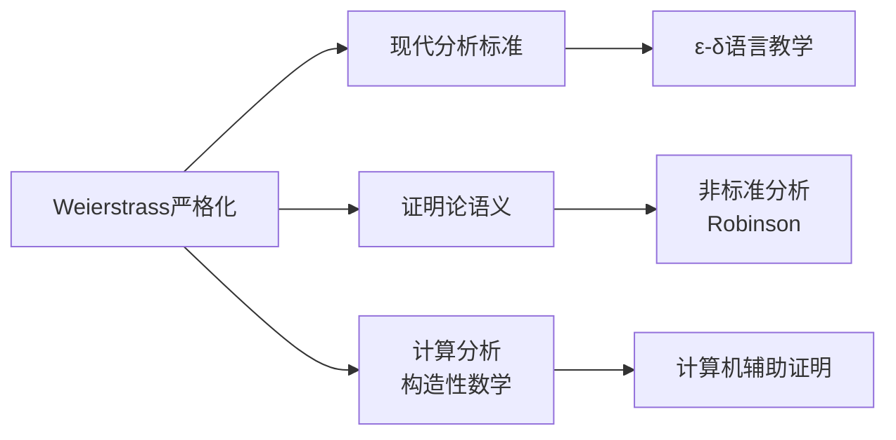

# 分析学传承脉络

> **核心传承链**：Euler → Cauchy → Weierstrass → Lebesgue → Hilbert → Banach

---

## 传承脉络总览



---

## 关键传承节点

### 第一节点：Euler（欧拉）——分析方法奠基

| 维度 | 内容 |
|------|------|
| **核心著作** | 《无穷分析引论》（1748）、《微分学原理》（1755）、《积分学原理》（1768-1770） |
| **核心贡献** | 函数概念、无穷级数、微分方程、变分法、复数运算 |
| **思想特征** | 计算的威力、形式的优美、直觉的信赖 |
| **历史地位** | 分析学的主要奠基人，18世纪数学的象征 |

**Euler的分析遗产**：
- 函数概念的现代化
- 无穷级数的大量计算
- 微分方程的系统解法
- Euler公式 e^(iπ) + 1 = 0

**特点**：形式计算优先于严格证明，这种方法展示了惊人的威力，但也埋下了基础问题的种子。

### 第二节点：Cauchy（柯西）——严格化开端

| 维度 | 内容 |
|------|------|
| **核心著作** | 《分析教程》（1821）、《微分学教程》（1829） |
| **核心贡献** | 极限的严格定义、连续性定义、Cauchy收敛准则、复分析 |
| **思想突破** | 用不等式语言（ε方法）定义极限，摆脱几何直观 |
| **历史地位** | 现代分析学的奠基人 |

**Cauchy的严格化贡献**：

| 概念 | Cauchy的定义 | 特点 |
|------|--------------|------|
| 极限 | "当n充分大时" | 接近现代定义 |
| 连续性 | 变量无穷小增量导致函数无穷小增量 | 接近ε-δ |
| 收敛 | Cauchy序列 | Cauchy准则 |
| 导数 | 极限定义 | 现代形式的雏形 |

**遗留问题**：Cauchy仍使用"无穷小"语言，没有完全算术化。

### 第三节点：Weierstrass（魏尔斯特拉斯）——严格化完成

| 维度 | 内容 |
|------|------|
| **核心贡献** | ε-δ语言的完善、无处可微连续函数、复分析（Weierstrass方法） |
| **思想突破** | 完全用静态的代数不等式取代动态的无穷小概念 |
| **历史地位** | "现代分析之父"，严格数学证明的典范 |

**ε-δ语言的核心**：

```

极限：∀ε>0, ∃N, ∀n>N: |a_n - L| < ε
连续：∀ε>0, ∃δ>0, |x-a|<δ ⇒ |f(x)-f(a)|<ε

```

**Weierstrass的严格性**：
- 拒绝几何直观
- 拒绝无穷小
- 纯粹算术化的定义
- "一个数学家如果没有看到魏尔斯特拉斯的严格性，就不是真正的数学家"

### 第四节点：实数理论（1872）

**Dedekind分割**：

```

将有理数分为两个非空集合A和B，
使得A中每个元素小于B中每个元素，
则(A,B)定义一个实数。

```

**Cantor基本列**：

```

柯西序列的等价类定义实数。

```

| 方法 | 提出者 | 特点 |
|------|--------|------|
| Dedekind分割 | Dedekind（1872） | 几何直观，序关系清晰 |
| 基本列 | Cantor（1872） | 分析自然，完备性明显 |
| 公理化 | Hilbert（1900） | 抽象简洁，现代常用 |

### 第五节点：Lebesgue（勒贝格）——测度与积分革命

| 维度 | 内容 |
|------|------|
| **核心著作** | 《积分、长度与面积》（1902） |
| **核心贡献** | Lebesgue测度与积分理论、实变函数论 |
| **思想突破** | 先定义测度，再定义积分；可测函数可积 |
| **历史地位** | 现代分析学的奠基人，泛函分析的先驱 |

**Lebesgue积分 vs Riemann积分**：

| 特征 | Riemann积分 | Lebesgue积分 |
|------|-------------|--------------|
| 分割方式 | 定义域分割 | 值域分割 |
| 可积函数 | 几乎连续函数 | 可测函数 |
| 极限交换 | 条件苛刻 | 条件宽松（控制收敛等） |
| 完备性 | 不完备 | L^p空间完备 |

### 第六节点：泛函分析的诞生



**Frigyes Riesz（1880-1956）**：
- L^p空间的系统研究
- Riesz表示定理
- 泛函分析的主要奠基人

**Banach（1892-1945）**：
- Banach空间理论（完备赋范空间）
- 线性算子理论
- 《线性算子理论》（1932）

**von Neumann（1903-1957）**：
- Hilbert空间的公理化
- 算子代数（von Neumann代数）
- 量子力学的数学基础

### 第七节点：分布理论与广义函数

| 人物 | 贡献 | 时间 |
|------|------|------|
| Sobolev | 广义函数的雏形 | 1936 |
| Schwartz | 分布理论的系统建立 | 1945-1950 |
| **Schwartz** | 广义函数论、核定理 | 1950 Fields奖 |

---

## 传承链条详解

### 链条一：严格化进程


### 链条二：积分理论的演进



### 链条三：从函数到泛函



---

## 关键传承事件

### 事件一：Cauchy《分析教程》（1821）

**背景**：18世纪分析的不严格问题日益明显
**突破**：引入严格定义，但仍有"无穷小"残余
**影响**：开启分析严格化运动

### 事件二：Weierstrass的柏林讲义（1860s）

**背景**：Cauchy的严格化不够彻底
**突破**：完全算术化的ε-δ语言
**影响**：现代分析的标准语言

### 事件三：实数理论的竞争（1872）

**背景**：分析需要严格的基础
**两种方法**：Dedekind分割 vs Cantor基本列
**结果**：殊途同归，都解决了实数基础问题

### 事件四：Lebesgue积分的诞生（1902）

**背景**：Riemann积分的局限性
**突破**：测度论基础上的新积分
**影响**：实变函数论、泛函分析、概率论的基础

### 事件五：泛函分析的成熟（1930s）

**背景**：积分方程、微分方程、量子力学的需要
**成果**：Banach空间、Hilbert空间、算子理论
**影响**：现代分析、数学物理、量子力学的基础

---

## 对现代分析的影响

### 1. 分析严格化的遗产



### 2. 泛函分析的广泛应用

| 领域 | 应用 | 关键概念 |
|------|------|----------|
| 偏微分方程 | 弱解理论 | Sobolev空间 |
| 量子力学 | 数学基础 | Hilbert空间、算子 |
| 概率论 | 随机过程 | 测度论、鞅论 |
| 优化理论 | 变分法、控制论 | Banach空间几何 |
| 信号处理 | 傅里叶分析 | L^2空间、紧算子 |

### 3. 当代延续

| 方向 | 当代发展 | 代表人物 |
|------|----------|----------|
| 非交换几何 | C*-代数、谱三重组 | Connes |
| 自由概率论 | 随机矩阵、算子代数 | Voiculescu |
| 压缩感知 | 稀疏恢复 | Candès、Tao |
| 最优输运 | Monge-Ampère方程 | Villani |

---

## 总结

分析学传承脉络的核心线索：

1. **Euler奠基**：分析方法在18世纪的大发展，展示了计算和形式的威力。

2. **Cauchy严格化开端**：19世纪初开始关注严格性，但尚未完全算术化。

3. **Weierstrass严格化完成**：ε-δ语言的确立，分析完全算术化。

4. **实数理论**：Dedekind和Cantor在1872年独立建立实数理论，完成分析的基础。

5. **Lebesgue积分革命**：1902年测度论基础上的新积分，极大地扩展了可积函数类。

6. **泛函分析诞生**：从研究函数到研究函数空间（Hilbert空间、Banach空间），分析学进入新阶段。

7. **算子理论深化**：von Neumann的算子代数，为量子力学提供数学基础。

这一传承脉络从18世纪的Euler延伸到20世纪的泛函分析，确立了现代分析学的基本框架和方法论，影响至今。

---

*文档编号：11*  
*创建日期：2026年4月*  
*所属项目：FormalMath 第十批推进计划*  
*核心传承链：Euler → Cauchy → Weierstrass → Lebesgue → Hilbert → Banach*  
*关键转折点：Cauchy严格化开端、Weierstrass严格化完成、Lebesgue积分革命*
