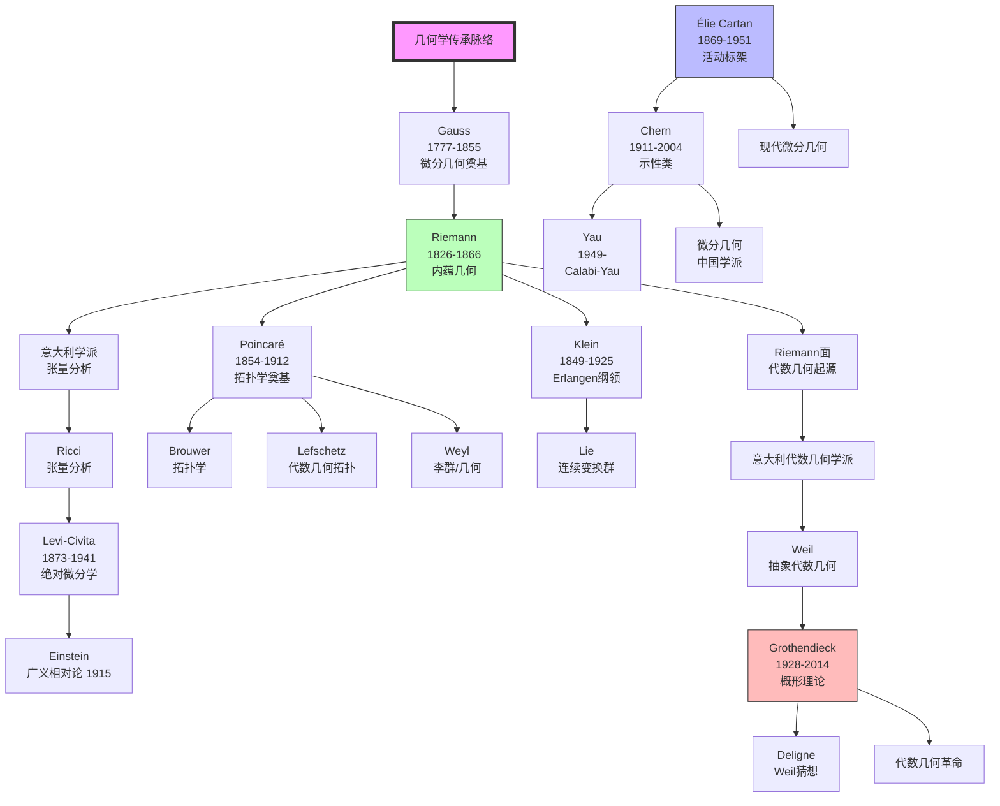
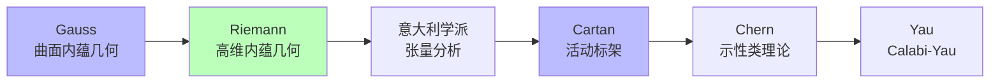
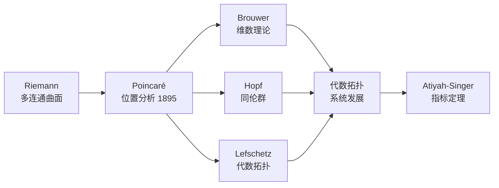
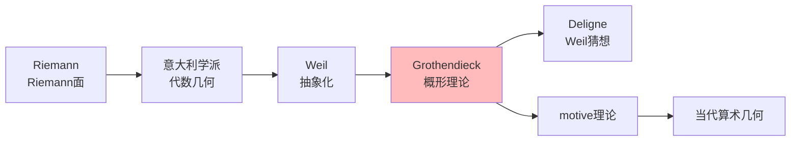
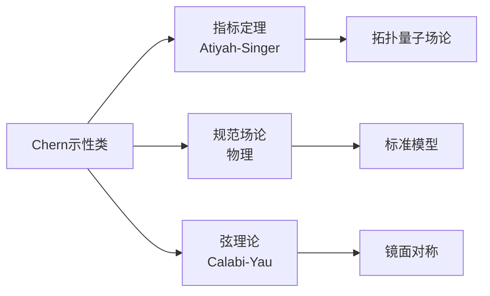

# 几何学传承脉络

> **核心传承链**：Gauss → Riemann → Poincaré → Cartan → Chern → Grothendieck

---

## 传承脉络总览



---

## 关键传承节点

### 第一节点：Gauss（高斯）——微分几何奠基

| 维度 | 内容 |
|------|------|
| **核心著作** | 《曲面的一般研究》（1827） |
| **核心贡献** | 曲面的内蕴几何、Gauss曲率、Gauss-Bonnet定理（特殊情形） |
| **思想突破** | 曲面的度量性质可以独立于嵌入空间来研究 |
| **历史地位** | 微分几何的奠基人，"数学王子" |

**Gauss的Theorema Egregium（绝妙定理）**：
> 曲面的Gauss曲率是内蕴的，不依赖于曲面在空间中的嵌入方式。

**意义**：
- 开创内蕴几何的先河
- 为高维几何和广义相对论奠定基础
- 几何可以独立于外部空间研究

### 第二节点：Riemann（黎曼）——内蕴几何与复几何

| 维度 | 内容 |
|------|------|
| **核心著作** | 就职演讲《论几何基础中的假设》（1854）、《复变函数一般理论基础》（1851） |
| **核心贡献** | 黎曼几何、黎曼面、复分析几何化、ζ函数 |
| **思想突破** | 任意维空间的内蕴几何，度量张量、曲率张量 |
| **历史地位** | 现代微分几何的奠基人，影响最深远的几何学家之一 |

**Riemann几何的革命性**：

| 方面 | 传统几何 | Riemann几何 |
|------|----------|-------------|
| 空间维度 | 2或3维 | 任意n维 |
| 曲率 | 常数 | 逐点变化 |
| 度量 | 欧氏度量 | 任意Riemann度量 |
| 基础 | 嵌入空间 | 完全内蕴 |
| 物理应用 | 无 | 广义相对论（60年后） |

### 第三节点：意大利微分几何学派

| 人物 | 生卒年 | 核心贡献 |
|------|--------|----------|
| Beltrami | 1835-1900 | 伪球面与双曲几何模型 |
| Christoffel | 1829-1900 | Christoffel符号、协变微分 |
| Ricci-Curbastro | 1853-1925 | Ricci曲率、张量分析 |
| Levi-Civita | 1873-1941 | Levi-Civita联络、平行移动 |

**张量分析的建立**：
- 从Riemann的抽象概念到可计算的符号系统
- 为广义相对论提供数学语言
- "绝对微分学"（Ricci和Levi-Civita，1900）

### 第四节点：Élie Cartan（嘉当，1869-1951）

| 维度 | 内容 |
|------|------|
| **核心贡献** | 活动标架法、外微分系统、对称空间、联络理论、李群几何 |
| **师承** | Darboux学生，受Klein影响 |
| **思想突破** | 用无穷小方法统一几何学，外形式系统 |
| **历史地位** | 现代微分几何的奠基人，20世纪最伟大的几何学家之一 |

**Cartan的主要贡献**：

| 领域 | 贡献 |
|------|------|
| 活动标架法 | 用移动标架研究子流形几何 |
| 外微分 | 外形式、Cartan结构方程 |
| 李群 | 李群和李代数的分类、表示论 |
| 对称空间 | Riemann对称空间的分类 |
| 联络理论 | 纤维丛上的联络（纤维丛概念的先驱） |

**名言**：
> "比起导数的计算，我更喜欢几何的思想。"

### 第五节点：Chern（陈省身，1911-2004）

| 维度 | 内容 |
|------|------|
| **核心贡献** | 陈类（Chern classes）、陈-Weil理论、高斯-博内内蕴证明、全纯曲线理论 |
| **师承** | Sun Guangyuan（清华），Élie Cartan（巴黎1936-1938） |
| **思想突破** | 用曲率形式表示示性类，拓扑不变量的几何计算 |
| **历史地位** | 20世纪最伟大的微分几何学家之一，微分几何中国学派的奠基人 |

**陈类（Chern Classes）**：

```

陈类是复向量丛的拓扑不变量，可以用曲率形式计算：
c(E) = det(I + (i/2π)Ω)
其中Ω是曲率形式。

```

**Chern的贡献统计**：
- 发表论文约150篇
- 学生遍布全球
- 创建数学科学研究所（MSRI）
- 南开大学陈省身数学研究所

### 第六节点：Poincaré（庞加莱）——拓扑学奠基

| 维度 | 内容 |
|------|------|
| **核心著作** | 《位置分析》（Analysis Situs，1895）及系列补充论文 |
| **核心贡献** | 代数拓扑创立、同调群、基本群、三体问题、动力系统 |
| **思想突破** | 研究图形在连续变形下的不变性质 |
| **历史地位** | "最后一位通才数学家"，拓扑学的奠基人 |

**Poincaré的拓扑贡献**：
- **同调群**：Betti数的群论解释
- **基本群**：第一同伦群
- **Poincaré对偶**：同调群的上积结构
- **Poincaré猜想**：三维球面的刻画（Perelman 2002证明）

### 第七节点：Klein（克莱因）——几何统一化

| 维度 | 内容 |
|------|------|
| **核心贡献** | Erlangen纲领（1872）、自守函数、代数方程与几何的联系 |
| **思想突破** | 几何学 = 在变换群下不变的理论 |
| **历史地位** | 几何学统一化的里程碑 |

**Erlangen纲领的核心**：

```

给定空间X和作用其上的变换群G，
几何学研究在G下不变的性质。

```

| 几何 | 变换群 | 不变量 |
|------|--------|--------|
| 欧氏几何 | 刚体运动群 | 距离、角度 |
| 仿射几何 | 仿射变换群 | 平行性、比例 |
| 射影几何 | 射影变换群 | 交比 |
| 拓扑学 | 同胚群 | 连通性、孔洞 |

### 第八节点：Weil（韦伊）与Grothendieck（格罗滕迪克）——代数几何革命

**Weil（1906-1998）**：
- Weil猜想（1949）
- 抽象代数几何奠基
- 椭圆曲线理论

**Grothendieck（1928-2014）**：
- 概形理论（1958-1970）
- 层上同调、六函子形式主义
- motive理论
- Topos理论

---

## 传承链条详解

### 链条一：微分几何的演进



### 链条二：拓扑学的发展



### 链条三：代数几何的革命



---

## 关键传承事件

### 事件一：Riemann就职演讲（1854）

**背景**：Riemann申请哥廷根大学教授职位
**内容**：提出任意维空间的内蕴几何
**影响**：
- 起初反响平平
- 后成为现代几何的基石
- 为广义相对论提供数学框架（1915）

### 事件二：Poincaré《位置分析》（1895）

**背景**：研究微分方程定性理论需要拓扑工具
**突破**：创立代数拓扑
**影响**：全新数学分支的诞生

### 事件三：Chern与Cartan（1936-1938）

**背景**：Chern赴巴黎深造
**学习**：Cartan的活动标架法和外微分
**突破**：陈类的发现（1946）
**影响**：现代微分几何的核心工具

### 事件四：Grothendieck革命（1958-1970）

**背景**：Weil猜想的挑战
**革命**：概形理论、层上同调
**成果**：Deligne证明Weil猜想（1973）
**影响**：整个20世纪后半叶的代数几何和数论

---

## 对现代几何的影响

### 1. 微分几何的广泛应用



### 2. 几何与物理学的融合

| 物理理论 | 数学工具 | 关键人物 |
|----------|----------|----------|
| 广义相对论 | Riemann几何 | Einstein、Hilbert |
| 规范场论 | 主丛、联络 | Weyl、Yang-Mills |
| 弦理论 | Calabi-Yau流形 | Candelas、Yau |
| 拓扑量子场论 | 指标定理、量子群 | Witten、Atiyah |

### 3. 当代延续

| 方向 | 当代发展 | 代表人物 |
|------|----------|----------|
| 几何分析 | Ricci流、Perelman证明Poincaré猜想 | Hamilton、Perelman |
| 辛几何 | Gromov-Witten理论、Fukaya范畴 | Gromov、Fukaya |
| 导出代数几何 | Toën-Vezzosi | Toën |
| 高维几何 | 特殊和乐群、Joyce | Joyce、Donaldson |

---

## 总结

几何学传承脉络的核心线索：

1. **Gauss奠基**：内蕴几何的概念，曲面的内蕴曲率。

2. **Riemann革命**：任意维空间的内蕴几何，Riemann度量、曲率张量，为现代微分几何奠定基础。

3. **意大利学派**：张量分析的系统化，为广义相对论提供数学语言。

4. **Cartan统一**：活动标架法、外微分系统、联络理论，现代微分几何的集大成者。

5. **Chern创新**：陈类和示性类理论，拓扑不变量的几何计算，微分几何中国学派的奠基。

6. **Poincaré开创**：代数拓扑的创立，研究连续变形下的不变性质。

7. **Grothendieck革命**：概形理论、层上同调，代数几何的革命性变革。

这一传承脉络从19世纪的Gauss和Riemann延伸到21世纪的当代几何，展示了从具体到抽象、从低维到高维、从局部到整体的演进过程。几何学不仅是数学的核心分支，也是物理学（相对论、规范场论、弦理论）的数学语言。

---

*文档编号：12*  
*创建日期：2026年4月*  
*所属项目：FormalMath 第十批推进计划*  
*核心传承链：Gauss → Riemann → Poincaré → Cartan → Chern → Grothendieck*  
*关键转折点：Riemann内蕴几何、Cartan活动标架法、Chern示性类、Grothendieck概形理论*
