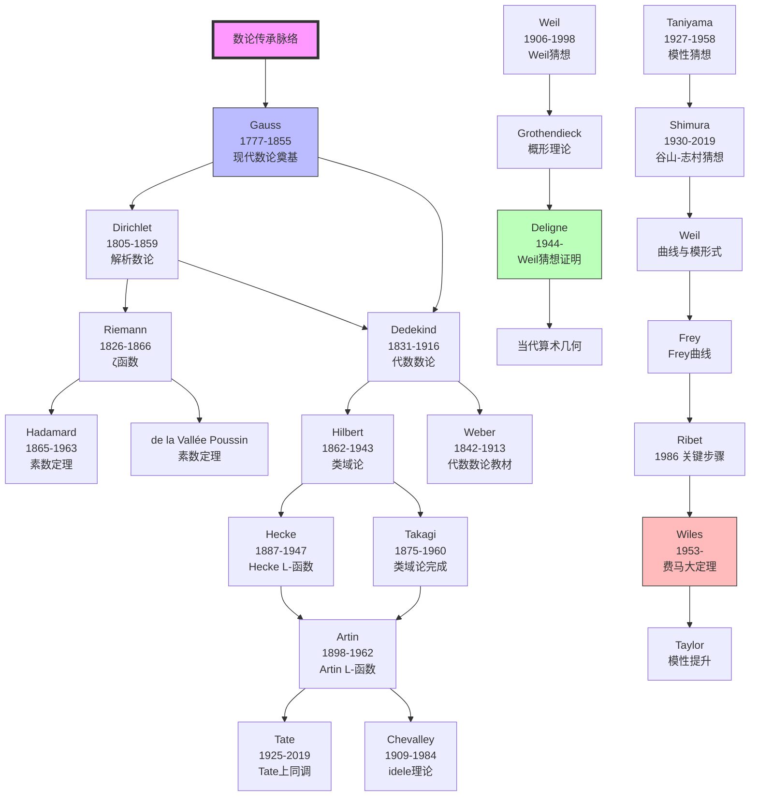
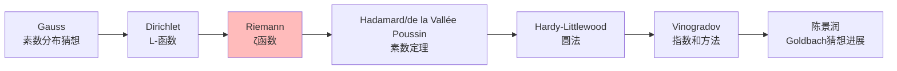
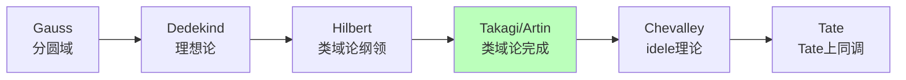
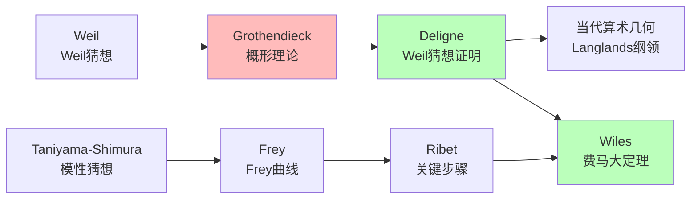
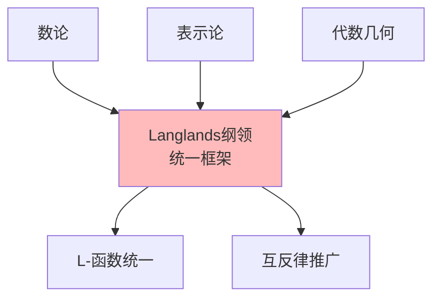

# 数论传承脉络

> **核心传承链**：Gauss → Dirichlet → Riemann → Dedekind → Hilbert → Weil → Deligne → Wiles

---

## 传承脉络总览



---

## 关键传承节点

### 第一节点：Gauss（高斯）——现代数论奠基

| 维度 | 内容 |
|------|------|
| **核心著作** | 《算术研究》（Disquisitiones Arithmeticae，1801） |
| **核心贡献** | 同余理论、二次互反律、型论、分圆域、代数基本定理 |
| **思想突破** | 建立系统的数论理论，引入现代数学方法 |
| **历史地位** | "数学王子"，现代数论的奠基人 |

**《算术研究》的主要内容**：

| 章节 | 内容 | 意义 |
|------|------|------|
| 1-3章 | 同余理论 | 现代同余概念的引入 |
| 4章 | 二次互反律 | "数论之酵母" |
| 5章 | 二元二次型 | 类群概念的萌芽 |
| 7章 | 分圆方程 | 代数数论的起点 |

**Gauss的数论贡献**：

- **二次互反律**：第一个深刻的互反律
- **分圆域**：x^p - 1 = 0的根，正多边形作图
- **素数定理的猜想**：π(x) ~ x/ln x
- **算术几何函数**：椭圆函数的早期研究

### 第二节点：Dirichlet（狄利克雷）——解析数论奠基

| 维度 | 内容 |
|------|------|
| **核心贡献** | Dirichlet L-函数、算术级数中的素数、解析数论方法 |
| **师承** | Gauss学生（精神传承），受Fourier影响 |
| **思想突破** | 用分析方法研究数论问题 |
| **历史地位** | 解析数论的奠基人，Gauss数论传统的继承者 |

**Dirichlet的主要贡献**：

| 定理 | 内容 | 年份 |
|------|------|------|
| Dirichlet定理 | 算术级数中有无穷多素数 | 1837 |
| 类数公式 | 二次型的类数与L-函数值 | 1839 |
| Dirichlet单位定理 | 代数数单位群的结构 | 1846 |

**方法论创新**：

- 引入**Dirichlet特征**：群表示论的先驱
- 引入**Dirichlet L-函数**：
  $$L(s,\chi) = \sum_{n=1}^{\infty} \frac{\chi(n)}{n^s}$$

### 第三节点：Riemann（黎曼）——ζ函数与解析数论

| 维度 | 内容 |
|------|------|
| **核心著作** | "论小于给定数的素数个数"（1859，仅8页） |
| **核心贡献** | Riemann ζ函数、解析延拓、函数方程、黎曼假设 |
| **思想突破** | 用复分析研究素数分布，ζ函数的零点与素数的关系 |
| **历史地位** | 解析数论的真正创立者，影响最深远的数学论文之一 |

**Riemann假设**：
> ζ函数的所有非平凡零点的实部都等于 1/2。

这是当代数学最重要（也是最难）的未解决问题之一。

**Riemann论文的主要内容**：

1. ζ函数的解析延拓
2. 函数方程
3. 黎曼假设的提出
4. 素数计数函数的显式公式

### 第四节点：Dedekind（戴德金）——代数数论奠基

| 维度 | 内容 |
|------|------|
| **核心贡献** | 理想概念、代数数域理论、Dedekind ζ函数 |
| **师承** | Gauss学生，Dirichlet影响 |
| **思想突破** | 用集合论方法重构代数数论，用理想补救唯一分解性 |
| **历史地位** | 现代代数数论的奠基人 |

**Dedekind的理想论**：

- **问题**：某些代数整数环中唯一分解定理不成立
- **解决**：引入"理想"作为"理想数"的严格化
- **结果**：理想唯一分解定理

**Dedekind-Weber理论**（1882）：

- 将代数数论的方法应用于代数函数
- 代数曲线与数域的类比
- 算术几何的先驱

### 第五节点：Hilbert（希尔伯特）——类域论的纲领

| 维度 | 内容 |
|------|------|
| **核心贡献** | 类域论的纲领（Hilbert第12问题）、范数剩余符号、互反律的推广 |
| **师承** | 受Dedekind、Kronecker影响 |
| **思想突破** | 提出类域论的框架，用抽象方法研究Abel扩张 |
| **历史地位** | 代数数论发展的重要推动者 |

**Hilbert的数论贡献**：

- **类域论的纲领**：描述数域的Abel扩张
- **Hilbert符号**：局部互反律的表述
- **Hilbert第9、12问题**：关于互反律和类域论

### 第六节点：Hecke（赫克）——L-函数的系统化

| 维度 | 内容 |
|------|------|
| **核心贡献** | Hecke L-函数、Hecke算子、模形式理论 |
| **师承** | Hilbert学生 |
| **思想突破** | 用L-函数统一处理数论问题，模形式的系统研究 |
| **历史地位** | 现代自守形式理论的奠基人 |

**Hecke L-函数**：
$$L(s, \chi) = \sum_{\mathfrak{a}} \frac{\chi(\mathfrak{a})}{N(\mathfrak{a})^s}$$
其中求和遍历代数数域的所有整理想。

### 第七节点：Artin（阿廷）——类域论的完成

| 维度 | 内容 |
|------|------|
| **核心贡献** | Artin互反律、Artin L-函数、类域论的算术化 |
| **师承** | Herglotz、Hecke、Noether |
| **思想突破** | 用群论统一描述类域论，完成Hilbert纲领 |
| **历史地位** | 类域论的完成者，代数数论的集大成者 |

**Artin互反律（1927）**：

```

对于数域K的Abel扩张L/K，存在Artin映射：
Gal(L/K) ≅ 广义理想类群
这是类域论的核心定理。

```

### 第八节点：Weil（韦伊）——Weil猜想

| 维度 | 内容 |
|------|------|
| **核心贡献** | Weil猜想（1949）、代数几何基础、椭圆曲线理论 |
| **思想突破** | 用拓扑方法研究有限域上的代数簇，提出深刻猜想 |
| **历史地位** | 20世纪最重要的数论学家之一，代数几何革命的先驱 |

**Weil猜想（1949）**：
关于有限域上代数簇的Zeta函数：

1. 有理性
2. 函数方程
3. Riemann假设类比
4. Betti数类比

这些猜想在1973年被Deligne证明。

### 第九节点：Deligne（德利涅）——Weil猜想的证明

| 维度 | 内容 |
|------|------|
| **核心贡献** | 证明Weil猜想（1973-1974）、混合Hodge理论 |
| **师承** | Grothendieck学生，受Serre影响 |
| **思想突破** | 用Grothendieck的深层几何工具解决数论问题 |
| **历史地位** | Fields奖（1978），20世纪最重要的代数几何学家之一 |

### 第十节点：谷山-志村-Weil猜想与Wiles证明

**Taniyama（谷山丰，1927-1958）**：

- 1955年提出椭圆曲线的模性猜想
- 悲剧性早逝（自杀）

**Shimura（志村五郎，1930-2019）**：

- 与Taniyama共同发展模性猜想
- 谷山-志村猜想的精确表述

**Weil的贡献**：

- 将猜想与函数方程联系起来
- 现在称为"谷山-志村-Weil猜想"

**Frey（弗雷）**：

- 1984年：如果费马大定理不成立，则可以构造特殊的椭圆曲线（Frey曲线）

**Ribet（里贝特）**：

- 1986年：证明Frey曲线不可能模性（Serre猜想 + ε猜想）

**Wiles（怀尔斯）**：

- 1994-1995年：证明半稳定椭圆曲线的谷山-志村猜想
- 从而证明费马大定理

---

## 传承链条详解

### 链条一：解析数论



### 链条二：代数数论



### 链条三：算术几何



---

## 关键传承事件

### 事件一：《算术研究》出版（1801）

**意义**：

- 现代数论的奠基之作
- 确立数论作为独立学科的地位
- 影响数代数学家

### 事件二：Riemann论文（1859）

**特点**：

- 仅8页，但内容极其深刻
- 提出黎曼假设
- 开创解析数论的新纪元

### 事件三：Dedekind理想论（1871）

**背景**：Kummer的"理想数"需要严格化
**创新**：用集合论定义理想
**影响**：代数数论的基础

### 事件四：类域论的完成（1920s）

**参与者**：Takagi、Artin、Hasse、Herbrand
**成果**：完整描述数域的Abel扩张
**意义**：代数数论的高峰

### 事件五：Weil猜想证明（1973-74）

**背景**：Grothendieck建立的宏大理论
**证明者**：Deligne
**意义**：展示了抽象方法的威力

### 事件六：费马大定理证明（1995）

**历史**：350年的难题
**关键**：谷山-志村猜想
**证明者**：Wiles
**意义**：数论与代数几何统一的典范

---

## 对现代数论的影响

### 1. Langlands纲领



### 2. 当代数论分支

| 分支 | 核心内容 | 代表人物 |
|------|----------|----------|
| 解析数论 | 素数分布、L-函数 | Green、Tao、Zhang |
| 代数数论 | 类域论、Iwasawa理论 | Coates、Wiles |
| 算术几何 | 椭圆曲线、模形式 | Serre、Mazur、Taylor |
| p进数论 | p进L-函数、完美oid | Scholze、Bhatt |

---

## 总结

数论传承脉络的核心线索：

1. **Gauss奠基**（1801）：《算术研究》确立现代数论的基础框架。

2. **两条分支**：
   - **解析方向**：Dirichlet → Riemann → Hadamard → 解析数论
   - **代数方向**：Dedekind → Hilbert → Artin → 代数数论

3. **类域论的完成**（1920s）：Takagi和Artin完成Hilbert纲领。

4. **算术几何的诞生**：Weil猜想 → Grothendieck理论 → Deligne证明。

5. **费马大定理**（1995）：Wiles的证明展示了数论与代数几何的统一。

6. **当代发展**：Langlands纲领、p进Hodge理论、完美oid空间等。

数论传承脉络展示了数学中最纯粹、最深刻的思想演进，从初等的整数性质到高深的算术几何，数论始终是数学的核心和灵魂。

---

*文档编号：13*
*创建日期：2026年4月*
*所属项目：FormalMath 第十批推进计划*
*核心传承链：Gauss → Dirichlet → Riemann → Dedekind → Hilbert → Weil → Deligne → Wiles*
*关键转折点：Gauss《算术研究》、Riemann ζ函数、Artin类域论、Deligne证明Weil猜想、Wiles证明费马大定理*
