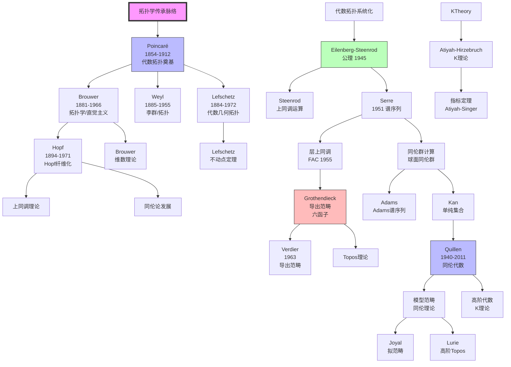
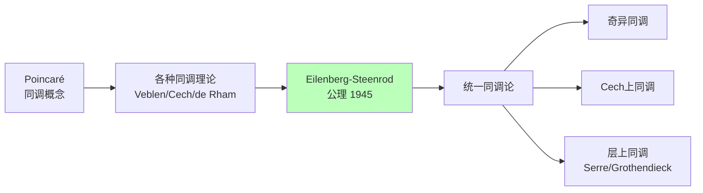
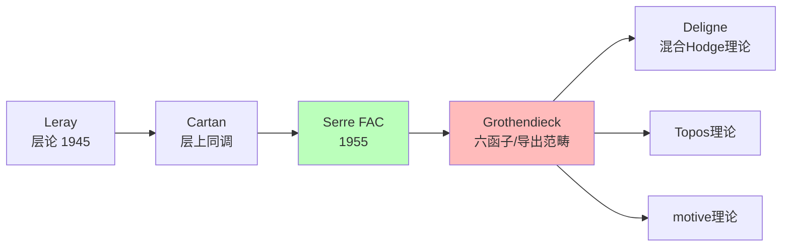

# 拓扑学传承脉络

> **核心传承链**：Poincaré → Brouwer → Hopf → Eilenberg-Steenrod → Serre → Grothendieck → Quillen

---

## 传承脉络总览



---

## 关键传承节点

### 第一节点：Poincaré（庞加莱）——代数拓扑奠基

| 维度 | 内容 |
|------|------|
| **核心著作** | 《位置分析》（Analysis Situs，1895）及系列补充论文（1899-1904） |
| **核心贡献** | 同调群、基本群、Betti数、Poincaré对偶、Poincaré猜想 |
| **思想突破** | 研究图形在连续变形下的不变性质，用代数工具研究拓扑问题 |
| **历史地位** | 代数拓扑的奠基人，"最后一位通才数学家" |

**Poincaré的拓扑贡献**：

| 概念 | 内容 | 意义 |
|------|------|------|
| 同调群 | Betti数的群论解释 | 拓扑不变量的代数化 |
| 基本群 | 第一同伦群 | 孔洞的代数刻画 |
| Poincaré对偶 | H_k ≅ H^(n-k) | 流形的对称性质 |
| Poincaré猜想 | S³的刻画 | 20世纪最重要的拓扑问题（2002年Perelman证明） |

**Poincaré的对偶悖论**：

- 最初"证明"了Poincaré对偶
- 后来发现自己错误，引入三角剖分修正
- 展示了拓扑的微妙之处

### 第二节点：Brouwer（布劳威尔）——维数理论与不动点定理

| 维度 | 内容 |
|------|------|
| **核心贡献** | 维数的不变性、区域不变性、Brouwer不动点定理、直觉主义 |
| **思想突破** | 用代数拓扑方法证明拓扑定理 |
| **历史地位** | 代数拓扑的重要贡献者，直觉主义数学哲学的创立者 |

**Brouwer不动点定理**：
> 任何从n维球到自身的连续映射都有不动点。

**维数理论**：

- 证明R^n与R^m不同胚（n≠m）
- 维数是拓扑不变量

### 第三节点：Hopf（霍普夫）——同伦论的突破

| 维度 | 内容 |
|------|------|
| **核心贡献** | Hopf纤维化、Hopf不变量、球面同伦群计算 |
| **思想突破** | 发现高维球面之间的非平凡映射 |
| **历史地位** | 同伦论的奠基人之一 |

**Hopf纤维化**：

```
S³ → S²
纤维：S¹

这是第一个非平凡的高维球面之间的映射，
π₃(S²) ≅ Z，由Hopf映射生成。
```

**Hopf的意义**：

- 展示了高维拓扑的丰富性
- 开启了球面同伦群的计算
- 纤维丛概念的早期例子

### 第四节点：Eilenberg-Steenrod（艾伦伯格-斯廷罗德）——公理化

| 维度 | 内容 |
|------|------|
| **核心著作** | 《代数拓扑基础》（Foundations of Algebraic Topology，1952） |
| **核心贡献** | 同调论的公理化（Eilenberg-Steenrod公理） |
| **思想突破** | 公理化方法应用于拓扑，统一各种同调理论 |
| **历史地位** | 代数拓扑系统化的里程碑 |

**Eilenberg-Steenrod公理**：

| 公理 | 内容 |
|------|------|
| 同伦公理 | 同伦映射诱导相同同态 |
| 正合性公理 | 对空间对的正合序列 |
| 切除公理 | 切除定理的公理化 |
| 维数公理 | 点的同调已知 |

**意义**：

- 统一了各种同调理论（奇异同调、Čech同调、de Rham上同调等）
- 公理化方法在拓扑中的成功应用
- 确立了同调论的标准形式

### 第五节点：Serre（塞尔）——谱序列与同伦群

| 维度 | 内容 |
|------|------|
| **核心贡献** | 谱序列的系统应用、球面同伦群的计算、层上同调（FAC）、同伦论（GAGA） |
| **师承** | 受Leray、Cartan影响 |
| **思想突破** | 用谱序列计算复杂拓扑不变量，层论在代数几何的应用 |
| **历史地位** | Fields奖（1954），20世纪最重要的拓扑学家之一 |

**Serre的关键贡献**：

| 论文 | 年份 | 贡献 |
|------|------|------|
| 博士论文 | 1951 | 谱序列系统应用于纤维化，计算球面同伦群 |
| FAC | 1955 | 层上同调在代数几何的系统应用 |
| GAGA | 1956 | 代数几何与解析几何的比较定理 |

**Serre的同伦群计算**：

- 证明了球面同伦群是有限生成的
- 发现了p-挠分量的规律性
- 开启了稳定同伦理论

### 第六节点：Grothendieck（格罗滕迪克）——同调代数革命

| 维度 | 内容 |
|------|------|
| **核心贡献** | Abel范畴、导出函子、六函子形式主义、导出范畴、motive理论 |
| **思想突破** | 用范畴论统一上同调理论，函子性优先 |
| **历史地位** | 20世纪最具影响力的数学家之一，代数几何和同调代数革命的核心 |

**Grothendieck的拓扑贡献**：

| 理论 | 内容 | 影响 |
|------|------|------|
| Abel范畴 | 同调代数的公理化 | Cartan-Eilenberg的深化 |
| 六函子 | f*, f*, f!, f!, ⊗, Hom | 上同调理论的统一语言 |
| Topos | 广义拓扑空间 | 逻辑学与代数几何 |
| 导出范畴 | 复形的同伦范畴 | Verdier系统化 |
| motive | 上同调的统一理论 | 当代算术几何的核心 |

### 第七节点：Quillen（奎伦）——同伦代数

| 维度 | 内容 |
|------|------|
| **核心贡献** | 模型范畴、高阶代数K理论、形式群律 |
| **思想突破** | 用代数方法（模型范畴）统一同伦理论 |
| **历史地位** | Fields奖（1978），同伦代数化的主要推动者 |

**Quillen的模型范畴**：

- 统一的同伦理论框架
- 弱等价、纤维化、余纤维化
- 可应用于拓扑空间、链复形、单纯集合等

**高阶K理论**：

- 将K理论扩展到高维
- 用模型范畴的构造
- 代数K理论的新纪元

---

## 传承链条详解

### 链条一：同调论的公理化



### 链条二：同伦论的发展


### 链条三：层论与上同调



---

## 关键传承事件

### 事件一：《位置分析》发表（1895）

**背景**：研究微分方程定性理论需要拓扑工具
**内容**：引入同调群、基本群
**意义**：代数拓扑的诞生

### 事件二：Poincaré对偶的修正（1899-1904）

**最初错误**：Poincaré最初"证明"了自己的对偶定理
**发现错误**：Poincaré自己发现证明有误
**修正方法**：引入三角剖分和单纯同调
**意义**：展示了拓扑的微妙和严格性的重要

### 事件三：Eilenberg-Steenrod公理（1945）

**背景**：多种同调理论并存，需要统一
**成果**：公理化同调论
**影响**：代数拓扑的系统化

### 事件四：Serre博士论文（1951）

**突破**：谱序列的系统应用
**成果**：球面同伦群的重大计算进展
**影响**：同伦论的新纪元

### 事件五：Grothendieck拓扑革命（1958-1970）

**背景**：Weil猜想的挑战
**革命**：层上同调、Topos理论
**影响**：代数几何、数论、逻辑学

### 事件六：Quillen模型范畴（1967）

**创新**：用代数方法统一同伦理论
**应用**：拓扑空间、链复形、单纯集合
**影响**：同伦代数化，高阶范畴论的先驱

---

## 对现代拓扑的影响

### 1. 高阶结构的发展


### 2. 拓扑与物理学的联系

| 物理领域 | 数学工具 | 关键发展 |
|----------|----------|----------|
| 量子场论 | 指标定理 | Atiyah-Singer |
| 弦理论 | 镜面对称 | Witten、Kontsevich |
| 拓扑绝缘体 | K理论 | Kitaev等 |
| 量子计算 | 拓扑量子计算 | Kitaev、Freedman |

### 3. 当代拓扑方向

| 方向 | 核心内容 | 代表人物 |
|------|----------|----------|
| 无穷范畴论 | (∞,1)-范畴、高阶Topos | Lurie、Joyal |
| 导出代数几何 | Toën-Vezzosi | Toën |
| 同伦类型论 | Voevodsky | Voevodsky、Awodey |
| 计算拓扑 | 持久同调 | Edelsbrunner、Carlsson |

---

## 总结

拓扑学传承脉络的核心线索：

1. **Poincaré奠基**（1895）：代数拓扑的诞生，同调群和基本群的引入。

2. **早期发展**：Brouwer的维数理论和不动点定理，Hopf的同伦论突破。

3. **公理化**（1945）：Eilenberg-Steenrod公理统一各种同调理论。

4. **同伦论的飞跃**（1951）：Serre用谱序列计算球面同伦群。

5. **同调代数革命**（1955-1970）：Grothendieck的层上同调、六函子、导出范畴。

6. **同伦代数化**（1967）：Quillen的模型范畴，高阶代数K理论。

7. **高阶结构**（2000s-）：无穷范畴论、高阶Topos、同伦类型论。

拓扑学从研究"橡皮几何"开始，发展成为连接代数、几何、分析、逻辑学和物理学的核心桥梁。拓扑不变量（同调、同伦、K理论）成为现代数学的基本工具。

---

*文档编号：14*
*创建日期：2026年4月*
*所属项目：FormalMath 第十批推进计划*
*核心传承链：Poincaré → Brouwer → Hopf → Eilenberg-Steenrod → Serre → Grothendieck → Quillen*
*关键转折点：Poincaré《位置分析》、Eilenberg-Steenrod公理化、Serre谱序列应用、Grothendieck层上同调革命*
