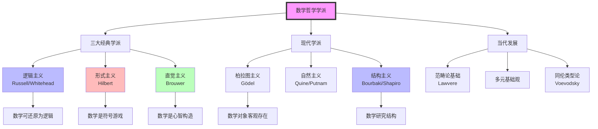
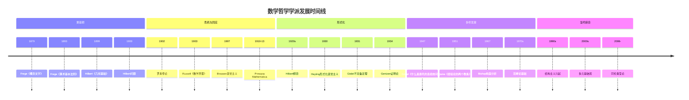

# 数学哲学学派对比

> **核心学派**：逻辑主义、形式主义、直觉主义、柏拉图主义、结构主义、范畴论基础

---

## 学派总览



---

## 三大经典学派对比

### 对比总表

| 维度 | 逻辑主义 | 形式主义 | 直觉主义 |
|------|----------|----------|----------|
| **代表人物** | Russell, Whitehead<br/>Frege, Carnap | Hilbert, Curry<br/>Cohen, Robinson | Brouwer, Heyting<br/>Weyl, Dummett |
| **核心主张** | 数学即逻辑<br/>数学可还原为逻辑 | 数学是符号游戏<br/>一致性即真理 | 数学是心智构造<br/>可构造性即存在性 |
| **无穷观** | 接受实际无穷<br/>集合论基础 | 理想元素方法<br/>无穷作为便利工具 | 潜无穷唯一合法<br/>否定实际无穷 |
| **排中律** | 完全接受 | 形式系统中接受 | 拒绝 |
| **证明标准** | 逻辑推导 | 形式可推导性 | 可构造性证明 |
| **典型成果** | Principia Mathematica<br/>类型论 | 证明论<br/>元数学 | 直觉主义逻辑<br/>BHK解释 |
| **主要局限** | 悖论问题<br/>还原不完全 | 不完备定理打击<br/>一致性证明困难 | 过于限制<br/>经典数学失效 |

### 逻辑主义（Logicism）

```
核心主张树
├── 数学可还原为逻辑
│   ├── 算术是逻辑的延伸
│   ├── 分析建立在算术之上
│   └── 集合论提供基础
├── 数学真理即逻辑真理
│   ├── 先验性
│   ├── 必然性
│   └── 分析性
└── 数学对象是逻辑构造
    ├── 数是类的类
    ├── 关系是命题函项
    └── 函数是映射关系
```

**Frege（1848-1925）**：

| 项目 | 内容 |
|------|------|
| 核心著作 | 《概念文字》（1879）、《算术基础》（1884）、《算术基本法则》（1893-1903） |
| 核心贡献 | 现代逻辑学奠基、逻辑主义纲领提出 |
| 挫折 | Russell悖论（1902）摧毁了《算术基本法则》系统 |
| 历史地位 | 分析哲学与数理逻辑的共同源头 |

**Russell与Whitehead（1910-1913）**：

| 项目 | 内容 |
|------|------|
| 核心著作 | Principia Mathematica（三卷本） |
| 核心贡献 | 类型论解决悖论、逻辑主义体系化 |
| 技术工具 | 分支类型论、可归约性公理、无穷公理 |
| 影响评估 | 逻辑主义未完全成功，但催生了类型论和现代逻辑 |

### 形式主义（Formalism）

```
核心主张树
├── 数学是符号操作
│   ├── 无意义的符号串
│   ├── 形成规则
│   └── 变形规则
├── 真理即可证性
│   ├── 形式可推导性
│   ├── 一致性即存在
│   └── 完备性理想
├── 无穷作为理想元素
│   ├── 实无穷是理想化
│   ├── 元数学中有限主义
│   └── 实际数学中自由使用
└── 数学对象无需本体论承诺
    ├── 符号本身即对象
    ├── 解释是额外的
    └── 多模型可能性
```

**Hilbert纲领（1900-1931）**：

| 项目 | 内容 |
|------|------|
| 核心目标 | 证明数学形式系统的一致性、完备性、可判定性 |
| 方法论 | 将数学形式化为符号系统，用有穷方法证明元数学性质 |
| 有穷主义 | 元数学中只承认有限构造，不涉及无穷 |
| 理想元素 | 数学实践中可使用无穷作为便利工具 |
| 挫折 | Gödel不完备定理（1931）证明纲领不可实现 |

**形式主义的遗产**：

- 证明论的建立（Gentzen、Ackermann）
- 自动定理证明
- 程序验证
- 形式化数学（Lean、Coq）

### 直觉主义（Intuitionism）

```
核心主张树
├── 数学是心智构造
│   ├── 基于时间直觉
│   ├── 原初二元性（一与多）
│   └── 自由构造序列
├── 可构造性即真理
│   ├── 存在 = 被构造
│   ├── 证明 = 构造方法
│   └── 真 = 有证明
├── 潜无穷唯一合法
│   ├── 自然数是无穷序列
│   ├── 实无穷不可接受
│   └── 连续统是构造过程
└── 拒绝排中律
    ├── 未证≠假
    ├── 未证≠真
    └── 真值间隙存在
```

**Brouwer（1881-1966）**：

| 项目 | 内容 |
|------|------|
| 核心著作 | 《论数学基础》（1907）、《数学、科学和语言》（1929） |
| 核心贡献 | 直觉主义数学哲学、选择序列、直觉主义拓扑 |
| 时间直觉 | 数学基于"原初直觉"——时间流逝中的二元性 |
| 对经典数学的批评 | 排中律的滥用、实际无穷的虚构性 |

**BHK解释**（Brouwer-Heyting-Kolmogorov）：

| 命题 | 证明/构造是... |
|------|----------------|
| p ∧ q | 一个对（p的证明，q的证明） |
| p ∨ q | 标记对，标记为"左"附带p的证明，或"右"附带q的证明 |
| p → q | 一个函数，将p的证明映射为q的证明 |
| ⊥ | 无（矛盾） |
| ∀x.P(x) | 一个函数，将每个a映射为P(a)的证明 |
| ∃x.P(x) | 一个对（a, P(a)的证明） |

---

## 现代学派

### 柏拉图主义（Platonism）

```
核心主张树
├── 数学对象客观存在
│   ├── 独立于心智
│   ├── 独立于物理世界
│   └── 抽象、永恒的实在
├── 数学真理是发现而非发明
│   ├── 数学家像探险家
│   ├── 定理等待被发现
│   └── 证明揭示真理
├── 数学直观把握抽象对象
│   ├── 类似知觉但非感觉
│   ├── 直接认识数学对象
│   └── Gödel的数学直觉
└── 集合论宇宙的真实存在
    ├── 连续统假设有确定真值
    ├── ZFC只是近似描述
    └── 新公理的发现
```

**Gödel的柏拉图主义**：

| 项目 | 内容 |
|------|------|
| 时期 | 1940s-1970s |
| 核心主张 | 集合论概念的客观实在性 |
| 连续统假设观点 | CH有确定的真值（可能是假的） |
| 新公理观 | 需要寻找更强的无穷公理 |
| 论证支持 | 数学的成功需要解释；一致性即存在 |

### 结构主义（Structuralism）

```
核心主张树
├── 数学研究结构而非对象
│   ├── 数是结构中的位置
│   ├── 结构关系优先于对象
│   └── 同构结构等价
├── 消去结构主义
│   ├── 结构可用逻辑描述
│   ├── 位置可消去
│   └── 类逻辑主义立场
├── 非消去结构主义
│   ├── 结构是真实的
│   ├── 位置是真实的
│   └── 类似柏拉图主义但强调结构
└── 模态结构主义
    ├── 数学陈述是模态的
    ├── "必然地，任何满足...的结构"
    └── 避免本体论承诺
```

**Bourbaki的结构主义实践**：

| 项目 | 内容 |
|------|------|
| 时期 | 1935- |
| 核心主张 | 数学是结构的科学 |
| 三大母结构 | 代数结构、序结构、拓扑结构 |
| 方法论 | 公理化方法、同构分类 |
| 影响 | 20世纪数学的统一化和抽象化 |

**Shapiro的结构主义哲学**：

| 项目 | 内容 |
|------|------|
| 核心著作 | 《数学哲学：结构与本体论》（1997） |
| 核心主张 | 数学对象即结构中的位置 |
| 认识论 | 通过抽象认识结构（从系统到结构） |
| 与柏拉图主义关系 | 保留实在论但改变本体论承诺的性质 |

---

## 当代发展

### 范畴论基础（Categorical Foundations）

```
核心主张树
├── 范畴论作为数学基础
│   ├── 不需要集合论
│   ├── 态射优先于元素
│   └── 统一各数学分支
├── 泛性质的核心地位
│   ├── 极限/余极限
│   ├── 伴随函子
│   └── 表征性定义
├── Topos理论
│   ├── 推广集合论概念
│   ├── 内部逻辑
│   └── 构造主义数学的基础
└── 结构主义的形式化
    ├── 结构即范畴
    ├── 结构保持即函子
    └── 结构关系即自然变换
```

**Lawvere的贡献**：

| 项目 | 内容 |
|------|------|
| 时期 | 1960s- |
| 核心贡献 | 范畴论作为基础、ETCS（基本拓扑斯理论） |
| 核心主张 | 数学的本质是映射（态射）而非集合（元素） |
| 技术工具 | 范畴的初等理论、函子语义学 |

### 同伦类型论（Homotopy Type Theory）

| 方面 | 内容 |
|------|------|
| 时期 | 2006-（Awodey-Warren, Voevodsky） |
| 核心创新 | Martin-Löf类型论与无穷范畴论的融合 |
| 公理 | 泛等公理（Univalence Axiom） |
| 与经典学派的联系 | 直觉主义逻辑 + 范畴论基础 + 构造主义 |
| 意义 | 可能提供新的数学基础框架 |

**泛等公理**：

```
等价即相等：(A ≃ B) ≃ (A = B)
同伦等价的类型在类型论中相等
```

### 多元基础观（Pluralism）

| 方面 | 内容 |
|------|------|
| 核心主张 | 不存在唯一的数学基础 |
| 代表性学者 | Feferman、Beeson |
| 论证 | 不同基础服务于不同目的 |
| 实践意义 | 尊重数学的多样性 |

---

## 学派对比矩阵

### 本体论承诺对比

| 学派 | 数学对象 | 存在性标准 | 本体论地位 |
|------|----------|------------|------------|
| 逻辑主义 | 类、关系 | 逻辑可定义性 | 逻辑构造 |
| 形式主义 | 符号 | 形式可表达性 | 无意义工具 |
| 直觉主义 | 构造 | 心智可构造 | 心智活动 |
| 柏拉图主义 | 抽象对象 | 客观存在 | 独立实在 |
| 结构主义 | 结构位置 | 结构实例化 | 抽象模式 |
| 范畴论 | 对象与态射 | 范畴存在 | 关系优先 |

### 认识论方法对比

| 学派 | 知识来源 | 证明标准 | 真理观 |
|------|----------|----------|--------|
| 逻辑主义 | 逻辑直觉 | 逻辑推导 | 分析真 |
| 形式主义 | 符号操作 | 形式可推导 | 约定真 |
| 直觉主义 | 时间直觉 | 构造性证明 | 可证即真 |
| 柏拉图主义 | 数学直觉 | 严格证明 | 客观真 |
| 结构主义 | 抽象能力 | 结构保持 | 结构真 |
| 范畴论 | 关系洞察 | 泛性质 | 表征真 |

---

## 历史发展脉络



---

## 对现代数学的影响

### 1. 基础研究的推动

三大主义的争论推动了：

- 数理逻辑的发展
- 证明论的建立
- 构造性数学的发展
- 计算机科学（类型论、λ演算）

### 2. 当代形式化数学

各学派的影响：

- **形式主义**：自动定理证明、证明助手
- **直觉主义**：构造性证明、程序提取
- **柏拉图主义**：对无穷集合的自由使用
- **结构主义**：抽象代数、范畴论

### 3. 数学实践哲学

当代关注：

- 证明的本质
- 解释在数学中的作用
- 计算机辅助证明的地位
- 数学理解的概念

---

## 总结

数学哲学学派的演进展示了人类对数学本质的不同理解：

1. **三大经典学派**（20世纪初）：
   - **逻辑主义**：数学即逻辑（Russell）
   - **形式主义**：数学是符号游戏（Hilbert）
   - **直觉主义**：数学是心智构造（Brouwer）

2. **现代学派**（20世纪中）：
   - **柏拉图主义**：数学对象客观存在（Gödel）
   - **结构主义**：数学研究结构（Bourbaki）

3. **当代发展**（20世纪末-21世纪）：
   - **范畴论基础**：关系优先（Lawvere）
   - **同伦类型论**：新的基础框架（Voevodsky）
   - **多元基础观**：多种基础并存

这些学派的对话与竞争推动了数学基础研究，也为我们理解数学的本质提供了丰富的视角。当代趋势显示，学派间的壁垒正在松动，综合与多元成为新的特征。

---

*文档编号：15*
*创建日期：2026年4月*
*所属项目：FormalMath 第十批推进计划*
*覆盖学派：7个主要学派 + 多个子流派*
*关键人物：Frege、Russell、Hilbert、Brouwer、Gödel、Bourbaki、Lawvere、Voevodsky*
