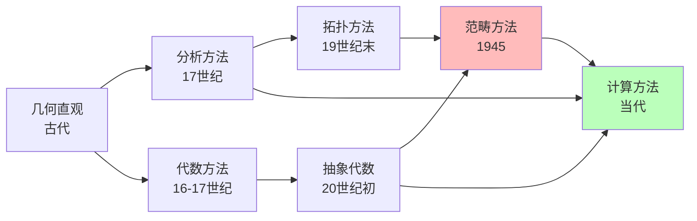

# 数学方法论演变

> **方法论演进**：几何直观 → 分析方法 → 代数方法 → 拓扑方法 → 范畴方法 → 计算方法

---

## 方法论演进总览

```mermaid
graph TD
    Root[数学方法论演变] --> Ancient[古代<br/>几何直观]
    Root --> Classical[近代<br/>分析计算]
    Root --> Modern[现代<br/>代数抽象]
    Root --> Contemporary[当代<br/>多元综合]

    Ancient --> Geometric[几何直观法<br/>Euclid/Archimedes]
    Ancient --> Algorithmic[算法构造法<br/>东方传统]

    Classical --> Analytic[分析方法<br/>Newton/Leibniz]
    Classical --> Algebraic[代数方法<br/>Descartes/Viète]

    Modern --> AbstractAlgebra[抽象代数法<br/>Noether/Bourbaki]
    Modern --> Topological[拓扑方法<br/>Poincaré]
    Modern --> Axiomatic[公理化方法<br/>Hilbert]

    Contemporary --> Categorical[范畴方法<br/>Eilenberg-Mac Lane]
    Contemporary --> Computational[计算方法<br/>计算机时代]
    Contemporary --> Structural[结构方法<br/>统一化]

    Geometric --> G1[图形思维]
    Geometric --> G2[尺规作图]
    Geometric --> G3[直观洞察]

    Analytic --> A1[极限过程]
    Analytic --> A2[无穷级数]
    Analytic --> A3[微分方程]

    AbstractAlgebra --> AA1[结构研究]
    AbstractAlgebra --> AA2[同态映射]
    AbstractAlgebra --> AA3[公理系统]

    Topological --> T1[连续变形]
    Topological --> T2[不变量]
    Topological --> T3[整体性质]

    Categorical --> C1[关系优先]
    Categorical --> C2[泛性质]
    Categorical --> C3[函子性]

    Computational --> CP1[算法实现]
    Computational --> CP2[数值计算]
    Computational --> CP3[符号计算]
    Computational --> CP4[形式化验证]

    style Root fill:#f9f,stroke:#333,stroke-width:4px
    style Geometric fill:#bbf
    style Analytic fill:#fbb
    style AbstractAlgebra fill:#bfb
    style Topological fill:#bbf
    style Categorical fill:#fbb
    style Computational fill:#bfb
```



---

## 各时期方法论详解

### 一、古代时期（几何直观与算法构造）

#### 1. 几何直观法（希腊传统）

| 特征 | 内容 |
|------|------|
| **核心** | 以图形为思维媒介，通过视觉洞察发现定理 |
| **工具** | 尺规作图、图形证明 |
| **代表** | Euclid《几何原本》、Archimedes穷竭法 |
| **优点** | 直观、启发性强 |
| **局限** | 难以处理复杂问题，严格性依赖公理 |

**Euclid的方法论**：

- 从公设出发
- 演绎推理
- 图形辅助
- 构造性证明

#### 2. 算法构造法（东方传统）

| 特征 | 内容 |
|------|------|
| **核心** | 问题-算法-应用的模式 |
| **工具** | 算筹、算盘、机械化算法 |
| **代表** | 《九章算术》、刘徽、祖冲之 |
| **优点** | 实用、计算精确 |
| **局限** | 缺乏系统理论 |

---

### 二、近代时期（分析与代数）

#### 1. 分析方法（17-19世纪）

| 特征 | 内容 |
|------|------|
| **核心** | 极限过程、无穷小、变化与累积 |
| **工具** | 微分、积分、无穷级数 |
| **代表** | Newton、Leibniz、Euler、Cauchy |
| **突破** | 从静态到动态，从有限到无穷 |
| **局限** | 基础不严格（19世纪前） |

**分析方法的革命**：

```
静态数学 → 动态数学
常量 → 变量
固定图形 → 运动曲线
特定数值 → 变化率
```

#### 2. 代数方法（符号化）

| 特征 | 内容 |
|------|------|
| **核心** | 符号运算、方程求解 |
| **工具** | 代数符号、坐标系 |
| **代表** | Viète、Descartes、Galois |
| **突破** | 数形结合，代数化几何 |
| **发展** | 从具体方程到抽象代数结构 |

**Descartes的解析几何**：

```
几何问题 → 代数方程
曲线性质 → 方程分析
几何直观 + 代数计算
```

---

### 三、现代时期（抽象化与公理化）

#### 1. 抽象代数方法（19世纪末-20世纪）

| 特征 | 内容 |
|------|------|
| **核心** | 研究代数结构而非具体计算 |
| **工具** | 群、环、域、模、同态 |
| **代表** | Noether、van der Waerden、Bourbaki |
| **突破** | 从具体例子到抽象结构 |
| **口号** | "关系比对象更重要"（Noether） |

**抽象化的层次**：

```
具体方程 → 代数系统
计算技巧 → 结构理论
个别例子 → 一般定理
```

#### 2. 拓扑方法（19世纪末-20世纪）

| 特征 | 内容 |
|------|------|
| **核心** | 研究连续变形下的不变性质 |
| **工具** | 同调、同伦、K理论 |
| **代表** | Poincaré、Eilenberg-Steenrod、Serre |
| **突破** | 从局部到整体，从个体到不变量 |
| **意义** | 定性研究方法 |

**拓扑方法的特点**：

- 连续性优先
- 不变量研究
- 整体性质
- 定性而非定量

#### 3. 公理化方法（20世纪）

| 特征 | 内容 |
|------|------|
| **核心** | 从公理出发构建理论体系 |
| **工具** | 形式系统、逻辑推导 |
| **代表** | Hilbert、Bourbaki |
| **突破** | 严格性、普遍性、统一性 |
| **影响** | 现代数学的标准范式 |

**公理化方法的步骤**：

1. 明确基本概念
2. 陈述公理
3. 逻辑推导定理
4. 研究模型的存在性和唯一性

---

### 四、当代时期（统一与计算）

#### 1. 范畴方法（20世纪中-）

| 特征 | 内容 |
|------|------|
| **核心** | 关系优先，函子性，泛性质 |
| **工具** | 范畴、函子、自然变换、伴随 |
| **代表** | Eilenberg-Mac Lane、Grothendieck、Lawvere |
| **突破** | 统一各种数学结构，揭示深层联系 |
| **应用** | 代数几何、逻辑学、计算机科学 |

**范畴方法的核心思想**：

```
对象 ↔ 态射（结构保持映射）
结构 ↔ 函子（结构保持映射）
关系 ↔ 自然变换
```

**泛性质（Universal Property）**：

- 表征性定义
- 唯一性
- 普适性

#### 2. 计算方法（计算机时代）

| 特征 | 内容 |
|------|------|
| **核心** | 算法实现、计算机辅助 |
| **工具** | 算法、数值方法、符号计算、证明助手 |
| **代表** | Turing、von Neumann、当代计算数学家 |
| **突破** | 处理大规模问题，验证复杂证明 |
| **方向** | 数值计算、符号计算、形式化验证 |

**计算方法的层次**：

| 层次 | 内容 | 工具 |
|------|------|------|
| 数值计算 | 近似解、模拟 | MATLAB、NumPy |
| 符号计算 | 精确代数运算 | Mathematica、Maple |
| 自动证明 | 定理自动发现/证明 | 自动推理系统 |
| 形式化验证 | 计算机可验证的证明 | Lean、Coq、Isabelle |

#### 3. 结构统一方法（当代）

| 特征 | 内容 |
|------|------|
| **核心** | 寻找不同领域的深层联系 |
| **工具** | Langlands纲领、指标定理、镜面对称 |
| **代表** | Langlands、Atiyah-Singer、Witten |
| **突破** | 数论-表示论-几何的统一 |
| **趋势** | 跨学科融合 |

**Langlands纲领**：

```
数论 ↔ 表示论 ↔ 几何
    ↕
  L-函数
```

---

## 方法论对比

### 对比矩阵

| 方法论 | 核心特征 | 主要工具 | 典型应用 | 优点 | 局限 |
|--------|----------|----------|----------|------|------|
| 几何直观 | 图形思维 | 尺规、图形 | 初等几何 | 直观启发 | 难以严格化 |
| 分析方法 | 极限过程 | 微积分 | 物理、工程 | 处理变化 | 基础复杂 |
| 代数方法 | 符号运算 | 群环域 | 代数方程 | 精确计算 | 抽象性 |
| 拓扑方法 | 连续变形 | 同调同伦 | 定性研究 | 整体视野 | 计算困难 |
| 范畴方法 | 关系优先 | 函子 | 统一理论 | 揭示联系 | 高度抽象 |
| 计算方法 | 算法实现 | 计算机 | 大规模问题 | 精确/快速 | 验证问题 |

### 演进关系



---

## 方法论选择指南

### 问题类型与方法匹配

| 问题类型 | 推荐方法 | 理由 |
|----------|----------|------|
| 几何形状 | 几何直观 + 拓扑方法 | 空间直觉、不变量 |
| 变化过程 | 分析方法 | 极限、微分方程 |
| 对称性 | 代数方法 | 群论 |
| 结构关系 | 范畴方法 | 函子、泛性质 |
| 大规模计算 | 计算方法 | 效率、精度 |
| 严格证明 | 公理化 + 形式化 | 可靠性 |

### 现代数学的趋势

1. **多元综合**：单一方法难以解决复杂问题，需要多种方法综合
2. **计算与理论结合**：计算机既是工具也是方法论
3. **跨学科融合**：数学与物理、计算机科学的深度交叉
4. **抽象与具体并重**：高度抽象的理论需要具体例子的支撑

---

## 方法论演进的启示

### 1. 累积性与革命性

数学方法论的演进既有累积性，也有革命性：

- **累积性**：旧方法不消失，而是成为新工具
- **革命性**：新范式的引入带来质的飞跃

### 2. 抽象化趋势

从具体到抽象是数学发展的主线：

```
具体计算 → 一般算法 → 抽象结构 → 泛性质
```

### 3. 统一化追求

从分散到统一是数学发展的另一主线：

```
分散分支 → 发现联系 → 统一理论 → 更高抽象
```

### 4. 严格性标准

严格性标准不断提升：

```
直观 → 分析严格化 → 公理化 → 形式化验证
```

---

## 总结

数学方法论的演进历程：

1. **古代**：几何直观与算法构造两种传统并存

2. **近代**：分析方法（微积分）和代数方法（符号化）的革命

3. **现代**：抽象代数方法、拓扑方法、公理化方法的系统化

4. **当代**：范畴方法（关系优先）、计算方法（计算机辅助）、结构统一方法（Langlands纲领等）

这一演进展示了数学从具体到抽象、从分散到统一、从手工到计算的发展趋势。理解这些方法论的特点和适用范围，有助于选择合适的方法解决数学问题。

当代数学的特点是**多元综合**：没有单一的最佳方法，而是根据问题的性质选择最合适的方法组合。几何直观、代数抽象、分析计算、拓扑洞察、范畴关系、计算机验证——这些方法论工具共同构成了现代数学家的武器库。

---

*文档编号：16*
*创建日期：2026年4月*
*所属项目：FormalMath 第十批推进计划*
*方法论演进：几何直观 → 分析方法 → 代数方法 → 拓扑方法 → 范畴方法 → 计算方法*
*核心特征：从具体到抽象、从分散到统一、从手工到计算*
