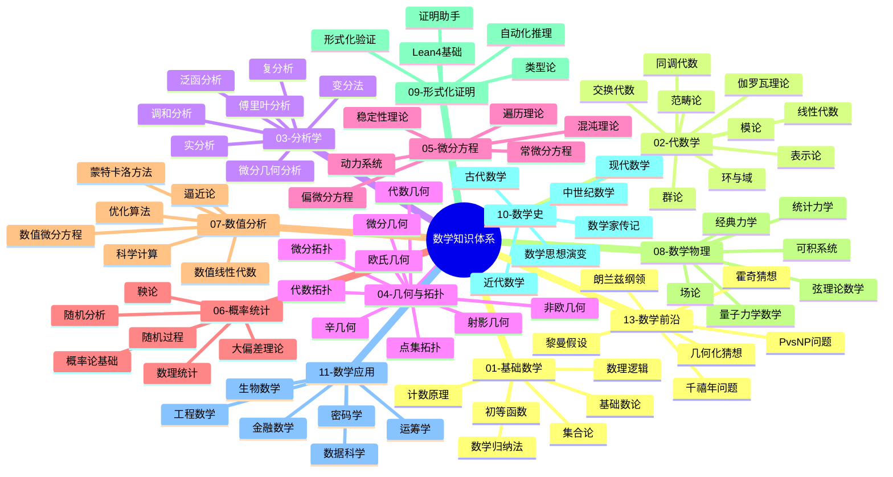
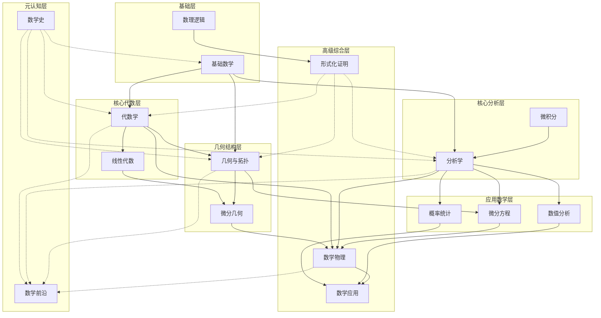
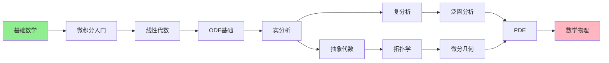
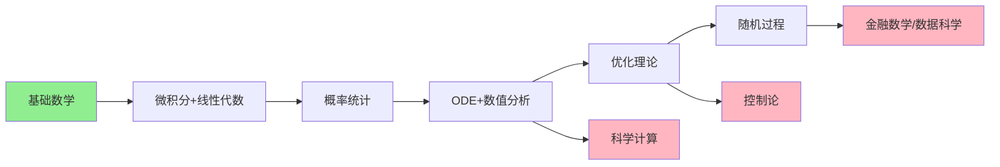
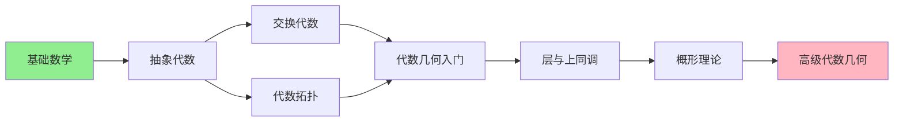
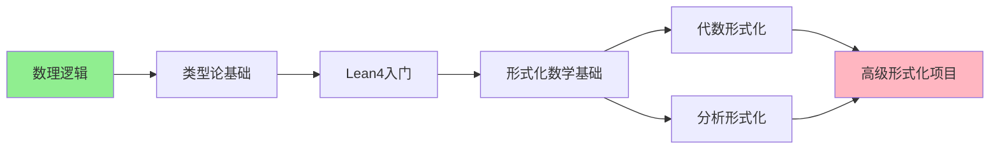
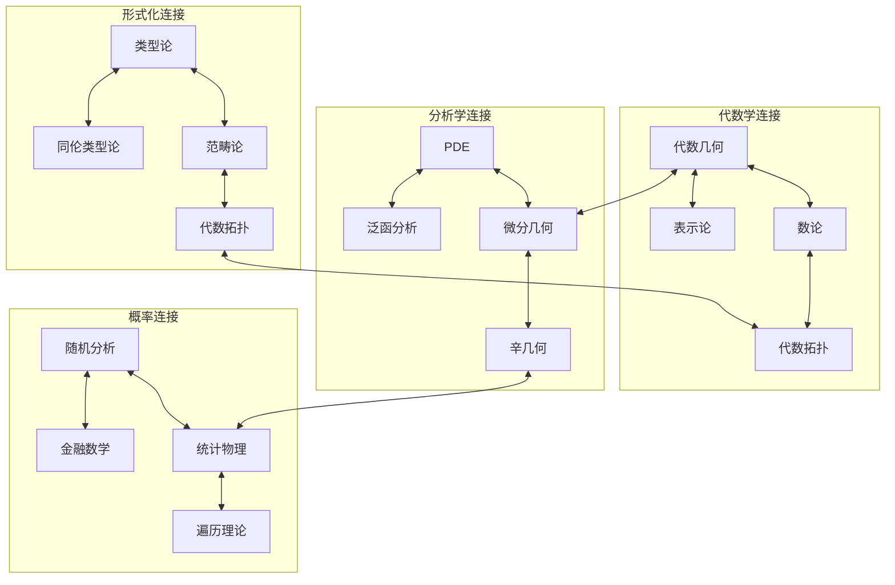

# 知识体系全景图

> 本文档提供FormalMath项目完整的知识体系概览，包含12个主分支的思维导图、核心概念索引、分支间依赖关系及学习路径推荐。

---

## 📊 十二主分支总览思维导图



---

## 🔄 分支间依赖关系图



---

## 📚 各分支核心概念快速索引

### 01-基础数学
| 核心概念 | 关键词 | 难度 | 前置知识 |
|---------|-------|------|---------|
| 集合论 | 公理化、基数、序数 | ⭐⭐ | 无 |
| 数理逻辑 | 命题逻辑、一阶逻辑、证明论 | ⭐⭐⭐ | 集合论 |
| 数学归纳法 | 强归纳、结构归纳、超限归纳 | ⭐⭐ | 无 |
| 基础数论 | 整除、同余、素数 | ⭐⭐ | 无 |
| 计数原理 | 排列组合、容斥原理 | ⭐⭐ | 无 |
| 初等函数 | 多项式、指数、对数 | ⭐ | 无 |

### 02-代数学
| 核心概念 | 关键词 | 难度 | 前置知识 |
|---------|-------|------|---------|
| 群论 | 同态、商群、Sylow定理 | ⭐⭐⭐ | 基础数学 |
| 环与域 | 理想、整环、域扩张 | ⭐⭐⭐ | 群论 |
| 线性代数 | 向量空间、线性变换、特征值 | ⭐⭐⭐ | 基础数学 |
| 模论 | 自由模、投射模、内射模 | ⭐⭐⭐⭐ | 线性代数、环论 |
| 表示论 | 群表示、特征标 | ⭐⭐⭐⭐ | 群论、线性代数 |
| 同调代数 | 复形、导出函子、Ext/Tor | ⭐⭐⭐⭐⭐ | 模论 |
| 范畴论 | 函子、自然变换、极限 | ⭐⭐⭐⭐ | 抽象代数 |
| 伽罗瓦理论 | 域自同构、可解群 | ⭐⭐⭐⭐⭐ | 域论、群论 |

### 03-分析学
| 核心概念 | 关键词 | 难度 | 前置知识 |
|---------|-------|------|---------|
| 实分析 | 测度论、Lebesgue积分、收敛 | ⭐⭐⭐⭐ | 微积分 |
| 复分析 | 全纯函数、留数、共形映射 | ⭐⭐⭐⭐ | 实分析 |
| 泛函分析 | Banach空间、Hilbert空间、算子 | ⭐⭐⭐⭐⭐ | 实分析、线性代数 |
| 傅里叶分析 | Fourier变换、卷积、分布 | ⭐⭐⭐⭐ | 实分析 |
| 变分法 | Euler-Lagrange方程、极值 | ⭐⭐⭐⭐ | 微积分、ODE |
| 调和分析 | 极大函数、奇异积分 | ⭐⭐⭐⭐⭐ | 实分析、傅里叶分析 |

### 04-几何与拓扑
| 核心概念 | 关键词 | 难度 | 前置知识 |
|---------|-------|------|---------|
| 欧氏几何 | 公理、全等、相似 | ⭐⭐ | 基础数学 |
| 非欧几何 | 双曲几何、椭圆几何 | ⭐⭐⭐ | 欧氏几何 |
| 微分几何 | 流形、曲率、联络 | ⭐⭐⭐⭐⭐ | 微积分、线性代数 |
| 代数几何 | 概形、层、上同调 | ⭐⭐⭐⭐⭐ | 交换代数、拓扑 |
| 点集拓扑 | 连续性、紧性、连通性 | ⭐⭐⭐ | 分析学 |
| 代数拓扑 | 同伦、同调、上同调 | ⭐⭐⭐⭐ | 点集拓扑、代数 |
| 微分拓扑 | 横截性、配边、示性类 | ⭐⭐⭐⭐⭐ | 微分几何、代数拓扑 |
| 辛几何 | 辛流形、Hamilton系统 | ⭐⭐⭐⭐⭐ | 微分几何、分析学 |

### 05-微分方程
| 核心概念 | 关键词 | 难度 | 前置知识 |
|---------|-------|------|---------|
| 常微分方程 | 初值问题、稳定性、相图 | ⭐⭐⭐ | 微积分 |
| 偏微分方程 | 椭圆/抛物/双曲型、边值问题 | ⭐⭐⭐⭐⭐ | 分析学、ODE |
| 动力系统 | 迭代、吸引子、分岔 | ⭐⭐⭐⭐ | ODE、拓扑 |
| 稳定性理论 | Lyapunov稳定性、中心流形 | ⭐⭐⭐⭐ | ODE |
| 混沌理论 | 敏感依赖、拓扑混合 | ⭐⭐⭐⭐ | 动力系统 |
| 遍历理论 | 保测变换、Birkhoff定理 | ⭐⭐⭐⭐⭐ | 测度论、动力系统 |

### 06-概率统计
| 核心概念 | 关键词 | 难度 | 前置知识 |
|---------|-------|------|---------|
| 概率论基础 | 概率空间、随机变量、期望 | ⭐⭐⭐ | 分析学 |
| 随机过程 | Markov过程、鞅、布朗运动 | ⭐⭐⭐⭐ | 概率论 |
| 数理统计 | 估计、假设检验、置信区间 | ⭐⭐⭐ | 概率论 |
| 随机分析 | Itô积分、SDE、鞅表示 | ⭐⭐⭐⭐⭐ | 随机过程、分析学 |
| 大偏差理论 | 速率函数、Varadhan原理 | ⭐⭐⭐⭐⭐ | 概率论、分析学 |

### 07-数值分析
| 核心概念 | 关键词 | 难度 | 前置知识 |
|---------|-------|------|---------|
| 数值线性代数 | 矩阵分解、迭代法、特征值 | ⭐⭐⭐ | 线性代数 |
| 数值微分方程 | 有限差分、有限元、谱方法 | ⭐⭐⭐⭐ | ODE/PDE |
| 逼近论 | 插值、最佳逼近、正交多项式 | ⭐⭐⭐ | 分析学 |
| 优化算法 | 梯度下降、牛顿法、凸优化 | ⭐⭐⭐⭐ | 微积分、线性代数 |
| 蒙特卡洛方法 | 随机采样、方差缩减、MCMC | ⭐⭐⭐ | 概率论 |

### 08-数学物理
| 核心概念 | 关键词 | 难度 | 前置知识 |
|---------|-------|------|---------|
| 经典力学 | Lagrange/Hamilton形式、辛几何 | ⭐⭐⭐⭐ | 微积分、ODE |
| 量子力学数学 | 算子理论、谱理论 | ⭐⭐⭐⭐⭐ | 泛函分析 |
| 统计力学 | 系综、热力学极限、相变 | ⭐⭐⭐⭐ | 概率论、分析学 |
| 场论 | 规范场、Yang-Mills理论 | ⭐⭐⭐⭐⭐ | 微分几何、PDE |
| 可积系统 | Lax对、逆散射、孤子 | ⭐⭐⭐⭐⭐ | PDE、代数几何 |

### 09-形式化证明
| 核心概念 | 关键词 | 难度 | 前置知识 |
|---------|-------|------|---------|
| Lean4基础 | 类型、证明、策略 | ⭐⭐⭐ | 数理逻辑 |
| 类型论 | 依赖类型、归纳类型、同伦类型论 | ⭐⭐⭐⭐ | 数理逻辑 |
| 证明助手 | Coq、Isabelle、Agda | ⭐⭐⭐⭐ | 类型论 |
| 形式化验证 | 程序验证、模型检验 | ⭐⭐⭐⭐ | 逻辑、计算机科学 |
| 自动化推理 | SAT求解、SMT、定理证明器 | ⭐⭐⭐⭐ | 数理逻辑 |

### 10-数学史
| 核心概念 | 关键词 | 难度 | 前置知识 |
|---------|-------|------|---------|
| 古代数学 | 巴比伦、埃及、希腊、中国、印度 | ⭐⭐ | 无 |
| 近代数学 | 解析几何、微积分创立 | ⭐⭐⭐ | 基础数学 |
| 现代数学 | 集合论、抽象代数、泛函分析 | ⭐⭐⭐ | 现代数学各分支 |
| 数学家传记 | Newton、Euler、Gauss、Riemann | ⭐⭐ | 数学史 |
| 数学思想演变 | 公理化、结构化、形式化 | ⭐⭐⭐ | 数学各分支 |

### 11-数学应用
| 核心概念 | 关键词 | 难度 | 前置知识 |
|---------|-------|------|---------|
| 工程数学 | 信号处理、控制理论 | ⭐⭐⭐ | 分析学、ODE |
| 金融数学 | Black-Scholes、风险度量 | ⭐⭐⭐⭐ | 随机分析 |
| 生物数学 | 种群动力学、神经模型 | ⭐⭐⭐ | ODE、概率论 |
| 数据科学 | 机器学习、统计学习 | ⭐⭐⭐ | 统计、优化 |
| 密码学 | RSA、椭圆曲线、格密码 | ⭐⭐⭐⭐ | 数论、代数 |
| 运筹学 | 线性规划、博弈论、排队论 | ⭐⭐⭐ | 优化、概率论 |

### 13-数学前沿
| 核心概念 | 关键词 | 难度 | 前置知识 |
|---------|-------|------|---------|
| 朗兰兹纲领 | 自守形式、Galois表示 | ⭐⭐⭐⭐⭐ | 代数数论、表示论 |
| 几何化猜想 | 3-流形、Thurston几何 | ⭐⭐⭐⭐⭐ | 拓扑、几何 |
| PvsNP问题 | 计算复杂性、电路复杂性 | ⭐⭐⭐⭐⭐ | 计算理论 |
| 霍奇猜想 | 代数循环、Hodge结构 | ⭐⭐⭐⭐⭐ | 代数几何 |
| 黎曼假设 | 素数分布、ζ函数 | ⭐⭐⭐⭐⭐ | 解析数论 |

---

## 🎯 学习路径推荐

### 路径一：经典数学路径（从入门到精通）



**阶段划分：**
| 阶段 | 内容 | 预计时间 | 目标 |
|-----|------|---------|------|
| 入门 | 基础数学+微积分 | 6个月 | 建立数学直觉 |
| 基础 | 线性代数+ODE+离散数学 | 8个月 | 掌握核心工具 |
| 进阶 | 实分析+复分析+抽象代数 | 12个月 | 抽象思维 |
| 深入 | 拓扑+泛函分析+微分几何 | 12个月 | 现代数学 |
| 精通 | PDE+代数几何+数学物理 | 24个月 | 研究前沿 |

### 路径二：应用数学路径



### 路径三：代数几何路径



### 路径四：形式化数学路径



---

## 🔗 跨分支连接热点



---

## 📈 知识体系复杂度分布

```mermaid
xychart-beta
    title "各分支知识复杂度分布"
    x-axis [基础数学, 代数学, 分析学, 几何拓扑, 微分方程, 概率统计, 数值分析, 数学物理, 形式化证明, 数学史, 数学应用, 数学前沿]
    y-axis "相对复杂度" 0 --> 10
    bar [2, 6, 7, 8, 7, 6, 5, 8, 6, 2, 5, 10]
```

---

## 📋 快速导航

| 分支 | 思维导图 | 核心内容 | 难度 |
|-----|---------|---------|------|
| 01-基础数学 | [基础数学思维导图](01-基础数学/00-基础数学思维导图.md) | 集合、逻辑、归纳 | ⭐⭐ |
| 02-代数学 | [代数学思维导图](02-代数学/00-代数学思维导图.md) | 群环域、线性代数 | ⭐⭐⭐ |
| 03-分析学 | [分析学思维导图](03-分析学/00-分析学思维导图.md) | 实复分析、泛函 | ⭐⭐⭐⭐ |
| 04-几何与拓扑 | [几何与拓扑思维导图](04-几何与拓扑/00-几何与拓扑思维导图.md) | 微分几何、拓扑 | ⭐⭐⭐⭐ |
| 05-微分方程 | [微分方程思维导图](05-微分方程/00-微分方程思维导图.md) | ODE、PDE、动力系统 | ⭐⭐⭐⭐ |
| 06-概率统计 | [概率统计思维导图](06-概率统计/00-概率统计思维导图.md) | 概率、统计、随机 | ⭐⭐⭐⭐ |
| 07-数值分析 | [数值分析思维导图](07-数值分析/00-数值分析思维导图.md) | 数值方法、算法 | ⭐⭐⭐ |
| 08-数学物理 | [数学物理思维导图](08-数学物理/00-数学物理思维导图.md) | 物理数学基础 | ⭐⭐⭐⭐⭐ |
| 09-形式化证明 | [形式化证明思维导图](09-形式化证明/00-形式化证明思维导图.md) | Lean4、类型论 | ⭐⭐⭐⭐ |
| 10-数学史 | [数学史思维导图](10-数学史/00-数学史思维导图.md) | 历史发展、思想 | ⭐⭐ |
| 11-数学应用 | [数学应用思维导图](11-数学应用/00-数学应用思维导图.md) | 应用领域 | ⭐⭐⭐ |
| 13-数学前沿 | [数学前沿思维导图](13-数学前沿/00-数学前沿思维导图.md) | 未解决问题 | ⭐⭐⭐⭐⭐ |

---

## 🎓 学习建议

### 初学者建议
1. **从基础开始**：扎实掌握集合论、逻辑和数学归纳法
2. **重视直觉**：在形式化之前建立几何直观
3. **勤做练习**：数学是练出来的，不是看出来的
4. **跨分支联系**：注意不同分支间的类比和联系

### 进阶学习建议
1. **重视证明**：理解定理证明比记住定理更重要
2. **抽象思维**：逐步适应更高层次的抽象
3. **阅读经典**：研读大师原著，理解思想脉络
4. **形式化辅助**：使用Lean4验证理解

### 研究准备建议
1. **深入专精**：选择一个方向深入钻研
2. **跟踪前沿**：关注arXiv最新论文
3. **参与社区**：加入数学讨论社区
4. **形式化贡献**：参与Lean4数学库建设

---

> 💡 **提示**：本文档是知识体系的导航图，详细内容请查看各分支的专门思维导图。
