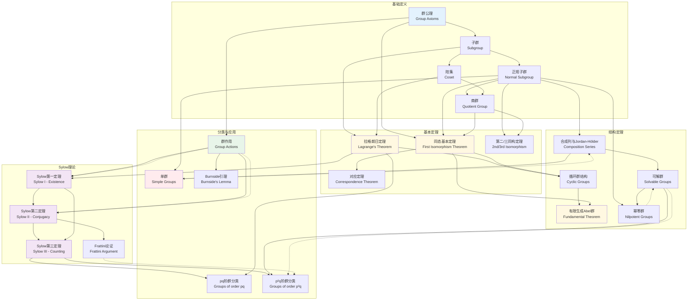

# 代数群论定理依赖网络

## 图谱说明

本图谱展示了群论中重要定理之间的逻辑依赖关系。从群的基本定义出发，逐步构建到结构定理和分类定理，揭示群论知识体系的内聚结构。

### 设计理念

- **定理层次**: 按定理的抽象程度和重要性分层
- **证明依赖**: 展示定理证明过程中需要引用的其他定理
- **应用领域**: 标注定理的典型应用场景

---

## Mermaid 图表



---

## 关键节点解释

### 🔵 基础定义层

| 节点 | 概念 | 核心内容 |
|------|------|----------|
| **A** | 群公理 | 封闭性、结合律、单位元、逆元 |
| **B** | 子群 | 子群判定、生成子群、陪集分解 |
| **C** | 陪集 | 左/右陪集、指数、拉格朗日前置 |
| **D** | 正规子群 | 正规性判定、核与像、商群构造 |
| **E** | 商群 | 商运算良定义、典范同态 |

### 🟡 基本定理层（核心）

| 节点 | 定理 | 内容 | 重要性 |
|------|------|------|--------|
| **F** | **拉格朗日定理** | H ≤ G ⇒ |H| 整除 |G| | ⭐⭐⭐ 有限群论基石 |
| **G** | **同态基本定理** | G/ker(φ) ≅ im(φ) | ⭐⭐⭐ 群同态核心 |
| **H** | 对应定理 | 子群与商群子群的一一对应 | ⭐⭐ 结构分析工具 |
| **I** | 第二/三同构定理 | HK/H ≅ K/(H∩K) 等 | ⭐⭐ 计算技巧 |

### 🟡 结构定理层（核心）

| 节点 | 定理 | 内容 | 应用 |
|------|------|------|------|
| **J** | 循环群结构 | 循环群分类、自同构群 | 最简群结构理解 |
| **K** | **有限生成Abel群基本定理** | 直积分解为循环群 | ⭐⭐⭐ Abel群完全分类 |
| **L** | Jordan-Hölder定理 | 合成列的唯一性 | 有限单群分类基础 |
| **M** | 可解群理论 | 导出列、可解性判定 | Galois理论核心 |
| **N** | 幂零群理论 | 降中心列、上中心列 | Lie群、p-群研究 |

### 🟣 Sylow理论层（高级）

| 节点 | 定理 | 内容 | 意义 |
|------|------|------|------|
| **O** | **Sylow第一定理** | p-Sylow子群存在性 | 存在性保证 |
| **P** | **Sylow第二定理** | p-Sylow子群互相共轭 | 唯一性模共轭 |
| **Q** | **Sylow第三定理** | n_p ≡ 1 (mod p), n_p | |G| | 计数约束 |
| **R** | Frattini论证 | G = N_G(P)N | 正规化子技术 |

### 🔴 分类应用层

| 节点 | 主题 | 内容 |
|------|------|------|
| **U** | 单群 | 正规子群仅有 {e} 和 G，有限单群分类大事记 |
| **V** | 群作用 | 轨道-稳定子定理、类方程 |
| **W** | Burnside引理 | 轨道计数、着色问题 |

---

## 定理依赖深度分析

### 核心依赖链

```
群公理 → 子群/陪集 → 拉格朗日定理 → Sylow定理 → 有限群分类
```

```
正规子群 → 同态基本定理 → 对应定理 → Jordan-Hölder → 单群理论
```

```
群作用 → 类方程 → Sylow定理 → Frattini论证 → 可解群判定
```

### 证明复杂度层次

| 层次 | 定理集合 | 典型证明长度 |
|------|----------|--------------|
| L1 | 拉格朗日、同态基本定理 | 1-2页 |
| L2 | 对应定理、同构定理 | 2-3页 |
| L3 | Jordan-Hölder、Abel群基本定理 | 3-5页 |
| L4 | Sylow三定理 | 5-8页 |
| L5 | 有限单群分类 | 数千页（全人类合作） |

---

## 使用指南

### 📖 学习路径建议

#### 初学者路径
```
群公理 → 子群 → 陪集 → 拉格朗日定理 → 正规子群 → 同态基本定理
```

#### 进阶路径
```
同态基本定理 → 对应定理 → Abel群基本定理 → 群作用 → Sylow定理
```

#### 研究路径
```
Sylow理论 → 可解群 → 幂零群 → 单群 → 有限群分类
```

### 🔗 相关资源

- [群论基础](../algebra/群论基础.md)
- [正规子群与商群](../algebra/正规子群.md)
- [Sylow定理详解](../algebra/Sylow定理.md)
- [群同态与同构](../algebra/群同态.md)

### 📝 推荐教材

- 《代数学引论》聂灵沼
- 《Algebra》Serge Lang
- 《Abstract Algebra》Dummit & Foote
- 《Finite Group Theory》Isaacs

---

## 图谱更新记录

| 日期 | 版本 | 更新内容 |
|------|------|----------|
| 2026-04-10 | v1.0 | 初始版本，包含群论核心定理依赖网络 |

---

*本图谱由 FormalMath 项目维护，如有建议欢迎提交 Issue。*
