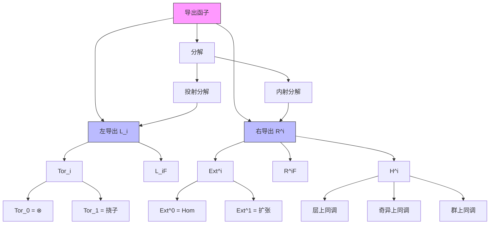

# 同调代数 - 导出函子关系图谱

**表征类型**: 知识图谱

---

## 核心关系图



---

## 函子关系表

| 函子 | 正合性 | 导出 | 计算 | 应用 |
|------|--------|------|------|------|
| ⊗ | 右正合 | Tor | 投射分解 | 挠子、平坦性 |
| Hom | 左正合 | Ext | 内射分解 | 扩张、障碍 |
| Γ | 左正合 | H^i | 内射分解 | 层上同调 |
| f_* | 左正合 | R^if_* | 内射分解 | 高阶直接像 |

---

## 学习路径

```
同调代数基础
│
├─ 正合序列
├─ 投射/内射模
│
├─ 导出函子定义
│   ├─ 左导出
│   └─ 右导出
│
├─ Tor与Ext
│
└─ 应用
    ├─ 代数：扩张分类
    ├─ 几何：层上同调
    └─ 拓扑：奇异同调
```

---

**图谱设计**: AI Assistant  
**最后更新**: 2026年4月10日
