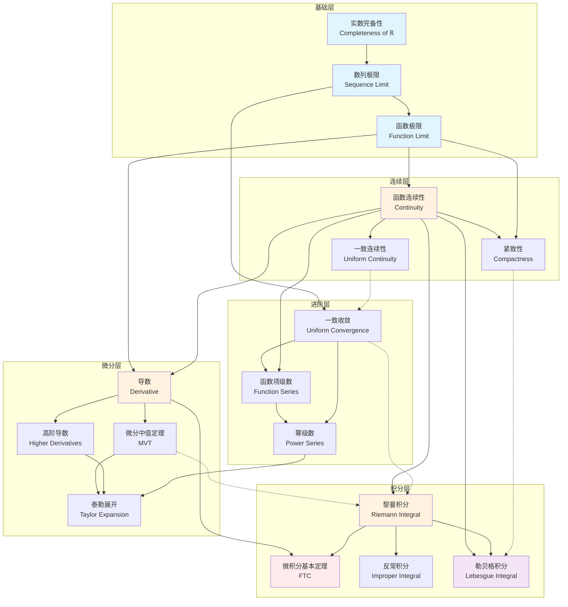

# 实分析核心概念关系图谱

## 图谱说明

本图谱展示了实分析领域中核心概念之间的逻辑依赖关系。从最基本的极限概念出发，逐步构建到连续、微分、积分等高级概念，形成完整的知识体系。

### 设计理念

- **层次递进**: 从基础概念到高级概念逐层展开
- **逻辑依赖**: 明确标注概念之间的先修关系
- **交叉关联**: 展示不同分支之间的联系

---

## Mermaid 图表



---

## 关键节点解释

### 🔵 基础层（蓝色）

| 节点 | 概念 | 核心内容 |
|------|------|----------|
| **A** | 实数完备性 | 确界原理、单调收敛定理、区间套定理、有限覆盖定理 |
| **B** | 数列极限 | ε-N定义、唯一性、有界性、保号性、四则运算 |
| **C** | 函数极限 | ε-δ定义、单侧极限、海涅定理、柯西准则 |

### 🟠 连续层（橙色）

| 节点 | 概念 | 核心内容 |
|------|------|----------|
| **D** | 函数连续性 | 点连续、区间连续、间断点分类、连续函数性质 |
| **E** | 一致连续性 | 全局连续性、康托尔定理、利普希茨条件 |
| **F** | 紧致性 | 闭区间紧致、有限覆盖、序列紧致 |

### 🟠 微分层（橙色）

| 节点 | 概念 | 核心内容 |
|------|------|----------|
| **G** | 导数 | 导数定义、几何意义、可导与连续关系、求导法则 |
| **H** | 微分中值定理 | 罗尔定理、拉格朗日中值定理、柯西中值定理 |
| **I** | 泰勒展开 | 泰勒公式、麦克劳林展开、余项估计 |
| **J** | 高阶导数 | 高阶导数定义、莱布尼茨公式 |

### 🟠 积分层（橙色）

| 节点 | 概念 | 核心内容 |
|------|------|----------|
| **K** | 黎曼积分 | 分割、黎曼和、可积条件、可积函数类 |
| **L** | 微积分基本定理 | 牛顿-莱布尼茨公式、变上限积分 |
| **M** | 反常积分 | 无穷积分、瑕积分、收敛判别法 |
| **N** | 勒贝格积分 | 测度论基础、可测函数、勒贝格积分理论 |

### 🟣 进阶层（紫色）

| 节点 | 概念 | 核心内容 |
|------|------|----------|
| **O** | 函数项级数 | 逐点收敛、函数序列、和函数性质 |
| **P** | 一致收敛 | 一致收敛定义、魏尔斯特拉斯判别法、性质保持 |
| **Q** | 幂级数 | 收敛半径、逐项求导/积分、解析函数 |

### 🔴 核心定理（红色）

| 节点 | 概念 | 重要性 |
|------|------|--------|
| **L** | 微积分基本定理 | 连接微分与积分的桥梁，整个微积分的核心 |

---

## 概念依赖路径

### 标准学习路径

```
实数完备性 → 数列极限 → 函数极限 → 连续性 → 导数 → 微积分基本定理 → 黎曼积分
```

### 深度分析路径

```
函数极限 → 一致连续 → 一致收敛 → 幂级数 → 泰勒展开
```

### 现代分析路径

```
实数完备性 → 紧致性 → 勒贝格积分 → 测度论
```

---

## 使用指南

### 📖 如何使用本图谱

1. **学习规划**: 按照图谱层次自底向上学习，确保先修概念掌握牢固
2. **查漏补缺**: 遇到理解困难时，回溯检查前置概念是否清晰
3. **复习导航**: 快速定位概念在知识体系中的位置

### 🔗 相关资源

- [极限理论详细文档](../analysis/极限理论.md)
- [连续性专题](../analysis/连续性.md)
- [微分学基础](../analysis/微分学.md)
- [积分学理论](../analysis/积分学.md)

### 📝 扩展阅读

- 《数学分析》陈纪修
- 《Principles of Mathematical Analysis》Rudin
- 《实变函数论》周民强

---

## 图谱更新记录

| 日期 | 版本 | 更新内容 |
|------|------|----------|
| 2026-04-10 | v1.0 | 初始版本，包含核心概念依赖关系 |

---

*本图谱由 FormalMath 项目维护，如有建议欢迎提交 Issue。*
