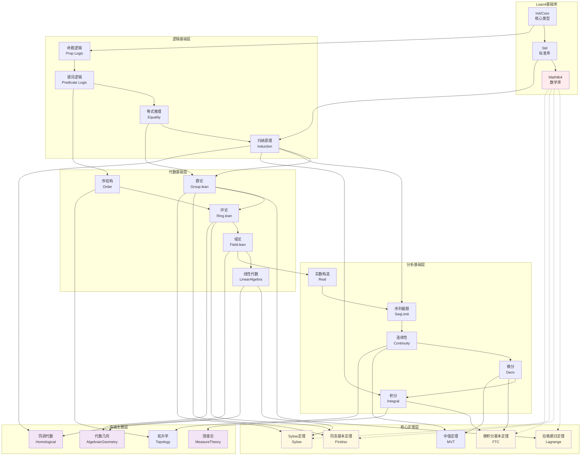

# 形式化 Lean4 定理映射图

## 图谱说明

本图谱展示了自然语言数学定理与 Lean4 形式化代码之间的对应关系。Lean4 是微软研究院开发的定理证明器和编程语言，被广泛用于数学形式化项目（如 Mathlib4、Liquid Tensor Experiment 等）。

### 设计理念

- **双向映射**: 连接自然语言描述与形式化实现
- **依赖追踪**: 展示定理证明中的依赖链
- **复杂度分层**: 按形式化难度组织内容

---

## Mermaid 图表



---

## 关键节点解释

### 🔴 Lean4基础库

| 节点 | 组件 | 说明 | 文档链接 |
|------|------|------|----------|
| **L1** | Init/Core | Lean4核心类型系统、归纳类型基础 | [Lean4 Core](https://leanprover.github.io/lean4/doc/) |
| **L2** | Std | 标准库，提供常用数据结构和算法 | [Std4](https://github.com/leanprover/std4) |
| **L3** | **Mathlib4** | 数学库，包含大量形式化数学 | [Mathlib4](https://leanprover-community.github.io/mathlib4_docs/) |

### 🔵 逻辑基础层

| 节点 | 概念 | Lean4实现 | 自然语言对应 |
|------|------|-----------|--------------|
| **B1** | 命题逻辑 | `Prop`, `∧`, `∨`, `→`, `¬` | 与或非蕴含否定 |
| **B2** | 谓词逻辑 | `∀`, `∃`, `fun x => P x` | 全称存在量词 |
| **B3** | 等式推理 | `Eq`, `rfl`, `rw` | 等式、自反性、重写 |
| **B4** | 归纳原理 | `inductive`, `rec`, `induction` | 数学归纳法、结构归纳 |

### 🟡 代数基础层

| 节点 | 主题 | Mathlib4位置 | 关键定义 |
|------|------|--------------|----------|
| **A1** | 群论 | `Mathlib/Algebra/Group/` | `Group`, `Subgroup`, `Homomorphism` |
| **A2** | 环论 | `Mathlib/Algebra/Ring/` | `Ring`, `Ideal`, `PrimeIdeal` |
| **A3** | 域论 | `Mathlib/Algebra/Field/` | `Field`, `AlgebraicClosure` |
| **A4** | 线性代数 | `Mathlib/LinearAlgebra/` | `Module`, `LinearMap`, `Basis` |
| **A5** | 序结构 | `Mathlib/Order/` | `PartialOrder`, `Lattice`, `CompleteLattice` |

### 🟡 分析基础层

| 节点 | 主题 | Mathlib4位置 | 关键概念 |
|------|------|--------------|----------|
| **N1** | 实数构造 | `Mathlib/Data/Real/` | Cauchy序列构造、Dedekind分割 |
| **N2** | 序列极限 | `Mathlib/Topology/MetricSpace/` | `Filter.Tendsto`, `atTop` |
| **N3** | 连续性 | `Mathlib/Topology/ContinuousOn/` | `Continuous`, `ContinuousOn` |
| **N4** | 微分 | `Mathlib/Calculus/Deriv/` | `deriv`, `Differentiable` |
| **N5** | 积分 | `Mathlib/MeasureTheory/Integral/` | `∫`, `Integrable`, `integral` |

### 🟡 核心定理层

| 节点 | 定理 | 自然语言表述 | Lean4表述 |
|------|------|--------------|-----------|
| **T1** | **拉格朗日定理** | H ≤ G ⇒ |H| 整除 |G| | `Subgroup.index_mul_card` |
| **T2** | **同态基本定理** | G/ker(φ) ≅ im(φ) | `QuotientGroup.quotientKerEquivRange` |
| **T3** | **Sylow第一定理** | p-Sylow子群存在 | `Sylow.exists_subgroup_card_pow_prime` |
| **T4** | **微积分基本定理** | ∫ₐᵇ f'(x)dx = f(b)-f(a) | `integral_deriv_eq_sub` |
| **T5** | **微分中值定理** | ∃c, f'(c) = (f(b)-f(a))/(b-a) | `exists_deriv_eq_slope` |

### 🟣 高级主题层

| 节点 | 主题 | Mathlib4位置 | 形式化状态 |
|------|------|--------------|------------|
| **H1** | 代数几何 | `Mathlib/AlgebraicGeometry/` | 活跃开发中 |
| **H2** | 同调代数 | `Mathlib/Algebra/Homological/` | 基础框架完成 |
| **H3** | 测度论 | `Mathlib/MeasureTheory/` | 非常成熟 |
| **H4** | 拓扑学 | `Mathlib/Topology/` | 非常成熟 |

---

## 定理映射对照表

### 代数定理

| 自然语言定理 | 数学表述 | Lean4定理名 | 文件位置 |
|--------------|----------|-------------|----------|
| 拉格朗日定理 | [G:H] = |G|/|H| | `index_mul_card` | `Group/Index.lean` |
| 同态基本定理 | G/ker φ ≅ im φ | `quotientKerEquivRange` | `QuotientGroup.lean` |
| 对应定理 | 子群与商群子群对应 | `comapEquiv` | `QuotientGroup.lean` |
| Sylow第一定理 | p-Sylow存在 | `exists_subgroup_card_pow_prime` | `Sylow.lean` |
| Sylow第三定理 | n_p ≡ 1 (mod p) | `card_sylow_modEq_one` | `Sylow.lean` |

### 分析定理

| 自然语言定理 | 数学表述 | Lean4定理名 | 文件位置 |
|--------------|----------|-------------|----------|
| 极限唯一性 | lim aₙ = L₁ = L₂ ⇒ L₁ = L₂ | `Tendsto_nhds_unique` | `Limits.lean` |
| 连续函数复合 | f,g连续 ⇒ f∘g连续 | `Continuous.comp` | `Continuous.lean` |
| 链式法则 | (f∘g)' = f'(g)·g' | `deriv_comp` | `Deriv.lean` |
| 微积分基本定理 | ∫ₐᵇ f' = f(b)-f(a) | `integral_deriv_eq_sub` | `FundThmCalculus.lean` |
| 分部积分 | ∫u dv = uv - ∫v du | `integral_mul_deriv_eq_deriv_mul` | `IntegrationByParts.lean` |

---

## 形式化复杂度分级

### ⭐ 初级（可直接形式化）

- 基本代数恒等式
- 简单不等式
- 有限集合的基数计算

### ⭐⭐ 中级（需要辅助引理）

- 初等数论定理
- 基本群论结果
- 序列极限计算

### ⭐⭐⭐ 高级（需要深入理论）

- Sylow定理完整证明
- 有限生成Abel群分类
- 微积分基本定理

### ⭐⭐⭐⭐ 研究级（需要大量工作）

- 代数几何中的深刻定理
- 同调代数的长正合列
- 测度论的收敛定理

### ⭐⭐⭐⭐⭐ 前沿（活跃研究领域）

- 费马大定理（已形式化）
- 液体张量实验（进行中）
- 朗兰兹纲领相关结果

---

## 使用指南

### 📖 如何使用本映射图

1. **查找形式化定理**: 通过自然语言名称定位Lean4实现
2. **理解证明结构**: 查看定理依赖关系，理解证明路径
3. **学习Lean4技巧**: 参考现有形式化代码的写作风格
4. **贡献新形式化**: 识别尚未形式化的重要定理

### 🛠️ Lean4入门路径

```
Lean4安装 → 基础语法 →  tactic学习 → 阅读Mathlib → 尝试证明
    ↓           ↓           ↓            ↓           ↓
  1小时       2小时       5小时       10小时+      持续
```

### 🔗 相关资源

- [Lean4官方文档](https://leanprover.github.io/lean4/doc/)
- [Mathlib4文档](https://leanprover-community.github.io/mathlib4_docs/)
- [Theorem Proving in Lean 4](https://leanprover.github.io/theorem_proving_in_lean4/)
- [Mathematics in Lean](https://leanprover-community.github.io/mathematics_in_lean/)
- [Lean4结构优化报告](../../00-Lean4结构优化报告.md)

### 📚 推荐学习资料

| 级别 | 资源 | 描述 |
|------|------|------|
| 入门 | *Functional Programming in Lean* | 函数式编程基础 |
| 基础 | *Theorem Proving in Lean 4* | 定理证明入门 |
| 进阶 | *Mathematics in Lean* | 数学形式化实践 |
| 高级 | Mathlib4源码 | 阅读实际形式化代码 |

---

## 贡献形式化代码

### 贡献流程

1. **选择目标**: 从项目Issues中选择待形式化定理
2. **建立依赖**: 确认前置引理是否已形式化
3. **编写证明**: 遵循Mathlib4编码规范
4. **提交PR**: 通过CI测试后合并

### 编码规范

- 使用 `camelCase` 命名定义
- 使用 `snake_case` 命名定理
- 提供详细的文档字符串
- 添加相关实例（instance）

---

## 图谱更新记录

| 日期 | 版本 | 更新内容 |
|------|------|----------|
| 2026-04-10 | v1.0 | 初始版本，包含Lean4与数学定理的映射关系 |

---

*本图谱由 FormalMath 项目维护，如有建议欢迎提交 Issue。*
