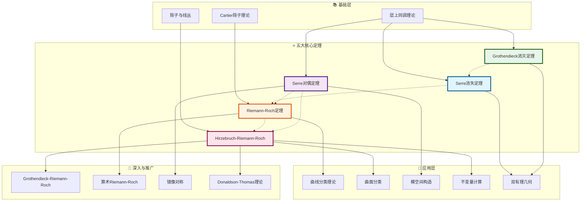

# 代数几何五大定理关系图

## 图谱概述

本文档展示代数几何中五大核心定理之间的关系网络：

1. **Serre消失定理 (Serre Vanishing)** - 高阶上同调的消失性
2. **Riemann-Roch定理** - 曲线/曲面上的 Euler 示性数公式
3. **Serre对偶定理 (Serre Duality)** - 上同调的完美配对
4. **Grothendieck消灭定理 (Grothendieck Vanishing)** - 高维上同调消失
5. **Hirzebruch-Riemann-Roch定理 (HRR)** - 一般簇上的 Riemann-Roch 推广

这些定理构成了现代代数几何的理论支柱，在曲线分类、曲面理论、模空间构造等领域具有核心作用。

## 定理关系图

## 定理详解

### 1. Serre消失定理 (1955)

**定理陈述**：设 X 是射影簇，F 是凝聚层，L 是丰沛线丛，则当 n 充分大时：
H^i(X, F ⊗ L^{⊗ n}) = 0, ∀ i > 0

**核心意义**：高阶上同调在丰沛扭转后消失，保证整体截影的丰富性。

**关键应用**：
- 射影嵌入的存在性
- 丰沛线丛的判据
- 高阶直像的消失

### 2. Riemann-Roch定理

**经典形式**（曲线）：
χ(F) = deg(F) + rk(F)(1-g)

**推广形式**（曲面）：
χ(O_X(D)) = (1/2)D.(D-K_X) + χ(O_X)

**核心意义**：拓扑不变量与代数不变量的深刻联系。

### 3. Serre对偶定理

**定理陈述**：设 X 是 n 维光滑射影簇，K_X 是典范丛：
H^i(X, F) ≅ H^{n-i}(X, K_X ⊗ F^*)^*

**推论**：
- 欧拉示性数的对称性
- 数值不变量的对偶关系
- Hodge理论的代数版本

### 4. Grothendieck消灭定理

**定理陈述**：对 n 维拓扑空间 X 上的任意层 F：
H^i(X, F) = 0, ∀ i > n

**意义**：上同调理论的维度约束，为计算提供有限性保证。

### 5. Hirzebruch-Riemann-Roch定理

**定理陈述**：对 n 维光滑射影簇 X 上的凝聚层 F：
χ(F) = ∫_X ch(F) · td(X)

**核心组成**：
- 陈特征 ch(F)：层的拓扑特征
- Todd类 td(X)：流形的内在不变量

**意义**：将代数几何与微分几何、拓扑学统一。

## 应用场景

### 场景一：曲线分类
使用 Riemann-Roch 定理和 Serre 对偶，可以：
- 确定线性系统的维数
- 刻画超椭圆曲线
- 计算曲线的模空间维数

### 场景二：曲面分类
Hirzebruch-Riemann-Roch 结合 Serre 对偶：
- 计算数值不变量 (q, p_g, χ)
- 建立 Noether 公式
- 完成 Enriques-Kodaira 分类

### 场景三：模空间理论
五大定理共同支撑：
- 稳定束模空间的构造
- 可构造层的导出范畴
- Donaldson-Thomas 不变量计算

## 相关资源

- [代数几何基础概念](../concept/algebraic-geometry/README.md)
- [Riemann-Roch定理专题](../concept/algebraic-geometry/riemann-roch.md)
- [层上同调理论](../concept/algebraic-geometry/sheaf-cohomology.md)

---
*创建于: 2026-04-10 | 版本: 1.0 | 分类: 代数几何*
