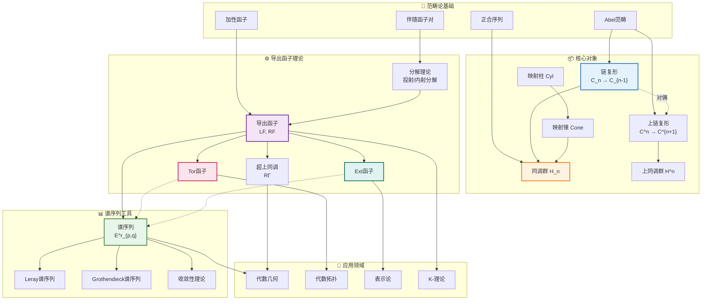

# 同调代数核心概念网络

## 图谱概述

同调代数是20世纪数学的重要分支，提供了研究代数结构的强有力的工具。本文档展示其核心概念间的关系网络：

- **范畴论基础**：Abel范畴、正合序列
- **核心对象**：复形、同调群
- **函子理论**：导出函子、Tor与Ext
- **计算工具**：谱序列、总导出函子

这些概念构成了现代代数几何、代数拓扑、表示论的理论基础。

## 概念关系图



## 核心概念详解

### 1. Abel范畴与正合性

**Abel范畴**是交换群范畴(Ab)的推广，要求：
- 存在零对象
- 任意态射有核与余核
- 每个单态射是某个态射的核
- 每个满态射是某个态射的余核

**典型例子**：模范畴、凝聚层范畴、有限生成Abel群范畴

**正合序列**：序列 ... → A → B → C → ... 在B处正合，如果 Im(f) = Ker(g)

### 2. 复形与同调

**链复形**：对象序列 C_n 配以边缘映射 ∂_n: C_n → C_{n-1}，满足 ∂_{n-1} ∘ ∂_n = 0

**同调群**：H_n(C) = Ker(∂_n) / Im(∂_{n+1})

**上链复形**：C^n 配以上边缘 d^n: C^n → C^{n+1}

**上同调群**：H^n(C) = Ker(d^n) / Im(d^{n-1})

### 3. 导出函子

**动机**：左/右正合函子需要"补全"成正合函子

**投射分解**：对对象A，构造正合序列 ... → P_1 → P_0 → A → 0，其中P_i是投射的

**内射分解**：0 → A → I^0 → I^1 → ...，其中I^i是内射的

**左导出函子**：L_nF(A) = H_n(F(P_•))

**右导出函子**：R^nF(A) = H^n(F(I^•))

### 4. Tor与Ext

**Tor函子**：张量积函子 M ⊗_R - 的左导出函子
- Tor_n^R(M, N) 度量 M 与 N 的"挠性"
- Tor_1 刻画平坦性

**Ext函子**：Hom函子 Hom_R(M, -) 的右导出函子
- Ext^n_R(M, N) 分类n次扩张
- Ext^1 分类短正合序列

### 5. 谱序列

**定义**：一族双分次对象 E^r_{p,q}，配备微分 d^r: E^r_{p,q} → E^r_{p-r, q+r-1}，满足 d^r ∘ d^r = 0

**收敛**：E^r_{p,q} ⇒ H_{p+q} 表示谱序列收敛到目标同调

**典型谱序列**：
- **Leray谱序列**：纤维化纤维→全空间→底空间
- **Grothendieck谱序列**：复合函子的导出函子
- **Hochschild-Serre谱序列**：群上同调的子群关系

## 概念层次结构

```
Abel范畴
    ├── 正合序列理论
    │       └── 短正合序列 / 长正合序列
    ├── 复形理论
    │       ├── 链复形 ──→ 同调群
    │       └── 上链复形 ──→ 上同调群
    ├── 导出函子
    │       ├── 投射/内射分解
    │       ├── 左导出函子 ──→ Tor函子
    │       └── 右导出函子 ──→ Ext函子
    └── 谱序列
            ├── Leray谱序列
            ├── Grothendieck谱序列
            └── 收敛理论
```

## 应用场景

### 代数几何
- 层上同调计算
- 对偶定理证明
- 相交理论

### 代数拓扑
- 奇异同调/上同调
- 纤维化谱序列
- 示性类理论

### 表示论
- 群上同调
- 扩张分类
- 导出等价

### K-理论
- 高阶K群
- 循环同调
- 非交换几何

## 相关资源

- [同调代数基础](../concept/homological-algebra/README.md)
- [导出范畴理论](../concept/homological-algebra/derived-categories.md)
- [谱序列计算指南](../concept/homological-algebra/spectral-sequences.md)

---
*创建于: 2026-04-10 | 版本: 1.0 | 分类: 同调代数*
