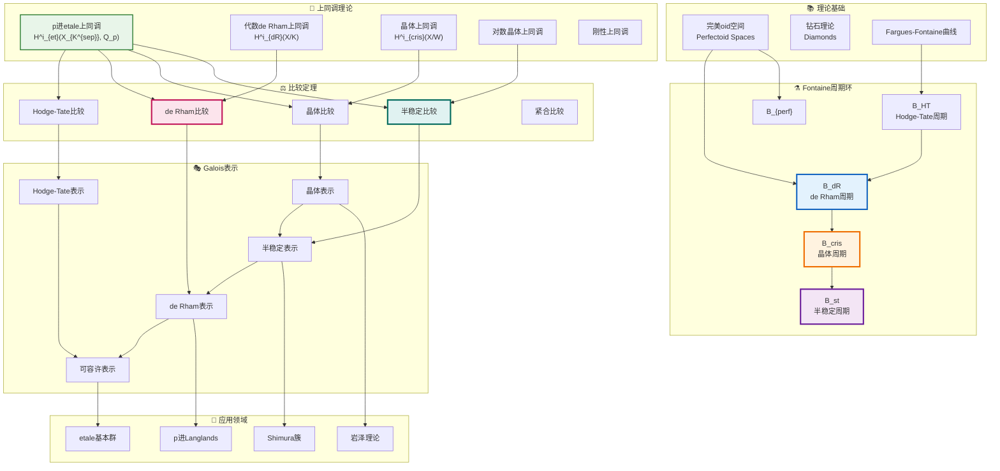

# p进Hodge理论全景图

## 图谱概述

p进Hodge理论是数论与代数几何交叉领域的重要分支，由Faltings、Tsuji、Fontaine等数学家发展完善。本文档展示其核心架构：

- **周期环理论**：B_dR, B_st, B_cris 等Fontaine周期环
- **上同调理论**：etale、de Rham、晶体、对数晶体上同调
- **比较定理**：p进比较定理及其变体
- **应用**：Galois表示、p进L函数、Shimura簇

该理论在Fermat大定理的证明、Langlands纲领、岩泽理论中具有核心作用。

## p进Hodge理论架构图



## 核心概念详解

### 1. Fontaine周期环

周期环是p进Hodge理论的"桥梁"，连接不同上同调理论。

**B_HT (Hodge-Tate周期环)**：
- 最简单的周期环
- 分级结构: B_HT = C_p[t, t^{-1}]
- 对应Hodge-Tate分解

**B_dR (de Rham周期环)**：
- 完备离散赋值环
- 滤过结构: Fil^i B_dR = t^i B_dR^+
- 与复Hodge理论中的C类比

**B_cris (晶体周期环)**：
- 包含Frobenius作用 φ
- 无挠、无幂零元
- 对应晶体上同调

**B_st (半稳定周期环)**：
- 包含对数元素 log[π]
- 配备Frobenius和单值算子N
- 满足 Nφ = pφN

### 2. 上同调理论

**p进etale上同调**：
H^i_{et}(X_{K^{sep}}, Q_p) = (lim← H^i_{et}(X_{K^{sep}}, Z/p^n)) ⊗_{Z_p} Q_p

具有自然的Galois作用：Gal(K^{sep}/K) ↷ H^i_{et}

**代数de Rham上同调**：
H^i_{dR}(X/K) = H^i(X, Ω^•_{X/K})

配备Hodge滤过和Gauss-Manin联络

**晶体上同调**：
在特征p的代数簇上，使用晶体site定义：
H^i_{cris}(X/W)

其中W是Witt环，配备Frobenius半线性自同态

### 3. p进比较定理

**de Rham比较定理**（Tsuji, 1999）：
H^i_{et}(X_{K^{sep}}, Q_p) ⊗_{Q_p} B_dR ≅ H^i_{dR}(X/K) ⊗_K B_dR

**晶体比较定理**（Faltings）：
H^i_{et}(X_{K^{sep}}, Q_p) ⊗_{Q_p} B_cris ≅ H^i_{cris}(X/W)[1/p] ⊗_{W[1/p]} B_cris

**半稳定比较定理**：
对于半稳定约化情形，使用B_st建立比较同构

### 4. 可容许表示论

Galois表示的可容许性分类：

| 表示类型 | 周期环 | 几何条件 |
|---------|--------|---------|
| Hodge-Tate | B_HT | 平凡 |
| de Rham | B_dR | 好约化 |
| 半稳定 | B_st | 半稳定约化 |
| 晶体 | B_cris | 好约化 |

**潜在半稳定猜想**（Breuil）：
任何de Rham表示都是潜在半稳定的

## 理论发展脉络

```
经典Hodge理论 (Hodge, 1950s)
    │
    ├──→ Tate的p进Hodge分解 (1967)
    │
    ├──→ Fontaine的周期环理论 (1980s)
    │       ├── B_HT, B_dR
    │       ├── B_cris, B_st
    │       └── 可容许表示
    │
    ├──→ Faltings的p进比较定理 (1988)
    │       └──  curves: etale ↔ de Rham
    │
    ├──→ Tsuji的证明 (1999)
    │       └── 使用(almost) etale理论
    │
    ├──→ Scholze的完美oid理论 (2011)
    │       ├──  diamonds
    │       └── 新的比较定理证明
    │
    └──→ 当前前沿
            ├── p进Langlands
            ├── 岩泽理论
            └── 朗兰兹对应
```

## 应用场景

### Fermat大定理
Wiles证明中使用的Galois形变理论依赖于p进Hodge理论：
- 3/5切换
- Galois表示的提升
- 自守形式的p进插值

### 岩泽理论
研究Z_p^d-扩张的Iwasawa代数结构：
- Selmer群的特征理想
- p进L函数
- 主猜想(Main Conjecture)

### p进Langlands对应
连接p进Galois表示与p进自守形式：
- 局部p进Langlands
- 整体对应
- 与Shimura簇的联系

## 相关资源

- [p进Hodge理论基础](../concept/p-adic-hodge-theory/README.md)
- [Fontaine周期环详解](../concept/p-adic-hodge-theory/fontaine-rings.md)
- [完美oid空间理论](../concept/p-adic-geometry/perfectoid-spaces.md)

---
*创建于: 2026-04-10 | 版本: 1.0 | 分类: p进几何*
