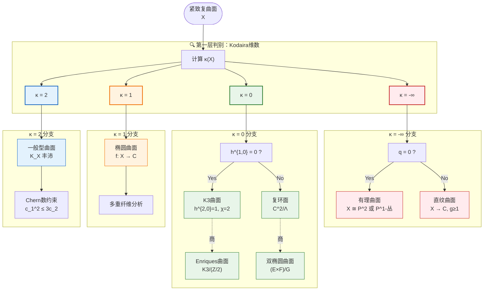

# 代数曲面分类决策树

## 图谱概述

代数曲面的Enriques-Kodaira分类是20世纪代数几何最伟大的成就之一。本文档提供完整的分类决策流程，涵盖：

- **基本不变量**：Kodaira维数、几何亏格、不规则性
- **分类层级**：从有理曲面到一般型曲面的完整谱系
- **判别条件**：数值判据和几何特征
- **典型例子**：各类曲面的标准构造

该分类在弦理论、模空间理论、双有理几何中具有核心意义。

## 曲面分类决策树



## 分类总览

| 类型 | κ | 几何亏格 p_g | 不规则性 q | 例子 |
|------|---|-------------|-----------|------|
| 有理曲面 | -∞ | 0 | 0 | P², P¹×P¹ |
| 直纹曲面 | -∞ | 0 | g | P¹×C_g |
| K3曲面 | 0 | 1 | 0 | 四次曲面, 二次超曲面 |
| Enriques曲面 | 0 | 0 | 0 | K3/(Z/2) |
| 复环面 | 0 | 1 | 2 | C²/Λ |
| 双椭圆曲面 | 0 | 0 | 1 | (E×F)/G |
| 椭圆曲面 | 1 | ≥0 | ≥0 | 椭圆K3, 椭圆曲面 |
| 一般型 | 2 | ≥0 | ≥0 | 一般五次曲面 |

## 各类曲面详解

### 1. κ = -∞（负无穷）

**有理曲面**：双有理等价于 P²

*判别条件*：
- q = 0, p_g = 0
- P_12 = 0（12重亏格消失）
- 存在丰富的(-1)-曲线

*典型例子*：
- P²
- Hirzebruch曲面 F_n = P(O ⊕ O(n))
- Del Pezzo曲面（Fano曲面）

**直纹曲面**：纤维化 X → C，纤维为 P¹

*判别条件*：
- q = g(C) ≥ 1
- p_g = 0
- 存在P¹-纤维化结构

### 2. κ = 0

**K3曲面**：

*不变量*：
- h^{1,0} = 0, h^{2,0} = 1
- χ(O_X) = 2
- b_2 = 22
- K_X ≅ O_X（典范平凡）

*典型构造*：
- P³中的四次曲面
- P⁴中两个二次超曲面的完全交
- 广义Kummer曲面

**Enriques曲面**：

*特征*：
- p_g = q = 0
- 2K_X ≅ O_X（典范2-挠）
- π_1^{et} = Z/2
- K3曲面的自由Z/2商

**复环面**：

*定义*：X = C²/Λ，Λ是秩4格

*不变量*：
- p_g = 1, q = 2
- K_X ≅ O_X

**双椭圆曲面**：

*结构*：(E × F)/G，其中E,F椭圆曲线，G有限群作用

*不变量*：
- p_g = 0, q = 1
- Kodaira维数 κ = 0

### 3. κ = 1

**椭圆曲面**：

*定义*：存在纤维化 f: X → C，一般纤维是椭圆曲线

*分类要素*：
- 纤维类型（Kodaira分类）
- 多重纤维的存在性
- Mordell-Weil群

*重要子类*：
- 椭圆K3曲面
- 有理椭圆曲面

### 4. κ = 2（一般型）

**判别条件**：
- K_X 是大的（big），即 h⁰(X, mK_X) 随 m³ 增长
- P_m ≥ cm² 对某个 c > 0

**数值约束**：
- Bogomolov-Miyaoka-Yau不等式：c_1² ≤ 3c_2
- Noether不等式：c_1² ≥ 2p_g - 4

**典型例子**：
- P³中的d≥5次曲面
- 一般完全交
- 商曲面

## 分类算法流程

```
输入：紧致复曲面 X
│
├─ 计算基本不变量
│   ├─ Hodge数 h^{p,q}
│   ├─ χ(O_X) = Σ(-1)^i h^{i,0}
│   └─ P_m = h^0(X, mK_X) (多重亏格)
│
├─ 确定Kodaira维数 κ
│   ├─ 若所有 P_m = 0 → κ = -∞
│   ├─ 若 P_m ∈ {0,1} 有界 → κ = 0
│   ├─ 若 P_m = O(m) → κ = 1
│   └─ 若 P_m = O(m²) → κ = 2
│
├─ 分支判别
│   ├─ κ = -∞: 检查 q = h^{1,0}
│   │   ├─ q = 0 → 有理曲面
│   │   └─ q > 0 → 直纹曲面
│   │
│   ├─ κ = 0: 检查 (p_g, q)
│   │   ├─ (1, 0) → K3曲面
│   │   ├─ (1, 2) → 复环面
│   │   ├─ (0, 0) → Enriques曲面
│   │   └─ (0, 1) → 双椭圆曲面
│   │
│   ├─ κ = 1 → 椭圆曲面
│   │
│   └─ κ = 2 → 一般型曲面
│       └─ 验证 Noether 和 BMY 不等式
│
└─ 输出：曲面类型 + 典型性质
```

## 模空间维数

各类曲面的模空间维数（粗模空间）：

| 类型 | 模空间维数 |
|------|-----------|
| 有理曲面 | 离散（有限型） |
| K3曲面 | 20 |
| Enriques曲面 | 10 |
| 复环面 | 4 |
| 一般型 (c_1², c_2) | 10χ - 2c_1² + 30 |

## 应用场景

### 弦理论
- K3曲面：Calabi-Yau二维
- 超弦紧化
- 镜像对称

### 代数几何
- 双有理分类
- 极小模型纲领
- 高维推广

### 数论
- 有理点分布
- Hasse原理
- 算术几何

## 相关资源

- [代数曲面分类理论](../concept/algebraic-geometry/surface-classification.md)
- [K3曲面专题](../concept/algebraic-geometry/k3-surfaces.md)
- [极小模型纲领](../concept/algebraic-geometry/mmp.md)

---
*创建于: 2026-04-10 | 版本: 1.0 | 分类: 代数几何*
