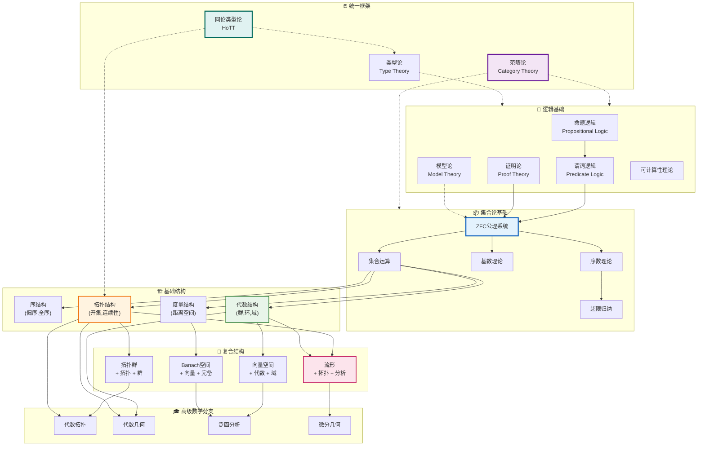

# 数学基础体系层次图

## 图谱概述

本文档展示现代数学基础的层次结构，从最基本的逻辑和集合论出发，逐步构建到丰富的数学结构：

- **逻辑层**：命题逻辑、谓词逻辑、证明论
- **集合论层**：ZFC公理、序数、基数
- **结构层**：代数结构、拓扑结构、序结构
- **理论层**：各种数学分支的理论基础

这一层次体系展示了数学知识是如何从最基本的原子构建起来的。

## 数学基础层次图



## 层次详解

### 第一层：逻辑基础

**命题逻辑**：
- 命题变元 p, q, r
- 逻辑连接词：¬, ∧, ∨, →, ↔
- 真值表与重言式

**谓词逻辑**：
- 量词：∀, ∃
- 谓词符号：P(x), Q(x,y)
- 一阶/高阶逻辑

**证明论**：
- 公理系统
- 推演规则
- 一致性、完备性、可判定性

### 第二层：集合论基础

**ZFC公理系统**：
1. **外延公理**：集合由其元素唯一确定
2. **空集公理**：存在空集 ∅
3. **配对公理**：{a, b} 存在
4. **并集公理**：∪A 存在
5. **幂集公理**：P(A) 存在
6. **无穷公理**：自然数集 N 存在
7. **分离公理模式**：子集构造
8. **替换公理模式**：函数像存在
9. **正则公理**：无无穷降链
10. **选择公理**：选择函数存在

**序数理论**：
- 良序集的同构类
- 超限归纳
- 基数算术的基础

**基数理论**：
- ℵ_0, ℵ_1, ... 阿列夫数
- 连续统假设
- 基数运算

### 第三层：基础结构

**代数结构**：

| 结构 | 运算 | 公理 |
|------|------|------|
| 广群 | 二元运算 | 封闭性 |
| 半群 | 二元运算 | 结合律 |
| 幺半群 | 二元+单位元 | 结合律+单位元 |
| 群 | 二元+逆元 | 群公理 |
| 环 | 加法+乘法 | 分配律等 |
| 域 | 环+除法 | 非零元可逆 |

**拓扑结构**：
- 开集族
- 连续性
- 紧致性、连通性

**序结构**：
- 偏序、全序
- 格、完备格
- 良序

### 第四层：复合结构

**向量空间**：
- (V, +) 是Abel群
- 域 F 作用：F × V → V
- 线性代数的基础

**拓扑群**：
- (G, ·) 是群
- (G, τ) 是拓扑空间
- 群运算连续

**度量空间**：
- 距离函数 d: X × X → [0,∞)
- 诱导拓扑
- 完备性

### 第五层：高级数学分支

**代数拓扑**：
- 基本群 π_1
- 同调/上同调
- 同伦论

**代数几何**：
- 代数簇
- 概形
- 层上同调

**泛函分析**：
- Banach空间
- Hilbert空间
- 算子理论

## 构建过程示例

以"Hilbert空间"为例，展示层次构建：

```
逻辑基础
    ↓
ZFC集合论
    ↓
集合运算 → 笛卡尔积 → 函数概念
    ↓
代数结构
    ├── 域理论（R或C）
    └── 向量空间（V, +, ·）
    ↓
拓扑结构
    └── 度量 → 范数 ∥·∥
    ↓
度量空间
    └── 完备化
    ↓
Banach空间（完备赋范空间）
    ↓
内积空间
    └── 内积 ⟨·,·⟩ 诱导范数
    ↓
Hilbert空间（完备内积空间）
```

## 统一框架

### 范畴论视角

范畴论提供统一语言：
- **对象**：各种数学结构
- **态射**：保持结构的映射
- **函子**：结构间的对应
- **自然变换**：函子间的映射

### 类型论视角

构造主义数学基础：
- **类型**：取代集合作为基本对象
- **项**：类型的元素
- **依赖类型**：依赖函数的推广
- **Curry-Howard对应**：证明=程序

### 同伦类型论 (HoTT)

 Vladimir Voevodsky 等发展的现代基础：
- **路径类型**：等同=路径
- **高阶结构**：同伦群
- **Univalence公理**：等价=等同

## 知识结构树

```
数学基础
├── 逻辑
│   ├── 经典逻辑
│   ├── 直觉主义逻辑
│   └── 模态逻辑
├── 集合论
│   ├── ZFC
│   ├── NBG
│   └── 选择公理的变体
├── 结构论
│   ├── 代数学
│   ├── 拓扑学
│   ├── 分析学
│   └── 几何学
├── 元数学
│   ├── 递归论
│   ├── 证明论
│   └── 模型论
└── 现代框架
    ├── 范畴论
    ├── 类型论
    └── 同伦类型论
```

## 相关资源

- [数理逻辑基础](../concept/logic/README.md)
- [集合论导论](../concept/set-theory/README.md)
- [范畴论入门](../concept/category-theory/README.md)

---
*创建于: 2026-04-10 | 版本: 1.0 | 分类: 数学基础*
