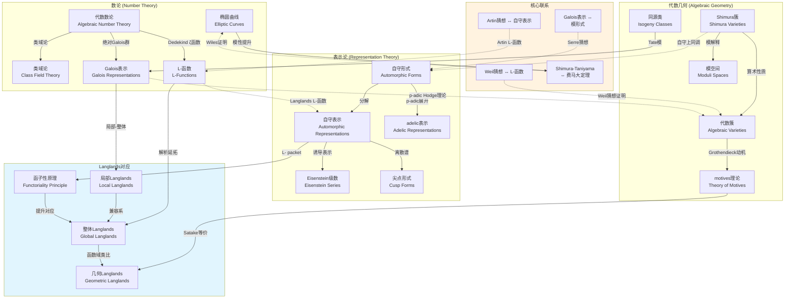

# Langlands纲领关系图

## 概述

Langlands纲领是现代数学中最具深远影响的统一性框架之一，由Robert Langlands于1960年代提出。该纲领揭示了数论、表示论和代数几何三大领域之间深刻而惊人的联系，被誉为"数学的大统一理论"。

## 知识图谱

## 详细说明

### 1. 数论领域 (Number Theory)

**代数数论**
- 研究代数数域及其整数环的性质
- 理想类群和单位群的结构
- 为Langlands纲领提供算术基础

**Galois表示**
- 绝对Galois群的连续表示
- ℓ-adic表示和p-adic表示
- 与自守形式的联系通过Fontaine-Mazur猜想

**L-函数**
- Dedekind ζ函数、Artin L-函数
- Hasse-Weil L-函数
- 特殊值的算术意义

### 2. 表示论领域 (Representation Theory)

**自守形式**
- 李群上的 square-integrable 函数
- 在算术离散子群下不变
- 包含模形式和Maass形式

**自守表示**
- adelic群的不可约表示
- 分解为局部成分的张量积
- L- packet和A- packet的分类

### 3. 代数几何领域 (Algebraic Geometry)

**Motives理论**
- Grothendieck提出的统一上同调理论
- 作为几何对象的"原子"
- 标准猜想与Tate猜想

**Shimura簇**
- 具有丰富算术结构的代数簇
- Hodge理论和自守形式的自然家园
- 特殊子簇的André-Oort猜想

### 4. Langlands对应类型

| 类型 | 定义域 | 核心对象 | 当前状态 |
|------|--------|----------|----------|
| 局部Langlands | 局部域 | GL(n)已完成，一般约化群部分完成 | 主要定理已证明 |
| 整体Langlands | 整体域 | 自守表示 ↔ Galois表示 | 许多重要进展 |
| 几何Langlands | 函数域 | D-模 ↔ 局部系统 | 特征0已完成 |
| 函子性原理 | 一般 | 提升映射 L-group → L-group | 猜想阶段 |

### 5. 历史里程碑

- **1967**: Langlands给Weil的信，纲领诞生
- **1974**: Deligne证明Weil猜想（最后一部分）
- **1994**: Wiles证明费马大定理（Shimura-Taniyama猜想）
- **1998**: Lafforgue证明函数域Langlands对应(GL(n))
- **2014**: 几何Langlands对应在特征0完成

## 应用场景

### 数学研究
1. **费马大定理证明**: Wiles通过证明半稳定椭圆曲线的模性，建立Shimura-Taniyama猜想与费马大定理的联系
2. **L-函数特殊值**: Bloch-Kato猜想连接算术与解析性质
3. **同余数问题**: Tunnell定理利用Waldspurger公式给出判别准则

### 密码学与编码理论
- 椭圆曲线密码的算术性质分析
- 同源密码学中的模形式应用

### 理论物理
- **弦理论**: Calabi-Yau流形的模空间
- **规范理论**: 几何Langlands与S-对偶
- **量子混沌**: 量子遍历性与Maass形式

### 相关资源

- [相关概念: 代数数论](../../concept/branch01-代数基础/01-06代数数论/)
- [相关概念: 自守形式](../../concept/branch04-分析学/04-04复分析/)
- [Wikipedia: Langlands program](https://en.wikipedia.org/wiki/Langlands_program)
