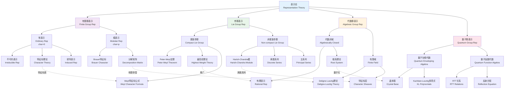

# 表示论分类体系

## 概述

表示论是数学中研究代数结构（群、代数等）在线性空间上作用的理论。通过将抽象代数对象表示为线性变换，表示论将代数问题转化为线性代数问题，从而利用线性代数的强大工具进行研究。本图谱系统展示表示论的四大核心分支及其相互联系。

## 知识图谱

## 详细说明

### 1. 有限群表示 (Finite Group Representation)

#### 常表示理论 (Characteristic 0)
- **Maschke定理**: 有限群在特征不整除群阶的域上，表示完全可约
- **特征标理论**: 类函数构成有限维Hilbert空间，不可约特征标形成标准正交基
- **Frobenius互反律**: 诱导表示与限制表示的伴随关系

**重要结果**:
- 不可约表示数目 = 共轭类数目
- 正则表示分解: $\mathbb{C}[G] \cong \bigoplus_i n_i V_i$，其中 $n_i = \dim V_i$

#### 模表示理论 (Modular Representation, char = p)
- 当域特征 $p$ 整除 $|G|$ 时，Maschke定理失效
- **Brauer特征标**: 处理 $p$-正则元素
- **分解数**: 连接常表示与模表示的桥梁

### 2. 李群表示 (Lie Group Representation)

#### 紧致李群
- **Peter-Weyl定理**: $L^2(G) \cong \widehat{\bigoplus}_{\pi} V_\pi \otimes V_\pi^*$
- **最高权理论**: 不可约表示与支配整权的对应
- **Weyl特征标公式**: 
  $$\chi_\lambda = \frac{\sum_{w \in W} \epsilon(w) e^{w(\lambda + \rho)}}{e^\rho \prod_{\alpha > 0}(1 - e^{-\alpha})}$$

#### 非紧致李群 (实约化李群)
- **Harish-Chandra模**: $(\mathfrak{g}, K)$-模
- **离散系列表示**: 存在条件与根系的关系
- **Langlands分类**: 不可约容许表示的完整分类

### 3. 代数群表示 (Algebraic Group Representation)

#### 有理表示
- 代数群作为代数簇的态射表示
- Weyl模与Verma模
- Borel-Weil-Bott定理: 旗流形的上同调与表示

#### 有限域上的代数群
- **Deligne-Lusztig理论**: 用$\ell$-进上同调构造表示
- **Green函数**: 计算特征标值的关键
- **Lusztig分类**: 用几何方法完整分类表示

### 4. 量子群表示 (Quantum Group Representation)

#### Drinfeld-Jimbo量子包络代数
- 参数$q$的形变
- **晶体基理论** (Kashiwara): $q \to 0$ 极限下的组合结构
- **典范基** (Lusztig): 基的正性与不变性

#### 应用与联系
- Jones多项式与量子不变量
- 共形场论与仿射李代数
- Hall代数的实现

## 分类对比表

| 特征 | 有限群 | 紧致李群 | 代数群 | 量子群 |
|------|--------|----------|--------|--------|
| 拓扑 | 离散 | 紧致流形 | 代数簇 | 非交换几何 |
| 表示完备性 | 完全可约 | 完全可约 | 通常不可约 | 最高权模 |
| 关键工具 | 特征标表 | 最高权理论 | 根系几何 | 晶体基 |
| 不变量 | 维数 | Casimir算子 | Weyl群 | R-矩阵 |
| 典型应用 | 分子振动 | 粒子物理 | 数论 | 纽结理论 |

## 应用场景

### 物理学应用

1. **粒子物理学**
   - 标准模型的规范群表示
   - SU(3)的八重态与夸克模型
   - 大统一理论中的表示分解

2. **量子力学**
   - 角动量的SU(2)表示
   - 氢原子的SO(4)对称性
   - 晶体点群的表示与能带结构

3. **统计力学**
   - Yang-Baxter方程与可积系统
   - 量子群在临界现象中的应用

### 化学应用
- 分子轨道理论的群论分析
- 光谱选择定则的推导
- 晶体振动模式的分类

### 计算机科学
- 傅里叶变换在群上的推广
- 快速算法的设计
- 量子计算中的群表示

### 相关资源

- [相关概念: 群论](../../concept/branch01-代数基础/01-01群论/)
- [相关概念: 李群与李代数](../../concept/branch02-几何与拓扑/02-10李群与李代数/)
- [相关概念: 量子群](../../concept/branch01-代数基础/01-04环论与代数/)
- [Wikipedia: Representation theory](https://en.wikipedia.org/wiki/Representation_theory)
