# 泛函分析理论体系

## 概述

泛函分析是研究无穷维向量空间（主要是函数空间）及其上算子理论的数学分支。它将古典分析、代数和几何的方法统一起来，是现代分析数学的基石。本图谱展示泛函分析的三大核心领域：Banach空间理论、Hilbert空间理论和算子代数。

## 知识图谱

```mermaid
graph TD
    A[泛函分析<br/>Functional Analysis] --> B[Banach空间理论<br/>Banach Space Theory]
    A --> C[Hilbert空间理论<br/>Hilbert Space Theory]
    A --> D[算子代数<br/>Operator Algebras]
    A --> E[广义函数论<br/>Distribution Theory]
    
    B --> B1[Banach空间<br/>Banach Space]
    B --> B2[有界线性算子<br/>Bounded Operators]
    B --> B3[三大定理<br/>Three Principles]
    B1 --> B11[完备赋范空间<br/>Complete Normed Space]
    B1 --> B12[经典例子<br/>L^p, C, l^p]
    B2 --> B21[算子范数<br/>Operator Norm]
    B2 --> B22[一致有界原理<br/>Uniform Boundedness]
    B3 --> B31[Hahn-Banach定理<br/>延拓定理]
    B3 --> B32[开映射定理<br/>Open Mapping]
    B3 --> B33[闭图像定理<br/>Closed Graph]
    
    C --> C1[Hilbert空间<br/>Hilbert Space]
    C --> C2[正交分解<br/>Orthogonal Decomposition]
    C --> C3[谱理论<br/>Spectral Theory]
    C1 --> C11[内积空间<br/>Inner Product Space]
    C1 --> C12[完备性<br/>Completeness]
    C2 --> C21[Riesz表示定理<br/>Riesz Representation]
    C2 --> C22[正交投影<br/>Orthogonal Projection]
    C3 --> C31[自伴算子<br/>Self-adjoint Operators]
    C3 --> C32[紧算子谱<br/>Spectral of Compact Op]
    C3 --> C33[谱分解<br/>Spectral Decomposition]
    
    D --> D1[C*-代数<br/>C*-Algebras]
    D --> D2[von Neumann代数<br/>von Neumann Algebras]
    D --> D3[谱序列<br/>Spectral Sequence]
    D1 --> D11[Banach *-代数<br/>Banach *-Algebra]
    D1 --> D12[Gelfand表示<br/>Gelfand Representation]
    D1 --> D13[交换C*-代数<br/>Commutative C*-Alg]
    D2 --> D21[W*-代数<br/>W*-Algebra]
    D2 --> D22[因子分解<br/>Factor Decomposition]
    D2 --> D23[双换位子<br/>Bicommutant Theorem]
    
    E --> E1[分布空间<br/>D']
    E --> E2[Sobolev空间<br/>Sobolev Spaces]
    E --> E3[弱解理论<br/>Weak Solutions]
    
    C11 -.->|完备化| B11
    B2 -.->|限制| D11
    C3 -.->|推广| D3
    E2 -.->|嵌入| B12
    
    style A fill:#e3f2fd
    style B fill:#f3e5f5
    style C fill:#e8f5e9
    style D fill:#fff3e0
    style E fill:#fce4ec
```



## 详细说明

### 1. Banach空间理论

#### Banach空间定义
完备的赋范向量空间 $(X, \|\cdot\|)$，满足：
- 范数公理: 正定性、齐次性、三角不等式
- Cauchy序列收敛

**经典例子**:
- $L^p(\mu)$ 空间: $1 \leq p \leq \infty$
- $C(K)$: 紧集上的连续函数
- $l^p$: 序列空间
- $c_0$, $l^\infty$

#### 三大基本定理

**Hahn-Banach定理**
- 范数保持的线性延拓
- 几何形式: 分离超平面定理
- 应用: 对偶空间非平凡

**一致有界原理 (Banach-Steinhaus)**
若 $\{T_\alpha\} \subset \mathcal{L}(X,Y)$ 点点有界，则范数一致有界

**开映射定理与闭图像定理**
- 满射有界算子是开映射
- 闭图像 ⟺ 连续性 (闭算子定理)

### 2. Hilbert空间理论

#### Hilbert空间结构
- 内积诱导范数: $\|x\| = \sqrt{\langle x, x \rangle}$
- 平行四边形法则刻画内积空间
- 完备性要求

**正交性与投影**
- Riesz表示定理: $H^* \cong H$
- 正交补与直和分解
- 正交基与Fourier展开

#### 谱理论

**有界自伴算子**
- 谱定理: $A = \int_{\sigma(A)} \lambda dE(\lambda)$
- 连续函数演算
- 正算子与平方根

**紧算子**
- 谱离散，0是唯一可能的聚点
- Fredholm择一性
- Hilbert-Schmidt算子与迹类算子

### 3. 算子代数

#### C*-代数
Banach *-代数满足C*-恒等式: $\|a^*a\| = \|a\|^2$

**Gelfand理论**
- 交换C*-代数 ⟺ $C_0(X)$
- 谱与特征标的对应
- 函数演算的代数基础

#### von Neumann代数
Hilbert空间上有界算子的*-子代数，满足:
- 弱算子闭
- 含单位元
- 双换位子定理: $M'' = M$

**因子分类 (Murray-von Neumann)**
- Type I: 矩阵代数与$B(H)$
- Type II: 有限或无限，迹存在
- Type III: 纯无限，Connes分类

### 4. 广义函数与Sobolev空间

#### 分布理论
- 测试函数空间 $\mathcal{D}(\Omega)$
- 分布作为连续线性泛函
- 微分运算的扩展

#### Sobolev空间
$$W^{k,p}(\Omega) = \{u \in L^p : D^\alpha u \in L^p, |\alpha| \leq k\}$$

- Sobolev嵌入定理
- 迹定理
- Poincaré不等式

## 空间包含关系

```
Hilbert空间 ⊂ 自反Banach空间 ⊂ Banach空间 ⊂ 赋范空间 ⊂ 拓扑向量空间

具体例子链:
l^2 ⊂ l^p (1<p<∞) ⊂ l^1 ⊂ l^∞

函数空间链:
C_c^∞ ⊂ S ⊂ H^s ⊂ L^2 ⊂ H^{-s} ⊂ S' ⊂ D'
```

## 应用场景

### 偏微分方程
- 弱解的存在性与正则性
- 变分方法
- 半群理论与发展方程

### 量子力学
- Hilbert空间作为态空间
- 自伴算子对应可观测量
- 谱定理与测量公设

### 调和分析
- Fourier变换的$L^p$理论
- 奇异积分算子
- Hardy空间与BMO

### 概率论
- 随机过程的轨道空间
- 鞅论
- 大偏差理论

### 优化与控制
- 凸分析
- 对偶理论
- 最优控制

### 相关资源

- [相关概念: 泛函分析](../../concept/branch04-分析学/04-06泛函分析/)
- [相关概念: Hilbert空间](../../concept/branch04-分析学/04-06泛函分析/04-06-02-Hilbert空间.md)
- [Wikipedia: Functional analysis](https://en.wikipedia.org/wiki/Functional_analysis)
