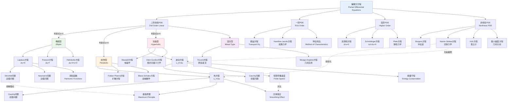
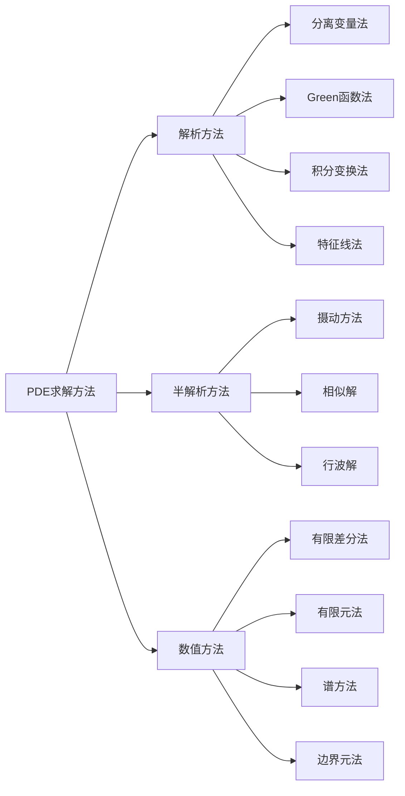

# 偏微分方程分类图谱

## 概述

偏微分方程(PDE)是含有多元函数及其偏导数的方程，是描述自然界各种连续现象的核心数学工具。根据特征方程的性质，二阶线性PDE可分为三大类：椭圆型、抛物型和双曲型。本图谱系统展示PDE的分类体系、典型方程及其数学理论。

## 知识图谱

## 详细说明

### 1. 二阶线性PDE分类

对于二阶线性PDE的一般形式:
$$Au_{xx} + 2Bu_{xy} + Cu_{yy} + Du_x + Eu_y + Fu = G$$

分类依据判别式 $\Delta = B^2 - AC$:

| 类型 | 判别式 | 标准型 | 特征 |
|------|--------|--------|------|
| 椭圆型 | $\Delta < 0$ | $u_{\xi\xi} + u_{\eta\eta} + \cdots$ | 无实特征线 |
| 抛物型 | $\Delta = 0$ | $u_{\xi\xi} + \cdots$ | 一族实特征线 |
| 双曲型 | $\Delta > 0$ | $u_{\xi\eta} + \cdots$ | 两族实特征线 |

### 2. 椭圆型方程

#### Laplace方程与Poisson方程
- **Laplace方程**: $\Delta u = 0$
- **Poisson方程**: $\Delta u = f$

**基本理论**:
- 极值原理: 调和函数在内部不能取最大/最小值
- 平均值性质
- Harnack不等式
- 椭圆正则性: $f \in C^k \Rightarrow u \in C^{k+2}$

**边值问题**:
- Dirichlet问题: 给定边界值
- Neumann问题: 给定边界法向导数
- Robin问题: 混合边界条件

### 3. 抛物型方程

#### 热方程
$$u_t = \Delta u$$

**关键特性**:
- 无限传播速度
- 光滑效应: 即使初值不光滑，解瞬时变光滑
- 极值原理
- 能量衰减

**重要推广**:
- 变系数抛物方程
- 退化抛物方程
- 反应-扩散方程

### 4. 双曲型方程

#### 波动方程
$$u_{tt} = \Delta u$$

**关键特性**:
- 有限传播速度
- 能量守恒
- 特征锥
- Huygens原理(奇数维)

**一维波动方程的D'Alembert公式**:
$$u(x,t) = \frac{1}{2}[f(x+t) + f(x-t)] + \frac{1}{2}\int_{x-t}^{x+t} g(s)ds$$

### 5. 混合型方程

#### Tricomi方程
$$y u_{xx} + u_{yy} = 0$$
- $y > 0$: 椭圆型
- $y = 0$: 抛物型(退化)
- $y < 0$: 双曲型

**应用**: 跨音速流体流动

### 6. 非线性PDE

| 方程 | 类型 | 应用领域 | 关键特征 |
|------|------|----------|----------|
| Burgers方程 | 拟线性双曲 | 交通流、激波 | 激波形成 |
| Navier-Stokes | 拟线性抛物 | 流体力学 |  Millennium问题 |
| KdV方程 | 色散波 | 浅水波、等离子体 | 孤立子解 |
| Monge-Ampère | 完全非线性 | 微分几何 | 凸性条件 |
| 极小曲面 | 拟线性椭圆 | 几何测度论 | 面积极小化 |

### 7. 求解方法概览

## 应用场景

### 物理学
- **电磁学**: Maxwell方程组
- **量子力学**: Schrödinger方程
- **广义相对论**: Einstein场方程
- **流体力学**: Euler方程与Navier-Stokes方程

### 工程应用
- **结构力学**: 弹性力学方程
- **热传导**: 热方程
- **金融数学**: Black-Scholes方程
- **图像处理**: 各向异性扩散方程

### 生命科学
- **人口动力学**: 反应-扩散方程
- **神经科学**: Hodgkin-Huxley方程
- **生物形态发生**: Turing模式形成

### 相关资源

- [相关概念: 偏微分方程](../../concept/branch04-分析学/04-07偏微分方程/)
- [相关概念: 椭圆型方程](../../concept/branch04-分析学/04-07偏微分方程/04-07-03-椭圆型方程.md)
- [Wikipedia: Partial differential equation](https://en.wikipedia.org/wiki/Partial_differential_equation)
