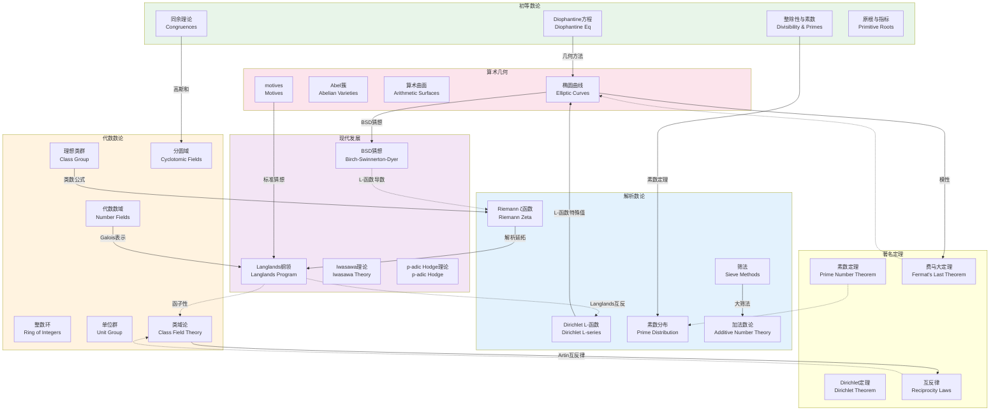

# 数论分支全景图

## 概述

数论是研究整数性质的数学分支，被誉为"数学的女王"。从古希腊的Euclid到现代的Wiles，数论吸引了无数数学家的关注。现代数论已发展成为包含解析数论、代数数论、算术几何等多个分支的庞大体系，并与代数、几何、分析等领域深度交织。本图谱展示数论的主要分支及其深刻联系。

## 知识图谱



## 详细说明

### 1. 初等数论 (Elementary Number Theory)

#### 核心内容
- **算术基本定理**: 整数的唯一素因子分解
- **欧几里得算法**: 最大公约数的计算
- **同余理论**: $a \equiv b \pmod{n}$
- **费马小定理与Euler定理**

#### 经典问题
- **费马大定理**: $x^n + y^n = z^n$ (Wiles证明)
- **Catalan猜想**: $x^p - y^q = 1$ (Mihăilescu证明)
- **Waring问题**: 表示整数为$k$次幂的和

### 2. 解析数论 (Analytic Number Theory)

#### Riemann ζ函数
$$\zeta(s) = \sum_{n=1}^\infty \frac{1}{n^s}, \quad \text{Re}(s) > 1$$

**关键性质**:
- 解析延拓与函数方程
- **Riemann假设**: $\zeta(s) = 0$ 的非平凡零点实部均为1/2
- 与素数分布的深刻联系

#### 素数分布
- **素数定理**: $\pi(x) \sim \frac{x}{\log x}$
- **Dirichlet定理**: 算术级数中有无穷多素数
- **孪生素数猜想**: $|\{p : p, p+2 \text{ 均为素数}\}| = \infty$ ?

#### 筛法
- Eratosthenes筛
- Brun筛与孪生素数上界
- 大筛法
- **陈景润定理**: 每个充分大偶数可表为一个素数与至多两个素数的积之和

### 3. 代数数论 (Algebraic Number Theory)

#### 代数数域
- 数域: $\mathbb{Q}$ 的有限扩张
- 整数环 $\mathcal{O}_K$: $K$ 中在 $\mathbb{Z}$ 上整的元素
- 迹与范数

#### 理想论
- **Dedekind整环**: 理想的唯一因子分解
- **理想类群**: $Cl(K) = \{ \text{分式理想} \} / \{ \text{主理想} \}$
- **类数**: $h_K = |Cl(K)|$，衡量整数环与UFD的差距

#### 单位群 (Dirichlet单位定理)
$$\mathcal{O}_K^\times \cong \mu_K \times \mathbb{Z}^{r_1 + r_2 - 1}$$

#### 类域论
- **Artin互反律**: 最重要的互反律
- **Hilbert类域**: 最大非分歧Abel扩张
- Artin L-函数

### 4. 算术几何 (Arithmetic Geometry)

#### 椭圆曲线
- Weierstrass方程: $y^2 = x^3 + ax + b$
- Mordell-Weil定理: 有理点构成有限生成Abel群
- **BSD猜想**: 秩与L-函数零点的关系

#### 模形式
- 上半平面的全纯函数，满足模变换性质
- Hecke算子
- **谷山-志村猜想** (Shimura-Taniyama-Weil): 椭圆曲线 ⟺ 模形式

#### 代数几何工具
- 概形 (Schemes) - Grothendieck
- 平展上同调
- motives理论

### 5. 现代发展

| 理论 | 核心思想 | 主要结果 | 开放问题 |
|------|----------|----------|----------|
| Langlands纲领 | 数论与表示论的统一 | 函数域Langlands | 数域Langlands |
| Iwasawa理论 | $p$-进L-函数 | 主猜想证明 | 高秩情形 |
| p-adic Hodge理论 | 比较定理 | Fontaine理论 | 非Abel情形 |
| Anabelian几何 | 基本群决定簇 | Neukirch-Uchida | 高维推广 |

## 数论问题难度层级

```
初等(已解决)
├── 素数无限性 (Euclid)
├── 算术基本定理
└── 二次互反律 (Gauss)

进阶(已解决)
├── 费马大定理 (Wiles, 1994)
├── Catalan猜想 (Mihăilescu, 2002)
├── 谷山-志村猜想 (Wiles等)
└── Weil猜想 (Deligne, 1974)

困难(部分进展)
├── Riemann假设
├── Goldbach猜想 (陈景朗定理)
├── 孪生素数猜想 (张益唐定理)
└── BSD猜想

未解决(重大猜想)
├── abc猜想 (望月新一宣称证明)
├── Langlands纲领
└── Schinzel假设H
```

## 应用场景

### 密码学
- **RSA加密**: 大整数分解的困难性
- **椭圆曲线密码**: 椭圆曲线离散对数
- **后量子密码**: 基于格问题的密码系统

### 编码理论
- 代数几何码
- LDPC码与数论构造

### 计算数学
- 快速乘法算法 (Karatsuba, FFT)
- 素性测试与因数分解
- 随机数生成

### 物理学
- 弦论中的Calabi-Yau流形
- 统计力学中的配分函数

### 相关资源

- [相关概念: 数论](../../concept/branch01-代数基础/01-05数论/)
- [相关概念: 代数数论](../../concept/branch01-代数基础/01-06代数数论/)
- [相关概念: 椭圆曲线](../../concept/branch01-代数基础/01-06代数数论/)
- [Wikipedia: Number theory](https://en.wikipedia.org/wiki/Number_theory)
