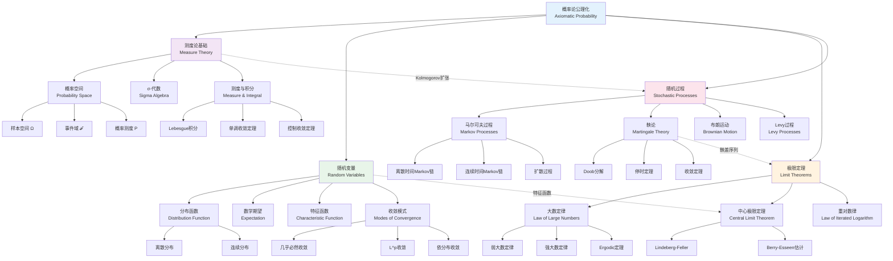

# 概率论公理化体系

## 概述

概率论是研究随机现象的数学理论。1933年，Kolmogorov建立了概率论的公理化体系，将概率论建立在测度论的严格基础之上。这一体系不仅统一了古典概率、几何概率和频率派概率，还为现代随机过程、数理统计、金融数学等学科奠定了坚实基础。本图谱展示概率论的完整公理化结构。

## 知识图谱



## 详细说明

### 1. 测度论基础 (Measure Theory Foundation)

#### Kolmogorov公理化 (1933)
概率空间的三元组 $(\Omega, \mathcal{F}, P)$:
- **样本空间** $\Omega$: 所有可能结果的集合
- **σ-代数** $\mathcal{F}$: 事件的集合，满足可数运算封闭
- **概率测度** $P$: $\mathcal{F} \to [0,1]$，满足 $P(\Omega) = 1$

#### 关键测度论定理
- **Carathéodory扩张定理**: 从半环构造测度
- **单调类定理**: σ-代数的生成
- **Radon-Nikodym定理**: 条件期望的存在性

### 2. 随机变量与分布

#### 随机变量的定义
可测映射 $X: (\Omega, \mathcal{F}) \to (\mathbb{R}, \mathcal{B}(\mathbb{R}))$

#### 分布与期望
- **分布函数**: $F_X(x) = P(X \leq x)$
- **数学期望**: $E[X] = \int_\Omega X dP$
- **方差**: $\text{Var}(X) = E[(X - E[X])^2]$

#### 重要分布

| 分布类型 | 分布名称 | 密度/概率质量 | 期望 | 方差 |
|----------|----------|---------------|------|------|
| 离散 | 二项分布 | $C_n^k p^k(1-p)^{n-k}$ | $np$ | $np(1-p)$ |
| 离散 | Poisson分布 | $\frac{\lambda^k e^{-\lambda}}{k!}$ | $\lambda$ | $\lambda$ |
| 连续 | 正态分布 | $\frac{1}{\sqrt{2\pi\sigma^2}}e^{-\frac{(x-\mu)^2}{2\sigma^2}}$ | $\mu$ | $\sigma^2$ |
| 连续 | 指数分布 | $\lambda e^{-\lambda x}$ | $\frac{1}{\lambda}$ | $\frac{1}{\lambda^2}$ |

#### 特征函数
$$\varphi_X(t) = E[e^{itX}]$$
- 唯一确定分布
- 独立和的特征函数等于特征函数的积
- 中心极限定理证明的核心工具

### 3. 收敛模式

| 收敛类型 | 记号 | 定义 | 蕴含关系 |
|----------|------|------|----------|
| 几乎必然收敛 | $X_n \xrightarrow{a.s.} X$ | $P(\lim X_n = X) = 1$ | 最强 |
| $L^p$收敛 | $X_n \xrightarrow{L^p} X$ | $E[|X_n - X|^p] \to 0$ | 强 |
| 依概率收敛 | $X_n \xrightarrow{P} X$ | $P(|X_n - X| > \epsilon) \to 0$ | 中等 |
| 依分布收敛 | $X_n \xrightarrow{d} X$ | $E[f(X_n)] \to E[f(X)]$ | 最弱 |

### 4. 极限定理

#### 大数定律 (Law of Large Numbers)

**弱大数定律**: 若 $\{X_n\}$ i.i.d.，$E[X_1] = \mu$，则
$$\frac{1}{n}\sum_{k=1}^n X_k \xrightarrow{P} \mu$$

**强大数定律** (Kolmogorov):
$$\frac{1}{n}\sum_{k=1}^n X_k \xrightarrow{a.s.} \mu$$

#### 中心极限定理 (Central Limit Theorem)

**经典CLT** (Lindeberg-Lévy): 若 $\{X_n\}$ i.i.d.，$E[X_1] = \mu$，$\text{Var}(X_1) = \sigma^2$，则
$$\frac{\sum_{k=1}^n X_k - n\mu}{\sigma\sqrt{n}} \xrightarrow{d} N(0,1)$$

**Berry-Esseen定理**: 收敛速度估计
$$\sup_x |F_n(x) - \Phi(x)| \leq \frac{C \rho}{\sigma^3 \sqrt{n}}$$

### 5. 随机过程

#### 马尔可夫过程
**马尔可夫性**: 
$$P(X_{n+1} = j | X_n = i, X_{n-1}, \ldots, X_0) = P(X_{n+1} = j | X_n = i)$$

**关键结果**:
- Chapman-Kolmogorov方程
- 遍历定理
- 位势理论

#### 鞅论 (Martingale Theory)

**定义**: 适应过程 $\{M_n\}$ 满足 $E[M_{n+1} | \mathcal{F}_n] = M_n$

**核心定理**:
- **Doob可选停时定理**
- **Doob不等式**
- **鞅收敛定理**: $L^1$有界鞅几乎必然收敛

#### 布朗运动 (Brownian Motion)

**定义**: 连续时间随机过程 $\{B_t\}_{t \geq 0}$ 满足:
- $B_0 = 0$
- 独立增量
- $B_t - B_s \sim N(0, t-s)$
- 连续轨道

**重要性**: 
- 连续鞅的基本构件 (Lévy刻画)
- 随机微积分的核心
- 扩散过程的尺度极限

## 概率论结构层次

```
测度论基础
└── 概率空间公理化
    └── 随机变量理论
        ├── 分布与期望
        │   └── 特征函数
        ├── 条件概率与期望
        │   └── 正则条件分布
        └── 随机过程
            ├── 马尔可夫过程
            │   ├── Markov链
            │   ├── 扩散过程
            │   └── 半群理论
            ├── 鞅论
            │   ├── 离散时间鞅
            │   ├── 连续时间鞅
            │   └── 局部鞅
            └── 平稳过程
                ├── 谱分析
                └── Ergodic理论
```

## 应用场景

### 金融数学
- **Black-Scholes模型**: 几何布朗运动假设
- **风险度量**: VaR与CVaR
- **衍生品定价**: 鞅测度与无套利

### 统计学习
- **大样本理论**: MLE的渐近正态性
- **蒙特卡洛方法**: 随机抽样算法
- **随机优化**: 随机梯度下降

### 信息论
- **熵**: $H(X) = -E[\log P(X)]$
- **信道容量**: 随机编码
- **数据压缩**: 典型序列

### 生物与物理
- **统计力学**: Gibbs测度
- **种群遗传学**: Wright-Fisher模型
- **神经科学**: 随机神经网络

### 工程应用
- **排队论**: 服务系统设计
- **可靠性理论**: 系统寿命分析
- **信号处理**: 随机信号分析

### 相关资源

- [相关概念: 概率论](../../concept/branch03-概率统计/03-01概率论/)
- [相关概念: 随机过程](../../concept/branch03-概率统计/03-03随机过程/)
- [相关概念: 鞅论](../../concept/branch03-概率统计/03-03随机过程/03-03-04-鞅论.md)
- [Wikipedia: Probability theory](https://en.wikipedia.org/wiki/Probability_theory)
