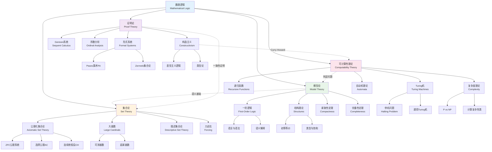
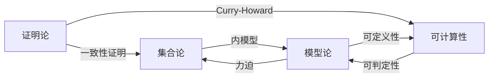

# 数理逻辑基础架构

## 概述

数理逻辑是用数学方法研究逻辑和数学基础的学科。它在20世纪初建立，旨在解决数学基础的危机（如Russell悖论）。现代数理逻辑主要分为四大分支：集合论、模型论、证明论和可计算性理论。这些分支相互交织，共同构成了现代数学和计算机科学的理论基础。

## 知识图谱

## 详细说明

### 1. 集合论 (Set Theory)

#### ZFC公理系统
现代数学的标准基础:

| 公理 | 内容 | 作用 |
|------|------|------|
| 外延性 | 集合由元素唯一确定 | 集合相等 |
| 配对 | $\{a, b\}$ 存在 | 构造有限集 |
| 并集 | $\bigcup x$ 存在 | 构造无穷并 |
| 幂集 | $\mathcal{P}(x)$ 存在 | 构造更大集合 |
| 无穷 | 存在无穷集 | 自然数 |
| 分离 | 子集构造 | 避免悖论 |
| 替换 | 像集存在 | 大基数理论 |
| 正则 | 无循环 ∈ 关系 | 良基性 |
| 选择(AC) | 选择函数存在 | 分析基础 |

#### 连续统假设 (Continuum Hypothesis, CH)
$2^{\aleph_0} = \aleph_1$?
- Cohen (1963): CH独立于ZFC
- 力迫法: 构造模型证明独立性

#### 大基数公理
- **可测基数**: 存在非主超滤
- **超紧基数**: 强大反射性质
- **Woodin基数**: 决定性公理与内模型

### 2. 模型论 (Model Theory)

#### 一阶逻辑
**语法**: 
- 语言 $\mathcal{L}$: 函数符号、关系符号、常数
- 项与公式
- 证明系统

**语义**:
- $\mathcal{L}$-结构 $\mathcal{M}$
- 满足关系 $\mathcal{M} \models \varphi$
- 理论 $T$ 与模型 $\text{Mod}(T)$

#### 核心定理

**完备性定理** (Gödel, 1930):
$$T \vdash \varphi \iff T \models \varphi$$
语法可证 ⟺ 语义有效

**紧致性定理**:
$$T \text{ 有模型} \iff \text{每个有限子集有模型}$$

应用: 非标准分析、图论中的无限结构

**Löwenheim-Skolem定理**:
无穷模型有任意大/小的初等等价模型

#### 稳定性理论 (Shelah)
分类理论的复杂度:
- 稳定理论
- 超稳定理论
- ω-稳定理论

### 3. 证明论 (Proof Theory)

#### 希尔伯特计划
- 形式化数学
- 证明一致性
- 有限方法

#### Gentzen序数分析
**Peano算术的一致性**:
- Gentzen (1936) 用超限归纳到 $\varepsilon_0$
- 证明论的序数: 系统强度的度量

#### 构造主义
**直觉主义逻辑** (Brouwer):
- 排中律不成立
- 证明即构造

**Curry-Howard同构**:
$$\text{证明} \cong \text{程序}, \quad \text{公式} \cong \text{类型}$$

#### 类型论
- **简单类型论** (Church)
- **依值类型论** (Martin-Löf)
- **同伦类型论** (HoTT, Voevodsky)

### 4. 可计算性理论 (Computability Theory)

#### Turing机 (1936)
形式化"算法"的概念:
- 无限磁带
- 有限状态控制
- 读写头

**Church-Turing论题**: 直观可计算 ⟺ Turing机可计算

#### 不可判定性结果

**停机问题**: 不存在算法判定任意程序是否停机

**Rice定理**: 非平凡的程序性质都不可判定

**Gödel不完备定理**:
- 第一不完备: 足够强的形式系统存在不可判定命题
- 第二不完备: 系统不能证明自身一致性

#### 复杂度理论

| 复杂性类 | 定义 | 典型问题 |
|----------|------|----------|
| P | 多项式时间可判定 | 排序、最短路径 |
| NP | 多项式时间可验证 | SAT、TSP判定 |
| PSPACE | 多项式空间 | QSAT |
| EXP | 指数时间 | 组合博弈 |

**P vs NP问题**: 数学中最重要开放问题之一

#### 递归论
- **图灵度**: 不可计算性的精细结构
- **可计算枚举集**: 部分可计算函数的定义域
- **优先方法**: 构造具有特定性质的递归集

## 四大分支的联系

## 历史发展

| 年份 | 人物 | 贡献 |
|------|------|------|
| 1874 | Cantor | 集合论诞生 |
| 1900 | Hilbert | 23个问题，公理化纲领 |
| 1901 | Russell | Russell悖论 |
| 1930 | Gödel | 完备性定理 |
| 1931 | Gödel | 不完备定理 |
| 1936 | Turing, Church | 可计算性理论 |
| 1936 | Gentzen | 序数分析 |
| 1944 | McKinsey, Tarski | 代数逻辑 |
| 1963 | Cohen | 力迫法，CH独立性 |
| 1965 | Robinson | 非标准分析 |
| 1970s | Shelah | 稳定性理论 |
| 2006 | Voevodsky | 同伦类型论 |

## 应用场景

### 计算机科学
- **程序验证**: Hoare逻辑，类型系统
- **数据库理论**: 关系代数
- **人工智能**: 自动定理证明
- **密码学**: 可证明安全

### 数学基础
- **形式化证明**: Lean, Coq, Isabelle
- **数学哲学**: 柏拉图主义vs形式主义
- **范畴论基础**: Topos理论

### 语言学
- **形式语言**: 上下文无关文法
- **语义学**: 蒙太古语法

### 相关资源

- [相关概念: 数理逻辑](../../concept/branch07-离散数学/07-01数理逻辑/)
- [相关概念: 集合论](../../concept/branch07-离散数学/07-02集合论/)
- [相关概念: 可计算性理论](../../concept/branch07-离散数学/07-05可计算性理论/)
- [Wikipedia: Mathematical logic](https://en.wikipedia.org/wiki/Mathematical_logic)
