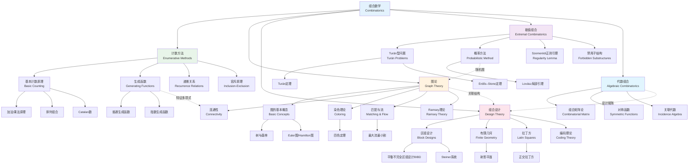

# 组合数学方法论

## 概述

组合数学是研究离散结构的存在、计数、优化和构型的数学分支。它与代数、几何、概率论和计算机科学有着深刻的联系。组合数学的主要方法论包括计数方法、图论、组合设计和极值组合学。本图谱系统展示这些方法论的结构体系和相互关系。

## 知识图谱

## 详细说明

### 1. 计数方法 (Enumerative Methods)

#### 基本计数原理
- **加法原理**: 不相交集合的并
- **乘法原理**: 笛卡尔积的大小
- **排列**: $P(n,k) = \frac{n!}{(n-k)!}$
- **组合**: $C(n,k) = \binom{n}{k} = \frac{n!}{k!(n-k)!}$

#### 生成函数 (Generating Functions)

**普通生成函数**:
$$G(x) = \sum_{n=0}^\infty a_n x^n$$

**指数生成函数**:
$$E(x) = \sum_{n=0}^\infty a_n \frac{x^n}{n!}$$

应用:
- 整数分拆
- Catalan数: $C_n = \frac{1}{n+1}\binom{2n}{n}$
- 递推关系的求解

#### 容斥原理
$$\left|\bigcup_{i=1}^n A_i\right| = \sum_{k=1}^n (-1)^{k+1} \sum_{1 \leq i_1 < \cdots < i_k \leq n} |A_{i_1} \cap \cdots \cap A_{i_k}|$$

应用:
- 错位排列 (derangements)
- Euler $\varphi$ 函数
- 图的着色多项式

### 2. 图论 (Graph Theory)

#### 基本概念
- **图**: $G = (V, E)$
- **度**: 邻边数
- **路径与连通**: 可达性
- **树**: 无圈连通图，$|E| = |V| - 1$

#### 经典图论问题

| 问题 | 内容 | 结果 |
|------|------|------|
| Euler回路 | 经过每条边一次 | 所有顶点度为偶数 |
| Hamilton圈 | 经过每个顶点一次 | 充分条件 (Dirac, Ore) |
| 平面图 | 可画在平面上无交叉 | Kuratowski定理 |
| 四色问题 | 地图着色 | Appel-Haken证明 |

#### 网络流
- **最大流最小割定理** (Ford-Fulkerson)
- **匹配**: Hall婚姻定理
- **二分图匹配**: 匈牙利算法

### 3. 组合设计 (Design Theory)

#### 平衡不完全区组设计 (BIBD)
参数 $(v, b, r, k, \lambda)$:
- $v$: 点集大小
- $b$: 区组数
- $r$: 每点出现次数
- $k$: 每区组点数
- $\lambda$: 每对点共现次数

**必要条件**:
- $bk = vr$
- $r(k-1) = \lambda(v-1)$

#### 有限几何
- **射影平面**: 阶为 $q$，$v = q^2 + q + 1$，每线 $q+1$ 点
- **仿射平面**: 阶为 $q$，$v = q^2$

#### 拉丁方与正交
- **拉丁方**: $n \times n$ 阵列，每符号每行每列一次
- **正交拉丁方**: 叠加后所有有序对唯一
- **Euler猜想**: 不存在正交拉丁方对 (当 $n \equiv 2 \pmod 4$) — 已被证伪

### 4. 极值组合学 (Extremal Combinatorics)

#### Turán型问题
**问题**: $n$ 个顶点、不含 $K_r$ 的图最多有多少边?

**Turán定理**: 极值图是完全 $(r-1)$-部图

**Erdős–Stone定理**: 渐近确定任意禁用图的极值数

#### 概率方法 (Erdős)
基本思想: 证明具有某性质的对象存在，通过证明随机对象具有该性质的概率 > 0

**Lovász局部引理**: 处理弱相关事件的联合避免

#### Szemerédi正则引理
图的粗糙描述: 任意大图可被划分为少数"正则"对

应用:
- Roth定理 (3项等差数列)
- 图移除引理
- 性质检验

### 5. 代数组合学 (Algebraic Combinatorics)

#### 关联代数与Möbius反演
**偏序集上的Möbius函数**:
$$\sum_{x \leq z \leq y} \mu(x,z) = \delta_{x,y}$$

**Möbius反演**:
$$g(x) = \sum_{y \leq x} f(y) \iff f(x) = \sum_{y \leq x} g(y)\mu(y,x)$$

#### 组合矩阵论
- **邻接矩阵**: 图的结构编码
- **谱图理论**: 特征值与图性质
- **Hadamard矩阵**: 正交设计

## 重要定理速览

| 定理 | 领域 | 内容 | 年代 |
|------|------|------|------|
| 四色定理 | 图染色 | 平面图4-可染色 | 1976 |
| Ramsey定理 | Ramsey理论 | 任意染色必有单色结构 | 1930 |
| Van der Waerden定理 | 算术组合 | 有限染色包含任意长等差数列 | 1927 |
| Szemerédi定理 | 极值组合 | 正密度集包含任意长等差数列 | 1975 |
| 图的次形定理 | 图论 | Wagner猜想，Robertson-Seymour | 2004 |

## 应用场景

### 计算机科学
- **算法设计**: 组合优化、近似算法
- **网络设计**: 路由、容错
- **密码学**: 组合设计、纠错码
- **计算复杂性**: #P-完全问题

### 运筹学
- **调度问题**: 作业调度、资源分配
- **运输问题**: 网络流优化
- **组合拍卖**: 机制设计

### 生物信息学
- **基因组重组**: 排列与排序
- **蛋白质折叠**: 组合搜索
- **系统发育树**: 图算法

### 统计物理
- **渗流理论**: 相变与临界现象
- **Ising模型**: 组合方法
- **随机图**: Erdős–Rényi模型

### 编码理论
- **纠错码**: Hamming码、Reed-Solomon码
- **设计理论**: 正交数组
- **密码编码**: LDPC码、极化码

### 相关资源

- [相关概念: 组合数学](../../concept/branch07-离散数学/07-06组合数学/)
- [相关概念: 图论](../../concept/branch07-离散数学/07-07图论/)
- [相关概念: 组合设计](../../concept/branch07-离散数学/07-06组合数学/07-06-03-组合设计.md)
- [Wikipedia: Combinatorics](https://en.wikipedia.org/wiki/Combinatorics)
