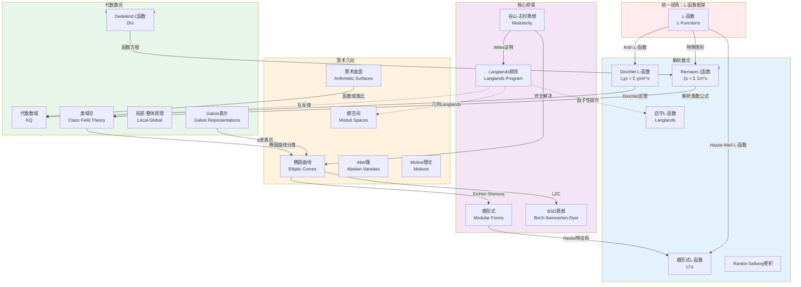

# 现代数论全景图

## 概述

现代数论是数学中最深刻、最统一的领域之一。从Gauss的《算术研究》到Grothendieck的概形理论，再到Wiles证明费马大定理，数论经历了从经典到现代的深刻变革。本图谱聚焦现代数论的三大支柱——**解析数论**、**代数数论**和**算术几何**——展示它们之间错综复杂的联系，以及L-函数如何成为统一这些分支的核心纽带。

## 知识图谱



## 三大支柱的内在联系

### 1. 解析数论：分析的视角

#### 核心特征
- **工具**：复变函数、调和分析、谱理论
- **对象**：各种L-函数的解析性质
- **问题**：素数分布、算术级数、加性问题

#### Riemann ζ函数的中心地位
$$
\zeta(s) = \sum_{n=1}^\infty \frac{1}{n^s} = \prod_p \frac{1}{1-p^{-s}}
$$

**关键性质**：
| 性质 | 表达式 | 数论意义 |
|------|--------|----------|
| 函数方程 | $\xi(s) = \xi(1-s)$ | 对称性与函数延拓 |
| 零点分布 | $\zeta(\rho) = 0$ | 素数定理的误差项 |
| 特殊值 | $\zeta(2) = \pi^2/6$ | 算术几何联系 |
| **Riemann假设** | $\text{Re}(\rho) = 1/2$ | 素数分布的精确性 |

#### 模形式与L-函数
**Hecke的洞察**：模形式的Fourier系数编码深刻算术信息
- **权2模形式** $\leftrightarrow$ **椭圆曲线**
- **Hecke L-函数**满足**函数方程**和**Euler乘积**

### 2. 代数数论：代数的视角

#### 核心特征
- **工具**：代数、Galois理论、同调代数
- **对象**：代数数域、理想类群、Galois表示
- **问题**：理想分解、单位群结构、扩张分类

#### 从经典到现代的发展

```
经典代数数论
├── 二次域 Q(√d)
├── 分圆域 Q(ζ_n)
└── 理想类群理论

现代代数数论
├── 类域论 (1920s-40s)
│   ├── Artin互反律
│   └── 局部-整体原理
├── Iwasawa理论 (1950s)
│   └── p进L-函数
└── Galois表示 (1970s-)
    ├── p进Hodge理论
    └── Fontaine-Laffaille理论
```

#### 类域论：互反律的高峰

**Artin互反律**（数论中最深刻的定理之一）：
$$\left(\frac{L/K}{\mathfrak{p}}\right) \longleftrightarrow \mathfrak{p} \in \text{Gal}(L/K)^{\text{ab}}$$

**局部-整体原理**：Hasse原理
$$X(\mathbb{Q}) \neq \emptyset \iff X(\mathbb{Q}_p) \neq \emptyset, \forall p \text{ 且 } X(\mathbb{R}) \neq \emptyset$$

### 3. 算术几何：几何的视角

#### 核心特征
- **工具**：代数几何、概形理论、上同调
- **对象**：代数簇、算术曲面、模空间
- **问题**：有理点、Diophantine方程、算术不变量

#### 从Diophantus到Grothendieck

**Diophantine方程**的现代理解：
- 从"找整数解"到"研究算术簇的有理点"
- **Mordell猜想** (Faltings定理)：曲线亏格$g \geq 2$时，有理点有限

**概形理论** (Grothendieck, 1960s)：
- 统一代数几何与数论
- 数域 $\leftrightarrow$ 一维概形 (Spec $\mathbb{Z}$)
- 整数环 $\leftrightarrow$ 结构层

#### 椭圆曲线的算术

**Mordell-Weil定理**：
$$E(\mathbb{Q}) \cong \mathbb{Z}^r \oplus E(\mathbb{Q})_{\text{tors}}$$

**BSD猜想**（七大千禧年问题之一）：
$$\text{rank } E(\mathbb{Q}) = \text{ord}_{s=1} L(E,s)$$
$$\frac{L^{(r)}(E,1)}{r! \cdot \Omega_E} = \frac{|\text{Sha}| \cdot \text{Reg}}{|\text{tors}|^2} \prod_{p} c_p$$

## 统一框架：核心桥梁

### 1. 模形式：分析与几何的交汇

**谷山-志村猜想**（模性定理）：
> 每条定义在$\mathbb{Q}$上的椭圆曲线都是模的

**Wiles的证明策略**：
```
椭圆曲线 E → Galois表示 ρ_E,p
                    ↓
模形式 f ← 可约性条件 ← 形变环 R
       ↓
      Hecke代数 T
       ↓
     R = T 定理
```

### 2. Langlands纲领： grand unification

**核心思想**：数论、表示论、代数几何的统一

| 领域 | Langlands对应 | 对应 |
|------|--------------|------|
| 数论 | Galois表示 $\rho: G_\mathbb{Q} \to GL_n(\overline{\mathbb{Q}}_\ell)$ | ↔ 自守表示 $\pi$ |
| 函数域 | $\ell$-进层 | ↔ 自守形式 |
| 几何 | Higgs丛 | ↔ 局部系统 |

**函子性原理**：
- 自守表示的提升 (Liftings)
- L-函数的因式分解

### 3. Motive理论：终极统一

**Grothendieck的愿景**：
- 所有上同调理论的共同来源
- 数与形的终极统一

**标准猜想**：
- Hodge猜想（几何版本）
- Tate猜想（算术版本）

## 现代数论的关键问题

### 已解决的重要问题

| 问题 | 解决者 | 年份 | 核心工具 |
|------|--------|------|----------|
| Weil猜想 | Deligne | 1974 | $\ell$-进上同调 |
| 费马大定理 | Wiles | 1994 | 模性提升 |
| 谷山-志村猜想 | BCDT | 2001 | 模形式理论 |
| Serre猜想 | Khare-Wintenberger | 2008 | Galois表示 |
| 主猜想 | Mazur-Wiles等 | 1984-2014 | Iwasawa理论 |

### 开放的重大猜想

| 猜想 | 内容 | 重要性 | 进展 |
|------|------|--------|------|
| Riemann假设 | ζ函数零点实部=1/2 | ★★★★★ | 10^13+零点验证 |
| BSD猜想 | 椭圆曲线秩与L-函数 | ★★★★★ | r=0,1时部分证明 |
| Langlands纲领 | 全局函子性 | ★★★★★ | GL_n情形 |
| Hodge猜想 | 代数闭链与Hodge类 | ★★★★☆ | 特殊情形 |
| Tate猜想 | 代数闭链与Tate类 | ★★★★☆ | Abel簇情形 |

## 应用场景

### 密码学与信息安全
- **椭圆曲线密码** (ECC)：基于ECDLP的困难性
- **配对密码学**：Weil配对、Tate配对
- **同态加密**：基于格/数论假设

### 编码理论
- **代数几何码**：Goppa码、Reed-Solomon码推广
- **LDPC码**：基于图的构造

### 计算数学
- **大整数分解**：椭圆曲线方法 (ECM)
- **素性测试**：AKS算法、椭圆曲线素性证明 (ECPP)
- **格基约化**：LLL算法及应用

### 物理学
- **弦论**：Calabi-Yau流形的算术性质
- **统计力学**：配分函数的算术特性
- **量子混沌**：量子遍历性与L-函数

### 相关资源

- [知识图谱-026: 数论分支全景图](./知识图谱-026-数论分支全景图.md)
- [知识图谱-021: Langlands纲领关系图](./知识图谱-021-Langlands纲领关系图.md)
- [相关概念: 代数数论](../../concept/branch01-代数基础/01-06代数数论/)
- [相关概念: 椭圆曲线](../../concept/branch01-代数基础/01-06代数数论/)
- [相关概念: 模形式](../../concept/branch01-代数基础/01-06代数数论/)
