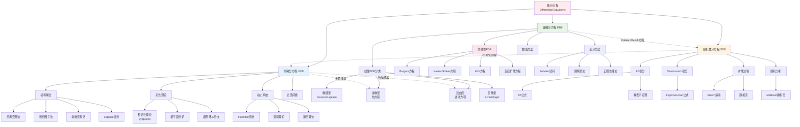
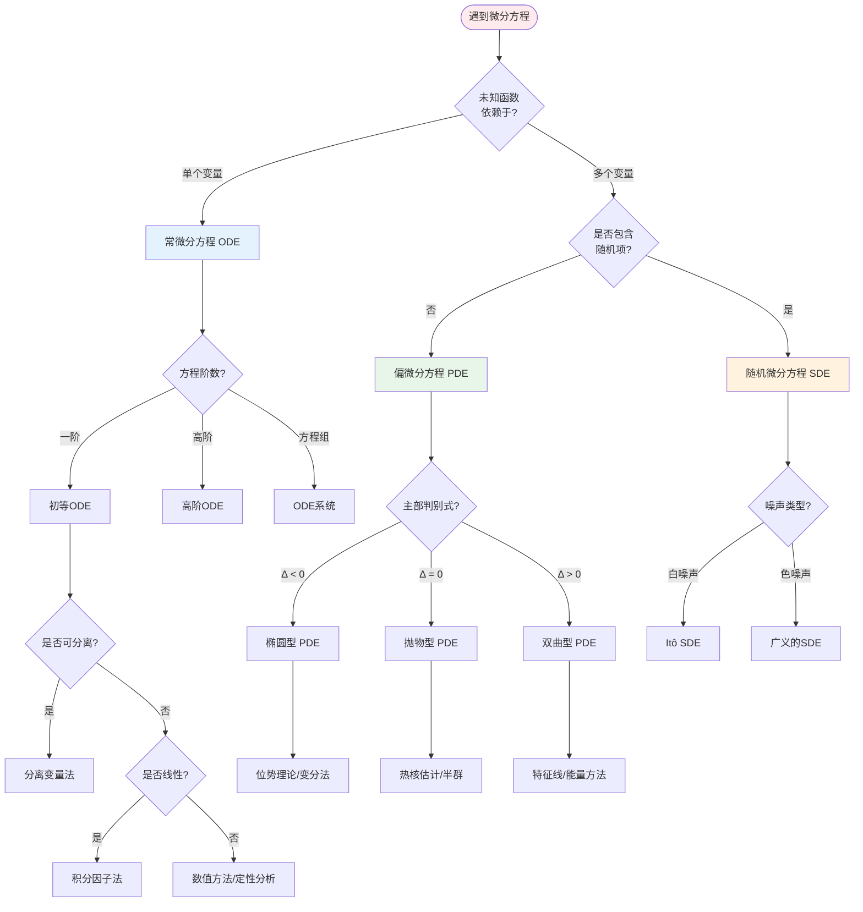

# 微分方程理论体系

## 概述

微分方程是数学中最核心的领域之一，描述了自然界中各种变化规律。从Newton的经典力学到Einstein的广义相对论，从流体力学到量子力学，微分方程无处不在。本图谱系统展示常微分方程(ODE)、偏微分方程(PDE)和随机微分方程(SDE)三大分支的分类体系、求解方法及其深刻联系。

## 知识图谱

## 决策树：如何选择方程类型

## 详细说明

### 1. 常微分方程 (ODE)

#### 基本形式与分类

**一般形式**：$F(x, y, y', \ldots, y^{(n)}) = 0$

| 类型 | 标准形式 | 解法 |
|------|----------|------|
| 可分离变量 | $y' = f(x)g(y)$ | $\int \frac{dy}{g(y)} = \int f(x)dx$ |
| 一阶线性 | $y' + p(x)y = q(x)$ | 积分因子 $\mu = e^{\int p dx}$ |
| Bernoulli方程 | $y' + p(x)y = q(x)y^n$ | 代换 $v = y^{1-n}$ |
| Riccati方程 | $y' = q_0(x) + q_1(x)y + q_2(x)y^2$ | 已知特解可降阶 |
| 恰当方程 | $Mdx + Ndy = 0$, $\frac{\partial M}{\partial y} = \frac{\partial N}{\partial x}$ | 势函数 $\psi(x,y) = C$ |

#### 高阶线性ODE

**常系数情形**：
$$y^{(n)} + a_{n-1}y^{(n-1)} + \cdots + a_0y = f(x)$$

**特征方程**：$\lambda^n + a_{n-1}\lambda^{n-1} + \cdots + a_0 = 0$

| 特征根类型 | 对应解 |
|-----------|--------|
| 单实根 $\lambda$ | $e^{\lambda x}$ |
| k重实根 | $e^{\lambda x}, xe^{\lambda x}, \ldots, x^{k-1}e^{\lambda x}$ |
| 共轭复根 $\alpha \pm i\beta$ | $e^{\alpha x}\cos\beta x$, $e^{\alpha x}\sin\beta x$ |

#### 定性理论与动力系统

**Lyapunov稳定性**：
- **稳定**：$\forall \epsilon > 0, \exists \delta > 0$ 使得 $\|x_0\| < \delta \Rightarrow \|x(t)\| < \epsilon$
- **渐近稳定**：稳定且 $\lim_{t \to \infty} x(t) = 0$
- **Lyapunov函数**：$V(x)$ 正定，$\dot{V}(x)$ 负定

**Poincaré-Bendixson定理**：
> 平面有界区域内，若轨线不趋于奇点，则必趋于闭轨。

**混沌三要素** (Devaney)：
1. 对初始条件敏感依赖
2. 拓扑传递性
3. 周期点稠密

### 2. 偏微分方程 (PDE)

#### 二阶线性PDE分类

**一般形式**：$Au_{xx} + 2Bu_{xy} + Cu_{yy} + Du_x + Eu_y + Fu = G$

**判别式**：$\Delta = B^2 - AC$

| 类型 | 判别式 | 典范形式 | 典型例子 |
|------|--------|----------|----------|
| **椭圆型** | $\Delta < 0$ | $u_{\xi\xi} + u_{\eta\eta} = \cdots$ | Laplace方程 $\Delta u = 0$ |
| **抛物型** | $\Delta = 0$ | $u_{\xi} = u_{\eta\eta}$ | 热方程 $u_t = \Delta u$ |
| **双曲型** | $\Delta > 0$ | $u_{\xi\xi} - u_{\eta\eta} = \cdots$ | 波动方程 $u_{tt} = \Delta u$ |

#### 椭圆型PDE

**Poisson方程**：$-\Delta u = f$ 在 $\Omega$ 内，$u = g$ 在 $\partial\Omega$ 上

**变分形式**：
$$J(u) = \frac{1}{2}\int_\Omega |\nabla u|^2 dx - \int_\Omega fu dx \to \min$$

**正则性理论**：
- **Schauder估计**：Hölder空间中的先验估计
- **De Giorgi-Nash定理**：散度型方程的连续性

#### 抛物型PDE

**热方程**：$u_t = \Delta u$, $u(x,0) = u_0(x)$

**基本解（热核）**：
$$\Phi(x,t) = \frac{1}{(4\pi t)^{n/2}} e^{-|x|^2/(4t)}$$

**最大模原理**：
$$\max_{\overline{\Omega} \times [0,T]} |u| = \max_{\Gamma_T} |u|$$
其中 $\Gamma_T$ 为抛物边界。

#### 双曲型PDE

**波动方程**：$u_{tt} - \Delta u = 0$, $u(x,0) = u_0(x)$, $u_t(x,0) = u_1(x)$

**d'Alembert公式**（一维）：
$$u(x,t) = \frac{u_0(x+t) + u_0(x-t)}{2} + \frac{1}{2}\int_{x-t}^{x+t} u_1(s)ds$$

**能量守恒**：
$$E(t) = \int_{\mathbb{R}^n} \left(|u_t|^2 + |\nabla u|^2\right) dx = \text{const}$$

#### 非线性PDE的重要例子

| 方程 | 形式 | 应用领域 | 特点 |
|------|------|----------|------|
| **Burgers方程** | $u_t + uu_x = \nu u_{xx}$ | 激波、交通流 | 可转化为热方程 |
| **KdV方程** | $u_t + uu_x + u_{xxx} = 0$ | 水波、等离子体 | 完全可积，孤子解 |
| **Navier-Stokes方程** | $\partial_t u + (u \cdot \nabla)u = -\nabla p + \nu \Delta u$ | 流体力学 | 千年难题 |
| **反应扩散方程** | $u_t = D\Delta u + f(u)$ | 模式形成、生态 | Turing不稳定性 |

### 3. 随机微分方程 (SDE)

#### Itô微积分

**Itô积分**：
$$\int_0^t H_s dB_s = \lim_{\Delta t \to 0} \sum H_{t_i}(B_{t_{i+1}} - B_{t_i})$$

**关键性质**：**Itô等距**
$$\mathbb{E}\left[\left(\int_0^t H_s dB_s\right)^2\right] = \mathbb{E}\left[\int_0^t H_s^2 ds\right]$$

**Itô公式**（链式法则的推广）：
$$df(t, X_t) = \frac{\partial f}{\partial t}dt + \frac{\partial f}{\partial x}dX_t + \frac{1}{2}\frac{\partial^2 f}{\partial x^2}(dX_t)^2$$

其中 $(dB_t)^2 = dt$（**Itô修正项**）

#### SDE的解

**标准形式**：
$$dX_t = b(t, X_t)dt + \sigma(t, X_t)dB_t$$

**存在唯一性**（Lipschitz条件）：
若 $b$, $\sigma$ 满足Lipschitz条件，则SDE存在唯一强解。

**例子：几何Brown运动**（Black-Scholes模型）：
$$dS_t = \mu S_t dt + \sigma S_t dB_t$$
$$S_t = S_0 \exp\left(\left(\mu - \frac{\sigma^2}{2}\right)t + \sigma B_t\right)$$

#### Fokker-Planck方程

SDE与PDE的联系：概率密度的演化

**Fokker-Planck方程**（前向Kolmogorov方程）：
$$\frac{\partial p}{\partial t} = -\frac{\partial}{\partial x}(b(x)p) + \frac{1}{2}\frac{\partial^2}{\partial x^2}(\sigma^2(x)p)$$

#### 应用：金融数学

**Black-Scholes方程**：
$$\frac{\partial V}{\partial t} + \frac{1}{2}\sigma^2 S^2 \frac{\partial^2 V}{\partial S^2} + rS\frac{\partial V}{\partial S} - rV = 0$$

**Feynman-Kac公式**：PDE解的概率表示
$$u(x,t) = \mathbb{E}\left[\phi(X_T)e^{-\int_t^T V(X_s)ds} \Big| X_t = x\right]$$

## 三大分支的联系

### 半群理论：统一视角

**ODE作为算子半群**：
$$\frac{du}{dt} = Au, \quad u(t) = e^{tA}u_0$$

**PDE作为无穷维半群**：
- 热方程：$e^{t\Delta}$ 是强连续半群
- 波动方程：$e^{tA}$ 是$C_0$群

**SDE的半群**：转移半群 $(P_t f)(x) = \mathbb{E}[f(X_t) | X_0 = x]$

### 数值方法概览

| 方法 | ODE | PDE | SDE |
|------|-----|-----|-----|
| **显式Euler** | $y_{n+1} = y_n + hf(t_n, y_n)$ | FTCS格式 | Euler-Maruyama |
| **隐式Euler** | $y_{n+1} = y_n + hf(t_{n+1}, y_{n+1})$ | 后向差分 | 隐式Euler |
| **Runge-Kutta** | RK4 | 无直接对应 | SRK方法 |
| **有限差分** | - | $\Delta u \approx \frac{u_{i+1}-2u_i+u_{i-1}}{h^2}$ | - |
| **有限元** | - | 变分离散 | - |
| **Monte Carlo** | - | - | 路径模拟 |

## 应用场景

### 物理学
- **经典力学**：Hamilton-Jacobi方程
- **量子力学**：Schrödinger方程
- **广义相对论**：Einstein场方程
- **统计物理**：Fokker-Planck方程

### 工程学
- **结构力学**：弹性力学方程组
- **流体力学**：Navier-Stokes方程
- **电磁学**：Maxwell方程组
- **控制理论**：Riccati方程、Hamilton系统

### 生物学
- **种群动力学**：Lotka-Volterra方程
- **神经科学**：Hodgkin-Huxley方程
- **流行病学**：SIR模型
- **形态发生**：反应扩散方程（Turing模式）

### 经济学与金融
- **期权定价**：Black-Scholes方程
- **利率模型**：Vasicek模型、CIR模型
- **投资组合**：Merton问题
- **宏观模型**：动态随机一般均衡 (DSGE)

### 相关资源

- [相关概念: 常微分方程](../../concept/branch03-分析学/03-04微分方程/)
- [相关概念: 偏微分方程](../../concept/branch03-分析学/03-05偏微分方程/)
- [相关概念: 动力系统](../../concept/branch05-动力系统/)
- [知识图谱-025: 偏微分方程分类图谱](./知识图谱-025-偏微分方程分类图谱.md)
- [知识图谱-027: 概率论公理化体系](./知识图谱-027-概率论公理化体系.md)
