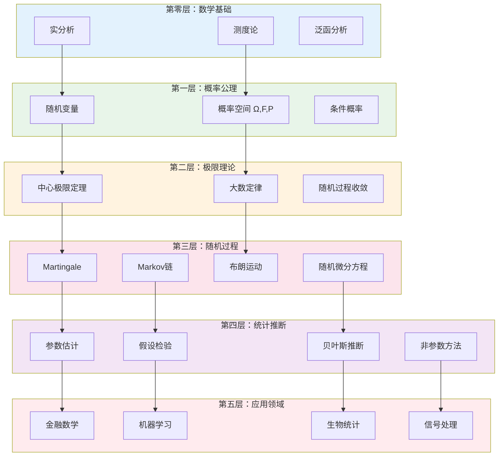

# 概率论与统计推断框架

## 概述

概率论与数理统计是研究随机现象规律性的数学分支，是现代科学、工程和金融的基石。从Kolmogorov的公理化体系到现代随机分析，从经典统计推断到贝叶斯方法，这一领域经历了深刻的发展。本图谱展示从测度论基础到随机过程，再到统计推断的完整知识体系，揭示概率与统计的内在统一。

## 知识图谱

```mermaid
graph TB
    A[测度论基础<br/>Measure Theory] --> B[概率空间<br/>Probability Space]
    
    B --> C[随机变量<br/>Random Variables]
    B --> D[收敛模式<br/>Convergence Modes]
    
    C --> C1[分布理论<br/>Distributions]
    C --> C2[期望与矩<br/>Expectation]
    C --> C3[特征函数<br/>Characteristic Functions]
    
    C1 --> C11[离散分布<br/>泊松/二项/几何]
    C1 --> C12[连续分布<br/>正态/指数/伽马]
    C1 --> C13[多元分布<br/>联合/边缘/条件]
    
    C2 --> C21[期望<br/>E(X)]
    C2 --> C22[方差<br/>Var(X)]
    C2 --> C23[协方差<br/>Cov(X,Y)]
    C2 --> C24[矩母函数<br/>MGF]
    
    D --> D1[几乎必然收敛<br/>a.s.]
    D --> D2[依概率收敛<br/>in P]
    D --> D3[依分布收敛<br/>in D]
    D --> D4[L^p收敛<br/>in L^p]
    
    B --> E[极限定理<br/>Limit Theorems]
    E --> E1[大数定律<br/>LLN]
    E --> E2[中心极限定理<br/>CLT]
    E --> E3[重对数律<br/>LIL]
    
    B --> F[随机过程<br/>Stochastic Processes]
    F --> F1[Markov过程<br/>Markov]
    F --> F2[Martingale<br/>鞅]
    F --> F3[平稳过程<br/>Stationary]
    F --> F4[随机分析<br/>Stochastic Calculus]
    
    F1 --> F11[离散时间<br/>Markov链]
    F1 --> F12[连续时间<br/>Markov过程]
    F1 --> F13[扩散过程<br/>布朗运动]
    
    F2 --> F21[Doob分解<br/>Doob]
    F2 --> F22[可选停时<br/>Optional Stopping]
    F2 --> F23[Martingale收敛<br/>Convergence]
    
    F4 --> F41[Itô积分<br/>Itô]
    F4 --> F42[Itô公式<br/>Itô Formula]
    F4 --> F43[随机微分方程<br/>SDE]
    
    B --> G[统计推断<br/>Statistical Inference]
    G --> G1[参数估计<br/>Estimation]
    G --> G2[假设检验<br/>Testing]
    G --> G3[置信区间<br/>Confidence Intervals]
    G --> G4[贝叶斯方法<br/>Bayesian]
    
    G1 --> G11[点估计<br/>Point Estimation]
    G1 --> G12[区间估计<br/>Interval Estimation]
    
    G11 --> G111[矩估计<br/>MOM]
    G11 --> G112[最大似然<br/>MLE]
    G11 --> G113[最小二乘<br/>OLS]
    
    G2 --> G21[Neyman-Pearson<br/>NP引理]
    G2 --> G22[似然比检验<br/>LRT]
    G2 --> G23[非参数检验<br/>Nonparametric]
    
    G4 --> G41[先验分布<br/>Prior]
    G4 --> G42[后验分布<br/>Posterior]
    G4 --> G43[贝叶斯估计<br/>Bayes Estimator]
    G4 --> G44[MCMC方法<br/>MCMC]
    
    E -.->|理论基础| G
    F -.->|时间序列| G
    C -.->|分布假设| G
    
    style A fill:#e3f2fd
    style B fill:#e8f5e9
    style C fill:#fff3e0
    style D fill:#fce4ec
    style E fill:#f3e5f5
    style F fill:#e1f5fe
    style G fill:#ffebee
```

## 层次结构：概率统计的知识体系



## 详细说明

### 1. 测度论基础与概率公理化

#### Kolmogorov公理体系 (1933)

**概率空间** $(\Omega, \mathcal{F}, P)$：
1. **样本空间** $\Omega$：所有可能结果的集合
2. **$\sigma$-代数** $\mathcal{F}$：可测事件的集合
3. **概率测度** $P: \mathcal{F} \to [0,1]$ 满足：
   - $P(\Omega) = 1$
   - **可列可加性**：对互不相容事件 $A_1, A_2, \ldots$
   $$P\left(\bigcup_{i=1}^\infty A_i\right) = \sum_{i=1}^\infty P(A_i)$$

#### 条件概率与独立性

**条件概率**：
$$P(A|B) = \frac{P(A \cap B)}{P(B)}, \quad P(B) > 0$$

**全概率公式**：若 $\{B_i\}$ 是划分，则
$$P(A) = \sum_i P(A|B_i)P(B_i)$$

**Bayes公式**：
$$P(B_i|A) = \frac{P(A|B_i)P(B_i)}{\sum_j P(A|B_j)P(B_j)}$$

### 2. 随机变量与分布

#### 随机变量的分类

| 类型 | 分布函数特点 | 例子 |
|------|-------------|------|
| **离散型** | 阶梯函数 | 泊松、二项、几何 |
| **连续型** | 绝对连续 | 正态、指数、伽马 |
| **奇异型** | 连续但非绝对连续 | Cantor分布 |

#### 重要分布族

**离散分布**：
| 分布 | PMF | 期望 | 方差 | 应用场景 |
|------|-----|------|------|----------|
| Bernoulli | $p^k(1-p)^{1-k}$ | $p$ | $p(1-p)$ | 二元试验 |
| 二项 | $\binom{n}{k}p^k(1-p)^{n-k}$ | $np$ | $np(1-p)$ | n次成功次数 |
| 泊松 | $\frac{\lambda^k e^{-\lambda}}{k!}$ | $\lambda$ | $\lambda$ | 稀有事件 |
| 几何 | $(1-p)^{k-1}p$ | $1/p$ | $(1-p)/p^2$ | 首次成功 |

**连续分布**：
| 分布 | PDF | 期望 | 方差 | 特征 |
|------|-----|------|------|------|
| 均匀 | $\frac{1}{b-a}$ | $\frac{a+b}{2}$ | $\frac{(b-a)^2}{12}$ | 最大熵 |
| 指数 | $\lambda e^{-\lambda x}$ | $1/\lambda$ | $1/\lambda^2$ | 无记忆性 |
| 正态 | $\frac{1}{\sqrt{2\pi}\sigma}e^{-\frac{(x-\mu)^2}{2\sigma^2}}$ | $\mu$ | $\sigma^2$ | CLT极限 |
| Gamma | $\frac{\lambda^\alpha}{\Gamma(\alpha)}x^{\alpha-1}e^{-\lambda x}$ | $\alpha/\lambda$ | $\alpha/\lambda^2$ | Poisson waiting |

#### 多元分布与相关性

**联合分布**：$F(x,y) = P(X \leq x, Y \leq y)$

**协方差与相关系数**：
$$\text{Cov}(X,Y) = E[(X-EX)(Y-EY)] = E[XY] - E[X]E[Y]$$
$$\rho_{X,Y} = \frac{\text{Cov}(X,Y)}{\sqrt{\text{Var}(X)\text{Var}(Y)}}$$

**条件期望**：给定$\sigma$-代数 $\mathcal{G}$，$E[X|\mathcal{G}]$ 是满足
$$\int_A E[X|\mathcal{G}]dP = \int_A X dP, \quad \forall A \in \mathcal{G}$$
的随机变量。

### 3. 极限定理

#### 大数定律 (Law of Large Numbers)

**弱大数定律** (WLLN)：
若 $X_1, X_2, \ldots$ i.i.d.，$E|X_1| < \infty$，则
$$\frac{S_n}{n} = \frac{X_1 + \cdots + X_n}{n} \xrightarrow{P} E[X_1]$$

**强大数定律** (SLLN)：
在上述条件下
$$\frac{S_n}{n} \xrightarrow{\text{a.s.}} E[X_1]$$

#### 中心极限定理 (Central Limit Theorem)

**经典CLT** (Lindeberg-Lévy)：
若 $X_1, X_2, \ldots$ i.i.d.，$EX_1 = \mu$，$\text{Var}(X_1) = \sigma^2 < \infty$，则
$$\frac{S_n - n\mu}{\sigma\sqrt{n}} \xrightarrow{D} N(0,1)$$

**泛函CLT** (Donsker不变原理)：
$$W_n(t) = \frac{S_{\lfloor nt \rfloor} - \lfloor nt \rfloor \mu}{\sigma\sqrt{n}} \xrightarrow{D} W(t)$$
其中 $W(t)$ 是标准布朗运动。

#### 收敛模式的关系

```
几乎必然收敛 ──→ 依概率收敛 ──→ 依分布收敛
     ↑                  ↑
   L^p收敛 ────────────┘
```

**蕴含关系**：
- $X_n \xrightarrow{\text{a.s.}} X \Rightarrow X_n \xrightarrow{P} X \Rightarrow X_n \xrightarrow{D} X$
- $X_n \xrightarrow{L^p} X \Rightarrow X_n \xrightarrow{P} X$ (对 $p \geq 1$)
- 若 $X_n \xrightarrow{D} c$ (常数)，则 $X_n \xrightarrow{P} c$

### 4. 随机过程

#### Markov过程

**Markov性质**：未来只依赖于现在，与过去无关
$$P(X_{t+s} \in A | \mathcal{F}_t) = P(X_{t+s} \in A | X_t)$$

**离散时间Markov链** (DTMC)：
- **转移矩阵**：$P = (p_{ij})$，$p_{ij} = P(X_{n+1}=j | X_n=i)$
- **Chapman-Kolmogorov方程**：$P^{(m+n)} = P^{(m)}P^{(n)}$
- **平稳分布**：$\pi P = \pi$

**连续时间Markov链** (CTMC)：
- **转移速率矩阵** $Q$
- **Kolmogorov前进/后退方程**：$P'(t) = QP(t) = P(t)Q$

#### Martingale理论

**定义**：随机过程 $\{M_n\}$ 称为Martingale，如果
1. $E|M_n| < \infty$
2. $E[M_{n+1} | \mathcal{F}_n] = M_n$

**重要定理**：
- **Doob分解**：任何可积适应过程可分解为Martingale + 可料过程
- **可选停时定理**：在适当条件下，$E[M_T] = E[M_0]$
- **Martingale收敛定理**：有界Martingale几乎必然收敛

#### 布朗运动与随机分析

**标准布朗运动** $\{B_t\}_{t \geq 0}$ 满足：
1. $B_0 = 0$
2. 独立增量
3. $B_t - B_s \sim N(0, t-s)$
4. 样本路径连续

**Itô公式**：
$$df(t, X_t) = \frac{\partial f}{\partial t}dt + \frac{\partial f}{\partial x}dX_t + \frac{1}{2}\frac{\partial^2 f}{\partial x^2}(dX_t)^2$$

**应用：Black-Scholes模型**
$$dS_t = \mu S_t dt + \sigma S_t dB_t$$
期权价格 $V(S,t)$ 满足 Black-Scholes PDE。

### 5. 统计推断

#### 参数估计

**点估计的评价标准**：
| 标准 | 定义 | 含义 |
|------|------|------|
| **无偏性** | $E[\hat{\theta}] = \theta$ | 无系统误差 |
| **有效性** | $\text{Var}(\hat{\theta})$ 最小 | 方差小 |
| **相合性** | $\hat{\theta}_n \xrightarrow{P} \theta$ | 大样本收敛 |
| **充分性** | 包含样本全部信息 | 信息无损 |

**最大似然估计** (MLE)：
$$\hat{\theta}_{MLE} = \arg\max_\theta L(\theta; x_1, \ldots, x_n) = \arg\max_\theta \prod_{i=1}^n f(x_i; \theta)$$

**性质**：
- 渐近无偏：$E[\hat{\theta}] \to \theta$
- 渐近有效：达到Cramér-Rao下界
- 渐近正态：$\sqrt{n}(\hat{\theta} - \theta) \xrightarrow{D} N(0, I(\theta)^{-1})$

#### 假设检验

**Neyman-Pearson框架**：
- **原假设** $H_0$ vs **备择假设** $H_1$
- **第一类错误** (拒真)：$\alpha = P(\text{拒绝} H_0 | H_0 \text{为真})$
- **第二类错误** (纳伪)：$\beta = P(\text{不拒绝} H_0 | H_1 \text{为真})$
- **功效**：$1 - \beta$

**似然比检验** (LRT)：
$$\Lambda = \frac{\sup_{\theta \in \Theta_0} L(\theta)}{\sup_{\theta \in \Theta} L(\theta)}$$
拒绝域：$\Lambda < c$，其中 $P(\Lambda < c | H_0) = \alpha$

#### 贝叶斯统计

**贝叶斯定理**：
$$\pi(\theta | x) = \frac{f(x | \theta) \pi(\theta)}{\int f(x | \theta) \pi(\theta) d\theta} \propto \text{似然} \times \text{先验}$$

**先验分布选择**：
| 类型 | 特点 | 例子 |
|------|------|------|
| **共轭先验** | 后验与先验同分布 | 正态-正态、二项-Beta |
| **无信息先验** | 尽量客观 | Jeffreys先验 |
| **主观先验** | 包含先验知识 | 专家经验 |

**贝叶斯估计**：
- **后验均值**：$\hat{\theta} = E[\theta | x]$
- **后验众数** (MAP)：$\hat{\theta} = \arg\max_\theta \pi(\theta | x)$

**MCMC方法**：
- **Metropolis-Hastings算法**
- **Gibbs抽样**
- **Hamiltonian Monte Carlo**

## 概率统计的现代发展

### 高维统计
- **随机矩阵理论**：特征值分布
- **压缩感知**：稀疏恢复
- **高维回归**：LASSO、Ridge

### 机器学习中的概率统计
- **概率图模型**：Bayes网、Markov随机场
- **变分推断**：近似后验
- **高斯过程**：非参数贝叶斯

## 应用场景

### 金融工程
- **风险度量**：VaR、CVaR
- **衍生品定价**：Monte Carlo模拟
- **投资组合优化**：均值-方差模型

### 生物统计
- **生存分析**：Kaplan-Meier估计
- **临床试验**：随机化设计
- **基因组学**：多重检验校正

### 信号处理
- **滤波理论**：Kalman滤波、粒子滤波
- **谱估计**：周期图、参数方法
- **检测理论**：Neyman-Pearson检测

### 机器学习
- **概率图模型**：HMM、CRF
- **深度生成模型**：VAE、扩散模型
- **强化学习**：MDP、策略梯度

### 相关资源

- [相关概念: 概率论](../../concept/branch02-概率统计/02-01概率论/)
- [相关概念: 数理统计](../../concept/branch02-概率统计/02-02数理统计/)
- [相关概念: 随机过程](../../concept/branch02-概率统计/02-03随机过程/)
- [知识图谱-027: 概率论公理化体系](./知识图谱-027-概率论公理化体系.md)
- [知识图谱-031: 微分方程理论体系](./知识图谱-031-微分方程理论体系.md)
