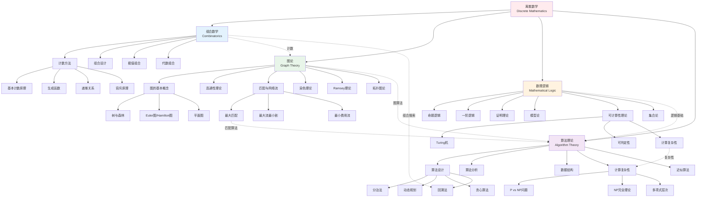
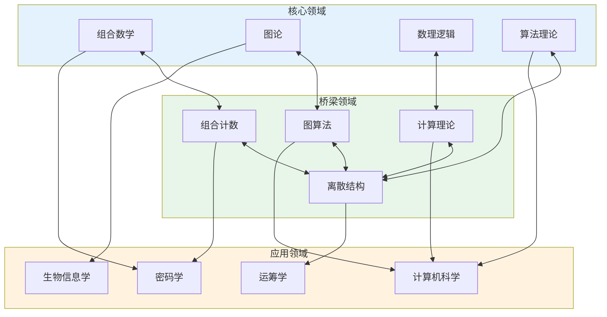

# 离散数学知识网络

## 概述

离散数学是研究离散对象（而非连续对象）的数学分支，是计算机科学的理论基础。从组合计数到图算法，从逻辑推理到计算复杂性，离散数学提供了理解和设计离散系统的基本工具。本图谱展示组合数学、图论、数理逻辑和算法理论四大核心分支的知识网络及其深刻联系。

## 知识图谱

## 网络图：离散数学的交叉领域

## 详细说明

### 1. 组合数学 (Combinatorics)

#### 基本计数原理

**加法原理**：若 $A \cap B = \emptyset$，则 $|A \cup B| = |A| + |B|$

**乘法原理**：$|A \times B| = |A| \cdot |B|$

**排列组合**：
| 类型 | 公式 | 条件 |
|------|------|------|
| 排列 | $P(n,k) = \frac{n!}{(n-k)!}$ | 有序选取k个 |
| 组合 | $\binom{n}{k} = \frac{n!}{k!(n-k)!}$ | 无序选取k个 |
| 重复排列 | $n^k$ | 可重复选取 |
| 重复组合 | $\binom{n+k-1}{k}$ | 可重复无序 |

#### 生成函数

**普通生成函数** (OGF)：
$$G(x) = \sum_{n=0}^\infty a_n x^n$$

**指数生成函数** (EGF)：
$$E(x) = \sum_{n=0}^\infty a_n \frac{x^n}{n!}$$

**经典例子**：
- 斐波那契数列：$F(x) = \frac{x}{1-x-x^2}$
- Catalan数：$C(x) = \frac{1-\sqrt{1-4x}}{2x} = \sum_{n=0}^\infty \frac{1}{n+1}\binom{2n}{n}x^n$

#### 容斥原理

$$\left|\bigcup_{i=1}^n A_i\right| = \sum_{k=1}^n (-1)^{k+1} \sum_{1 \leq i_1 < \cdots < i_k \leq n} |A_{i_1} \cap \cdots \cap A_{i_k}|$$

**应用**：
- **错位排列** (Derangements)：$D_n = n!\sum_{k=0}^n \frac{(-1)^k}{k!} \approx \frac{n!}{e}$
- **Euler $\varphi$函数**：$\varphi(n) = n\prod_{p|n}\left(1-\frac{1}{p}\right)$

#### 极值组合

**Turán定理**：$n$个顶点、不含$K_{r+1}$的图的最大边数为
$$t_r(n) = \left(1-\frac{1}{r}\right)\frac{n^2}{2}$$

**Erdős–Stone定理**：确定任意禁用图的极值数

**概率方法** (Erdős)：
> 证明存在具有某性质的对象，通过证明随机对象具有该性质的概率 > 0

### 2. 图论 (Graph Theory)

#### 基本概念

**图**：$G = (V, E)$，其中 $V$ 为顶点集，$E$ 为边集

**图的分类**：
| 类型 | 定义 | 特点 |
|------|------|------|
| **简单图** | 无环、无重边 | 最基本 |
| **有向图** | 边有方向 | 表示非对称关系 |
| **带权图** | 边有权重 | 网络流、最短路径 |
| **二分图** | 顶点可分两组 | 匹配问题 |
| **平面图** | 可画在平面上无交叉 | 四色定理 |

#### 连通性与遍历

**树**：连通无圈图，$|E| = |V| - 1$

**Euler图**：存在经过每条边恰好一次的回路
> **判定**：连通图是Euler图 $\iff$ 每个顶点度数为偶数

**Hamilton图**：存在经过每个顶点恰好一次的圈
> **Dirac定理**：$n \geq 3$ 且 $\delta(G) \geq n/2$ $\Rightarrow$ Hamilton图
> **Ore定理**：对不相邻顶点 $u,v$，$d(u)+d(v) \geq n$ $\Rightarrow$ Hamilton图

#### 匹配与网络流

**匹配**：无公共顶点的边集

**Hall婚姻定理**：二分图 $G = (X \cup Y, E)$ 存在完美匹配 $\iff$
$$\forall S \subseteq X, \quad |N(S)| \geq |S|$$

**最大流最小割定理** (Ford-Fulkerson)：
$$\max |f| = \min_{(S,T)} c(S,T)$$

#### 染色理论

**顶点染色数** $\chi(G)$：使相邻顶点不同色的最少颜色数

**重要结果**：
- **四色定理** (Appel-Haken, 1976)：平面图4-可染色
- **五色定理**：平面图5-可染色（简单证明）
- **Brooks定理**：连通图 $\chi(G) \leq \Delta(G)$，除非是完全图或奇圈

#### Ramsey理论

**Ramsey定理**：对任意 $k, l$，存在 $R(k,l)$ 使得
> 任意 $n \geq R(k,l)$ 个顶点的完全图，用红蓝两色染色，必存在红色 $K_k$ 或蓝色 $K_l$

**Ramsey数**：$R(3,3) = 6$，$R(4,4) = 18$，$R(5,5)$ 未知（在43到48之间）

### 3. 数理逻辑 (Mathematical Logic)

#### 命题逻辑

**语法**：
- 原子命题：$p, q, r, \ldots$
- 连接词：$\neg$ (非), $\wedge$ (且), $\vee$ (或), $\rightarrow$ (蕴涵), $\leftrightarrow$ (等价)

**语义**：
- 真值表
- **重言式** (永真)：所有赋值下为真
- **可满足式**：至少一个赋值下为真

**范式**：
- **合取范式** (CNF)：$(A_{11} \vee \cdots \vee A_{1n}) \wedge \cdots \wedge (A_{m1} \vee \cdots \vee A_{mn})$
- **析取范式** (DNF)

#### 一阶逻辑

**语法**：
- 量词：$\forall$ (全称), $\exists$ (存在)
- 谓词：$P(x), Q(x,y), \ldots$
- 函数符号：$f(x), g(x,y), \ldots$

**语义**：
- **结构** $\mathcal{M} = (M, \ldots)$：论域 + 解释
- **满足关系**：$\mathcal{M} \models \varphi$

**重要定理**：
- **完备性定理** (Gödel)：一阶逻辑可证 $\iff$ 有效
- **紧致性定理**：若公式集的每个有限子集可满足，则整体可满足

#### 可计算性理论

**Turing机**：计算的形式化模型

**可判定性**：
| 问题 | 可判定性 | 备注 |
|------|----------|------|
| 命题逻辑可满足 | 可判定 | SAT问题，NP完全 |
| 一阶逻辑有效性 | **不可判定** | Church-Turing定理 |
| 停机问题 | **不可判定** | Turing证明 |
| 算术真命题 | **不可判定** | Gödel不完全性 |

**Church-Turing论题**：
> 直观可计算 = Turing机可计算

### 4. 算法理论 (Algorithm Theory)

#### 算法设计范式

| 范式 | 思想 | 经典例子 |
|------|------|----------|
| **分治法** | 分解、解决、合并 | 归并排序、快速排序、FFT |
| **动态规划** | 最优子结构、重叠子问题 | 最长公共子序列、背包问题 |
| **贪心算法** | 局部最优 → 全局最优 | Dijkstra、最小生成树 |
| **回溯法** | 深度搜索 + 剪枝 | N皇后、数独求解 |
| **分支定界** | 系统枚举 + 界限 | 整数规划 |

#### 计算复杂性

**复杂性类**：
| 类 | 定义 | 典型问题 |
|---|------|----------|
| **P** | 多项式时间可判定 | 排序、最短路径、匹配 |
| **NP** | 多项式时间可验证 | SAT、TSP、图染色 |
| **co-NP** | 补问题在NP中 | 非可满足性验证 |
| **PSPACE** | 多项式空间可解 | 量化布尔公式 |
| **EXP** | 指数时间可解 | 博弈求解 |

**NP完全问题** (Cook-Levin定理)：
- SAT是第一个NP完全问题
- 其他NP完全问题：3-SAT、顶点覆盖、团、独立集、Hamilton圈、TSP

**P vs NP问题**：
> 世纪难题，$1,000,000美元悬赏

#### 图算法

| 问题 | 算法 | 复杂度 |
|------|------|--------|
| 单源最短路径 | Dijkstra | $O((V+E)\log V)$ |
| 全源最短路径 | Floyd-Warshall | $O(V^3)$ |
| 最小生成树 | Prim/Kruskal | $O(E \log V)$ |
| 最大匹配 | Hopcroft-Karp | $O(\sqrt{V}E)$ |
| 最大流 | Dinic | $O(V^2E)$ |
| 强连通分量 | Tarjan | $O(V+E)$ |

## 离散数学的交叉应用

### 组合优化
- **整数规划**：线性规划 + 整数约束
- **组合拍卖**：机制设计
- **调度问题**：作业车间调度

### 密码学
- **数论**：RSA、ElGamal
- **组合设计**：认证码、秘密共享
- **图论**：零知识证明

### 编码理论
- **纠错码**：Hamming码、Reed-Solomon码
- **组合设计**：正交数组
- **LDPC码**：基于图的编码

### 生物信息学
- **序列比对**：动态规划
- **系统发育树**：图算法
- **蛋白质折叠**：组合搜索

## 重要定理速览

| 定理 | 领域 | 内容 | 年代 |
|------|------|------|------|
| 四色定理 | 图染色 | 平面图4-可染色 | 1976 |
| Cook-Levin定理 | 复杂性 | SAT是NP完全的 | 1971 |
| Robertson-Seymour定理 | 图论 | 图次形良拟序 | 2004 |
| PCP定理 | 复杂性 | NP = PCP(log n, 1) | 1992 |
| Szemerédi正则引理 | 极值组合 | 图的粗糙结构 | 1978 |

## 应用场景

### 计算机科学
- **数据结构**：图、树、哈希表
- **算法设计**：排序、搜索、优化
- **编译原理**：自动机理论、上下文无关文法
- **数据库**：关系代数、查询优化

### 网络科学
- **社交网络分析**：社区发现、影响力最大化
- **互联网路由**：最短路径、流量工程
- **推荐系统**：图算法、矩阵分解

### 运筹学与优化
- **线性规划**：单纯形法、内点法
- **组合优化**：旅行商问题、车辆路径
- **博弈论**：纳什均衡、机制设计

### 人工智能
- **机器学习**：VC维、PAC学习
- **约束满足**：SAT求解、CSP
- **知识表示**：描述逻辑、本体论

### 相关资源

- [知识图谱-029: 组合数学方法论](./知识图谱-029-组合数学方法论.md)
- [知识图谱-028: 数理逻辑基础架构](./知识图谱-028-数理逻辑基础架构.md)
- [相关概念: 组合数学](../../concept/branch07-离散数学/07-06组合数学/)
- [相关概念: 图论](../../concept/branch07-离散数学/07-07图论/)
- [相关概念: 数理逻辑](../../concept/branch08-数理逻辑/)
