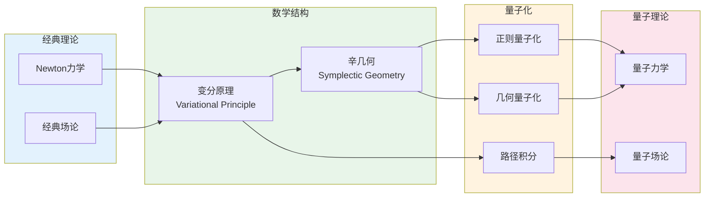

# 数学物理交叉领域

## 概述

数学物理是数学与物理学的交叉领域，研究物理问题的数学结构和物理理论的数学表述。从Newton的经典力学到Schrödinger的量子力学，从Maxwell的电磁理论到Einstein的广义相对论，数学物理始终是推动数学和物理学共同发展的核心动力。本图谱展示经典力学、量子力学、场论的数学结构及其深刻联系。

## 知识图谱

```mermaid
flowchart TB
    A[数学物理<br/>Mathematical Physics] --> B[经典力学<br/>Classical Mechanics]
    A --> C[量子力学<br/>Quantum Mechanics]
    A --> D[场论<br/>Field Theory]
    A --> E[统计力学<br/>Statistical Mechanics]
    
    B --> B1[Newton力学]
    B --> B2[Lagrange力学]
    B --> B3[Hamilton力学]
    B --> B4[辛几何]
    
    B3 --> B31[正则方程]
    B3 --> B32[Poisson括号]
    B3 --> B33[作用-角变量]
    B3 --> B34[可积系统]
    
    B4 --> B41[辛流形]
    B4 --> B42[正则变换]
    B4 --> B43[Liouville定理]
    
    C --> C1[Hilbert空间]
    C --> C2[算子理论]
    C --> C3[谱理论]
    C --> C4[路径积分]
    
    C1 --> C11[态矢量 |ψ⟩]
    C1 --> C12[Dirac符号]
    C1 --> C13[张量积]
    
    C2 --> C21[可观测量<br/>厄米算子]
    C2 --> C22[对易关系<br/>[A,B]=iℏ]
    C2 --> C23[不确定性原理]
    
    C3 --> C31[离散谱<br/>束缚态]
    C3 --> C32[连续谱<br/>散射态]
    C3 --> C33[自伴延拓]
    
    D --> D1[经典场论]
    D --> D2[量子场论]
    D --> D3[规范场论]
    D --> D4[广义相对论]
    
    D1 --> D11[Euler-Lagrange方程]
    D1 --> D12[Noether定理]
    D1 --> D13[能量-动量张量]
    
    D2 --> D21[正则量子化]
    D2 --> D22[路径积分量子化]
    D2 --> D23[重整化理论]
    
    D3 --> D31[规范对称性]
    D3 --> D32[纤维丛理论]
    D3 --> D33[Yang-Mills理论]
    
    D4 --> D41[Einstein场方程]
    D4 --> D42[微分几何基础]
    D4 --> D43[时空奇点理论]
    
    E --> E1[系综理论]
    E --> E2[配分函数]
    E --> E3[相变理论]
    E --> E4[临界现象]
    
    B2 -.->|Legendre变换| B3
    B3 -.->|算子化| C2
    C4 -.->|经典极限| D22
    D12 -.->|应用到| B2
    D32 -.->|纤维丛| B4
    
    style A fill:#ffebee
    style B fill:#e3f2fd
    style C fill:#e8f5e9
    style D fill:#fff3e0
    style E fill:#f3e5fe
```

## 统一框架：从经典到量化的流程



## 详细说明

### 1. 经典力学 (Classical Mechanics)

#### Newton力学

**Newton第二定律**：
$$\mathbf{F} = m\mathbf{a} = m\frac{d^2\mathbf{q}}{dt^2}$$

**守恒定律**：
- **动量守恒**：若 $\mathbf{F} = 0$，则 $\mathbf{p} = m\mathbf{v}$ 守恒
- **角动量守恒**：若 $\mathbf{\tau} = 0$，则 $\mathbf{L} = \mathbf{r} \times \mathbf{p}$ 守恒
- **能量守恒**：若力是保守的，$E = T + V = \text{const}$

#### Lagrange力学

**Lagrange函数**：$L(q, \dot{q}, t) = T - V$

**Euler-Lagrange方程**：
$$\frac{d}{dt}\frac{\partial L}{\partial \dot{q}_i} - \frac{\partial L}{\partial q_i} = 0$$

**优点**：
- 与坐标系无关
- 自动处理约束
- 便于推广到场论

#### Hamilton力学

**Legendre变换**：
$$H(q, p) = \sum_i p_i \dot{q}_i - L(q, \dot{q})$$
其中 $p_i = \frac{\partial L}{\partial \dot{q}_i}$

**Hamilton正则方程**：
$$\dot{q}_i = \frac{\partial H}{\partial p_i}, \quad \dot{p}_i = -\frac{\partial H}{\partial q_i}$$

**Poisson括号**：
$$\{F, G\} = \sum_i \left(\frac{\partial F}{\partial q_i}\frac{\partial G}{\partial p_i} - \frac{\partial F}{\partial p_i}\frac{\partial G}{\partial q_i}\right)$$

**性质**：
- $\{q_i, p_j\} = \delta_{ij}$
- $\{q_i, q_j\} = \{p_i, p_j\} = 0$
- 时间演化：$\frac{dF}{dt} = \{F, H\} + \frac{\partial F}{\partial t}$

#### 辛几何 (Symplectic Geometry)

**辛流形**：$(M, \omega)$，其中 $\omega$ 是闭的非退化2-形式

**典范辛形式**：在 $\mathbb{R}^{2n}$ 上，$\omega = \sum_{i=1}^n dp_i \wedge dq_i$

**重要定理**：
- **Liouville定理**：Hamilton流保持相空间体积
- **Darboux定理**：局部上所有辛流形同构于标准辛空间
- **Arnold-Liouville定理**：完全可积系统的刻画

### 2. 量子力学 (Quantum Mechanics)

#### 数学框架

**Hilbert空间**：复可分Hilbert空间 $\mathcal{H}$

**态矢量**：$|\psi\rangle \in \mathcal{H}$，满足 $\langle\psi|\psi\rangle = 1$

**Dirac符号**：
- 右矢 (ket)：$|\psi\rangle$
- 左矢 (bra)：$\langle\phi|$
- 内积：$\langle\phi|\psi\rangle$
- 外积：$|\psi\rangle\langle\phi|$

#### 算子理论

**可观测量**：自伴算子 $A = A^\dagger$

**对易关系** (Heisenberg)：
$$[\hat{q}, \hat{p}] = i\hbar I$$

**不确定性原理**：
$$\Delta A \cdot \Delta B \geq \frac{1}{2}|\langle[A,B]\rangle|$$
特别地，$\Delta x \cdot \Delta p \geq \frac{\hbar}{2}$

#### 动力学

**Schrödinger方程** (含时)：
$$i\hbar\frac{\partial}{\partial t}|\psi(t)\rangle = \hat{H}|\psi(t)\rangle$$

**定态Schrödinger方程**：
$$\hat{H}|\psi_n\rangle = E_n|\psi_n\rangle$$

**Heisenberg绘景**：
$$\frac{d\hat{A}}{dt} = \frac{i}{\hbar}[\hat{H}, \hat{A}] + \frac{\partial \hat{A}}{\partial t}$$
与经典力学的联系：$[\cdot, \cdot]/(i\hbar) \leftrightarrow \{\cdot, \cdot\}$

#### 谱理论

**自伴算子的谱分解**：
$$\hat{H} = \int_{\sigma(\hat{H})} \lambda dE(\lambda)$$

**谱的类型**：
| 类型 | 特征 | 物理意义 |
|------|------|----------|
| **离散谱** | 本征值孤立 | 束缚态 |
| **连续谱** | 区间形式 | 散射态 |
| **剩余谱** | - | 无物理意义（自伴算子无剩余谱） |

#### 路径积分 (Feynman, 1948)

**传播子**：
$$K(q_f, t_f; q_i, t_i) = \int_{q(t_i)=q_i}^{q(t_f)=q_f} e^{\frac{i}{\hbar}S[q]} \mathcal{D}[q]$$

其中经典作用量：$S[q] = \int_{t_i}^{t_f} L(q, \dot{q}) dt$

**路径积分的意义**：
- 所有可能路径的叠加
- 经典路径贡献最大（驻相近似）
- 量子涨落围绕经典轨迹

### 3. 场论 (Field Theory)

#### 经典场论

**场的概念**：时空上的函数 $\phi(x, t)$ 或 $\phi(x^\mu)$

**Lagrange密度**：$\mathcal{L}(\phi, \partial_\mu \phi)$

**Euler-Lagrange方程** (场论版本)：
$$\partial_\mu\frac{\partial \mathcal{L}}{\partial(\partial_\mu \phi)} - \frac{\partial \mathcal{L}}{\partial \phi} = 0$$

**例子**：
- **Klein-Gordon场**：$\mathcal{L} = \frac{1}{2}(\partial_\mu \phi)(\partial^\mu \phi) - \frac{1}{2}m^2\phi^2$
- **Maxwell场**：$\mathcal{L} = -\frac{1}{4}F_{\mu\nu}F^{\mu\nu}$
- **Yang-Mills场**：非交换推广

#### Noether定理

**核心思想**：对称性 $\Rightarrow$ 守恒律

| 对称性 | 变换 | 守恒量 |
|--------|------|--------|
| 时间平移 | $t \to t + \epsilon$ | 能量 $E$ |
| 空间平移 | $\mathbf{x} \to \mathbf{x} + \mathbf{\epsilon}$ | 动量 $\mathbf{p}$ |
| 空间旋转 | $\mathbf{x} \to R\mathbf{x}$ | 角动量 $\mathbf{L}$ |
| 规范变换 | 内部对称性 | 电荷等 |

**能量-动量张量**：
$$T^{\mu\nu} = \frac{\partial \mathcal{L}}{\partial(\partial_\mu \phi)}\partial^\nu \phi - \eta^{\mu\nu}\mathcal{L}$$

#### 量子场论

**正则量子化**：
- 场成为算子：$\hat{\phi}(\mathbf{x})$，$\hat{\pi}(\mathbf{x}) = \frac{\partial \mathcal{L}}{\partial \dot{\phi}}$
- 等时对易关系：$[\hat{\phi}(\mathbf{x}), \hat{\pi}(\mathbf{y})] = i\hbar \delta(\mathbf{x}-\mathbf{y})$

**Fock空间构造**：
- 真空态 $|0\rangle$
- 产生算子 $a^\dagger(\mathbf{p})$，湮灭算子 $a(\mathbf{p})$
- 单粒子态：$|\mathbf{p}\rangle = a^\dagger(\mathbf{p})|0\rangle$

**相互作用**：
- **S矩阵**：散射过程
- **Feynman图**：微扰计算的图形表示
- **重整化**：消除发散

#### 规范场论

**规范对称性**：场在局域变换下的不变性

**U(1)规范理论** (电磁学)：
- 规范场：$A_\mu$
- 场强：$F_{\mu\nu} = \partial_\mu A_\nu - \partial_\nu A_\mu$

**非交换规范理论** (Yang-Mills)：
- 规范群：$SU(N)$、$SO(N)$ 等
- 结构常数：$[T^a, T^b] = if^{abc}T^c$

**纤维丛理论**：
- 主丛：规范场
- 伴丛：物质场
- 联络：协变导数 $\mathcal{D}_\mu = \partial_\mu - igA_\mu^a T^a$

### 4. 广义相对论

#### Einstein场方程

$$G_{\mu\nu} + \Lambda g_{\mu\nu} = \frac{8\pi G}{c^4} T_{\mu\nu}$$

其中：
- $G_{\mu\nu} = R_{\mu\nu} - \frac{1}{2}g_{\mu\nu}R$ (Einstein张量)
- $T_{\mu\nu}$：能量-动量张量
- $\Lambda$：宇宙学常数

#### 微分几何基础

**流形**：局部同胚于 $\mathbb{R}^n$ 的拓扑空间

**度量**：$ds^2 = g_{\mu\nu}dx^\mu dx^\nu$

**联络**：协变导数 $\nabla_\mu$

**曲率**：
- **Riemann曲率张量**：$R^\rho_{\sigma\mu\nu}$
- **Ricci张量**：$R_{\mu\nu} = R^\rho_{\mu\rho\nu}$
- **标量曲率**：$R = g^{\mu\nu}R_{\mu\nu}$

#### 黑洞与奇点

**Schwarzschild解**（球对称静态）：
$$ds^2 = -\left(1-\frac{2GM}{rc^2}\right)c^2dt^2 + \left(1-\frac{2GM}{rc^2}\right)^{-1}dr^2 + r^2d\Omega^2$$

**事件视界**：$r = 2GM/c^2$

**奇点定理** (Penrose-Hawking)：
> 在一定条件下，时空必然存在奇点

### 5. 统计力学

#### 系综理论

| 系综 | 宏观条件 | 配分函数 |
|------|----------|----------|
| **微正则** | $E, V, N$ 固定 | $\Omega(E) = \sum_{E_n=E} 1$ |
| **正则** | $T, V, N$ 固定 | $Z = \sum_n e^{-\beta E_n}$ |
| **巨正则** | $T, V, \mu$ 固定 | $\Xi = \sum_N e^{\beta\mu N} Z_N$ |

#### 热力学极限

**热力学量**：
- 自由能：$F = -k_B T \ln Z$
- 熵：$S = -\frac{\partial F}{\partial T}$
- 能量：$E = -\frac{\partial \ln Z}{\partial \beta}$

#### 相变与临界现象

**相变的分类** (Ehrenfest)：
- 一级相变：自由能一阶导数不连续
- 二级相变：自由能二阶导数不连续

**临界指数**：
- 磁化率：$\chi \sim |T-T_c|^{-\gamma}$
- 比热：$C \sim |T-T_c|^{-\alpha}$
- 关联长度：$\xi \sim |T-T_c|^{-\nu}$

**重整化群**：标度变换下的不变性

## 数学物理的数学工具

### 泛函分析
- Hilbert空间、Banach空间
- 自伴算子的谱理论
- 分布理论

### 微分几何
- 流形、张量分析
- 纤维丛、联络
- 辛几何、Poisson几何

### 李群与李代数
- 对称性的数学描述
- 表示论
- 规范理论

### 代数拓扑
- 示性类
- 指标定理 (Atiyah-Singer)
- 瞬子与单极子

## 现代发展方向

### 弦论与M理论
- 基本客体是一维弦
- 需要额外维度
- 五种弦论的统一 (M理论)

### 量子引力
- 圈量子引力
- 弦论方法
- 因果集理论

### 可积系统
- KdV方程族
- Toda晶格
- 量子群与Yang-Baxter方程

## 应用场景

### 凝聚态物理
- 拓扑绝缘体
- 超导体理论 (BCS)
- 量子霍尔效应

### 粒子物理
- 标准模型
- 散射振幅计算
- 格点QCD

### 宇宙学
- 宇宙微波背景
- 结构形成
- 暗物质与暗能量

### 量子信息
- 量子纠缠
- 量子计算
- 量子纠错

### 相关资源

- [知识图谱-023: 微分几何核心概念网络](./知识图谱-023-微分几何核心概念网络.md)
- [知识图谱-024: 泛函分析理论体系](./知识图谱-024-泛函分析理论体系.md)
- [知识图谱-031: 微分方程理论体系](./知识图谱-031-微分方程理论体系.md)
- [相关概念: 动力系统](../../concept/branch05-动力系统/)
- [相关概念: 微分几何](../../concept/branch04-几何拓扑/)
