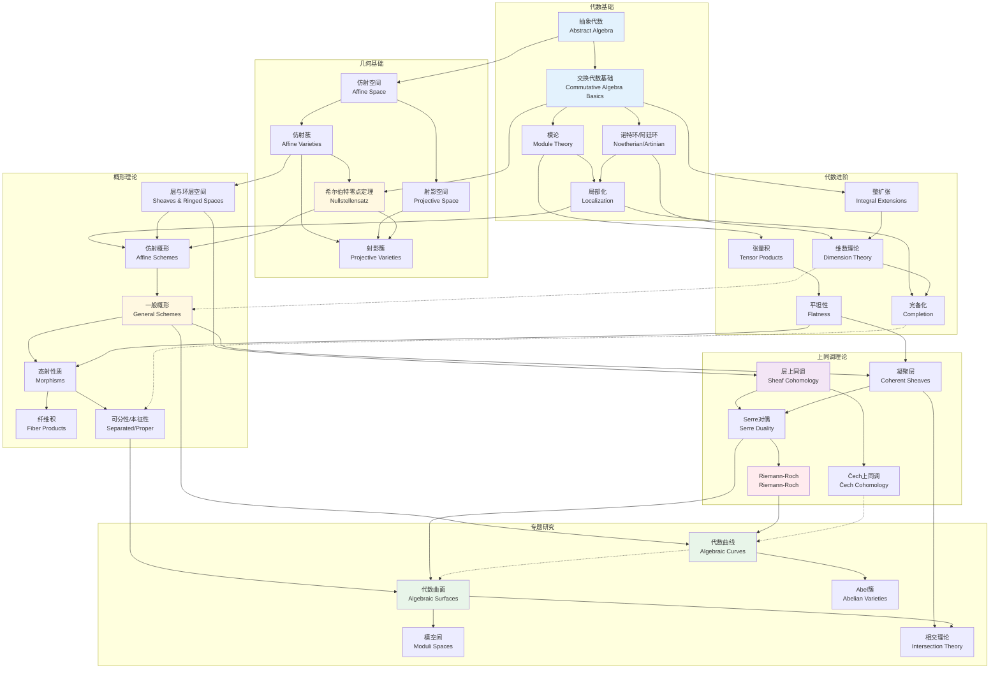

# 跨课程代数几何学习路径图

## 图谱说明

本图谱展示了代数几何学科的完整学习路径。代数几何是现代数学的核心领域之一，需要扎实的代数基础、几何直觉和一定的拓扑学知识。本路径图从交换代数出发，逐步深入到概形理论、上同调方法，最终到达曲线和曲面的研究。

### 设计理念

- **先修明确**: 清晰标注每个主题的前置知识要求
- **路径分支**: 展示不同研究方向的分叉点
- **难度递进**: 从本科水平逐步过渡到研究生水平

---

## Mermaid 图表



---

## 关键节点解释

### 🔵 代数基础层（必备）

| 节点 | 主题 | 核心内容 | 建议学时 |
|------|------|----------|----------|
| **A1** | 抽象代数 | 群、环、域基础，同态与同构 | 40h |
| **A2** | 交换代数基础 | 理想、商环、多项式环 | 30h |
| **A3** | 模论 | 模的定义、子模、商模、正合列 | 25h |
| **A4** | 诺特环/阿廷环 | ACC/DCC条件、准素分解 | 20h |
| **A5** | 局部化 | 分式域、局部环、局部性质 | 15h |

### 🔵 代数进阶层（深入）

| 节点 | 主题 | 核心内容 | 应用场景 |
|------|------|----------|----------|
| **B1** | 整扩张 | 整闭包、Noether正规化 | 维数理论 |
| **B2** | 维数理论 | Krull维数、高度、深度 | 几何维数对应 |
| **B3** | 张量积 | 模的张量积、基变换 | 几何纤维 |
| **B4** | 平坦性 | 平坦模、忠实平坦下降 | 模空间构造 |
| **B5** | 完备化 | adic完备化、形式概形 | 奇点研究 |

### 🟡 几何基础层（古典代数几何）

| 节点 | 主题 | 核心内容 | 里程碑 |
|------|------|----------|--------|
| **C1** | 仿射空间 | Aⁿ的定义、Zariski拓扑 | 起点 |
| **C2** | 仿射簇 | 代数集、坐标环、态射 | 基础对象 |
| **C3** | **希尔伯特零点定理** | I(V(J)) = √J | ⭐ 代数-几何桥梁 |
| **C4** | 射影空间 | Pⁿ的构造、齐次坐标 | 完备化 |
| **C5** | 射影簇 | 齐次理想、射影态射 | 紧簇研究 |

### 🟡 概形理论层（现代代数几何核心）

| 节点 | 主题 | 核心内容 | 难度 |
|------|------|----------|------|
| **D1** | 层与环层空间 | 预层、层、层化、环层空间 | ⭐⭐⭐ |
| **D2** | 仿射概形 | Spec(R)、结构层 | ⭐⭐⭐ |
| **D3** | **一般概形** | 概形的定义、例子 | ⭐⭐⭐⭐ |
| **D4** | 态射性质 | 有限型、有限、仿射、射影 | ⭐⭐⭐⭐ |
| **D5** | 纤维积 | 概形的纤维积、基变换 | ⭐⭐⭐⭐ |
| **D6** | 可分性/本征性 | 分离态射、真态射 | ⭐⭐⭐⭐⭐ |

### 🟣 上同调理论层（工具）

| 节点 | 主题 | 核心内容 | 应用 |
|------|------|----------|------|
| **E1** | **层上同调** | 导出函子、Grothendieck上同调 | 全局不变量 |
| **E2** | Čech上同调 | 开覆盖、Čech复形 | 计算工具 |
| **E3** | 凝聚层 | 凝聚层定义、性质、直像 | 代数几何核心 |
| **E4** | Serre对偶 | 对偶定理、对偶化层 | 曲线理论必备 |
| **E5** | **Riemann-Roch** | Riemann-Roch定理及应用 | ⭐ 核心定理 |

### 🟢 专题研究层（前沿）

| 节点 | 主题 | 研究内容 | 难度 |
|------|------|----------|------|
| **F1** | **代数曲线** | 亏格、除子、线丛、Jacobian | ⭐⭐⭐⭐ |
| **F2** | **代数曲面** | 分类理论、Castelnuovo定理 | ⭐⭐⭐⭐⭐ |
| **F3** | Abel簇 | 复环面、极化、模空间 | ⭐⭐⭐⭐⭐ |
| **F4** | 模空间 | 曲线模空间 Mg、形变理论 | ⭐⭐⭐⭐⭐⭐ |
| **F5** | 相交理论 | Chow环、陈类、指标定理 | ⭐⭐⭐⭐⭐ |

---

## 学习路径规划

### 📚 标准路径（推荐）

```
代数基础 → 几何基础 → 概形理论 → 上同调理论 → 专题研究
   ↓           ↓           ↓           ↓            ↓
 100h        80h        120h        100h         150h+
```

**总计**: 约550+ 小时（研究生水平）

### 🎯 快速入门路径

```
抽象代数 → 希尔伯特零点定理 → 仿射概形 → 层上同调 → 代数曲线
   ↓             ↓              ↓          ↓          ↓
  40h           30h           40h        50h        60h
```

**总计**: 约220小时（曲线专项）

### 🔬 研究导向路径

```
概形理论 → 上同调理论 → 相交理论 → 模空间 → 前沿专题
```

---

## 关键里程碑

### ⭐ 里程碑1: 零点定理理解
- 掌握代数集与根理想的一一对应
- 理解坐标环的几何意义

### ⭐ 里程碑2: 概形直觉建立
- 理解Spec的拓扑和结构层
- 能计算简单的概形例子

### ⭐ 里程碑3: 上同调计算
- 掌握Čech上同调计算
- 理解上同调的几何意义

### ⭐ 里程碑4: Riemann-Roch应用
- 能计算曲线的Riemann-Roch
- 理解其在几何中的应用

---

## 使用指南

### 📖 如何使用本路径图

1. **评估基础**: 根据自己的代数基础选择起点
2. **循序渐进**: 严格按照依赖关系学习，不要跳跃
3. **多线并行**: 代数与几何可以交叉学习，互相促进
4. **重视例子**: 每个概念都要通过具体例子理解

### 📚 推荐教材

| 阶段 | 教材 | 作者 | 特点 |
|------|------|------|------|
| 代数基础 | 《代数学引论》 | 聂灵沼 | 中文经典 |
| 交换代数 | 《Commutative Algebra》 | Atiyah-Macdonald | 精炼短小 |
| 古典代数几何 | 《代数几何》 | 李克正 | 中文入门 |
| 概形理论 | **《The Red Book》** | Mumford | 几何直觉 |
| 概形理论 | **《Algebraic Geometry》** | Hartshorne | 标准教材 |
| 上同调 | 《Sheaves in Geometry》 | Wedhorn | 层论入门 |
| 代数曲线 | **《Algebraic Curves》** | Fulton | 经典入门 |

### 🔗 相关资源

- [交换代数基础](../algebra/交换代数.md)
- [古典代数几何](../geometry/代数几何古典.md)
- [概形理论入门](../geometry/概形理论.md)
- [层上同调](../geometry/层上同调.md)
- [代数曲线](../geometry/代数曲线.md)

---

## 图谱更新记录

| 日期 | 版本 | 更新内容 |
|------|------|----------|
| 2026-04-10 | v1.0 | 初始版本，包含代数几何完整学习路径 |

---

*本图谱由 FormalMath 项目维护，如有建议欢迎提交 Issue。*
