# 项目全局文档结构导航图

## 图谱说明

本图谱展示了 FormalMath 项目的整体文档结构，帮助用户快速定位所需内容，理解项目组织架构。项目采用分层设计，从顶层索引到底层概念文档形成完整的知识体系。

### 设计理念

- **分层结构**: 清晰的层次关系，便于导航
- **交叉引用**: 展示不同模块间的关联
- **入口指引**: 为不同类型的用户提供快速入口

---

## Mermaid 图表

```mermaid
graph TD
    subgraph 入口层[入口层]
        ROOT[README.md<br/>项目主页]
        INDEX[INDEX.md<br/>内容索引]
        INDEX_EN[INDEX.en.md<br/>English Index]
    end

    subgraph 元数据层[元数据层]
        META1[项目报告<br/>00-*.md]
        META2[课程对齐报告<br/>00-*大学*.md]
        META3[Wikipedia对齐<br/>00-Wikipedia*.md]
        META4[概念映射<br/>00-*.json]
    end

    subgraph 核心内容[核心内容层]
        CORE1[docs/<br/>文档库]
        CORE2[concept/<br/>概念库]
        CORE3[数学家/<br/>人物库]
        CORE4[ref/<br/>参考文献]
    end

    subgraph 分支领域[分支领域]
        BR1[代数学<br/>algebra/]
        BR2[几何拓扑<br/>geometry/]
        BR3[分析学<br/>analysis/]
        BR4[数论<br/>number_theory/]
        BR5[概率统计<br/>probability/]
        BR6[离散数学<br/>discrete/]
        BR7[应用数学<br/>applied/]
        BR8[逻辑计算<br/>logic/]
    end

    subgraph 支持系统[支持系统]
        SUP1[tools/<br/>工具脚本]
        SUP2[tests/<br/>测试套件]
        SUP3[output/<br/>生成输出]
        SUP4[vector_store/<br/>向量存储]
    end

    subgraph 形式化层[形式化层]
        FOR1[FormalMath-Enhanced/<br/>增强版]
        FOR2[FormalMath-Interactive/<br/>交互版]
        FOR3[project/<br/>项目文档]
        FOR4[research/<br/>研究成果]
    end

    %% 入口层
    ROOT --> INDEX
    ROOT --> INDEX_EN

    %% 元数据层
    INDEX --> META1
    INDEX --> META2
    INDEX --> META3
    INDEX --> META4

    %% 核心内容
    INDEX --> CORE1
    INDEX --> CORE2
    INDEX --> CORE3
    INDEX --> CORE4

    %% 分支领域
    CORE1 --> BR1
    CORE1 --> BR2
    CORE1 --> BR3
    CORE1 --> BR4
    CORE1 --> BR5
    CORE1 --> BR6
    CORE1 --> BR7
    CORE1 --> BR8

    CORE2 -.-> BR1
    CORE2 -.-> BR2
    CORE2 -.-> BR3
    CORE2 -.-> BR4
    CORE2 -.-> BR5
    CORE2 -.-> BR6
    CORE2 -.-> BR7
    CORE2 -.-> BR8

    %% 支持系统
    ROOT --> SUP1
    SUP1 --> SUP2
    SUP1 --> SUP3
    SUP1 --> SUP4

    %% 形式化层
    ROOT --> FOR1
    ROOT --> FOR2
    FOR1 --> FOR3
    FOR1 --> FOR4
    FOR2 --> FOR3

    %% 跨层联系
    META2 -.-> BR1
    META2 -.-> BR2
    META3 -.-> BR1
    META3 -.-> BR3
    CORE3 -.-> BR1
    CORE3 -.-> BR2

    style ROOT fill:#ffebee
    style INDEX fill:#ffebee
    style CORE1 fill:#e3f2fd
    style CORE2 fill:#e3f2fd
    style BR1 fill:#fff8e1
    style BR2 fill:#fff8e1
    style BR3 fill:#fff8e1
    style BR4 fill:#fff8e1
    style FOR1 fill:#f3e5f5
    style FOR2 fill:#f3e5f5
```



---

## 关键节点解释

### 🔴 入口层（红色）

| 节点 | 文件/目录 | 用途 | 目标用户 |
|------|-----------|------|----------|
| **ROOT** | README.md | 项目介绍、快速开始、贡献指南 | 所有用户 |
| **INDEX** | INDEX.md | 中文内容索引、分类导航 | 中文用户 |
| **INDEX_EN** | INDEX.en.md | 英文内容索引、国际化支持 | 国际用户 |

**入口建议**:
- 🆕 **新用户**: 从 README.md 开始
- 🔍 **查找内容**: 使用 INDEX.md
- 🌐 **国际用户**: 使用 INDEX.en.md

### 🔵 元数据层（蓝色）

| 节点 | 文件模式 | 内容 | 数量 |
|------|----------|------|------|
| **META1** | 00-*.md | 项目进展报告、质量报告、实施报告 | 60+ |
| **META2** | 00-*大学*.md | 与全球顶尖大学课程对齐报告 | 15+ |
| **META3** | 00-Wikipedia*.md | 与 Wikipedia 数学内容对齐报告 | 10+ |
| **META4** | 00-*.json | 概念映射、依赖关系配置 | 10+ |

### 🔵 核心内容层（蓝色）

| 节点 | 目录 | 内容描述 | 规模 |
|------|------|----------|------|
| **CORE1** | docs/ | 分类文档库，按数学分支组织 | 500+ 文档 |
| **CORE2** | concept/ | 核心概念定义、定理、证明 | 2000+ 概念 |
| **CORE3** | 数学家/ | 数学家生平、贡献、思想体系 | 100+ 人物 |
| **CORE4** | ref/ | 参考文献、外部资源链接 | 分类整理 |

### 🟡 分支领域层（黄色）

| 节点 | 分支 | 主要内容 | 文档数 |
|------|------|----------|--------|
| **BR1** | 代数学 | 群论、环论、域论、线性代数、表示论 | 100+ |
| **BR2** | 几何拓扑 | 微分几何、代数几何、拓扑学、几何分析 | 100+ |
| **BR3** | 分析学 | 实分析、复分析、泛函分析、调和分析 | 100+ |
| **BR4** | 数论 | 初等数论、解析数论、代数数论、算术几何 | 80+ |
| **BR5** | 概率统计 | 概率论、数理统计、随机过程、测度论 | 80+ |
| **BR6** | 离散数学 | 组合数学、图论、数理逻辑、计算理论 | 80+ |
| **BR7** | 应用数学 | 微分方程、优化、数值分析、数学物理 | 80+ |
| **BR8** | 逻辑计算 | 数理逻辑、集合论、递归论、证明论 | 60+ |

### 🟣 形式化层（紫色）

| 节点 | 目录 | 内容 | 状态 |
|------|------|------|------|
| **FOR1** | FormalMath-Enhanced/ | Lean4 形式化增强版 | 持续完善 |
| **FOR2** | FormalMath-Interactive/ | 交互式学习版本 | 开发中 |
| **FOR3** | project/ | 项目计划、里程碑、任务管理 | 活跃 |
| **FOR4** | research/ | 研究笔记、前沿跟踪、创新探索 | 活跃 |

### ⚙️ 支持系统层

| 节点 | 目录 | 功能 |
|------|------|------|
| **SUP1** | tools/ | 自动化工具、脚本、生成器 |
| **SUP2** | tests/ | 测试套件、验证脚本 |
| **SUP3** | output/ | 自动生成的输出文件 |
| **SUP4** | vector_store/ | 向量数据库、语义搜索支持 |

---

## 用户导航路径

### 🎓 学生用户路径

```
README.md → INDEX.md → docs/ → [选择分支] → concept/
    ↓           ↓          ↓         ↓
了解项目    查找主题    学习文档    深入概念
```

### 👨‍🏫 教师用户路径

```
README.md → 00-*大学*.md → docs/ → ref/
    ↓           ↓           ↓        ↓
了解项目    课程对齐    教学内容    参考文献
```

### 👨‍💻 开发者路径

```
README.md → tools/ → tests/ → FormalMath-Enhanced/
    ↓          ↓         ↓           ↓
了解项目    工具使用    测试验证    形式化开发
```

### 🔬 研究者路径

```
README.md → research/ → 00-arXiv*.md → FormalMath-Enhanced/
    ↓           ↓            ↓              ↓
了解项目    研究笔记    前沿跟踪      形式化实现
```

---

## 文档命名规范

### 项目报告
```
00-[主题]-[类型]报告.md
例: 00-MIT课程内容对齐报告.md
```

### 概念文档
```
docs/[分支]/[主题].md
例: docs/algebra/群论基础.md
```

### 配置文件
```
00-[主题]配置.yaml
例: 00-代数学概念依赖配置.yaml
```

---

## 使用指南

### 📖 快速查找内容

1. **按主题查找**: 使用 INDEX.md 的分类索引
2. **按课程查找**: 查看 00-*大学*.md 对齐报告
3. **按概念查找**: 使用 concept/ 目录的层级结构
4. **搜索功能**: 使用 vector_store/ 的语义搜索

### 🔧 参与贡献

1. 阅读 README.md 中的贡献指南
2. 查看 CODE_OF_CONDUCT.md 和 CONTRIBUTING.md
3. 在 project/ 中了解当前任务
4. 使用 tools/ 中的工具进行内容生成

### 📊 项目状态

查看以下文件了解项目最新状态：
- `00-FormalMath-项目100%完成确认书.md` - 完成状态
- `CHANGELOG.md` - 更新日志
- `00-无限深化推进最新进度-持续更新.md` - 持续进展

---

## 图谱更新记录

| 日期 | 版本 | 更新内容 |
|------|------|----------|
| 2026-04-10 | v1.0 | 初始版本，包含项目完整结构导航 |

---

*本图谱由 FormalMath 项目维护，如有建议欢迎提交 Issue。*
