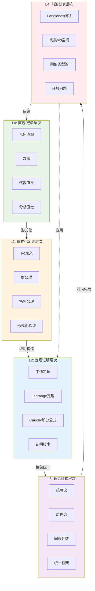

# L0-L4数学知识层次定义标准

**文档编号**: FM.HIERARCHY.00
**创建日期**: 2026年4月3日
**版本**: 1.0

---

## 📋 目录

- [L0-L4数学知识层次定义标准](#l0-l4数学知识层次定义标准)
  - [📋 目录](#目录)
  - [1. 概述](#1-概述)
  - [2. L0层次：直观/经验层次](#2-l0层次直观经验层次)
    - [2.1 定义](#21-定义)
    - [2.2 特征](#22-特征)
    - [2.3 示例](#23-示例)
  - [3. L1层次：形式化定义层次](#3-l1层次形式化定义层次)
    - [3.1 定义](#31-定义)
    - [3.2 特征](#32-特征)
    - [3.3 示例](#33-示例)
  - [4. L2层次：定理证明层次](#4-l2层次定理证明层次)
    - [4.1 定义](#41-定义)
    - [4.2 特征](#42-特征)
    - [4.3 示例](#43-示例)
  - [5. L3层次：理论建构层次](#5-l3层次理论建构层次)
    - [5.1 定义](#51-定义)
    - [5.2 特征](#52-特征)
    - [5.3 示例](#53-示例)
  - [6. L4层次：前沿研究层次](#6-l4层次前沿研究层次)
    - [6.1 定义](#61-定义)
    - [6.2 特征](#62-特征)
    - [6.3 示例](#63-示例)
  - [7. 层次递进关系图](#7-层次递进关系图)
  - [8. 层次间转化条件](#8-层次间转化条件)

---

## 一、概述

本文档定义了FormalMath项目的五层数学知识层次体系（L0-L4），为数学概念的学习、教学和研究提供结构化的框架。

**核心原则**:
- **渐进性**: 从直观到抽象，从具体到极致
- **关联性**: 各层次间存在清晰的依赖和转化关系
- **可操作性**: 每个层次都有明确的判定标准和转化条件

---

## 二、L0层次：直观/经验层次

### 2.1 定义

L0层次是数学知识的起点，基于**直观感知**和**经验认知**。学习者通过具体例子、几何图形、数值计算等方式建立对数学概念的初步理解。

> **本质**: L0层次对应于皮亚杰认知发展理论中的"具体运算阶段"，强调通过具体操作和感知来理解数学对象。

### 2.2 特征

| 特征维度 | 具体表现 |
|---------|---------|
| **认知方式** | 几何直观、数感、操作经验 |
| **表达形式** | 图形、实例、数值、自然语言 |
| **验证方法** | 举例验证、图形观察、数值检验 |
| **典型思维** | "这看起来像..."、"例如...的时候" |
| **严格性** | 非形式化，允许模糊性和直观跳跃 |

### 2.3 示例

#### 几何直观

```

概念: 连续函数
L0理解: "一笔画成的曲线，没有断开"
直观表现: 用绘图软件画出 y = x², y = sin(x) 等连续曲线

```

#### 数感

```

概念: 极限
L0理解: "越来越接近某个值"
直观表现: 数列 1, 1/2, 1/3, 1/4... 越来越小，接近0

```

#### 代数直觉

```

概念: 群
L0理解: "有对称性的对象"
直观表现: 等边三角形的旋转对称、正方形的对称变换

```

#### 分析直觉

```

概念: 导数
L0理解: "切线的斜率"、"瞬时变化率"
直观表现: 汽车速度表、曲线在某点的倾斜程度

```

---

## 三、L1层次：形式化定义层次

### 3.1 定义

L1层次将直观认知转化为**严格的数学定义**。使用精确的语言、符号系统和公理化方法，消除直观理解的歧义和模糊性。

> **本质**: L1层次实现了从"知其然"到"知其所以然"的跨越，建立概念的逻辑基础。

### 3.2 特征

| 特征维度 | 具体表现 |
|---------|---------|
| **认知方式** | 逻辑分析、公理推演、符号操作 |
| **表达形式** | 形式化定义、公理系统、符号表达式 |
| **验证方法** | 定义检验、公理验证、等价性证明 |
| **典型思维** | "根据定义..."、"由公理可知..." |
| **严格性** | ε-δ精确化，满足逻辑一致性 |

### 3.3 示例

#### ε-δ定义（连续性）

```

概念: 函数连续性
L1定义: 
函数 f: ℝ → ℝ 在点 a 连续，当且仅当
∀ε > 0, ∃δ > 0, 使得 |x - a| < δ ⇒ |f(x) - f(a)| < ε

关键要素:
- 量词结构: ∀ε∃δ
- 邻域概念: |x - a| < δ
- 误差控制: |f(x) - f(a)| < ε

```

#### 群公理

```

概念: 群 (Group)
L1定义:
集合 G 配备二元运算 · 构成群，当且仅当满足:
(G1) 结合律: ∀a,b,c ∈ G, (a·b)·c = a·(b·c)
(G2) 单位元: ∃e ∈ G, ∀a ∈ G, e·a = a·e = a
(G3) 逆元: ∀a ∈ G, ∃a⁻¹ ∈ G, a·a⁻¹ = a⁻¹·a = e

关键要素:
- 封闭性隐含在运算定义中
- 三条公理相互独立且完备
- 单位元和逆元的唯一性可由公理导出

```

#### 拓扑空间公理

```

概念: 拓扑空间
L1定义:
集合 X 的子集族 τ 称为拓扑，如果:
(T1) ∅ ∈ τ, X ∈ τ
(T2) 任意并封闭: 若 {U_i} ⊆ τ, 则 ∪U_i ∈ τ
(T3) 有限交封闭: 若 U, V ∈ τ, 则 U ∩ V ∈ τ

关键要素:
- 开集族而非距离定义
- 极端的抽象性和一般性
- 统一处理连续性概念

```

---

## 四、L2层次：定理证明层次

### 4.1 定义

L2层次基于形式化定义，通过**严格证明**建立定理和命题。运用逻辑推理、数学归纳、反证法等证明技术，揭示概念间的深层关系。

> **本质**: L2层次构建数学知识的"骨架"，通过定理网络展现数学结构的内在逻辑。

### 4.2 特征

| 特征维度 | 具体表现 |
|---------|---------|
| **认知方式** | 逻辑推理、证明构造、反例寻找 |
| **表达形式** | 定理-证明结构、引理-推论体系 |
| **验证方法** | 严格证明、形式化验证、自动化检验 |
| **典型思维** | "证明如下..."、"由定理X可得..." |
| **严格性** | 每一步都有逻辑依据，可形式化验证 |

### 4.3 示例

#### 中值定理（证明层次）

```

定理: 中值定理 (Mean Value Theorem)
陈述: 
若 f 在 [a,b] 连续，在 (a,b) 可导，
则 ∃c ∈ (a,b), 使得 f'(c) = [f(b)-f(a)]/(b-a)

证明思路:
1. 构造辅助函数 g(x) = f(x) - f(a) - [(f(b)-f(a))/(b-a)](x-a)
2. 验证 g(a) = g(b) = 0
3. 应用Rolle定理，存在 c 使得 g'(c) = 0
4. 计算 g'(c) = f'(c) - [f(b)-f(a)]/(b-a) = 0
5. 整理即得结论

证明技巧: 辅助函数构造法
深层含义: 函数在区间上的平均变化率必在某点达到

```

#### Lagrange定理（群论）

```

定理: Lagrange定理
陈述:
若 H 是有限群 G 的子群，则 |H| 整除 |G|，且 |G| = |H|·[G:H]

证明框架:
1. 定义陪集: 对 g ∈ G, 左陪集 gH = {gh : h ∈ H}
2. 证明所有左陪集构成 G 的划分
3. 证明每个陪集与 H 等势（双射存在）
4. 计算得 |G| = |H|·(陪集个数)

证明要点:
- 等价关系的应用
- 划分与计数的组合
- 对称性的代数刻画

```

#### Cauchy积分公式（复分析）

```

定理: Cauchy积分公式
陈述:
若 f 在单连通域 D 内全纯，z₀ ∈ D，γ 是围绕 z₀ 的简单闭曲线，则
f(z₀) = (1/2πi) ∮_γ f(z)/(z-z₀) dz

证明核心:
1. 利用Cauchy积分定理，路径可变形
2. 构造以 z₀ 为中心的小圆 C_r
3. 在小圆上展开 f(z) = f(z₀) + [f(z)-f(z₀)]
4. 计算 ∫_{C_r} 1/(z-z₀) dz = 2πi
5. 估计余项趋于0（当 r → 0）

深刻含义:
- 全纯函数由边界值完全确定
- 导数可由积分表示（无穷可导性）

```

---

## 五、L3层次：理论建构层次

### 5.1 定义

L3层次超越单个定理，构建**统一的理论框架**。通过范畴论、层理论、同调理论等高级工具，统一不同领域的数学结构，揭示深层次的联系。

> **本质**: L3层次实现"居高临下"的视角，通过抽象统一多样化的数学现象。

### 5.2 特征

| 特征维度 | 具体表现 |
|---------|---------|
| **认知方式** | 结构抽象、统一视角、框架建构 |
| **表达形式** | 范畴论语言、层理论、函子体系 |
| **验证方法** | 泛性质验证、自然变换、等价性 |
| **典型思维** | "从范畴论视角..."、"由泛性质可知..." |
| **严格性** | 元数学层次，关注结构间的映射关系 |

### 5.3 示例

#### 范畴论视角

```

理论: 范畴论 (Category Theory)
核心观点: 
- 对象之间的态射比对象本身更重要
- 泛性质刻画结构的本质特征
- 函子保持结构，自然变换是函子间的"映射"

统一视角示例:
- 群、拓扑空间、向量空间都是范畴的对象
- 同态、连续映射、线性映射都是态射
- 积、余积、等化子、余等化子在各范畴有统一定义

深层意义:
- 相同的抽象模式出现在不同数学分支
- 证明一次，到处应用（Lambek格言）

```

#### 层理论 (Sheaf Theory)

```

理论: 层理论
核心观点:
- 局部数据如何粘合成整体结构
- 预层 + 粘合条件 = 层
- 层的上同调反映整体-局部信息差

构造示例:
- 连续函数层: U ↦ C(U)（U上的连续函数）
- 微分形式层: U ↦ Ω^p(U)（U上的p次微分形式）
- 结构层: 概形理论的核心

应用领域:
- 代数几何: 概形的结构层
- 拓扑学: 局部系数的同调
- 复几何: 解析层的上同调

```

#### 同调代数框架

```

理论: 同调代数
核心观点:
- 用链复形和边缘映射刻画"洞"的结构
- 导出函子 (Ext, Tor) 测量"非正合性"
- 长正合序列联系不同维度的信息

统一性体现:
- 拓扑同调: 空间的拓扑不变量
- 群同调: 群模结构的度量
- 层上同调: 整体截面的存在性
- Hochschild同调: 代数的非交换几何

方法论价值:
- 统一处理不同数学对象的"缺陷"
- 谱序列计算复杂结构
- 导出范畴提升同伦层次

```

---

## 六、L4层次：前沿研究层次

### 6.1 定义

L4层次是数学研究的最前沿，包含**开放问题**、**新兴理论**和**跨学科应用**。涉及Langlands纲领、完美oid空间、同伦类型论等当代数学的核心议题。

> **本质**: L4层次代表数学知识的生长点，连接已知与未知，推动数学边界的扩展。

### 6.2 特征

| 特征维度 | 具体表现 |
|---------|---------|
| **认知方式** | 猜想驱动、模式识别、跨学科类比 |
| **表达形式** | 纲领性框架、研究项目、开放问题 |
| **验证方法** | 部分结果、特殊情况、计算机辅助 |
| **典型思维** | "猜想..."、"如果...将会..." |
| **严格性** | 部分结果严格，整体框架待完善 |

### 6.3 示例

#### Langlands纲领

```

纲领: Langlands Program (朗兰兹纲领)
核心猜想:
数论对象 ↔ 表示论对象 ↔ 几何对象
   ↓              ↓              ↓
L-函数      自守表示       motives

关键对应:
- GL(n)的自守表示 ↔ n维Galois表示
- Artin L-函数 ↔ 自守L-函数
- 几何Langlands: 曲线上的对应

研究现状:
- GL(2)情形: 完全解决（Wiles证明费马大定理的关键）
- 高维情形: 部分结果，核心猜想仍开放
- 几何Langlands: 特征p和复数情形有重要进展

数学意义:
- 统一数论、表示论、代数几何
- 被称为"数学的大统一理论"

```

#### 完美oid空间 (Perfectoid Spaces)

```

理论: 完美oid空间 (Scholze, 2011)
核心思想:
- 融合特征0和特征p的代数几何
- 用Huber对（完美oid代数）统一处理p进域

关键突破:
- 几乎数学 (almost mathematics)
- 倾斜函子 (tilting equivalence)
- 将特征0问题约化到特征p

应用成果:
- 权单性猜想 (Weight-Monodromy Conjecture)
- p进Hodge理论的新证明
- p进Langlands纲领进展

意义:
- 彻底解决多个长期开放问题
- 开创p进几何新纪元
- Scholze获2018年菲尔兹奖

```

#### 同伦类型论 (Homotopy Type Theory)

```

理论: 同伦类型论 (HoTT)
核心思想:
- 类型 = 空间
- 证明 = 路径
- 等价 = 同伦等价

Univalence公理:
- 等价类型相等: (A ≃ B) ≅ (A = B)
- 消除数学中的"同构障碍"

研究前沿:
- 高阶归纳类型 (HITs)
- 立方类型论 (Cubical Type Theory)
- 计算机形式化证明 (Lean, Coq, Agda)

潜在影响:
- 数学基础的替代方案
- 计算机辅助证明的新范式
- 抽象代数拓扑的实用化

```

---

## 七、层次递进关系图



---

## 八、层次间转化条件

### 8.1 L0 → L1 转化条件

| 转化条件 | 具体要求 | 评估标准 |
|---------|---------|---------|
| **直觉精确化** | 能将模糊描述转化为精确陈述 | 消除"大约"、"接近"等模糊词汇 |
| **符号掌握** | 熟练使用数学符号系统 | 能读写形式化定义 |
| **反例识别** | 能找出直观理解的反例 | 知道直觉何时失效 |
| **公理意识** | 理解公理的必要性和完备性 | 能判断定义的充分性 |

### 8.2 L1 → L2 转化条件

| 转化条件 | 具体要求 | 评估标准 |
|---------|---------|---------|
| **证明技术** | 掌握直接证明、反证法、归纳法 | 能独立完成中等难度证明 |
| **定理网络** | 理解定理间的依赖关系 | 能画出概念依赖图 |
| **反例构造** | 能构造说明边界情况的例子 | 能判断条件是否必要 |
| **证明书写** | 能写出严格的证明过程 | 每一步都有逻辑依据 |

### 8.3 L2 → L3 转化条件

| 转化条件 | 具体要求 | 评估标准 |
|---------|---------|---------|
| **模式识别** | 能从不同定理中发现共同模式 | 能写出"抽象证明" |
| **泛性质理解** | 能用泛性质刻画数学结构 | 理解"在同构意义下唯一" |
| **函子思维** | 能识别保持结构的映射 | 理解协变/反变函子 |
| **范畴迁移** | 能将在一个范畴的结果迁移到另一个 | 知道何时可以"照搬"证明 |

### 8.4 L3 → L4 转化条件

| 转化条件 | 具体要求 | 评估标准 |
|---------|---------|---------|
| **问题意识** | 能识别重要开放问题 | 知道领域的前沿挑战 |
| **猜想能力** | 基于类比和模式提出猜想 | 能论证猜想的合理性 |
| **跨域联系** | 能发现不同领域间的深层联系 | 理解Langlands型对应 |
| **研究品味** | 能判断问题的重要性和可行性 | 知道什么值得研究 |

### 8.5 层次跃迁路径示例

```

实数概念的层次跃迁:

L0: "数轴上的点，可以任意精确测量"
    ↓ 形式化
L1: "完备的Archimedean有序域，或Dedekind分割"
    ↓ 证明
L2: "完备性定理、闭区间套定理、Bolzano-Weierstrass定理"
    ↓ 理论建构
L3: "实数作为拓扑空间的万有性质、实数域的泛性质"
    ↓ 前沿研究
L4: "非标准分析、超实数、可计算分析"

```

---

**文档信息**
- **创建**: 2026年4月3日
- **字数**: 约4500字
- **适用范围**: FormalMath项目全阶段
- **维护状态**: 持续更新
