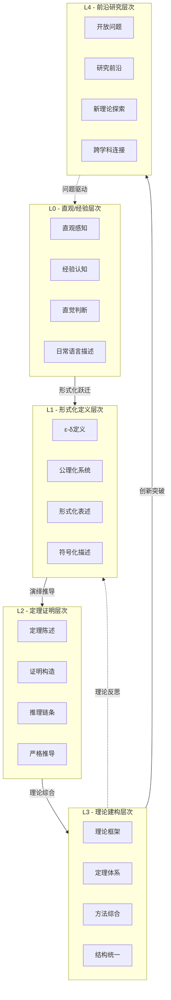
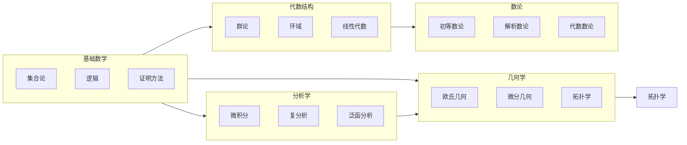
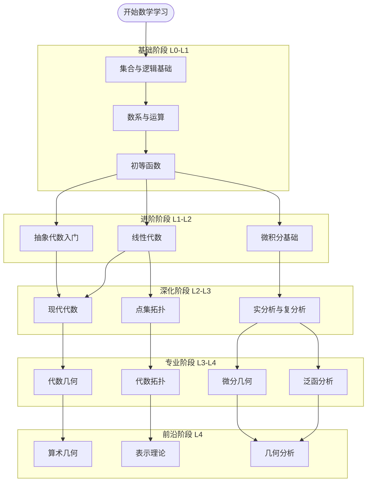

msc_primary: "00A99"
msc_secondary: ['00-XX']
---

# 数学知识层次总览图

## 层次架构全景

## 学科层次分布图

## 层次递进路径

## 层次特征对照表

| 层次 | 认知特征 | 数学活动 | 典型问题 | 能力要求 |
|------|----------|----------|----------|----------|
| **L0** | 直观感知、经验归纳 | 观察、猜测、举例 | "看起来连续" | 数学直觉 |
| **L1** | 严格定义、精确表述 | 形式化、公理化 | "ε-δ定义是什么" | 逻辑精确 |
| **L2** | 演绎推理、证明构造 | 定理证明、推导 | "如何严格证明" | 推理能力 |
| **L3** | 系统综合、理论建构 | 理论整合、应用 | "理论体系如何组织" | 系统思维 |
| **L4** | 创新探索、问题提出 | 研究、猜想、突破 | "未知领域是什么" | 创新能力 |

## 层次转换关键节点

## 核心学科层次映射

| 学科领域 | L0示例 | L1示例 | L2示例 | L3示例 | L4示例 |
|----------|--------|--------|--------|--------|--------|
| **分析学** | 函数图像连续 | ε-δ连续性定义 | 中值定理证明 | 微积分基本定理体系 | 非标准分析 |
| **代数学** | 对称性观察 | 群公理化定义 | Sylow定理证明 | Galois对应理论 |  motive理论 |
| **几何学** | 空间形状感知 | 流形严格定义 | Gauss-Bonnet定理 | 微分几何体系 | 镜面对称猜想 |
| **拓扑学** | 连通直观 | 拓扑空间公理 | 基本群计算 | 同调代数体系 | 庞加莱猜想推广 |
| **数论** | 素数分布观察 | 同余形式定义 | 二次互反律证明 | 类域论体系 | Birch-Swinnerton-Dyer猜想 |
| **逻辑学** | 推理直觉 | 形式系统定义 | 完备性定理证明 | 模型论体系 | 决定性公理研究 |

## 学习路径总图

---

*本文档为FormalMath项目数学知识层次体系的总览图谱，涵盖L0-L4五个层次的全貌、特征和递进关系。*
