# L0-L4 数学知识层次递进关系总图

## 概述

本文档提供 FormalMath 项目 **L0-L4 五层数学知识层次体系** 的完整概览，包括层次定义、递进关系、依赖结构和标注规范。

---

## 一、五层体系总览

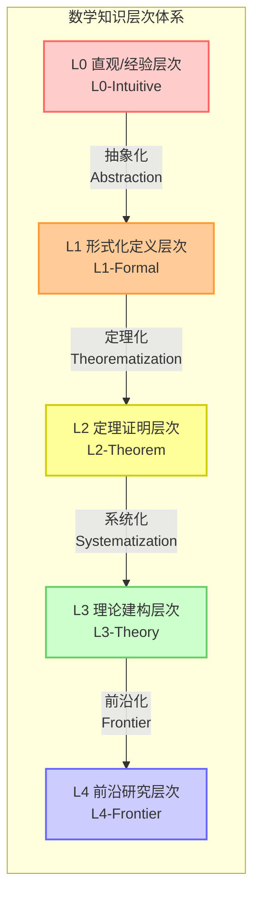

---

## 二、各层次详细定义

### 2.1 层次对比表

| 层次 | 名称 | 英文标识 | 核心特征 | 主要活动 |
|-----|------|---------|---------|---------|
| **L0** | 直观/经验 | Intuitive | 直觉、经验、具体 | 观察、操作、探索 |
| **L1** | 形式化定义 | Formal | 公理、定义、符号 | 定义、公理化 |
| **L2** | 定理证明 | Theorem | 证明、推理、技巧 | 证明、推导 |
| **L3** | 理论建构 | Theory | 系统、统一、框架 | 整合、建构 |
| **L4** | 前沿研究 | Frontier | 开放、创新、未知 | 研究、探索 |

### 2.2 层次特征矩阵

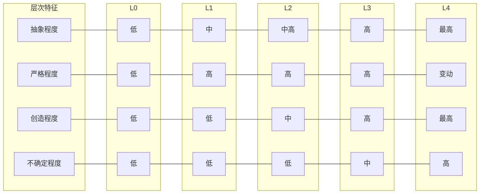

---

## 三、递进关系详解

### 3.1 L0 → L1：从直觉到形式

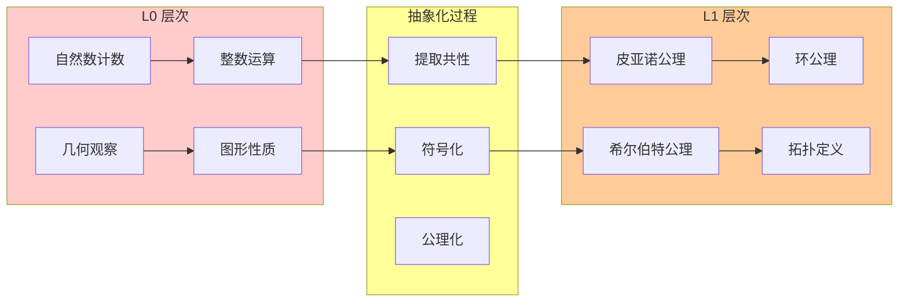

**关键转变**：

- 从具体实例到抽象概念
- 从描述性定义到公理化定义
- 从操作验证到逻辑推理

### 3.2 L1 → L2：从定义到定理

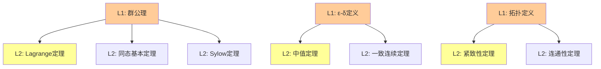

**关键转变**：

- 从"是什么"到"推出什么"
- 从概念掌握到证明技巧
- 从静态知识到动态推理

### 3.3 L2 → L3：从定理到理论

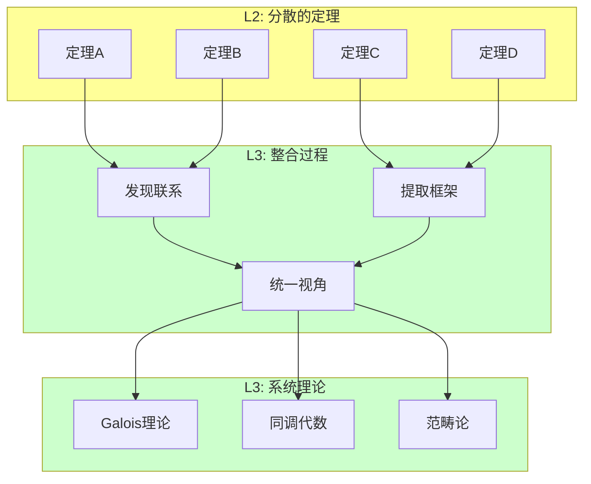

**关键转变**：

- 从孤立定理到相互关联
- 从证明技巧到理论框架
- 从局部到整体

### 3.4 L3 → L4：从理论到前沿

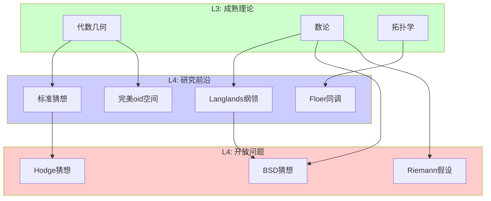

**关键转变**：

- 从已知到未知
- 从学习到创造
- 从应用理论到发展理论

---

## 四、层次依赖关系

### 4.1 依赖关系图

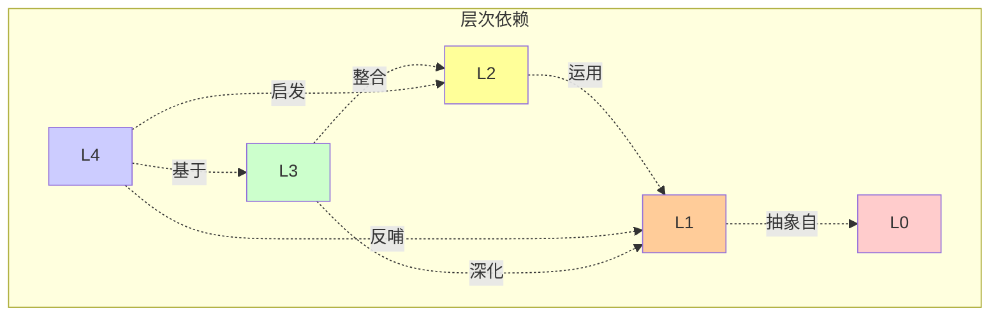

### 4.2 依赖矩阵

| 依赖于 → | L0 | L1 | L2 | L3 | L4 |
|---------|-----|-----|-----|-----|-----|
| **L0** | - | | | | |
| **L1** | ✓ | - | | | |
| **L2** | | ✓ | - | | |
| **L3** | | ✓ | ✓ | - | |
| **L4** | | ✓ | ✓ | ✓ | - |

### 4.3 反哺关系

高层次对低层次的**反哺**作用：

| 方向 | 反哺内容 | 示例 |
|-----|---------|------|
| L4 → L1 | 新定义、新公理 | 无穷范畴公理 |
| L4 → L2 | 新证明方法 | 概率方法 |
| L3 → L1 | 概念深化 | 层论视角的定义 |
| L3 → L2 | 证明框架 | 同调代数方法 |

---

## 五、层次标注规范

### 5.1 文档头部模板

```markdown
---
# 层次标注元数据
level: [L0-Intuitive|L1-Formal|L2-Theorem|L3-Theory|L4-Frontier]

# 所属领域
domain: [代数/几何/分析/数论/...]

# 前置知识层次
prerequisites:
  - [前置概念1]
  - [前置概念2]

# 后续学习层次
next_level: [L0|L1|L2|L3|L4相关概念]

# 标签
tags:
  - "[标签1]"
  - "[标签2]"

# 创建日期
created: "YYYY-MM-DD"

# 最后更新
updated: "YYYY-MM-DD"

# 状态
status: [draft|review|complete]
---
```

### 5.2 层次标签系统

#### 颜色编码

| 层次 | 颜色 | HEX | 用途 |
|-----|------|-----|------|
| L0 | 粉红 | `#FFCCCC` | 直观、经验 |
| L1 | 橙色 | `#FFCC99` | 形式、定义 |
| L2 | 黄色 | `#FFFF99` | 定理、证明 |
| L3 | 绿色 | `#CCFFCC` | 理论、系统 |
| L4 | 蓝色 | `#CCCCFF` | 前沿、研究 |

#### 图标标识

| 层次 | 图标 | Unicode |
|-----|------|---------|
| L0 | 🔍 | U+1F50D |
| L1 | 📐 | U+1F4D0 |
| L2 | 📊 | U+1F4CA |
| L3 | 🌐 | U+1F310 |
| L4 | 🚀 | U+1F680 |

---

## 六、层次递进的学习路径

### 6.1 标准学习路径

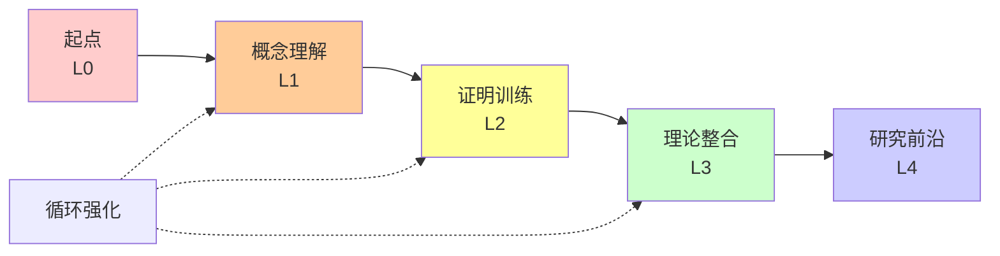

### 6.2 跨层次跳跃

#### 允许的跳跃

- L0 → L2（通过计算练习）
- L1 → L3（通过高级教材）
- L2 → L4（通过研究项目）

#### 必须的基础

- 进入 L2 必须掌握 L1
- 进入 L3 必须掌握 L2
- 进入 L4 必须掌握 L3

### 6.3 个性化路径

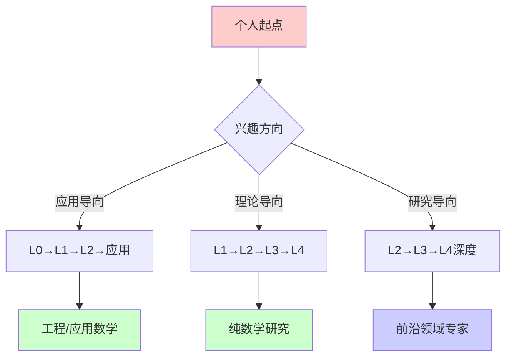

---

## 七、层次评估标准

### 7.1 各层次能力要求

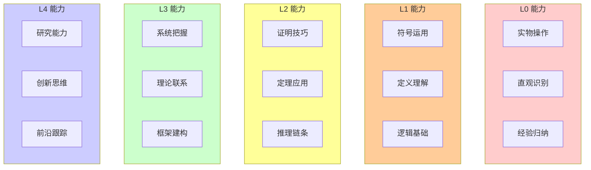

### 7.2 进阶评估指标

| 层次 | 评估方式 | 通过标准 |
|-----|---------|---------|
| L0 | 操作任务 | 能完成具体操作 |
| L1 | 定义测试 | 能复述和运用定义 |
| L2 | 证明考核 | 能独立完成标准证明 |
| L3 | 综述报告 | 能系统阐述理论框架 |
| L4 | 研究提案 | 能提出研究问题 |

---

## 八、层次体系的应用

### 8.1 课程设计

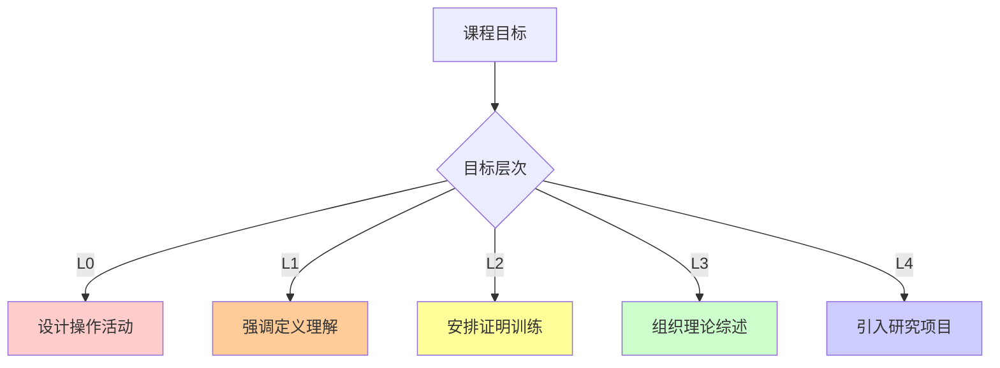

### 8.2 资源标注

所有 FormalMath 资源应按层次标注：

```
docs/
├── 01-基础数学/           # 主要 L0-L1
├── 02-代数结构/           # L1-L2
├── 03-分析学/            # L1-L3
├── 04-几何学/            # L0-L3
├── 05-拓扑学/            # L1-L3
├── 11-高级数学/           # L2-L4
└── research/             # L3-L4
```

---

## 九、层次体系的扩展

### 9.1 跨学科映射

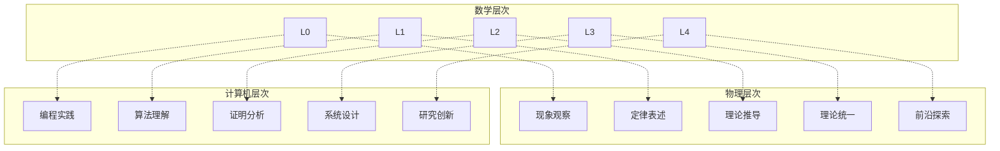

### 9.2 教育阶段对应

| 层次 | 教育阶段 | 典型年龄 |
|-----|---------|---------|
| L0 | 学前教育-小学 | 3-11岁 |
| L1 | 中学-大学初级 | 12-18岁 |
| L2 | 大学中级-高级 | 18-22岁 |
| L3 | 研究生 | 22-28岁 |
| L4 | 博士-研究员 | 28岁+ |

---

## 十、总结

FormalMath 的 **L0-L4 五层数学知识层次体系** 提供了一个：

1. **结构化的知识框架**：从直觉到前沿的递进路径
2. **清晰的学习路径**：各层次的能力要求和过渡方式
3. **统一的内容标注**：标准化的层次标签和元数据
4. **灵活的应用基础**：适用于课程设计、资源组织和个人学习

这一体系体现了数学知识发展的内在逻辑，也为数学教育提供了科学依据。

---

## 附录：层次体系速查表

### A. 层次速查

| 层次 | 关键词 | 典型问句 |
|-----|--------|---------|
| L0 | 直观、经验、操作 | "这是什么？" |
| L1 | 定义、公理、符号 | "这是什么意思？" |
| L2 | 定理、证明、推理 | "为什么成立？" |
| L3 | 理论、系统、框架 | "如何组织？" |
| L4 | 前沿、开放、创造 | "还能探索什么？" |

### B. 递进检查清单

- [ ] 能熟练操作具体实例 → 进入 L1
- [ ] 能准确复述形式定义 → 进入 L2
- [ ] 能独立完成标准证明 → 进入 L3
- [ ] 能系统阐述理论框架 → 进入 L4
- [ ] 能提出研究问题 → 在 L4 深入

---

*文档版本：1.0*
*创建日期：2026年4月*
*体系名称：FormalMath L0-L4 知识层次体系*
